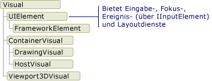
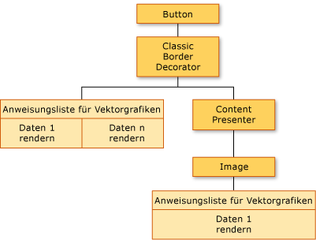
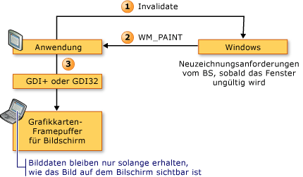
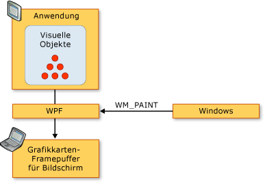
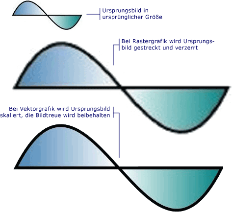

# Übersicht über das WPF-Grafikrendering
Das Thema bietet einen Überblick über die visuelle [!INCLUDE[TLA2#tla_winclient](../../../../includes/tla2sharptla-winclient-md.md)]-Schicht. Der Schwerpunkt liegt dabei auf die Rolle der <xref:System.Windows.Media.Visual> -Standardklasse zum Rendern von-Unterstützung in der [!INCLUDE[TLA2#tla_winclient](../../../../includes/tla2sharptla-winclient-md.md)] Modell.  
  
  
   
## Rolle des visuellen Objekts  
 Die <xref:System.Windows.Media.Visual> Klasse ist die grundlegende Abstraktion von dem jede <xref:System.Windows.FrameworkElement> Objekt abgeleitet wurde. Sie dient auch als Einstiegspunkt zum Schreiben neuer Steuerelemente [!INCLUDE[TLA2#tla_winclient](../../../../includes/tla2sharptla-winclient-md.md)] und kann in vielerlei Hinsicht als Fensterhandle (HWND) im Win32-Anwendungsmodell betrachtet werden.  
  
 Die <xref:System.Windows.Media.Visual> -Objekt ist ein zentrales [!INCLUDE[TLA2#tla_winclient](../../../../includes/tla2sharptla-winclient-md.md)] -Objekt, dessen primäre Rolle Rendering zu unterstützen. Steuerelemente der Benutzeroberfläche, z. B. <xref:System.Windows.Controls.Button> und <xref:System.Windows.Controls.TextBox>, leiten Sie von der <xref:System.Windows.Media.Visual> Klasse, und verwenden sie für ihre Renderingdaten beibehalten. Die <xref:System.Windows.Media.Visual> Objekt bietet Unterstützung für:  
  
-   Ausgabeanzeige: Rendern des persistenten, serialisierten Zeichnungsinhalts eines visuellen Objekts.  
  
-   Transformationen: Ausführen von Transformationen auf einem visuellen Objekt.  
  
-   Clipping: Bereitstellen der Clippingbereichsunterstützung für ein visuelles Objekt.  
  
-   Treffertests: Bestimmen, ob eine Koordinate oder eine Geometrie innerhalb der Grenzen eines visuellen Objekts enthalten ist.  
  
-   Berechnungen des Begrenzungsrahmens: Bestimmen des umschließenden Rechtecks eines visuellen Objekts.  
  
 Allerdings die <xref:System.Windows.Media.Visual> Objekt bietet keine Unterstützung für nicht-Rendering-Funktionen, wie z. B.:  
  
-   Ereignisbehandlung  
  
-   Layout  
  
-   Stile  
  
-   Datenbindung  
  
-   Globalisierung  
  
 <xref:System.Windows.Media.Visual>wird als öffentliche abstrakte Klasse verfügbar gemacht werden aus der untergeordneten Klassen abgeleitet werden müssen. Die folgende Abbildung zeigt die Hierarchie der visuellen Objekte, die in [!INCLUDE[TLA2#tla_winclient](../../../../includes/tla2sharptla-winclient-md.md)] verfügbar gemacht werden.  
  
   
Klassenhierarchie von visuellen Objekten  
  
### DrawingVisual-Klasse  
 Die <xref:System.Windows.Media.DrawingVisual> ist eine einfache zeichnen-Klasse, die zum Rendern von Formen, Bildern oder Text verwendet wird. Diese Klasse wird als einfach angesehen, da sie keine Layout- oder Ereignisbehandlung bereitstellt, was die Laufzeitleistung verbessert. Aus diesem Grund sind Zeichnungen für Hintergründe und ClipArt ideal. Die <xref:System.Windows.Media.DrawingVisual> können verwendet werden, um ein benutzerdefiniertes visuelles Objekt erstellen. Weitere Informationen finden Sie unter [Verwenden von DrawingVisual-Objekten](../../../../docs/framework/wpf/graphics-multimedia/using-drawingvisual-objects.md).  
  
### Viewport3DVisual-Klasse  
 Die <xref:System.Windows.Media.Media3D.Viewport3DVisual> stellt eine Brücke zwischen 2D <xref:System.Windows.Media.Visual> und <xref:System.Windows.Media.Media3D.Visual3D> Objekte. Die <xref:System.Windows.Media.Media3D.Visual3D> Klasse ist die Basisklasse für alle visuellen 3D-Elemente. Die <xref:System.Windows.Media.Media3D.Viewport3DVisual> erfordert, dass Sie definieren eine <xref:System.Windows.Media.Media3D.Viewport3DVisual.Camera%2A> Wert und eine <xref:System.Windows.Media.Media3D.Viewport3DVisual.Viewport%2A> Wert. Die Kamera ermöglicht die Anzeige der Szene. Der Anzeigebereich legt fest, wo die Projektion auf der 2D-Fläche zuordnet. Weitere Informationen über 3D in [!INCLUDE[TLA2#tla_winclient](../../../../includes/tla2sharptla-winclient-md.md)] finden Sie unter [Übersicht über 3D-Grafiken](../../../../docs/framework/wpf/graphics-multimedia/3-d-graphics-overview.md).  
  
### ContainerVisual-Klasse  
 Die <xref:System.Windows.Media.ContainerVisual> Klasse dient als Container für eine Auflistung von <xref:System.Windows.Media.Visual> Objekte. Die <xref:System.Windows.Media.DrawingVisual> Klasse leitet sich von der <xref:System.Windows.Media.ContainerVisual> -Klasse, ermöglicht diese eine Sammlung visueller Objekte enthalten.  
  
### Zeichnungsinhalt in visuellen Objekten  
 Ein <xref:System.Windows.Media.Visual> Objekt speichert seine Renderingdaten als eine **Vektorgrafiken**. Jedes Element in der Anweisungsliste stellt einen Satz von Grafikdaten einer niedrigeren Ebene und dazugehörige Ressourcen in einem serialisierten Format dar. Es gibt vier verschiedene Typen von Renderingdaten, die Zeichnungsinhalt enthalten können.  
  
|Zeichnungsinhaltstyp|Beschreibung|  
|--------------------------|-----------------|  
|Vektorgrafik|Stellt vector Graphics-Daten und alle zugeordneten <xref:System.Windows.Media.Brush> und <xref:System.Windows.Media.Pen> Informationen.|  
|Bild|Stellt ein Bild innerhalb eines Bereichs von definiert eine <xref:System.Windows.Rect>.|  
|Glyphe|Stellt eine Zeichnung, das rendert eine <xref:System.Windows.Media.GlyphRun>, also eine Sequenz von Symbolen aus einer angegebenen Ressource. So wird Text dargestellt.|  
|Video|Stellt eine Zeichnung dar, die Video rendert.|  
  
 Die <xref:System.Windows.Media.DrawingContext> können Sie zum Auffüllen einer <xref:System.Windows.Media.Visual> mit visuellen Inhalt. Bei Verwendung einer <xref:System.Windows.Media.DrawingContext> des Objekts zeichnen-Befehle, speichern Sie einen Satz von Renderingdaten, die später vom Grafiksystem verwendet werden; Sie sind nicht in Echtzeit auf dem Bildschirm zeichnen.  
  
 Beim Erstellen einer [!INCLUDE[TLA2#tla_winclient](../../../../includes/tla2sharptla-winclient-md.md)] steuern, wie z. B. ein <xref:System.Windows.Controls.Button>, das Steuerelement implizit generiert Renderingdaten für sich selbst zeichnen. Z. B. die <xref:System.Windows.Controls.ContentControl.Content%2A> Eigenschaft von der <xref:System.Windows.Controls.Button> bewirkt, dass das Steuerelement eine Renderingdarstellung eines Symbols zu speichern.  
  
 Ein <xref:System.Windows.Media.Visual> beschreibt den Inhalt als eine oder mehrere <xref:System.Windows.Media.Drawing> Objekte innerhalb einer <xref:System.Windows.Media.DrawingGroup>. Ein <xref:System.Windows.Media.DrawingGroup> beschreibt auch die Deckkraftmasken, Transformationen, Bitmapeffekte und andere Vorgänge, die an seinen Inhalt angewendet werden. <xref:System.Windows.Media.DrawingGroup>Vorgänge werden in der folgenden Reihenfolge angewendet, wenn Inhalt gerendert wird: <xref:System.Windows.Media.DrawingGroup.OpacityMask%2A>, <xref:System.Windows.Media.DrawingGroup.Opacity%2A>, <xref:System.Windows.Media.DrawingGroup.BitmapEffect%2A>, <xref:System.Windows.Media.DrawingGroup.ClipGeometry%2A>, <xref:System.Windows.Media.DrawingGroup.GuidelineSet%2A>, und klicken Sie dann <xref:System.Windows.Media.DrawingGroup.Transform%2A>.  
  
 Die folgende Abbildung zeigt die Reihenfolge, in dem <xref:System.Windows.Media.DrawingGroup> Vorgänge während der Renderingsequenz angewendet werden.  
  
   
Reihenfolge der DrawingGroup-Vorgänge  
  
 Weitere Informationen finden Sie unter [Übersicht über Zeichnungsobjekte](../../../../docs/framework/wpf/graphics-multimedia/drawing-objects-overview.md).  
  
#### Zeichnungsinhalt auf Ebene des visuellen Objekts  
 Nie direkt instanziieren einer <xref:System.Windows.Media.DrawingContext>; Sie können jedoch einen Zeichnung Kontext vom bestimmte Methoden, wie z. B. abrufen <xref:System.Windows.Media.DrawingGroup.Open%2A?displayProperty=nameWithType> und <xref:System.Windows.Media.DrawingVisual.RenderOpen%2A?displayProperty=nameWithType>. Das folgende Beispiel ruft eine <xref:System.Windows.Media.DrawingContext> aus einem <xref:System.Windows.Media.DrawingVisual> und verwendet, um ein Rechteck gezeichnet werden soll.  
  
 [!code-csharp[drawingvisualsample#101](../../../../samples/snippets/csharp/VS_Snippets_Wpf/DrawingVisualSample/CSharp/Window1.xaml.cs#101)]
 [!code-vb[drawingvisualsample#101](../../../../samples/snippets/visualbasic/VS_Snippets_Wpf/DrawingVisualSample/visualbasic/window1.xaml.vb#101)]  
  
#### Auflisten des Zeichnungsinhalts auf der Ebene eines visuellen Objekts  
 Zusätzlich zu anderen ihres Verwendungszwecks <xref:System.Windows.Media.Drawing> Objekte enthalten auch ein Objektmodell für das Auflisten des Inhalts eines eine <xref:System.Windows.Media.Visual>.  
  
> [!NOTE]
>  Wenn Sie den Inhalt des visuellen Elements auflisten, rufen Sie <xref:System.Windows.Media.Drawing> Objekte und nicht die zugrunde liegende Darstellung der Renderingdaten als Anweisungsliste für Vektor.  
  
 Im folgenden Beispiel wird die <xref:System.Windows.Media.VisualTreeHelper.GetDrawing%2A> Methode zum Abrufen der <xref:System.Windows.Media.DrawingGroup> Wert, der eine <xref:System.Windows.Media.Visual> und aufgelistet.  
  
 [!code-csharp[DrawingMiscSnippets_snip#GraphicsMMRetrieveDrawings](../../../../samples/snippets/csharp/VS_Snippets_Wpf/DrawingMiscSnippets_snip/CSharp/EnumerateDrawingsExample.xaml.cs#graphicsmmretrievedrawings)]  
  
   
## Verwenden von visuellen Objekten zum Erstellen von Steuerelementen  
 Viele der Objekte in [!INCLUDE[TLA2#tla_winclient](../../../../includes/tla2sharptla-winclient-md.md)] bestehen aus anderen visuellen Objekten, d.h., sie können unterschiedliche Hierarchien von untergeordneten Objekten enthalten. Viele Benutzeroberflächenelemente in [!INCLUDE[TLA2#tla_winclient](../../../../includes/tla2sharptla-winclient-md.md)], z.B. Steuerelemente, bestehen aus mehreren visuellen Objekten, die unterschiedliche Typen von Renderingelementen darstellen. Z. B. die <xref:System.Windows.Controls.Button> Steuerelement kann enthalten eine Reihe von anderen Objekten, einschließlich <xref:Microsoft.Windows.Themes.ClassicBorderDecorator>, <xref:System.Windows.Controls.ContentPresenter>, und <xref:System.Windows.Controls.TextBlock>.  
  
 Der folgende code zeigt eine <xref:System.Windows.Controls.Button> -Steuerelements im Markup definiert.  
  
 [!code-xaml[VisualsOverview#VisualsOverviewSnippet1](../../../../samples/snippets/csharp/VS_Snippets_Wpf/VisualsOverview/CSharp/Window1.xaml#visualsoverviewsnippet1)]  
  
 Würden Sie die visuellen Objekte auflisten, die standardmäßig bilden <xref:System.Windows.Controls.Button> -Steuerelement, würden Sie die Hierarchie der visuellen Objekte unten dargestellt feststellen:  
  
   
Diagramm der visuellen Strukturhierarchie  
  
 Die <xref:System.Windows.Controls.Button> Steuerelement enthält eine <xref:Microsoft.Windows.Themes.ClassicBorderDecorator> Element, das wiederum enthält ein <xref:System.Windows.Controls.ContentPresenter> Element. Die <xref:Microsoft.Windows.Themes.ClassicBorderDecorator> Element ist verantwortlich für das Zeichnen von Rahmen und Hintergrund für die <xref:System.Windows.Controls.Button>. Die <xref:System.Windows.Controls.ContentPresenter> Element ist verantwortlich für das Anzeigen des Inhalts von den <xref:System.Windows.Controls.Button>. In diesem Fall, da Sie Text anzeigen, die <xref:System.Windows.Controls.ContentPresenter> Element enthält eine <xref:System.Windows.Controls.TextBlock> Element. Die Tatsache, die die <xref:System.Windows.Controls.Button> -Steuerelement verwendet eine <xref:System.Windows.Controls.ContentPresenter> bedeutet, die der Inhalt von anderen Elementen wie dargestellt werden konnte ein <xref:System.Windows.Controls.Image> oder eine Geometrie, z. B. ein <xref:System.Windows.Media.EllipseGeometry>.  
  
### Steuerelementvorlagen  
 Der Schlüssel zur Erweiterung eines Steuerelements in einer Hierarchie von Steuerelementen ist die <xref:System.Windows.Controls.ControlTemplate>. Eine Steuerelementvorlage gibt die visuelle Standardhierarchie für ein Steuerelement an. Wenn Sie explizit auf ein Steuerelement verweisen, verweisen Sie implizit auf dessen visuelle Hierarchie. Sie können die Standardwerte für eine Steuerelementvorlage überschreiben, um eine angepasste visuelle Darstellung für ein Steuerelement zu erstellen. Sie konnten z. B. Wert für die Hintergrundfarbe der ändern die <xref:System.Windows.Controls.Button> steuern, sodass sie anstelle von einer Volltonfarbe Wert einen linearen Farbverlauf für den Wert verwendet. Weitere Informationen finden Sie unter [Button-Stile und Vorlagen](../../../../docs/framework/wpf/controls/button-styles-and-templates.md).  
  
 Ein Element der Benutzeroberfläche, z. B. eine <xref:System.Windows.Controls.Button> steuern, enthält mehrere Vector Graphics Anweisungslisten, die das gesamte Rendering-Definition eines Steuerelements zu beschreiben. Der folgende code zeigt eine <xref:System.Windows.Controls.Button> -Steuerelements im Markup definiert.  
  
 [!code-xaml[VisualsOverview#VisualsOverviewSnippet2](../../../../samples/snippets/csharp/VS_Snippets_Wpf/VisualsOverview/CSharp/Window1.xaml#visualsoverviewsnippet2)]  
  
 Würden Sie die visuellen Objekte aufzulisten und vector Graphics Anweisungslisten, die bilden die <xref:System.Windows.Controls.Button> -Steuerelement, würden Sie die Hierarchie der Objekte, die unten dargestellt feststellen:  
  
   
Diagramm der visuellen Struktur und des Renderings von Daten  
  
 Die <xref:System.Windows.Controls.Button> Steuerelement enthält eine <xref:Microsoft.Windows.Themes.ClassicBorderDecorator> Element, das wiederum enthält ein <xref:System.Windows.Controls.ContentPresenter> Element. Die <xref:Microsoft.Windows.Themes.ClassicBorderDecorator> Element ist verantwortlich für alle diskreten Grafikelemente, aus denen der Rahmen und Hintergrund einer Schaltfläche zu zeichnen. Die <xref:System.Windows.Controls.ContentPresenter> Element ist verantwortlich für das Anzeigen des Inhalts von den <xref:System.Windows.Controls.Button>. In diesem Fall, da Sie sind Anzeigen eines Bilds, das <xref:System.Windows.Controls.ContentPresenter> Element enthält eine <xref:System.Windows.Controls.Image> Element.  
  
 Es gibt mehrere Dinge im Zusammenhang mit der Hierarchie von visuellen Objekten und Anweisungslisten für Vektorgrafiken zu beachten:  
  
-   Die Reihenfolge in der Hierarchie stellt die Renderingreihenfolge der Zeichnungsinformationen dar. Aus dem visuellen Stammelement werden untergeordnete Elemente von links nach rechts und von oben nach unten durchlaufen. Wenn ein Element über visuelle untergeordnete Elemente verfügt, werden diese vor den gleichgeordneten Elementen des Elements durchlaufen.  
  
-   Blattknoten Elemente in der Hierarchie, z. B. <xref:System.Windows.Controls.ContentPresenter>, werden verwendet, um untergeordnete Elemente enthalten – sie enthalten keine Anweisung aufgeführt.  
  
-   Wenn ein visuelles Element eine Anweisungsliste für Vektorgrafiken und visuelle untergeordnete Elemente enthält, wird die Anweisungsliste im übergeordneten visuellen Element vor Zeichnungen in einem der untergeordneten visuellen Objekte gerendert.  
  
-   Die Elemente in der Anweisungsliste für Vektorgrafiken werden von links nach rechts gerendert.  
  
   
## Visuelle Struktur  
 Die visuelle Struktur enthält alle visuellen Elemente, die in der Benutzeroberfläche einer Anwendung verwendet werden. Da ein visuelles Element persistent gespeicherte Zeichnungsinformationen enthält, können Sie sich die visuelle Struktur als Szenengraph vorstellen, der alle Renderinginformationen enthält, die erforderlich sind, um die Ausgabe auf dem Anzeigegerät zu erstellen. Diese Struktur ist die Ansammlung aller visuellen Elemente, die direkt von der Anwendung im Code oder im Markup erstellt werden. Die visuelle Struktur enthält auch alle visuellen Elemente, die von der Vorlagenerweiterung der Elemente, wie z.B. Steuerelemente und Datenobjekte, erstellt werden.  
  
 Der folgende code zeigt eine <xref:System.Windows.Controls.StackPanel> in Markup definierten Elemente.  
  
 [!code-xaml[VisualsOverview#VisualsOverviewSnippet3](../../../../samples/snippets/csharp/VS_Snippets_Wpf/VisualsOverview/CSharp/Window1.xaml#visualsoverviewsnippet3)]  
  
 Würden Sie die visuellen Objekte auflisten, die bilden die <xref:System.Windows.Controls.StackPanel> Element im Markupbeispiel, würden Sie die Hierarchie der visuellen Objekte unten dargestellt feststellen:  
  
   
Diagramm der visuellen Strukturhierarchie  
  
### Renderingreihenfolge  
 Die visuelle Struktur bestimmt die Renderingreihenfolge der visuellen [!INCLUDE[TLA2#tla_winclient](../../../../includes/tla2sharptla-winclient-md.md)] und Zeichnungsobjekte. Die Reihenfolge des Durchlaufs beginnt mit dem visuellen Stammelement, das der oberste Knoten in der visuellen Struktur ist. Die untergeordnete Elemente des visuellen Stammelements werden von links nach rechts durchlaufen. Wenn ein visuelles Objekt über untergeordnete Elemente verfügt, werden seine untergeordneten Elemente vor den gleichgeordneten visuellen Elementen durchlaufen. Dies bedeutet, dass der Inhalt eines untergeordneten visuellen Objekts vor dem Inhalt des visuellen Objekts selbst gerendert wird.  
  
   
Diagramm der visuellen Struktur-Rendering-Reihenfolge  
  
### Visuelles Stammobjekt  
 Das **visuelle Stammobjekt** ist das oberste Element in der Hierarchie einer visuellen Struktur. In den meisten Anwendungen ist die Basisklasse den Stamm visual entweder <xref:System.Windows.Window> oder <xref:System.Windows.Navigation.NavigationWindow>. Wenn Sie jedoch visuelle Objekte in einer Win32-Anwendung hosten, ist das visuelle Stammobjekt das oberste visuelle Objekt, das Sie im Win32-Fenster hosten. Weitere Informationen finden Sie unter [Tutorial: Hosten von visuellen Objekten in einer Win32-Anwendung](../../../../docs/framework/wpf/graphics-multimedia/tutorial-hosting-visual-objects-in-a-win32-application.md).  
  
### Beziehung zur logischen Struktur  
 Die logische Struktur in [!INCLUDE[TLA2#tla_winclient](../../../../includes/tla2sharptla-winclient-md.md)] stellt die Elemente einer Anwendung zur Laufzeit dar. Obwohl Sie die Struktur nicht direkt bearbeiten, ist diese Ansicht der Anwendung nützlich, um die Vererbung von Eigenschaften und das Ereignisrouting nachzuvollziehen. Im Gegensatz zu der visuellen Struktur die logische Struktur kann darstellen Datenobjekten auf nicht sichtbare Gesamtwerte, z. B. <xref:System.Windows.Documents.ListItem>. In vielen Fällen ist die logische Struktur eng an die Markupdefinitionen einer Anwendung angelehnt. Der folgende code zeigt eine <xref:System.Windows.Controls.DockPanel> in Markup definierten Elemente.  
  
 [!code-xaml[VisualsOverview#VisualsOverviewSnippet5](../../../../samples/snippets/csharp/VS_Snippets_Wpf/VisualsOverview/CSharp/Window1.xaml#visualsoverviewsnippet5)]  
  
 Würden Sie die logischen Objekte auflisten, die bilden die <xref:System.Windows.Controls.DockPanel> Element im Markupbeispiel würden Sie die Hierarchie der logischen Objekte, die unten dargestellt feststellen:  
  
   
Diagramm der logischen Struktur  
  
 Die visuelle Struktur und die logische Struktur werden mit dem aktuellen Satz von Anwendungselementen synchronisiert und spiegeln dabei alle Hinzufügungen, Löschungen oder Änderungen von Elementen wider. Die Strukturen liefern jedoch verschiedene Ansichten der Anwendung. Im Gegensatz zu der visuellen Struktur wird die logische Struktur des Steuerelements nicht erweitert <xref:System.Windows.Controls.ContentPresenter> Element. Dies bedeutet, dass keine direkte 1:1-Entsprechung zwischen einer logischen Struktur und einer visuellen Struktur für den gleichen Satz von Objekten vorhanden ist. In der Tat Aufrufen der **LogicalTreeHelper** des Objekts <xref:System.Windows.LogicalTreeHelper.GetChildren%2A> Methode und die **VisualTreeHelper** des Objekts <xref:System.Windows.Media.VisualTreeHelper.GetChild%2A> Methode mit demselben Element wie ein Parameter unterschiedliche Ergebnisse erzielt .  
  
 Weitere Informationen über die logische Struktur finden Sie unter [Strukturen in WPF](../../../../docs/framework/wpf/advanced/trees-in-wpf.md).  
  
### Anzeigen der visuellen Struktur mit XamlPad  
 Das [!INCLUDE[TLA2#tla_winclient](../../../../includes/tla2sharptla-winclient-md.md)]-Tool XamlPad bietet eine Option zum Anzeigen und Durchsuchen der visuellen Struktur, die dem aktuell definierten [!INCLUDE[TLA#tla_titlexaml](../../../../includes/tlasharptla-titlexaml-md.md)]-Inhalt entspricht. Klicken Sie auf die Schaltfläche **Visuelle Struktur anzeigen** der Menüleiste, um die visuelle Struktur anzuzeigen. Im Folgenden wird die Erweiterung des [!INCLUDE[TLA#tla_titlexaml](../../../../includes/tlasharptla-titlexaml-md.md)]-Inhalts in Knoten in der visuellen Struktur im Panel **Visueller Struktur-Explorer**-Bereich in XamlPad veranschaulicht:  
  
   
Visueller Struktur-Explorer-Bereich in XamlPad  
  
 Beachten Sie, dass wie die <xref:System.Windows.Controls.Label>, <xref:System.Windows.Controls.TextBox>, und <xref:System.Windows.Controls.Button> Steuerelemente jedes anzeigen in eine separaten visual Objekthierarchie der **visuellen Struktur-Explorer** Bereich von XamlPad. Grund hierfür ist, [!INCLUDE[TLA2#tla_winclient](../../../../includes/tla2sharptla-winclient-md.md)] Steuerelemente verfügen über eine <xref:System.Windows.Controls.ControlTemplate> , die die visuelle Struktur des Steuerelements enthält. Wenn Sie explizit auf ein Steuerelement verweisen, verweisen Sie implizit auf dessen visuelle Hierarchie.  
  
### Erstellung von visuellen Leistungsprofilen  
 [!INCLUDE[TLA2#tla_winclient](../../../../includes/tla2sharptla-winclient-md.md)] stellt eine Suite von Leistungsprofilerstellungstools bereit, mit deren Hilfe Sie das Laufzeitverhalten der Anwendung analysieren und die Typen der anwendbaren Leistungsoptimierungen bestimmen können. Das Visual Profiler-Tool bietet eine umfassende grafische Sicht der Leistungsdaten, indem diese direkt der visuellen Struktur der Anwendung zugeordnet werden. In diesem Screenshot verschafft Ihnen der Abschnitt **CPU-Auslastung** von Visual Profiler eine genaue Aufschlüsselung der Nutzung von [!INCLUDE[TLA2#tla_winclient](../../../../includes/tla2sharptla-winclient-md.md)]-Diensten eines Objekts, z.B. Rendering und Layout.  
  
   
Visual Profiler-Anzeigeausgabe  
  
   
## Verhalten des visuellen Renderings  
 [!INCLUDE[TLA2#tla_winclient](../../../../includes/tla2sharptla-winclient-md.md)] verfügt über Funktionen, die das Renderingverhalten visueller Objekte beeinflussen: Retained Mode-Grafiken, Vektorgrafiken und geräteunabhängige Grafiken.  
  
### Retained Mode-Grafiken  
 Einer der Schlüssel zum Verständnis der Rolle des visuellen Objekts ist der Unterschied zwischen Grafiksystemen mit **Direktmodus** und **Retained Mode**. Eine standardmäßige Win32-Anwendung, die auf GDI oder GDI+ basiert, verwendet ein Grafiksystem mit unmittelbaren Modus. Das heißt, dass die Anwendung für das Neuzeichnen des Teils des Clientbereichs verantwortlich ist, der aufgrund einer Aktion, z.B. Änderung der Größe eines Fensters, oder eines Objekts, dessen visuelle Darstellung geändert wird, ungültig ist.  
  
   
Diagramm der Win32-Renderingsequenz  
  
 Im Gegensatz dazu verwendet [!INCLUDE[TLA2#tla_winclient](../../../../includes/tla2sharptla-winclient-md.md)] ein System mit Retained Mode. Dies bedeutet, dass Objekte, die eine visuelle Darstellung haben, einen Satz serialisierter Zeichnungsdaten definieren. Nachdem die Zeichnungsdaten definiert wurden, ist das System für alle Repaint-Anforderungen zum Rendern der Anwendungsobjekte verantwortlich. Auch zur Laufzeit können Sie Anwendungsobjekte ändern oder erstellen und das System weiterhin auf Zeichnungsanforderungen reagieren lassen. Die Leistungsstärke eines Grafiksystems mit Retained Mode ist darauf zurückzuführen, dass Zeichnungsinformationen stets in einem serialisierten Zustand von der Anwendung gespeichert werden, die Verantwortung für das Rendering aber dem System überlassen wird. Das folgende Diagramm zeigt, wie die Anwendung [!INCLUDE[TLA2#tla_winclient](../../../../includes/tla2sharptla-winclient-md.md)] auf Zeichnungsanforderungen reagieren lässt.  
  
   
Diagramm der WPF-Renderingsequenz  
  
#### Intelligentes Neuzeichnen  
 Einer der größten Vorteile bei der Verwendung von Grafiken mit dem Retained Mode besteht darin, dass [!INCLUDE[TLA2#tla_winclient](../../../../includes/tla2sharptla-winclient-md.md)] effizient optimieren kann, was in der Anwendung neu gezeichnet werden muss. Auch wenn Sie über eine komplexe Szene mit unterschiedlicher Deckkraft verfügen, müssen Sie im Allgemeinen nicht für besondere Zwecke Code zum Neuzeichnen optimieren. Vergleichen Sie dies mit der Win32-Programmierung, bei der Sie viele Ressourcen in die Optimierung Ihrer Anwendung durch Minimierung des Neuzeichnungaufwands im Aktualisierungsbereich investieren können. Ein Beispiel für den Typ der Komplexität in Verbindung mit der Optimierung der Neuzeichnung in Win32-Anwendungen finden Sie unter [Neuzeichnen im Aktualisierungsbereich](https://msdn.microsoft.com/library/dd162909.aspx).  
  
### Vektorgrafiken  
 [!INCLUDE[TLA2#tla_winclient](../../../../includes/tla2sharptla-winclient-md.md)] verwendet **Vektorgrafiken** als Renderingdatenformat. Vektorgrafiken – darunter Scalable Vector Graphics (SVG), Windows-Metadateien (WMF) und TrueType-Schriftarten – speichern Renderingdaten und übertragen sie als Liste von Anweisungen, die beschreiben, wie ein Bild mit Grafikprimitiven neu erstellt wird. TrueType-Schriftarten beispielsweise sind Umrissschriftarten, die einen Satz von Linien, Kurven und Befehlen anstelle eines Arrays von Pixeln beschreiben. Einer der wichtigsten Vorteile von Vektorgrafiken ist die Möglichkeit, auf eine beliebige Größe und Auflösung zu skalieren.  
  
 Im Gegensatz zu Vektorgrafiken speichern Bitmapgrafiken Renderingdaten als pixelweise Darstellung eines Bilds, die bereits für eine bestimmte Auflösung gerendert ist. Einer der wichtigsten Unterschiede zwischen Bitmap- und Vektorgrafikformaten ist die Originaltreue in Bezug auf das ursprüngliche Bild. Wenn beispielsweise die Größe eines Quellbilds geändert wird, strecken Bitmapgrafiksysteme das Bild, während Vektorgrafiksysteme das Bild skalieren und dabei die Bildtreue beibehalten.  
  
 Die folgende Abbildung zeigt ein Quellbild, dessen Größe um 300 % geändert wurde. Beachten Sie die Verzerrungen, die angezeigt werden, wenn das Quellbild als Bitmap-Grafik gestreckt und nicht als Vektorgrafikbild skaliert wird.  
  
   
Unterschiede zwischen Raster- und Vektorgrafiken  
  
 Das folgende Markup zeigt zwei <xref:System.Windows.Shapes.Path> definierten Elemente. Das zweite Element verwendet eine <xref:System.Windows.Media.ScaleTransform> die Zeichnung Anweisungen des ersten Elements von 300 % Größe. Beachten Sie, dass die Zeichnung Anweisungen in der <xref:System.Windows.Shapes.Path> Elemente bleiben unverändert.  
  
 [!code-xaml[VectorGraphicsSnippets#VectorGraphicsSnippet1](../../../../samples/snippets/csharp/VS_Snippets_Wpf/VectorGraphicsSnippets/CS/PageOne.xaml#vectorgraphicssnippet1)]  
  
### Info zu auflösungs- und geräteunabhängiger Grafik  
 Zwei Systemfaktoren bestimmen die Größe von Text und Grafiken auf dem Bildschirm: Auflösung und DPI. Die Auflösung beschreibt die Anzahl der Pixel, die auf dem Bildschirm angezeigt werden. Mit höherer Auflösung werden Pixel kleiner und lassen Grafiken und Text kleiner erscheinen. Eine Grafik, die auf einem Monitor mit 1024 x 768 angezeigt wird, erscheint viel kleiner, wenn die Auflösung in 1600 x 1200 geändert wird.  
  
 Die andere Systemeinstellung, DPI, beschreibt die Größe eines Bildschirmzolls in Pixeln. Die meisten [!INCLUDE[TLA#tla_mswin](../../../../includes/tlasharptla-mswin-md.md)]-Systeme verfügen über den DPI-Wert 96, d.h. ein Bildschirmzoll beträgt 96 Pixel. Durch Erhöhen der DPI-Einstellung wird der Bildschirmzoll größer, durch Verringern des DPI-Werts wird der Bildschirmzoll kleiner. Das bedeutet, dass ein Bildschirmzoll nicht die gleiche Größe wie ein realer Zoll hat; auf den meisten System trifft dies wahrscheinlich zu. Wenn Sie den DPI-Wert erhöhen, werden mit DPI kompatible Grafiken und Text größer, da Sie den Bildschirmzoll vergrößert haben. Durch Erhöhen des DPI-Werts kann sich die Lesbarkeit von Text, besonders in hoher Auflösung, verbessern.  
  
 Nicht alle Programme sind DPI-kompatibel: Einige verwenden Hardwarepixel als primäre Maßeinheit. Eine Änderung des DPI-Systemwerts hat keine Auswirkungen auf diese Anwendungen. Viele andere Clientanwendungen verwenden Einheiten, die mit DPI kompatibel sind, um Schriftgrade zu beschreiben, aber verwenden Pixel, um alles andere zu beschreiben. Ein zu großer oder zu kleiner DPI-Wert kann zu Layoutproblemen für diese Anwendungen führen, da der Text der Anwendungen mit der DPI-Einstellung skaliert wird, während dies bei den Anwendungen der Benutzeroberfläche nicht der Fall ist. Das Problem wurde für mit [!INCLUDE[TLA2#tla_winclient](../../../../includes/tla2sharptla-winclient-md.md)] entwickelte Anwendungen gelöst.  
  
 [!INCLUDE[TLA2#tla_winclient](../../../../includes/tla2sharptla-winclient-md.md)] unterstützt die automatische Skalierung mit geräteunabhängigen Pixeln als primärer Maßeinheit anstelle von Hardwarepixeln. Grafiken und Text skalieren ordnungsgemäß ohne zusätzlichen Eingriff seitens des Entwicklers der Anwendung. Die folgende Abbildung veranschaulicht anhand eines Beispiels, wie [!INCLUDE[TLA2#tla_winclient](../../../../includes/tla2sharptla-winclient-md.md)]-Text und -Grafiken mit unterschiedlichen DPI-Einstellungen angezeigt werden.  
  
   
Grafiken und Text mit unterschiedlichen DPI-Einstellungen  
  
   
## VisualTreeHelper-Klasse  
 Die <xref:System.Windows.Media.VisualTreeHelper> Klasse ist eine statische Hilfsklasse, die Low-Level-Funktionen für die Programmierung auf der Ebene visuelles Objekt bereitstellt, z. B. das Entwickeln von benutzerdefinierten Steuerelementen für hohe Leistung, sehr spezifischen Szenarien nützlich ist. In den meisten Fällen, die auf höherer Ebene [!INCLUDE[TLA2#tla_winclient](../../../../includes/tla2sharptla-winclient-md.md)] Framework-Objekte, z. B. <xref:System.Windows.Controls.Canvas> und <xref:System.Windows.Controls.TextBlock>, bieten eine größere Flexibilität und einfache Bedienung.  
  
### Treffertests  
 Die <xref:System.Windows.Media.VisualTreeHelper> -Klasse stellt Methoden bereit, für Treffertests für visuelle Objekte, wenn die Standardeinstellung Testunterstützung erreicht nicht Ihren Anforderungen entspricht. Können Sie die <xref:System.Windows.Media.VisualTreeHelper.HitTest%2A> Methoden in der <xref:System.Windows.Media.VisualTreeHelper> Klasse, um zu bestimmen, ob ein Geometrie oder Punkt-Koordinatenwert innerhalb der Grenzen eines angegebenen Objekts, z. B. ein Steuerelement oder ein grafisches Element ist. Sie können beispielsweise mit Treffertests bestimmen, ob ein Mausklick innerhalb des umschließenden Rechtecks eines Objekts innerhalb der Geometrie eines Kreises liegt. Außerdem können Sie angeben, dass die standardmäßige Implementierung des Treffertests Ihre eigenen benutzerdefinierten Treffertestberechnungen überschreibt.  
  
 Weitere Informationen zu Treffertests finden Sie unter [Treffertests in der visuellen Ebene](../../../../docs/framework/wpf/graphics-multimedia/hit-testing-in-the-visual-layer.md).  
  
### Auflisten der visuellen Struktur  
 Die <xref:System.Windows.Media.VisualTreeHelper> Klasse stellt die Funktionalität zum Auflisten der Member einer visuellen Struktur bereit. Um ein übergeordnetes Element abzurufen, rufen Sie die <xref:System.Windows.Media.VisualTreeHelper.GetParent%2A> Methode. Rufen Sie zum Abrufen einer untergeordneten oder direkter Nachfolger, der ein visuelles Objekt, das <xref:System.Windows.Media.VisualTreeHelper.GetChild%2A> Methode. Diese Methode gibt ein untergeordnetes Element <xref:System.Windows.Media.Visual> des übergeordneten Elements am angegebenen Index.  
  
 Im folgenden Beispiel wird veranschaulicht, wie Sie alle Nachfolgerelemente eines visuellen Objekts auflisten. Diese Methode können Sie verwenden, wenn Sie alle Renderinginformationen einer Hierarchie von visuellen Objekten serialisieren möchten.  
  
 [!code-csharp[VisualsOverview#101](../../../../samples/snippets/csharp/VS_Snippets_Wpf/VisualsOverview/CSharp/Window1.xaml.cs#101)]
 [!code-vb[VisualsOverview#101](../../../../samples/snippets/visualbasic/VS_Snippets_Wpf/VisualsOverview/visualbasic/window1.xaml.vb#101)]  
  
 In den meisten Fällen ist die logische Struktur eine sinnvollere Darstellung der Elemente in einer [!INCLUDE[TLA2#tla_winclient](../../../../includes/tla2sharptla-winclient-md.md)]-Anwendung. Obwohl Sie die logische Struktur nicht ändern, ist diese Ansicht der Anwendung nützlich, um die Vererbung von Eigenschaften und das Ereignisrouting nachzuvollziehen. Im Gegensatz zu der visuellen Struktur die logische Struktur kann darstellen Datenobjekten auf nicht sichtbare Gesamtwerte, z. B. <xref:System.Windows.Documents.ListItem>. Weitere Informationen über die logische Struktur finden Sie unter [Strukturen in WPF](../../../../docs/framework/wpf/advanced/trees-in-wpf.md).  
  
 Die <xref:System.Windows.Media.VisualTreeHelper> -Klasse stellt Methoden zum Zurückgeben des umschließenden Rechtecks visueller Objekte. Sie können das umschließende Rechteck ein visuelles Objekt zurückgeben, durch den Aufruf <xref:System.Windows.Media.VisualTreeHelper.GetContentBounds%2A>. Sie können das Begrenzungsrechteck der alle Nachfolger des visuellen Objekts, einschließlich des visuellen Objekts selbst, durch den Aufruf zurückgeben <xref:System.Windows.Media.VisualTreeHelper.GetDescendantBounds%2A>. Der folgende Code zeigt, wie Sie das umschließende Rechteck des visuellen Objekts und aller Nachfolgerknoten berechnen.  
  
 [!code-csharp[VisualsOverview#102](../../../../samples/snippets/csharp/VS_Snippets_Wpf/VisualsOverview/CSharp/Window1.xaml.cs#102)]
 [!code-vb[VisualsOverview#102](../../../../samples/snippets/visualbasic/VS_Snippets_Wpf/VisualsOverview/visualbasic/window1.xaml.vb#102)]  
  
## Siehe auch  
 <xref:System.Windows.Media.Visual>  
 <xref:System.Windows.Media.VisualTreeHelper>  
 <xref:System.Windows.Media.DrawingVisual>  
 [2D-Grafiken und Bildverarbeitung](../../../../docs/framework/wpf/advanced/optimizing-performance-2d-graphics-and-imaging.md)  
 [Treffertests in der visuellen Ebene](../../../../docs/framework/wpf/graphics-multimedia/hit-testing-in-the-visual-layer.md)  
 [Verwenden von DrawingVisual-Objekten](../../../../docs/framework/wpf/graphics-multimedia/using-drawingvisual-objects.md)  
 [Tutorial: Hosten von visuellen Objekten in einer Win32-Anwendung](../../../../docs/framework/wpf/graphics-multimedia/tutorial-hosting-visual-objects-in-a-win32-application.md)  
 [Optimieren der WPF-Anwendungsleistung](../../../../docs/framework/wpf/advanced/optimizing-wpf-application-performance.md)
