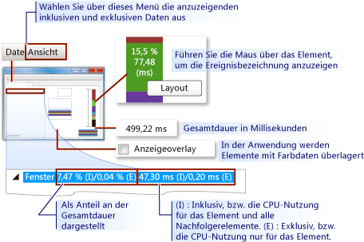
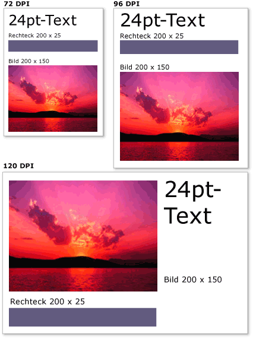

# Übersicht über das WPF-GrafikrenderingWPF Graphics Rendering Overview
Das Thema bietet einen Überblick über die visuelle [!INCLUDE[TLA2#tla_winclient](../../../../includes/tla2sharptla-winclient-md.md)]-Schicht.This topic provides an overview of the [!INCLUDE[TLA2#tla_winclient](../../../../includes/tla2sharptla-winclient-md.md)] visual layer. Der Schwerpunkt liegt auf der Rolle der- <xref:System.Windows.Media.Visual> Klasse für das Rendern von Unterstützung im [!INCLUDE[TLA2#tla_winclient](../../../../includes/tla2sharptla-winclient-md.md)] Modell.It focuses on the role of the <xref:System.Windows.Media.Visual> class for rendering support in the [!INCLUDE[TLA2#tla_winclient](../../../../includes/tla2sharptla-winclient-md.md)] model.  

## Rolle des visuellen ObjektsRole of the Visual Object  
 Die- <xref:System.Windows.Media.Visual> Klasse ist die Basis Abstraktion, von der jedes <xref:System.Windows.FrameworkElement> Objekt abgeleitet wird.The <xref:System.Windows.Media.Visual> class is the basic abstraction from which every <xref:System.Windows.FrameworkElement> object derives. Sie dient auch als Einstiegspunkt zum Schreiben neuer Steuerelemente [!INCLUDE[TLA2#tla_winclient](../../../../includes/tla2sharptla-winclient-md.md)] und kann in vielerlei Hinsicht als Fensterhandle (HWND) im Win32-Anwendungsmodell betrachtet werden.It also serves as the entry point for writing new controls in [!INCLUDE[TLA2#tla_winclient](../../../../includes/tla2sharptla-winclient-md.md)], and in many ways can be thought of as the window handle (HWND) in the Win32 application model.  
  
 <xref:System.Windows.Media.Visual>Bei dem Objekt handelt es sich um ein Kern [!INCLUDE[TLA2#tla_winclient](../../../../includes/tla2sharptla-winclient-md.md)] Objekt, dessen primäre Rolle die Unterstützung von Rendering bereitstellt.The <xref:System.Windows.Media.Visual> object is a core [!INCLUDE[TLA2#tla_winclient](../../../../includes/tla2sharptla-winclient-md.md)] object, whose primary role is to provide rendering support. Steuerelemente der Benutzeroberfläche, z. b. <xref:System.Windows.Controls.Button> und <xref:System.Windows.Controls.TextBox> , werden von der <xref:System.Windows.Media.Visual> -Klasse abgeleitet und zum Speichern ihrer Renderingdaten verwendet.User interface controls, such as <xref:System.Windows.Controls.Button> and <xref:System.Windows.Controls.TextBox>, derive from the <xref:System.Windows.Media.Visual> class, and use it for persisting their rendering data. Das- <xref:System.Windows.Media.Visual> Objekt bietet Unterstützung für:The <xref:System.Windows.Media.Visual> object provides support for:  
  
- Ausgabeanzeige: Rendern des persistenten, serialisierten Zeichnungsinhalts eines visuellen Objekts.Output display: Rendering the persisted, serialized drawing content of a visual.  
  
- Transformationen: Ausführen von Transformationen auf einem visuellen Objekt.Transformations: Performing transformations on a visual.  
  
- Clipping: Bereitstellen der Clippingbereichsunterstützung für ein visuelles Objekt.Clipping: Providing clipping region support for a visual.  
  
- Treffertests: Bestimmen, ob eine Koordinate oder eine Geometrie innerhalb der Grenzen eines visuellen Objekts enthalten ist.Hit testing: Determining whether a coordinate or geometry is contained within the bounds of a visual.  
  
- Berechnungen des Begrenzungsrahmens: Bestimmen des umschließenden Rechtecks eines visuellen Objekts.Bounding box calculations: Determining the bounding rectangle of a visual.  
  
 Das- <xref:System.Windows.Media.Visual> Objekt beinhaltet jedoch keine Unterstützung für nicht-Renderingfeatures, wie z. b.:However, the <xref:System.Windows.Media.Visual> object does not include support for non-rendering features, such as:  
  
- Behandlung von EreignissenEvent handling  
  
- LayoutLayout  
  
- StileStyles  
  
- DatenbindungData binding  
  
- GlobalisierungGlobalization  
  
 <xref:System.Windows.Media.Visual>wird als öffentliche abstrakte Klasse verfügbar gemacht, von der untergeordnete Klassen abgeleitet werden müssen.<xref:System.Windows.Media.Visual> is exposed as a public abstract class from which child classes must be derived. Die folgende Abbildung zeigt die Hierarchie der visuellen Objekte, die in [!INCLUDE[TLA2#tla_winclient](../../../../includes/tla2sharptla-winclient-md.md)] verfügbar gemacht werden.The following illustration shows the hierarchy of the visual objects that are exposed in [!INCLUDE[TLA2#tla_winclient](../../../../includes/tla2sharptla-winclient-md.md)].  
  
 
  
### DrawingVisual-KlasseDrawingVisual Class  
 <xref:System.Windows.Media.DrawingVisual>Ist eine vereinfachte Zeichnungs Klasse, die zum Rendering von Formen, Bildern oder Text verwendet wird.The <xref:System.Windows.Media.DrawingVisual> is a lightweight drawing class that is used to render shapes, images, or text. Diese Klasse wird als einfach angesehen, da sie keine Layout- oder Ereignisbehandlung bereitstellt, was die Laufzeitleistung verbessert.This class is considered lightweight because it does not provide layout or event handling, which improves its runtime performance. Aus diesem Grund eignen sich Zeichnungen für Hintergründe und ClipArt.For this reason, drawings are ideal for backgrounds and clip art. <xref:System.Windows.Media.DrawingVisual>Kann verwendet werden, um ein benutzerdefiniertes visuelles Objekt zu erstellen.The <xref:System.Windows.Media.DrawingVisual> can be used to create a custom visual object. Weitere Informationen finden Sie unter [Verwenden von DrawingVisual-Objekten](using-drawingvisual-objects.md).For more information, see [Using DrawingVisual Objects](using-drawingvisual-objects.md).  
  
### Viewport3DVisual-KlasseViewport3DVisual Class  
 <xref:System.Windows.Media.Media3D.Viewport3DVisual>Stellt eine Brücke zwischen 2D <xref:System.Windows.Media.Visual> -und-Objekten bereit <xref:System.Windows.Media.Media3D.Visual3D> .The <xref:System.Windows.Media.Media3D.Viewport3DVisual> provides a bridge between 2D <xref:System.Windows.Media.Visual> and <xref:System.Windows.Media.Media3D.Visual3D> objects. Die <xref:System.Windows.Media.Media3D.Visual3D> -Klasse ist die Basisklasse für alle visuellen 3D-Elemente.The <xref:System.Windows.Media.Media3D.Visual3D> class is the base class for all 3D visual elements. <xref:System.Windows.Media.Media3D.Viewport3DVisual>Erfordert, dass Sie einen <xref:System.Windows.Media.Media3D.Viewport3DVisual.Camera%2A> -Wert und einen- <xref:System.Windows.Media.Media3D.Viewport3DVisual.Viewport%2A> Wert definieren.The <xref:System.Windows.Media.Media3D.Viewport3DVisual> requires that you define a <xref:System.Windows.Media.Media3D.Viewport3DVisual.Camera%2A> value and a <xref:System.Windows.Media.Media3D.Viewport3DVisual.Viewport%2A> value. Die Kamera ermöglicht die Anzeige der Szene.The camera allows you to view the scene. Der Anzeigebereich legt fest, wo die Projektion auf der 2D-Fläche zuordnet.The viewport establishes where the projection maps onto the 2D surface. Weitere Informationen zu 3D in [!INCLUDE[TLA2#tla_winclient](../../../../includes/tla2sharptla-winclient-md.md)] finden Sie unter [Übersicht über 3D-Grafiken](3-d-graphics-overview.md).For more information on 3D in [!INCLUDE[TLA2#tla_winclient](../../../../includes/tla2sharptla-winclient-md.md)], see [3D Graphics Overview](3-d-graphics-overview.md).  
  
### ContainerVisual-KlasseContainerVisual Class  
 Die- <xref:System.Windows.Media.ContainerVisual> Klasse wird als Container für eine Auflistung von- <xref:System.Windows.Media.Visual> Objekten verwendet.The <xref:System.Windows.Media.ContainerVisual> class is used as a container for a collection of <xref:System.Windows.Media.Visual> objects. Die- <xref:System.Windows.Media.DrawingVisual> Klasse wird von der- <xref:System.Windows.Media.ContainerVisual> Klasse abgeleitet, sodass Sie eine Auflistung visueller Objekte enthalten kann.The <xref:System.Windows.Media.DrawingVisual> class derives from the <xref:System.Windows.Media.ContainerVisual> class, allowing it to contain a collection of visual objects.  
  
### Zeichnungsinhalt in visuellen ObjektenDrawing Content in Visual Objects  
 Ein- <xref:System.Windows.Media.Visual> Objekt speichert seine Renderdaten als eine **Vektorgrafik Anweisungs Liste**.A <xref:System.Windows.Media.Visual> object stores its render data as a **vector graphics instruction list**. Jedes Element in der Anweisungsliste stellt einen Satz von Grafikdaten einer niedrigeren Ebene und dazugehörige Ressourcen in einem serialisierten Format dar.Each item in the instruction list represents a low-level set of graphics data and associated resources in a serialized format. Es gibt vier verschiedene Typen von Renderingdaten, die Zeichnungsinhalt enthalten können.There are four different types of render data that can contain drawing content.  
  
|ZeichnungsinhaltstypDrawing content type|BeschreibungDescription|  
|--------------------------|-----------------|  
|VektorgrafikVector graphics|Stellt Vektorgrafik Daten und alle zugeordneten <xref:System.Windows.Media.Brush> -und- <xref:System.Windows.Media.Pen> Informationen dar.Represents vector graphics data, and any associated <xref:System.Windows.Media.Brush> and <xref:System.Windows.Media.Pen> information.|  
|ImageImage|Stellt ein Bild innerhalb eines von definierten Bereichs dar <xref:System.Windows.Rect> .Represents an image within a region defined by a <xref:System.Windows.Rect>.|  
|GlypheGlyph|Stellt eine Zeichnung dar, die eine rendert <xref:System.Windows.Media.GlyphRun> , bei der es sich um eine Sequenz von Symbolen aus einer angegebenen Schriftart Ressource handelt.Represents a drawing that renders a <xref:System.Windows.Media.GlyphRun>, which is a sequence of glyphs from a specified font resource. So wird Text dargestellt.This is how text is represented.|  
|VideoVideo|Stellt eine Zeichnung dar, die Video rendert.Represents a drawing that renders video.|  
  
 <xref:System.Windows.Media.DrawingContext>Mit dem können Sie eine <xref:System.Windows.Media.Visual> mit visuellen Inhalten auffüllen.The <xref:System.Windows.Media.DrawingContext> allows you to populate a <xref:System.Windows.Media.Visual> with visual content. Wenn Sie <xref:System.Windows.Media.DrawingContext> die draw-Befehle eines-Objekts verwenden, speichern Sie tatsächlich eine Reihe von Renderingdaten, die später vom Grafiksystem verwendet werden. Sie werden nicht in Echtzeit auf den Bildschirm gezeichnet.When you use a <xref:System.Windows.Media.DrawingContext> object's draw commands, you are actually storing a set of render data that will later be used by the graphics system; you are not drawing to the screen in real-time.  
  
 Wenn Sie ein Steuerelement erstellen [!INCLUDE[TLA2#tla_winclient](../../../../includes/tla2sharptla-winclient-md.md)] , z <xref:System.Windows.Controls.Button> . b. ein, generiert das Steuerelement implizit Rendering-Daten für das Zeichnen.When you create a [!INCLUDE[TLA2#tla_winclient](../../../../includes/tla2sharptla-winclient-md.md)] control, such as a <xref:System.Windows.Controls.Button>, the control implicitly generates render data for drawing itself. Beispielsweise bewirkt das Festlegen der- <xref:System.Windows.Controls.ContentControl.Content%2A> Eigenschaft von <xref:System.Windows.Controls.Button> , dass das-Steuerelement eine Renderingdarstellung eines Symbols speichert.For example, setting the <xref:System.Windows.Controls.ContentControl.Content%2A> property of the <xref:System.Windows.Controls.Button> causes the control to store a rendering representation of a glyph.  
  
 Ein <xref:System.Windows.Media.Visual> beschreibt seinen Inhalt als ein oder mehrere-Objekte, die <xref:System.Windows.Media.Drawing> in einem enthalten sind <xref:System.Windows.Media.DrawingGroup> .A <xref:System.Windows.Media.Visual> describes its content as one or more <xref:System.Windows.Media.Drawing> objects contained within a <xref:System.Windows.Media.DrawingGroup>. <xref:System.Windows.Media.DrawingGroup>Außerdem werden Deck Kraft Masken, Transformationen, Bitmapeffekte und andere Vorgänge beschrieben, die auf den Inhalt angewendet werden.A <xref:System.Windows.Media.DrawingGroup> also describes opacity masks, transforms, bitmap effects, and other operations that are applied to its contents. <xref:System.Windows.Media.DrawingGroup>Vorgänge werden in der folgenden Reihenfolge angewendet, wenn der Inhalt gerendert wird: <xref:System.Windows.Media.DrawingGroup.OpacityMask%2A> , <xref:System.Windows.Media.DrawingGroup.Opacity%2A> , <xref:System.Windows.Media.DrawingGroup.BitmapEffect%2A> , <xref:System.Windows.Media.DrawingGroup.ClipGeometry%2A> , <xref:System.Windows.Media.DrawingGroup.GuidelineSet%2A> und dann <xref:System.Windows.Media.DrawingGroup.Transform%2A> .<xref:System.Windows.Media.DrawingGroup> operations are applied in the following order when content is rendered: <xref:System.Windows.Media.DrawingGroup.OpacityMask%2A>, <xref:System.Windows.Media.DrawingGroup.Opacity%2A>, <xref:System.Windows.Media.DrawingGroup.BitmapEffect%2A>, <xref:System.Windows.Media.DrawingGroup.ClipGeometry%2A>, <xref:System.Windows.Media.DrawingGroup.GuidelineSet%2A>, and then <xref:System.Windows.Media.DrawingGroup.Transform%2A>.  
  
 Die folgende Abbildung zeigt die Reihenfolge, in der <xref:System.Windows.Media.DrawingGroup> Vorgänge während der Renderingsequenz angewendet werden.The following illustration shows the order in which <xref:System.Windows.Media.DrawingGroup> operations are applied during the rendering sequence.  
  
   
Reihenfolge der DrawingGroup-VorgängeOrder of DrawingGroup operations  
  
 Weitere Informationen finden Sie unter [Übersicht über Zeichnungsobjekte](drawing-objects-overview.md).For more information, see [Drawing Objects Overview](drawing-objects-overview.md).  
  
#### Zeichnungsinhalt auf Ebene des visuellen ObjektsDrawing Content at the Visual Layer  
 Sie können niemals direkt instanziieren <xref:System.Windows.Media.DrawingContext> . Sie können jedoch einen Zeichnungs Kontext von bestimmten Methoden abrufen, z <xref:System.Windows.Media.DrawingGroup.Open%2A?displayProperty=nameWithType> . b. und <xref:System.Windows.Media.DrawingVisual.RenderOpen%2A?displayProperty=nameWithType> .You never directly instantiate a <xref:System.Windows.Media.DrawingContext>; you can, however, acquire a drawing context from certain methods, such as <xref:System.Windows.Media.DrawingGroup.Open%2A?displayProperty=nameWithType> and <xref:System.Windows.Media.DrawingVisual.RenderOpen%2A?displayProperty=nameWithType>. Im folgenden Beispiel wird ein <xref:System.Windows.Media.DrawingContext> aus einem abgerufen <xref:System.Windows.Media.DrawingVisual> und zum Zeichnen eines Rechtecks verwendet.The following example retrieves a <xref:System.Windows.Media.DrawingContext> from a <xref:System.Windows.Media.DrawingVisual> and uses it to draw a rectangle.  
  
 [!code-csharp[drawingvisualsample#101](~/samples/snippets/csharp/VS_Snippets_Wpf/DrawingVisualSample/CSharp/Window1.xaml.cs#101)]
 [!code-vb[drawingvisualsample#101](~/samples/snippets/visualbasic/VS_Snippets_Wpf/DrawingVisualSample/visualbasic/window1.xaml.vb#101)]  
  
#### Auflisten des Zeichnungsinhalts auf der Ebene eines visuellen ObjektsEnumerating Drawing Content at the Visual Layer  
 Zusätzlich zu den anderen Verwendungsmöglichkeiten <xref:System.Windows.Media.Drawing> stellen-Objekte auch ein Objektmodell für das Auflisten des Inhalts von bereit <xref:System.Windows.Media.Visual> .In addition to their other uses, <xref:System.Windows.Media.Drawing> objects also provide an object model for enumerating the contents of a <xref:System.Windows.Media.Visual>.  
  
> [!NOTE]
> Wenn Sie den Inhalt der Visualisierung auflisten, rufen Sie <xref:System.Windows.Media.Drawing> Objekte ab, und nicht die zugrunde liegende Darstellung der Renderingdaten als Liste von Vektorgrafik Anweisungs Listen.When you are enumerating the contents of the visual, you are retrieving <xref:System.Windows.Media.Drawing> objects, and not the underlying representation of the render data as a vector graphics instruction list.  
  
 Im folgenden Beispiel wird die <xref:System.Windows.Media.VisualTreeHelper.GetDrawing%2A> -Methode verwendet, um den <xref:System.Windows.Media.DrawingGroup> Wert eines abzurufen <xref:System.Windows.Media.Visual> und ihn aufzulisten.The following example uses the <xref:System.Windows.Media.VisualTreeHelper.GetDrawing%2A> method to retrieve the <xref:System.Windows.Media.DrawingGroup> value of a <xref:System.Windows.Media.Visual> and enumerate it.  
  
 [!code-csharp[DrawingMiscSnippets_snip#GraphicsMMRetrieveDrawings](~/samples/snippets/csharp/VS_Snippets_Wpf/DrawingMiscSnippets_snip/CSharp/EnumerateDrawingsExample.xaml.cs#graphicsmmretrievedrawings)]  
  

## Verwenden von visuellen Objekten zum Erstellen von SteuerelementenHow Visual Objects are Used to Build Controls  
 Viele der Objekte in [!INCLUDE[TLA2#tla_winclient](../../../../includes/tla2sharptla-winclient-md.md)] bestehen aus anderen visuellen Objekten, d.h., sie können unterschiedliche Hierarchien von untergeordneten Objekten enthalten.Many of the objects in [!INCLUDE[TLA2#tla_winclient](../../../../includes/tla2sharptla-winclient-md.md)] are composed of other visual objects, meaning they can contain varying hierarchies of descendant objects. Viele Benutzeroberflächenelemente in [!INCLUDE[TLA2#tla_winclient](../../../../includes/tla2sharptla-winclient-md.md)], z.B. Steuerelemente, bestehen aus mehreren visuellen Objekten, die unterschiedliche Typen von Renderingelementen darstellen.Many of the user interface elements in [!INCLUDE[TLA2#tla_winclient](../../../../includes/tla2sharptla-winclient-md.md)], such as controls, are composed of multiple visual objects, representing different types of rendering elements. Das-Steuerelement <xref:System.Windows.Controls.Button> kann beispielsweise eine Reihe anderer-Objekte enthalten, einschließlich <xref:Microsoft.Windows.Themes.ClassicBorderDecorator> , <xref:System.Windows.Controls.ContentPresenter> und <xref:System.Windows.Controls.TextBlock> .For example, the <xref:System.Windows.Controls.Button> control can contain a number of other objects, including <xref:Microsoft.Windows.Themes.ClassicBorderDecorator>, <xref:System.Windows.Controls.ContentPresenter>, and <xref:System.Windows.Controls.TextBlock>.  
  
 Der folgende Code zeigt ein <xref:System.Windows.Controls.Button> im Markup definiertes Steuerelement.The following code shows a <xref:System.Windows.Controls.Button> control defined in markup.  
  
 [!code-xaml[VisualsOverview#VisualsOverviewSnippet1](~/samples/snippets/csharp/VS_Snippets_Wpf/VisualsOverview/CSharp/Window1.xaml#visualsoverviewsnippet1)]  
  
 Wenn Sie die visuellen Objekte auflisten, die das Standard Steuerelement bilden <xref:System.Windows.Controls.Button> , finden Sie die unten dargestellte Hierarchie von visuellen Objekten:If you were to enumerate the visual objects that comprise the default <xref:System.Windows.Controls.Button> control, you would find the hierarchy of visual objects illustrated below:  
  
 
  
 Das- <xref:System.Windows.Controls.Button> Steuerelement enthält ein- <xref:Microsoft.Windows.Themes.ClassicBorderDecorator> Element, das wiederum ein- <xref:System.Windows.Controls.ContentPresenter> Element enthält.The <xref:System.Windows.Controls.Button> control contains a <xref:Microsoft.Windows.Themes.ClassicBorderDecorator> element, which in turn, contains a <xref:System.Windows.Controls.ContentPresenter> element. Das <xref:Microsoft.Windows.Themes.ClassicBorderDecorator> -Element ist für das Zeichnen eines Rahmens und eines Hintergrunds für das verantwortlich <xref:System.Windows.Controls.Button> .The <xref:Microsoft.Windows.Themes.ClassicBorderDecorator> element is responsible for drawing a border and a background for the <xref:System.Windows.Controls.Button>. Das- <xref:System.Windows.Controls.ContentPresenter> Element ist dafür verantwortlich, den Inhalt von anzuzeigen <xref:System.Windows.Controls.Button> .The <xref:System.Windows.Controls.ContentPresenter> element is responsible for displaying the contents of the <xref:System.Windows.Controls.Button>. In diesem Fall enthält das-Element ein-Element, da Sie Text anzeigen <xref:System.Windows.Controls.ContentPresenter> <xref:System.Windows.Controls.TextBlock> .In this case, since you are displaying text, the <xref:System.Windows.Controls.ContentPresenter> element contains a <xref:System.Windows.Controls.TextBlock> element. Die Tatsache, dass das <xref:System.Windows.Controls.Button> Steuerelement einen verwendet, <xref:System.Windows.Controls.ContentPresenter> bedeutet, dass der Inhalt durch andere Elemente dargestellt werden kann, z <xref:System.Windows.Controls.Image> . b. eine oder eine Geometrie, z <xref:System.Windows.Media.EllipseGeometry> . b. ein.The fact that the <xref:System.Windows.Controls.Button> control uses a <xref:System.Windows.Controls.ContentPresenter> means that the content could be represented by other elements, such as an <xref:System.Windows.Controls.Image> or a geometry, such as an <xref:System.Windows.Media.EllipseGeometry>.  
  
### SteuerelementvorlagenControl Templates  
 Der Schlüssel zur Erweiterung eines Steuer Elements in eine Hierarchie von Steuerelementen ist die <xref:System.Windows.Controls.ControlTemplate> .The key to the expansion of a control into a hierarchy of controls is the <xref:System.Windows.Controls.ControlTemplate>. Eine Steuerelementvorlage gibt die visuelle Standardhierarchie für ein Steuerelement an.A control template specifies the default visual hierarchy for a control. Wenn Sie explizit auf ein Steuerelement verweisen, verweisen Sie implizit auf dessen visuelle Hierarchie.When you explicitly reference a control, you implicitly reference its visual hierarchy. Sie können die Standardwerte für eine Steuerelementvorlage überschreiben, um eine angepasste visuelle Darstellung für ein Steuerelement zu erstellen.You can override the default values for a control template to create a customized visual appearance for a control. Beispielsweise können Sie den Wert für die Hintergrundfarbe des- <xref:System.Windows.Controls.Button> Steuer Elements so ändern, dass ein linearer Farbverlaufs Farbwert anstelle eines voll tonfarbwerts verwendet wird.For example, you could modify the background color value of the <xref:System.Windows.Controls.Button> control so that it uses a linear gradient color value instead of a solid color value. Weitere Informationen finden Sie unter [Button-Stile und Vorlagen](../controls/button-styles-and-templates.md).For more information, see [Button Styles and Templates](../controls/button-styles-and-templates.md).  
  
 Ein Benutzeroberflächen Element, z. b. ein- <xref:System.Windows.Controls.Button> Steuerelement, enthält mehrere Vektorgrafik Anweisungs Listen, die die gesamte Renderingdefinition eines-Steuer Elements beschreiben.A user interface element, such as a <xref:System.Windows.Controls.Button> control, contains several vector graphics instruction lists that describe the entire rendering definition of a control. Der folgende Code zeigt ein <xref:System.Windows.Controls.Button> im Markup definiertes Steuerelement.The following code shows a <xref:System.Windows.Controls.Button> control defined in markup.  
  
 [!code-xaml[VisualsOverview#VisualsOverviewSnippet2](~/samples/snippets/csharp/VS_Snippets_Wpf/VisualsOverview/CSharp/Window1.xaml#visualsoverviewsnippet2)]  
  
 Wenn Sie die Listen der visuellen Objekte und der Vektorgrafik Anweisung auflisten, die das Steuerelement enthalten <xref:System.Windows.Controls.Button> , finden Sie die unten dargestellte Hierarchie von Objekten:If you were to enumerate the visual objects and vector graphics instruction lists that comprise the <xref:System.Windows.Controls.Button> control, you would find the hierarchy of objects illustrated below:  
  
   
  
 Das- <xref:System.Windows.Controls.Button> Steuerelement enthält ein- <xref:Microsoft.Windows.Themes.ClassicBorderDecorator> Element, das wiederum ein- <xref:System.Windows.Controls.ContentPresenter> Element enthält.The <xref:System.Windows.Controls.Button> control contains a <xref:Microsoft.Windows.Themes.ClassicBorderDecorator> element, which in turn, contains a <xref:System.Windows.Controls.ContentPresenter> element. Das- <xref:Microsoft.Windows.Themes.ClassicBorderDecorator> Element ist für das Zeichnen aller einzelnen Grafikelemente verantwortlich, die den Rahmen und den Hintergrund einer Schaltfläche bilden.The <xref:Microsoft.Windows.Themes.ClassicBorderDecorator> element is responsible for drawing all the discrete graphic elements that make up the border and background of a button. Das- <xref:System.Windows.Controls.ContentPresenter> Element ist dafür verantwortlich, den Inhalt von anzuzeigen <xref:System.Windows.Controls.Button> .The <xref:System.Windows.Controls.ContentPresenter> element is responsible for displaying the contents of the <xref:System.Windows.Controls.Button>. In diesem Fall enthält das-Element ein-Element, da Sie ein Bild anzeigen <xref:System.Windows.Controls.ContentPresenter> <xref:System.Windows.Controls.Image> .In this case, since you are displaying an image, the <xref:System.Windows.Controls.ContentPresenter> element contains a <xref:System.Windows.Controls.Image> element.  
  
 Es gibt mehrere Dinge im Zusammenhang mit der Hierarchie von visuellen Objekten und Anweisungslisten für Vektorgrafiken zu beachten:There are a number of points to note about the hierarchy of visual objects and vector graphics instruction lists:  
  
- Die Reihenfolge in der Hierarchie stellt die Renderingreihenfolge der Zeichnungsinformationen dar.The ordering in the hierarchy represents the rendering order of the drawing information. Aus dem visuellen Stammelement werden untergeordnete Elemente von links nach rechts und von oben nach unten durchlaufen.From the root visual element, child elements are traversed, left to right, top to bottom. Wenn ein Element über visuelle untergeordnete Elemente verfügt, werden diese vor den gleichgeordneten Elementen des Elements durchlaufen.If an element has visual child elements, they are traversed before the element’s siblings.  
  
- Nicht Blattknoten Elemente in der Hierarchie, wie z <xref:System.Windows.Controls.ContentPresenter> . b., werden verwendet, um untergeordnete Elemente zu enthalten – Sie enthalten keine Anweisungs Listen.Non-leaf node elements in the hierarchy, such as <xref:System.Windows.Controls.ContentPresenter>, are used to contain child elements—they do not contain instruction lists.  
  
- Wenn ein visuelles Element eine Anweisungsliste für Vektorgrafiken und visuelle untergeordnete Elemente enthält, wird die Anweisungsliste im übergeordneten visuellen Element vor Zeichnungen in einem der untergeordneten visuellen Objekte gerendert.If a visual element contains both a vector graphics instruction list and visual children, the instruction list in the parent visual element is rendered before drawings in any of the visual child objects.  
  
- Die Elemente in der Anweisungsliste für Vektorgrafiken werden von links nach rechts gerendert.The items in the vector graphics instruction list are rendered left to right.  
  

## Visuelle StrukturVisual Tree  
 Die visuelle Struktur enthält alle visuellen Elemente, die in der Benutzeroberfläche einer Anwendung verwendet werden.The visual tree contains all visual elements used in an application's user interface. Da ein visuelles Element persistent gespeicherte Zeichnungsinformationen enthält, können Sie sich die visuelle Struktur als Szenengraph vorstellen, der alle Renderinginformationen enthält, die erforderlich sind, um die Ausgabe auf dem Anzeigegerät zu erstellen.Since a visual element contains persisted drawing information, you can think of the visual tree as a scene graph, containing all the rendering information needed to compose the output to the display device. Diese Struktur ist die Ansammlung aller visuellen Elemente, die direkt von der Anwendung im Code oder im Markup erstellt werden.This tree is the accumulation of all visual elements created directly by the application, whether in code or in markup. Die visuelle Struktur enthält auch alle visuellen Elemente, die von der Vorlagenerweiterung der Elemente, wie z.B. Steuerelemente und Datenobjekte, erstellt werden.The visual tree also contains all visual elements created by the template expansion of elements such as controls and data objects.  
  
 Der folgende Code zeigt ein-Element, das <xref:System.Windows.Controls.StackPanel> in Markup definiert ist.The following code shows a <xref:System.Windows.Controls.StackPanel> element defined in markup.  
  
 [!code-xaml[VisualsOverview#VisualsOverviewSnippet3](~/samples/snippets/csharp/VS_Snippets_Wpf/VisualsOverview/CSharp/Window1.xaml#visualsoverviewsnippet3)]  
  
 Wenn Sie die visuellen Objekte auflisten möchten, aus denen das- <xref:System.Windows.Controls.StackPanel> Element im Markup Beispiel besteht, finden Sie die unten dargestellte Hierarchie von visuellen Objekten:If you were to enumerate the visual objects that comprise the <xref:System.Windows.Controls.StackPanel> element in the markup example, you would find the hierarchy of visual objects illustrated below:  
  
   
  
### RenderingreihenfolgeRendering Order  
 Die visuelle Struktur bestimmt die Renderingreihenfolge der visuellen [!INCLUDE[TLA2#tla_winclient](../../../../includes/tla2sharptla-winclient-md.md)] und Zeichnungsobjekte.The visual tree determines the rendering order of [!INCLUDE[TLA2#tla_winclient](../../../../includes/tla2sharptla-winclient-md.md)] visual and drawing objects. Die Reihenfolge des Durchlaufs beginnt mit dem visuellen Stammelement, das der oberste Knoten in der visuellen Struktur ist.The order of traversal starts with the root visual, which is the top-most node in the visual tree. Die untergeordnete Elemente des visuellen Stammelements werden von links nach rechts durchlaufen.The root visual’s children are then traversed, left to right. Wenn ein visuelles Objekt über untergeordnete Elemente verfügt, werden seine untergeordneten Elemente vor den gleichgeordneten visuellen Elementen durchlaufen.If a visual has children, its children are traversed before the visual’s siblings. Dies bedeutet, dass der Inhalt eines untergeordneten visuellen Objekts vor dem Inhalt des visuellen Objekts selbst gerendert wird.This means that the content of a child visual is rendered in front of the visual's own content.  
  
 
  
### Visuelles StammobjektRoot Visual  
 Das **visuelle Stammobjekt** ist das oberste Element in der Hierarchie einer visuellen Struktur.The **root visual** is the top-most element in a visual tree hierarchy. In den meisten Anwendungen ist die Basisklasse der visuellen Stamm Visualisierung entweder <xref:System.Windows.Window> oder <xref:System.Windows.Navigation.NavigationWindow> .In most applications, the base class of the root visual is either <xref:System.Windows.Window> or <xref:System.Windows.Navigation.NavigationWindow>. Wenn Sie jedoch visuelle Objekte in einer Win32-Anwendung hosten, ist das visuelle Stammobjekt das oberste visuelle Objekt, das Sie im Win32-Fenster hosten.However, if you were hosting visual objects in a Win32 application, the root visual would be the top-most visual you were hosting in the Win32 window. Weitere Informationen finden Sie unter [Tutorial: Hosten von visuellen Objekten in einer Win32-Anwendung](tutorial-hosting-visual-objects-in-a-win32-application.md).For more information, see [Tutorial: Hosting Visual Objects in a Win32 Application](tutorial-hosting-visual-objects-in-a-win32-application.md).  
  
### Beziehung zur logischen StrukturRelationship to the Logical Tree  
 Die logische Struktur in [!INCLUDE[TLA2#tla_winclient](../../../../includes/tla2sharptla-winclient-md.md)] stellt die Elemente einer Anwendung zur Laufzeit dar.The logical tree in [!INCLUDE[TLA2#tla_winclient](../../../../includes/tla2sharptla-winclient-md.md)] represents the elements of an application at run time. Obwohl Sie die Struktur nicht direkt bearbeiten, ist diese Ansicht der Anwendung nützlich, um die Vererbung von Eigenschaften und das Ereignisrouting nachzuvollziehen.Although you do not manipulate this tree directly, this view of the application is useful for understanding property inheritance and event routing. Anders als bei der visuellen Struktur kann die logische Struktur nicht visuelle Datenobjekte, wie z. b., darstellen <xref:System.Windows.Documents.ListItem> .Unlike the visual tree, the logical tree can represent non-visual data objects, such as <xref:System.Windows.Documents.ListItem>. In vielen Fällen ist die logische Struktur eng an die Markupdefinitionen einer Anwendung angelehnt.In many cases, the logical tree maps very closely to an application's markup definitions. Der folgende Code zeigt ein-Element, das <xref:System.Windows.Controls.DockPanel> in Markup definiert ist.The following code shows a <xref:System.Windows.Controls.DockPanel> element defined in markup.  
  
 [!code-xaml[VisualsOverview#VisualsOverviewSnippet5](~/samples/snippets/csharp/VS_Snippets_Wpf/VisualsOverview/CSharp/Window1.xaml#visualsoverviewsnippet5)]  
  
 Wenn Sie die logischen Objekte auflisten möchten, aus denen das- <xref:System.Windows.Controls.DockPanel> Element im Markup Beispiel besteht, finden Sie die unten dargestellte Hierarchie von logischen Objekten:If you were to enumerate the logical objects that comprise the <xref:System.Windows.Controls.DockPanel> element in the markup example, you would find the hierarchy of logical objects illustrated below:  
  
   
Diagramm der logischen StrukturDiagram of logical tree  
  
 Die visuelle Struktur und die logische Struktur werden mit dem aktuellen Satz von Anwendungselementen synchronisiert und spiegeln dabei alle Hinzufügungen, Löschungen oder Änderungen von Elementen wider.Both the visual tree and logical tree are synchronized with the current set of application elements, reflecting any addition, deletion, or modification of elements. Die Strukturen liefern jedoch verschiedene Ansichten der Anwendung.However, the trees present different views of the application. Anders als bei der visuellen Struktur, erweitert die logische Struktur nicht das- <xref:System.Windows.Controls.ContentPresenter> Element eines Steuer Elements.Unlike the visual tree, the logical tree does not expand a control's <xref:System.Windows.Controls.ContentPresenter> element. Dies bedeutet, dass keine direkte 1:1-Entsprechung zwischen einer logischen Struktur und einer visuellen Struktur für den gleichen Satz von Objekten vorhanden ist.This means there is not a direct one-to-one correspondence between a logical tree and a visual tree for the same set of objects. Tatsächlich führt das Aufrufen der-Methode des **LogicalTreeHelper** -Objekts <xref:System.Windows.LogicalTreeHelper.GetChildren%2A> und der-Methode des **VisualTreeHelper** -Objekts, <xref:System.Windows.Media.VisualTreeHelper.GetChild%2A> die das gleiche-Element wie ein-Parameter verwendet, zu unterschiedlichen Ergebnissen.In fact, invoking the **LogicalTreeHelper** object's <xref:System.Windows.LogicalTreeHelper.GetChildren%2A> method and the **VisualTreeHelper** object's <xref:System.Windows.Media.VisualTreeHelper.GetChild%2A> method using the same element as a parameter yields differing results.  
  
 Weitere Informationen zu der logischen Struktur finden Sie unter [Strukturen in WPF](../advanced/trees-in-wpf.md).For more information on the logical tree, see [Trees in WPF](../advanced/trees-in-wpf.md).  
  
### Anzeigen der visuellen Struktur mit XamlPadViewing the Visual Tree with XamlPad  
 Das [!INCLUDE[TLA2#tla_winclient](../../../../includes/tla2sharptla-winclient-md.md)] Tool XamlPad bietet eine Option zum Anzeigen und untersuchen der visuellen Struktur, die dem aktuell definierten XAML-Inhalt entspricht.The [!INCLUDE[TLA2#tla_winclient](../../../../includes/tla2sharptla-winclient-md.md)] tool, XamlPad, provides an option for viewing and exploring the visual tree that corresponds to the currently defined XAML content. Klicken Sie auf die Schaltfläche **Visuelle Struktur anzeigen** der Menüleiste, um die visuelle Struktur anzuzeigen.Click the **Show Visual Tree** button on the menu bar to display the visual tree. Das folgende Beispiel veranschaulicht die Erweiterung von XAML-Inhalt in visuelle Struktur Knoten im Panel des visuellen Struktur- **Explorers** von XamlPad:The following illustrates the expansion of XAML content into visual tree nodes in the **Visual Tree Explorer** panel of XamlPad:  
  
   

 Beachten Sie, dass die Steuer <xref:System.Windows.Controls.Label> <xref:System.Windows.Controls.TextBox> Elemente, und <xref:System.Windows.Controls.Button> jeweils eine separate visuelle Objekthierarchie im **Visual Tree Explorer** -Panel von XamlPad anzeigen.Notice how the <xref:System.Windows.Controls.Label>, <xref:System.Windows.Controls.TextBox>, and <xref:System.Windows.Controls.Button> controls each display a separate visual object hierarchy in the **Visual Tree Explorer** panel of XamlPad. Dies liegt daran [!INCLUDE[TLA2#tla_winclient](../../../../includes/tla2sharptla-winclient-md.md)] , dass Steuerelemente über einen verfügen <xref:System.Windows.Controls.ControlTemplate> , der die visuelle Struktur dieses Steuer Elements enthält.This is because [!INCLUDE[TLA2#tla_winclient](../../../../includes/tla2sharptla-winclient-md.md)] controls have a <xref:System.Windows.Controls.ControlTemplate> that contains the visual tree of that control. Wenn Sie explizit auf ein Steuerelement verweisen, verweisen Sie implizit auf dessen visuelle Hierarchie.When you explicitly reference a control, you implicitly reference its visual hierarchy.  
  
### Erstellung von visuellen LeistungsprofilenProfiling Visual Performance  
 [!INCLUDE[TLA2#tla_winclient](../../../../includes/tla2sharptla-winclient-md.md)] stellt eine Suite von Leistungsprofilerstellungstools bereit, mit deren Hilfe Sie das Laufzeitverhalten der Anwendung analysieren und die Typen der anwendbaren Leistungsoptimierungen bestimmen können.provides a suite of performance profiling tools that allow you to analyze the run-time behavior of your application and determine the types of performance optimizations you can apply. Das Visual Profiler-Tool bietet eine umfassende grafische Sicht der Leistungsdaten, indem diese direkt der visuellen Struktur der Anwendung zugeordnet werden.The Visual Profiler tool provides a rich, graphical view of performance data by mapping directly to the application's visual tree. In diesem Screenshot verschafft Ihnen der Abschnitt **CPU-Auslastung** von Visual Profiler eine genaue Aufschlüsselung der Nutzung von [!INCLUDE[TLA2#tla_winclient](../../../../includes/tla2sharptla-winclient-md.md)]-Diensten eines Objekts, z.B. Rendering und Layout.In this screenshot, the **CPU Usage** section of the Visual Profiler gives you a precise breakdown of an object's use of [!INCLUDE[TLA2#tla_winclient](../../../../includes/tla2sharptla-winclient-md.md)] services, such as rendering and layout.  
  
   
Visual Profiler-AnzeigeausgabeVisual Profiler display output  
  

## Verhalten des visuellen RenderingsVisual Rendering Behavior  
 [!INCLUDE[TLA2#tla_winclient](../../../../includes/tla2sharptla-winclient-md.md)] verfügt über Funktionen, die das Renderingverhalten visueller Objekte beeinflussen: Retained Mode-Grafiken, Vektorgrafiken und geräteunabhängige Grafiken.introduces several features that affect the rendering behavior of visual objects: retained mode graphics, vector graphics, and device independent graphics.  
  
### Retained Mode-GrafikenRetained Mode Graphics  
 Einer der Schlüssel zum Verständnis der Rolle des visuellen Objekts ist der Unterschied zwischen Grafiksystemen mit **Direktmodus** und **Retained Mode**.One of the keys to understanding the role of the Visual object is to understand the difference between **immediate mode** and **retained mode** graphics systems. Eine standardmäßige Win32-Anwendung, die auf GDI oder GDI+ basiert, verwendet ein Grafiksystem mit unmittelbaren Modus.A standard Win32 application based on GDI or GDI+ uses an immediate mode graphics system. Das heißt, dass die Anwendung für das Neuzeichnen des Teils des Clientbereichs verantwortlich ist, der aufgrund einer Aktion, z.B. Änderung der Größe eines Fensters, oder eines Objekts, dessen visuelle Darstellung geändert wird, ungültig ist.This means that the application is responsible for repainting the portion of the client area that is invalidated, due to an action such as a window being resized, or an object changing its visual appearance.  
  
   
  
 Im Gegensatz dazu verwendet [!INCLUDE[TLA2#tla_winclient](../../../../includes/tla2sharptla-winclient-md.md)] ein System mit Retained Mode.In contrast, [!INCLUDE[TLA2#tla_winclient](../../../../includes/tla2sharptla-winclient-md.md)] uses a retained mode system. Dies bedeutet, dass Objekte, die eine visuelle Darstellung haben, einen Satz serialisierter Zeichnungsdaten definieren.This means application objects that have a visual appearance define a set of serialized drawing data. Nachdem die Zeichnungsdaten definiert wurden, ist das System für alle Repaint-Anforderungen zum Rendern der Anwendungsobjekte verantwortlich.Once the drawing data is defined, the system is responsible thereafter for responding to all repaint requests for rendering the application objects. Auch zur Laufzeit können Sie Anwendungsobjekte ändern oder erstellen und das System weiterhin auf Zeichnungsanforderungen reagieren lassen.Even at run time, you can modify or create application objects, and still rely on the system for responding to paint requests. Die Leistungsstärke eines Grafiksystems mit Retained Mode ist darauf zurückzuführen, dass Zeichnungsinformationen stets in einem serialisierten Zustand von der Anwendung gespeichert werden, die Verantwortung für das Rendering aber dem System überlassen wird.The power in a retained mode graphics system is that drawing information is always persisted in a serialized state by the application, but rendering responsibility left to the system. Das folgende Diagramm zeigt, wie die Anwendung [!INCLUDE[TLA2#tla_winclient](../../../../includes/tla2sharptla-winclient-md.md)] auf Zeichnungsanforderungen reagieren lässt.The following diagram shows how the application relies on [!INCLUDE[TLA2#tla_winclient](../../../../includes/tla2sharptla-winclient-md.md)] for responding to paint requests.  
  
   

#### Intelligentes NeuzeichnenIntelligent Redrawing  
 Einer der größten Vorteile bei der Verwendung von Grafiken mit dem Retained Mode besteht darin, dass [!INCLUDE[TLA2#tla_winclient](../../../../includes/tla2sharptla-winclient-md.md)] effizient optimieren kann, was in der Anwendung neu gezeichnet werden muss.One of the biggest benefits in using retained mode graphics is that [!INCLUDE[TLA2#tla_winclient](../../../../includes/tla2sharptla-winclient-md.md)] can efficiently optimize what needs to be redrawn in the application. Auch wenn Sie über eine komplexe Szene mit unterschiedlicher Deckkraft verfügen, müssen Sie im Allgemeinen nicht für besondere Zwecke Code zum Neuzeichnen optimieren.Even if you have a complex scene with varying levels of opacity, you generally do not need to write special-purpose code to optimize redrawing. Vergleichen Sie dies mit der Win32-Programmierung, bei der Sie viele Ressourcen in die Optimierung Ihrer Anwendung durch Minimierung des Neuzeichnungaufwands im Aktualisierungsbereich investieren können.Compare this with Win32 programming in which you can spend a great deal of effort in optimizing your application by minimizing the amount of redrawing in the update region. Ein Beispiel für den Typ der Komplexität in Verbindung mit der Optimierung der Neuzeichnung in Win32-Anwendungen finden Sie unter [Neuzeichnen im Aktualisierungsbereich](/windows/desktop/gdi/redrawing-in-the-update-region).See [Redrawing in the Update Region](/windows/desktop/gdi/redrawing-in-the-update-region) for an example of the type of complexity involved in optimizing redrawing in Win32 applications.  
  
### VektorgrafikenVector Graphics  
 [!INCLUDE[TLA2#tla_winclient](../../../../includes/tla2sharptla-winclient-md.md)] verwendet **Vektorgrafiken** als Renderingdatenformat.uses **vector graphics** as its rendering data format. Vektorgrafiken – darunter Scalable Vector Graphics (SVG), Windows-Metadateien (WMF) und TrueType-Schriftarten – speichern Renderingdaten und übertragen sie als Liste von Anweisungen, die beschreiben, wie ein Bild mit Grafikprimitiven neu erstellt wird.Vector graphics—which include Scalable Vector Graphics (SVG), Windows metafiles (.wmf), and TrueType fonts—store rendering data and transmit it as a list of instructions that describe how to recreate an image using graphics primitives. TrueType-Schriftarten beispielsweise sind Umrissschriftarten, die einen Satz von Linien, Kurven und Befehlen anstelle eines Arrays von Pixeln beschreiben.For example, TrueType fonts are outline fonts that describe a set of lines, curves, and commands, rather than an array of pixels. Einer der wichtigsten Vorteile von Vektorgrafiken ist die Möglichkeit, auf eine beliebige Größe und Auflösung zu skalieren.One of the key benefits of vector graphics is the ability to scale to any size and resolution.  
  
 Im Gegensatz zu Vektorgrafiken speichern Bitmapgrafiken Renderingdaten als pixelweise Darstellung eines Bilds, die bereits für eine bestimmte Auflösung gerendert ist.Unlike vector graphics, bitmap graphics store rendering data as a pixel-by-pixel representation of an image, pre-rendered for a specific resolution. Einer der wichtigsten Unterschiede zwischen Bitmap- und Vektorgrafikformaten ist die Originaltreue in Bezug auf das ursprüngliche Bild.One of the key differences between bitmap and vector graphic formats is fidelity to the original source image. Wenn beispielsweise die Größe eines Quellbilds geändert wird, strecken Bitmapgrafiksysteme das Bild, während Vektorgrafiksysteme das Bild skalieren und dabei die Bildtreue beibehalten.For example, when the size of a source image is modified, bitmap graphics systems stretch the image, whereas vector graphics systems scale the image, preserving the image fidelity.  
  
 Die folgende Abbildung zeigt ein Quellbild, dessen Größe um 300 % geändert wurde.The following illustration shows a source image that has been resized by 300%. Beachten Sie die Verzerrungen, die angezeigt werden, wenn das Quellbild als Bitmap-Grafik gestreckt und nicht als Vektorgrafikbild skaliert wird.Notice the distortions that appear when the source image is stretched as a bitmap graphics image rather than scaled as a vector graphics image.  
  
   
  
 Das folgende Markup zeigt zwei <xref:System.Windows.Shapes.Path> definierte Elemente.The following markup shows two <xref:System.Windows.Shapes.Path> elements defined. Das zweite Element verwendet einen <xref:System.Windows.Media.ScaleTransform> , um die Größe der Zeichnungs Anweisungen des ersten Elements um 300% zu ändern.The second element uses a <xref:System.Windows.Media.ScaleTransform> to resize the drawing instructions of the first element by 300%. Beachten Sie, dass die Zeichnungs Anweisungen in den <xref:System.Windows.Shapes.Path> Elementen unverändert bleiben.Notice that the drawing instructions in the <xref:System.Windows.Shapes.Path> elements remain unchanged.  
  
 [!code-xaml[VectorGraphicsSnippets#VectorGraphicsSnippet1](~/samples/snippets/csharp/VS_Snippets_Wpf/VectorGraphicsSnippets/CS/PageOne.xaml#vectorgraphicssnippet1)]  
  
### Info zu auflösungs- und geräteunabhängiger GrafikAbout Resolution and Device-Independent Graphics  
 Zwei Systemfaktoren bestimmen die Größe von Text und Grafiken auf dem Bildschirm: Auflösung und DPI.There are two system factors that determine the size of text and graphics on your screen: resolution and DPI. Die Auflösung beschreibt die Anzahl der Pixel, die auf dem Bildschirm angezeigt werden.Resolution describes the number of pixels that appear on the screen. Mit höherer Auflösung werden Pixel kleiner und lassen Grafiken und Text kleiner erscheinen.As the resolution gets higher, pixels get smaller, causing graphics and text to appear smaller. Eine Grafik, die auf einem Monitor mit 1024 x 768 angezeigt wird, erscheint viel kleiner, wenn die Auflösung in 1600 x 1200 geändert wird.A graphic displayed on a monitor set to 1024 x 768 will appear much smaller when the resolution is changed to 1600 x 1200.  
  
 Die andere Systemeinstellung, DPI, beschreibt die Größe eines Bildschirmzolls in Pixeln.The other system setting, DPI, describes the size of a screen inch in pixels. Die meisten Windows-Systeme verfügen über den dpi-Wert 96, was bedeutet, dass ein Bildschirm Zoll 96 Pixel ist.Most Windows systems have a DPI of 96, which means a screen inch is 96 pixels. Durch Erhöhen der DPI-Einstellung wird der Bildschirmzoll größer, durch Verringern des DPI-Werts wird der Bildschirmzoll kleiner.Increasing the DPI setting makes the screen inch larger; decreasing the DPI makes the screen inch smaller. Das bedeutet, dass ein Bildschirmzoll nicht die gleiche Größe wie ein realer Zoll hat; auf den meisten System trifft dies wahrscheinlich zu.This means that a screen inch isn't the same size as a real-world inch; on most systems, it's probably not. Wenn Sie den DPI-Wert erhöhen, werden mit DPI kompatible Grafiken und Text größer, da Sie den Bildschirmzoll vergrößert haben.As you increase the DPI, DPI-aware graphics and text become larger because you've increased the size of the screen inch. Durch Erhöhen des DPI-Werts kann sich die Lesbarkeit von Text, besonders in hoher Auflösung, verbessern.Increasing the DPI can make text easier to read, especially at high resolutions.  
  
 Nicht alle Programme sind DPI-kompatibel: Einige verwenden Hardwarepixel als primäre Maßeinheit. Eine Änderung des DPI-Systemwerts hat keine Auswirkungen auf diese Anwendungen.Not all applications are DPI-aware: some use hardware pixels as the primary unit of measurement; changing the system DPI has no effect on these applications. Viele andere Clientanwendungen verwenden Einheiten, die mit DPI kompatibel sind, um Schriftgrade zu beschreiben, aber verwenden Pixel, um alles andere zu beschreiben.Many other applications use DPI-aware units to describe font sizes, but use pixels to describe everything else. Ein zu großer oder zu kleiner DPI-Wert kann zu Layoutproblemen für diese Anwendungen führen, da der Text der Anwendungen mit der DPI-Einstellung skaliert wird, während dies bei den Anwendungen der Benutzeroberfläche nicht der Fall ist.Making the DPI too small or too large can cause layout problems for these applications, because the applications' text scales with the system's DPI setting, but the applications' UI does not. Das Problem wurde für mit [!INCLUDE[TLA2#tla_winclient](../../../../includes/tla2sharptla-winclient-md.md)] entwickelte Anwendungen gelöst.This problem has been eliminated for applications developed using [!INCLUDE[TLA2#tla_winclient](../../../../includes/tla2sharptla-winclient-md.md)].  
  
 [!INCLUDE[TLA2#tla_winclient](../../../../includes/tla2sharptla-winclient-md.md)] unterstützt die automatische Skalierung mit geräteunabhängigen Pixeln als primärer Maßeinheit anstelle von Hardwarepixeln. Grafiken und Text skalieren ordnungsgemäß ohne zusätzlichen Eingriff seitens des Entwicklers der Anwendung.supports automatic scaling by using the device independent pixel as its primary unit of measurement, instead of hardware pixels; graphics and text scale properly without any extra work from the application developer. Die folgende Abbildung veranschaulicht anhand eines Beispiels, wie [!INCLUDE[TLA2#tla_winclient](../../../../includes/tla2sharptla-winclient-md.md)]-Text und -Grafiken mit unterschiedlichen DPI-Einstellungen angezeigt werden.The following illustration shows an example of how [!INCLUDE[TLA2#tla_winclient](../../../../includes/tla2sharptla-winclient-md.md)] text and graphics are appear at different DPI settings.  
  
   
Grafiken und Text mit unterschiedlichen DPI-EinstellungenGraphics and text at different DPI settings  
  

## VisualTreeHelper-KlasseVisualTreeHelper Class  
 Bei der- <xref:System.Windows.Media.VisualTreeHelper> Klasse handelt es sich um eine statische Hilfsklasse, die Funktionen auf niedriger Ebene für die Programmierung auf visueller Objektebene bereitstellt, die in sehr spezifischen Szenarien nützlich ist, z. b. das Entwickeln von benutzerdefinierten Steuerelementen mit hoher LeistungThe <xref:System.Windows.Media.VisualTreeHelper> class is a static helper class that provides low-level functionality for programming at the visual object level, which is useful in very specific scenarios, such as developing high-performance custom controls. In den meisten Fällen bieten die Framework-Objekte auf höherer Ebene [!INCLUDE[TLA2#tla_winclient](../../../../includes/tla2sharptla-winclient-md.md)] , wie z. b. <xref:System.Windows.Controls.Canvas> und <xref:System.Windows.Controls.TextBlock> , eine größere Flexibilität und Benutzerfreundlichkeit.In most case, the higher-level [!INCLUDE[TLA2#tla_winclient](../../../../includes/tla2sharptla-winclient-md.md)] framework objects, such as <xref:System.Windows.Controls.Canvas> and <xref:System.Windows.Controls.TextBlock>, offer greater flexibility and ease of use.  
  
### TreffertestsHit Testing  
 Die- <xref:System.Windows.Media.VisualTreeHelper> Klasse stellt Methoden für Treffer Tests für visuelle Objekte bereit, wenn die standardmäßige Treffer Testunterstützung nicht Ihren Anforderungen entspricht.The <xref:System.Windows.Media.VisualTreeHelper> class provides methods for hit testing on visual objects when the default hit test support does not meet your needs. Sie können die <xref:System.Windows.Media.VisualTreeHelper.HitTest%2A> Methoden in der- <xref:System.Windows.Media.VisualTreeHelper> Klasse verwenden, um zu bestimmen, ob sich ein Geometrie-oder Punkt Koordinaten Wert innerhalb der Grenze eines angegebenen Objekts befindet, z. b. ein Steuerelement oder ein grafisches Element.You can use the <xref:System.Windows.Media.VisualTreeHelper.HitTest%2A> methods in the <xref:System.Windows.Media.VisualTreeHelper> class to determine whether a geometry or point coordinate value is within the boundary of a given object, such as a control or graphic element. Sie können beispielsweise mit Treffertests bestimmen, ob ein Mausklick innerhalb des umschließenden Rechtecks eines Objekts innerhalb der Geometrie eines Kreises liegt. Außerdem können Sie angeben, dass die standardmäßige Implementierung des Treffertests Ihre eigenen benutzerdefinierten Treffertestberechnungen überschreibt.For example, you could use hit testing to determine whether a mouse click within the bounding rectangle of an object falls within the geometry of a circle You can also choose to override the default implementation of hit testing to perform your own custom hit test calculations.  
  
 Weitere Informationen zu Treffertests finden Sie unter [Treffertests in der visuellen Ebene](hit-testing-in-the-visual-layer.md).For more information on hit testing, see [Hit Testing in the Visual Layer](hit-testing-in-the-visual-layer.md).  
  
### Auflisten der visuellen StrukturEnumerating the Visual Tree  
 Die- <xref:System.Windows.Media.VisualTreeHelper> Klasse stellt Funktionen zum Auflisten der Elemente einer visuellen Struktur bereit.The <xref:System.Windows.Media.VisualTreeHelper> class provides functionality for enumerating the members of a visual tree. Rufen Sie zum Abrufen eines übergeordneten Elements die- <xref:System.Windows.Media.VisualTreeHelper.GetParent%2A> Methode auf.To retrieve a parent, call the <xref:System.Windows.Media.VisualTreeHelper.GetParent%2A> method. Um ein untergeordnetes Element oder einen direkt Nachfolger eines visuellen Objekts abzurufen, rufen Sie die- <xref:System.Windows.Media.VisualTreeHelper.GetChild%2A> Methode auf.To retrieve a child, or direct descendant, of a visual object, call the <xref:System.Windows.Media.VisualTreeHelper.GetChild%2A> method. Diese Methode gibt ein <xref:System.Windows.Media.Visual> untergeordnetes Element des übergeordneten Elements am angegebenen Index zurück.This method returns a child <xref:System.Windows.Media.Visual> of the parent at the specified index.  
  
 Im folgenden Beispiel wird veranschaulicht, wie Sie alle Nachfolgerelemente eines visuellen Objekts auflisten. Diese Methode können Sie verwenden, wenn Sie alle Renderinginformationen einer Hierarchie von visuellen Objekten serialisieren möchten.The following example shows how to enumerate all the descendants of a visual object, which is a technique you might want to use if you were interested in serializing all the rendering information of a visual object hierarchy.  
  
 [!code-csharp[VisualsOverview#101](~/samples/snippets/csharp/VS_Snippets_Wpf/VisualsOverview/CSharp/Window1.xaml.cs#101)]
 [!code-vb[VisualsOverview#101](~/samples/snippets/visualbasic/VS_Snippets_Wpf/VisualsOverview/visualbasic/window1.xaml.vb#101)]  
  
 In den meisten Fällen ist die logische Struktur eine sinnvollere Darstellung der Elemente in einer [!INCLUDE[TLA2#tla_winclient](../../../../includes/tla2sharptla-winclient-md.md)]-Anwendung.In most cases, the logical tree is a more useful representation of the elements in a [!INCLUDE[TLA2#tla_winclient](../../../../includes/tla2sharptla-winclient-md.md)] application. Obwohl Sie die logische Struktur nicht ändern, ist diese Ansicht der Anwendung nützlich, um die Vererbung von Eigenschaften und das Ereignisrouting nachzuvollziehen.Although you do not modify the logical tree directly, this view of the application is useful for understanding property inheritance and event routing. Anders als bei der visuellen Struktur kann die logische Struktur nicht visuelle Datenobjekte, wie z. b., darstellen <xref:System.Windows.Documents.ListItem> .Unlike the visual tree, the logical tree can represent non-visual data objects, such as <xref:System.Windows.Documents.ListItem>. Weitere Informationen zu der logischen Struktur finden Sie unter [Strukturen in WPF](../advanced/trees-in-wpf.md).For more information on the logical tree, see [Trees in WPF](../advanced/trees-in-wpf.md).  
  
 Die- <xref:System.Windows.Media.VisualTreeHelper> Klasse stellt Methoden zum Zurückgeben des umgebenden Rechtecks von visuellen Objekten bereit.The <xref:System.Windows.Media.VisualTreeHelper> class provides methods for returning the bounding rectangle of visual objects. Sie können das umgebende Rechteck eines visuellen Objekts zurückgeben, indem Sie aufrufen <xref:System.Windows.Media.VisualTreeHelper.GetContentBounds%2A> .You can return the bounding rectangle of a visual object by calling <xref:System.Windows.Media.VisualTreeHelper.GetContentBounds%2A>. Sie können das umgebende Rechteck aller Nachfolger eines visuellen Objekts, einschließlich des visuellen Objekts selbst, durch Aufrufen von zurückgeben <xref:System.Windows.Media.VisualTreeHelper.GetDescendantBounds%2A> .You can return the bounding rectangle of all the descendants of a visual object, including the visual object itself, by calling <xref:System.Windows.Media.VisualTreeHelper.GetDescendantBounds%2A>. Der folgende Code zeigt, wie Sie das umschließende Rechteck des visuellen Objekts und aller Nachfolgerknoten berechnen.The following code shows how you would calculate the bounding rectangle of a visual object and all its descendants.  
  
 [!code-csharp[VisualsOverview#102](~/samples/snippets/csharp/VS_Snippets_Wpf/VisualsOverview/CSharp/Window1.xaml.cs#102)]
 [!code-vb[VisualsOverview#102](~/samples/snippets/visualbasic/VS_Snippets_Wpf/VisualsOverview/visualbasic/window1.xaml.vb#102)]  
  
## Siehe auchSee also

- <xref:System.Windows.Media.Visual>
- <xref:System.Windows.Media.VisualTreeHelper>
- <xref:System.Windows.Media.DrawingVisual>
- [2D-Grafiken und Bildverarbeitung2D Graphics and Imaging](../advanced/optimizing-performance-2d-graphics-and-imaging.md)
- [Treffertests in der visuellen EbeneHit Testing in the Visual Layer](hit-testing-in-the-visual-layer.md)
- [Verwenden von DrawingVisual-ObjektenUsing DrawingVisual Objects](using-drawingvisual-objects.md)
- [Tutorial: Hosten von visuellen Objekten in einer Win32-AnwendungTutorial: Hosting Visual Objects in a Win32 Application](tutorial-hosting-visual-objects-in-a-win32-application.md)
- [Optimieren der WPF-AnwendungsleistungOptimizing WPF Application Performance](../advanced/optimizing-wpf-application-performance.md)
