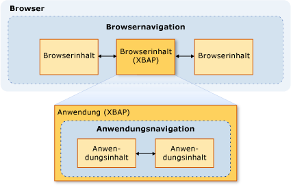
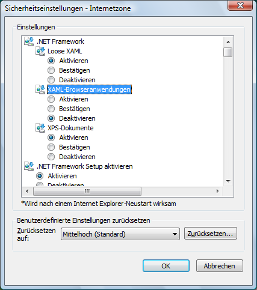

# Sicherheit (WPF)
Bei der Entwicklung von [!INCLUDE[TLA#tla_wpf](../../../includes/tlasharptla-wpf-md.md)] eigenständige und im Browser gehostete Anwendungen, müssen Sie berücksichtigen, dass das Sicherheitsmodell. [!INCLUDE[TLA2#tla_wpf](../../../includes/tla2sharptla-wpf-md.md)]eigenständige Anwendungen mit uneingeschränkten Berechtigungen ausgeführt ( [!INCLUDE[TLA2#tla_cas](../../../includes/tla2sharptla-cas-md.md)] **FullTrust** Berechtigungssatz), ob mithilfe von Windows Installer (MSI-Datei) mithilfe von XCopy, bereitgestellt oder [!INCLUDE[TLA2#tla_clickonce](../../../includes/tla2sharptla-clickonce-md.md)]. Die Bereitstellung teilweise vertrauenswürdiger eigenständiger WPF-Anwendungen mit ClickOnce wird nicht unterstützt. Eine voll vertrauenswürdige hostanwendung kann jedoch eine teilweise vertrauenswürdigen erstellen <xref:System.AppDomain> mit dem .NET Framework-Add-in-Modell. Weitere Informationen finden Sie unter [Übersicht über WPF-Add-Ins](../../../docs/framework/wpf/app-development/wpf-add-ins-overview.md).  
  
 [!INCLUDE[TLA2#tla_wpf](../../../includes/tla2sharptla-wpf-md.md)]im Browser gehostete Anwendungen werden von gehosteten [!INCLUDE[TLA#tla_iegeneric](../../../includes/tlasharptla-iegeneric-md.md)] oder Firefox, und kann entweder [!INCLUDE[TLA#tla_xbap#plural](../../../includes/tlasharptla-xbapsharpplural-md.md)] oder lose [!INCLUDE[TLA#tla_xaml](../../../includes/tlasharptla-xaml-md.md)] Dokumente Weitere Informationen finden Sie unter [WPF-XAML Browser Applications Overview](../../../docs/framework/wpf/app-development/wpf-xaml-browser-applications-overview.md).  
  
 [!INCLUDE[TLA2#tla_wpf](../../../includes/tla2sharptla-wpf-md.md)]Führen Sie im Browser gehostete Anwendungen in einer teilweise vertrauenswürdigen Sicherheits-Sandbox wird standardmäßig die beschränkt der Standardwert ist [!INCLUDE[TLA2#tla_cas](../../../includes/tla2sharptla-cas-md.md)] **Internet** zone Berechtigungssatz. Dies effektiv isoliert [!INCLUDE[TLA2#tla_wpf](../../../includes/tla2sharptla-wpf-md.md)] im Browser gehostete Anwendungen auf dem Clientcomputer auf die gleiche Weise, dass erwartet typische Webanwendungen isoliert werden müssen. Eine XBAP kann, abhängig von der Sicherheitszone der Bereitstellungs-URL und der Sicherheitskonfiguration des Clients, Berechtigungen bis zur vollen Vertrauenswürdigkeit erhöhen. Weitere Informationen finden Sie unter [WPF-Sicherheit mit teilweiser Vertrauenswürdigkeit](../../../docs/framework/wpf/wpf-partial-trust-security.md).  
  
 Dieses Thema beschreibt das Sicherheitsmodell für [!INCLUDE[TLA#tla_wpf](../../../includes/tlasharptla-wpf-md.md)] eigenständige und im Browser gehostete Anwendungen.  
  
 Dieses Thema enthält folgende Abschnitte:  
  
-   [Sichere Navigation](#SafeTopLevelNavigation)  
  
-   [Sicherheitseinstellungen für webbrowsende Software](#InternetExplorerSecuritySettings)  
  
-   [WebBrowser-Steuerelement und Funktionssteuerelemente](#webbrowser_control_and_feature_controls)  
  
-   [Deaktivieren von APTCA-Assemblys für teilweise vertrauenswürdige Clientanwendungen](#APTCA)  
  
-   [Sandkastenverhalten für Loose XAML-Dateien](#LooseContentSandboxing)  
  
-   [Ressourcen zum Entwickeln von WPF-Anwendungen, die die Sicherheit erhöhen](#BestPractices)  
  
   
## Sichere Navigation  
 Für [!INCLUDE[TLA2#tla_xbap#plural](../../../includes/tla2sharptla-xbapsharpplural-md.md)], [!INCLUDE[TLA2#tla_wpf](../../../includes/tla2sharptla-wpf-md.md)] werden zwei Threadtypen Navigation: Anwendung und Browser.  
  
 Als *Anwendungsnavigation* wird die Navigation zwischen Inhaltselementen in einer Anwendung bezeichnet, die in einem Browser gehostet wird. Als *Browsernavigation* wird die Navigation bezeichnet, die die Inhalts- und Speicherort-URL eines Browsers selbst ändert. Die Beziehung zwischen der Navigation in der Anwendung (normalerweise XAML) und Browsernavigation (in der Regel HTML) wird in der folgenden Abbildung gezeigt:
  
   
  
 Der Typ des Inhalts, die als sicher betrachtet eine [!INCLUDE[TLA2#tla_xbap](../../../includes/tla2sharptla-xbap-md.md)] zum Navigieren in erster Linie richtet sich nach, ob die Navigation in der Anwendung oder Browser-Navigation verwendet wird.  
  
   
### Sicherheit von Anwendungsnavigation  
 Navigation in der Anwendung wird als sicher betrachtet, wenn er mit einem Pack identifiziert werden kann [!INCLUDE[TLA2#tla_uri](../../../includes/tla2sharptla-uri-md.md)], die unterstützt vier Typen von Inhalten:  
  
|Inhaltstyp|Beschreibung|URI-Beispiel|  
|------------------|-----------------|-----------------|  
|Ressource|Dateien, die zu einem Projekt mit einem Build hinzugefügt werden **Ressource**.|`pack://application:,,,/MyResourceFile.xaml`|  
|Inhalt|Dateien, die zu einem Projekt mit einem Build hinzugefügt werden **Content**.|`pack://application:,,,/MyContentFile.xaml`|  
|Ursprungswebsite|Dateien, die zu einem Projekt mit einem Build hinzugefügt werden **keine**.|`pack://siteoforigin:,,,/MySiteOfOriginFile.xaml`|  
|Anwendungscode|XAML-Ressourcen mit kompiliertem Code-Behind   - oder -    Verwendung von XAML-Dateien, die zu einem Projekt mit einem Build hinzugefügt werden **Seite**.|`pack://application:,,,/MyResourceFile` `.xaml`|  
  
> [!NOTE]
>  Weitere Informationen zu Anwendungsdatendateien und Pack [!INCLUDE[TLA2#tla_uri#plural](../../../includes/tla2sharptla-urisharpplural-md.md)], finden Sie unter [Anwendungsressource WPF-Inhalt und Datendateien](../../../docs/framework/wpf/app-development/wpf-application-resource-content-and-data-files.md).  
  
 Ein Navigieren zu Dateien dieser Inhaltstypen kann sowohl durch einen Benutzer als auch programmgesteuert erfolgen:  
  
-   **Benutzernavigation**. Der Benutzer navigiert wird, indem Sie auf eine <xref:System.Windows.Documents.Hyperlink> Element.  
  
-   **Programmgesteuerte Navigation** Die Anwendung navigiert, ohne den Benutzer einzubinden, z. B. durch Festlegen der <xref:System.Windows.Navigation.NavigationWindow.Source%2A?displayProperty=nameWithType> Eigenschaft.  
  
   
### Sicherheit von Browsernavigation  
 Browsernavigation wird nur unter den folgenden Bedingungen als sicher betrachtet:  
  
-   **Benutzernavigation**. Der Benutzer navigiert wird, indem Sie auf eine <xref:System.Windows.Documents.Hyperlink> Element, das innerhalb des Haupt- <xref:System.Windows.Navigation.NavigationWindow>, nicht in einer geschachtelten <xref:System.Windows.Controls.Frame>.  
  
-   **Zone**. Der Inhalt, in dem navigiert wird, befindet sich im Internet oder im lokalen Intranet.  
  
-   **Protokoll**. Das verwendete Protokoll ist entweder **http**, **Https**, **Datei**, oder **Mailto**.  
  
 Wenn ein [!INCLUDE[TLA2#tla_xbap](../../../includes/tla2sharptla-xbap-md.md)] versucht, auf Inhalte auf eine Weise zu navigieren, die nicht mit den folgenden Bedingungen entspricht einer <xref:System.Security.SecurityException> ausgelöst wird.  
  
   
## Sicherheitseinstellungen für webbrowsende Software  
 Die Sicherheitseinstellungen auf dem Computer bestimmen, welcher Zugriff jeder webbrowsenden Software gewährt wird. Webbrowser-Software enthält jede Anwendung oder Komponente, verwendet der [WinINet](http://go.microsoft.com/fwlink/?LinkId=179379) oder [UrlMon](http://go.microsoft.com/fwlink/?LinkId=179383) APIs, einschließlich Internet Explorer und PresentationHost.exe.  
  
 [!INCLUDE[TLA2#tla_iegeneric](../../../includes/tla2sharptla-iegeneric-md.md)]bietet einen Mechanismus, mit dem können Sie konfigurieren, die Funktionalität, die von oder aus ausgeführt werden darf [!INCLUDE[TLA2#tla_iegeneric](../../../includes/tla2sharptla-iegeneric-md.md)], u. a. folgende:  
  
-   Komponenten, die auf [!INCLUDE[TLA2#tla_winfx](../../../includes/tla2sharptla-winfx-md.md)] aufsetzen  
  
-   ActiveX-Steuerelemente und Plug-Ins  
  
-   Downloads  
  
-   Skripterstellung  
  
-   Benutzerauthentifizierung  
  
 Die Sammlung von Funktionen, die auf diese Weise gesichert werden kann auf Basis der pro-Zone konfiguriert ist die **Internet**, **Intranet**, **vertrauenswürdige Sites**, und  **Eingeschränkte Sites** Zonen. Die folgenden Schritte beschreiben, wie die Sicherheitseinstellungen konfiguriert werden:  
  
1.  Open **in der Systemsteuerung**.  
  
2.  Klicken Sie auf **Netzwerk und Internet** , und klicken Sie dann auf **Internetoptionen**.  
  
     Das Dialogfeld "Internetoptionen" wird angezeigt.  
  
3.  Auf der **Sicherheit** Registerkarte, wählen Sie die Zone so konfigurieren Sie die Sicherheitseinstellungen für.  
  
4.  Klicken Sie auf die **Stufe** Schaltfläche.  
  
     Die **Sicherheitseinstellungen** Dialogfeld wird angezeigt, und Sie können die Sicherheitseinstellungen für die ausgewählte Zone konfigurieren.  
  
       
  
> [!NOTE]
>  Sie können auch aus Internet Explorer zum Dialogfeld „Internetoptionen“ gelangen. Klicken Sie auf **Tools** , und klicken Sie dann auf **Internetoptionen**.  
  
 Beginnend mit [!INCLUDE[TLA#tla_ie7](../../../includes/tlasharptla-ie7-md.md)], speziell für die folgenden Sicherheitseinstellungen [!INCLUDE[TLA2#tla_winfx](../../../includes/tla2sharptla-winfx-md.md)] sind enthalten:  
  
-   **Loose XAML**. Steuert, ob [!INCLUDE[TLA2#tla_iegeneric](../../../includes/tla2sharptla-iegeneric-md.md)] können zu navigieren und lose [!INCLUDE[TLA2#tla_xaml](../../../includes/tla2sharptla-xaml-md.md)] Dateien. (Optionen „Aktivieren“, „Deaktivieren“ und „Bestätigen“.)  
  
-   **XAML-Browseranwendungen**. Steuert, ob [!INCLUDE[TLA2#tla_iegeneric](../../../includes/tla2sharptla-iegeneric-md.md)] können zu navigieren, und führen Sie [!INCLUDE[TLA2#tla_xbap#plural](../../../includes/tla2sharptla-xbapsharpplural-md.md)]. (Optionen „Aktivieren“, „Deaktivieren“ und „Bestätigen“.)  
  
 Wird standardmäßig diese Einstellungen sind alle aktiviert für die **Internet**, **lokales Intranet**, und **vertrauenswürdige Sites** Zonen und deaktiviert für den **eingeschränkte Sites**  Zone.  
  
   
### Sicherheitsbezogene WPF-Registrierungseinstellungen  
 Zusätzlich zu den Sicherheitseinstellungen, die über die Internetoptionen verfügbar sind, sind die folgenden Registrierungswerte für die selektive Blockierung einiger sicherheitsrelevanter WPF-Funktionen verfügbar. Die Werte werden unter dem folgenden Schlüssel definiert:  
  
 `HKEY_LOCAL_MACHINE\SOFTWARE\Microsoft\.NETFramework\Windows Presentation Foundation\Features`  
  
 In der folgenden Tabelle sind die Werte aufgelistet, die festgelegt werden können.  
  
|Wertname|Werttyp|Wertdaten|  
|----------------|----------------|----------------|  
|XBAPDisallow|REG_DWORD|1 = nicht zulassen; 0 = zulassen|  
|LooseXamlDisallow|REG_DWORD|1 = nicht zulassen; 0 = zulassen|  
|WebBrowserDisallow|REG_DWORD|1 = nicht zulassen; 0 = zulassen|  
|MediaAudioDisallow|REG_DWORD|1 = nicht zulassen; 0 = zulassen|  
|MediaImageDisallow|REG_DWORD|1 = nicht zulassen; 0 = zulassen|  
|MediaVideoDisallow|REG_DWORD|1 = nicht zulassen; 0 = zulassen|  
|ScriptInteropDisallow|REG_DWORD|1 = nicht zulassen; 0 = zulassen|  
  
   
## WebBrowser-Steuerelement und Funktionssteuerelemente  
 Die WPF <xref:System.Windows.Controls.WebBrowser> Steuerelement zum Hosten von Webinhalten verwendet werden kann. Die WPF <xref:System.Windows.Controls.WebBrowser> Steuerelement umschließt das zugrunde liegende WebBrowser ActiveX-Steuerelement. WPF bietet einige Unterstützung zum Sichern Ihrer Anwendung bei der Verwendung von WPF <xref:System.Windows.Controls.WebBrowser> zu hostende Steuerelement als nicht vertrauenswürdig eingestuft Webinhalte. Allerdings müssen einige Sicherheitsfunktionen angewendet werden, direkt von den Anwendungen, die mithilfe der <xref:System.Windows.Controls.WebBrowser> Steuerelement. Weitere Informationen über das WebBrowser ActiveX-Steuerelement finden Sie unter [WebBrowser-Steuerelement Overviews and Tutorials](http://go.microsoft.com/fwlink/?LinkId=179388).  
  
> [!NOTE]
>  Dieser Abschnitt gilt auch für die <xref:System.Windows.Controls.Frame> steuern, da er verwendet die <xref:System.Windows.Controls.WebBrowser> zu HTML-Inhalt navigieren.  
  
 Wenn der WPF <xref:System.Windows.Controls.WebBrowser> Steuerelement zum Hosten von nicht vertrauenswürdigen Webinhalte verwendet wird, die Anwendung sollte eine teilweise vertrauenswürdigen verwenden <xref:System.AppDomain> können den Anwendungscode von potenziell bösartige HTML-Skript-Code zu isolieren. Dies gilt insbesondere, wenn Ihre Anwendung mit dem gehosteten Skript mit interagiert der <xref:System.Windows.Controls.WebBrowser.InvokeScript%2A> Methode und die <xref:System.Windows.Controls.WebBrowser.ObjectForScripting%2A> Eigenschaft. Weitere Informationen finden Sie unter [Übersicht über WPF-Add-Ins](../../../docs/framework/wpf/app-development/wpf-add-ins-overview.md).  
  
 Wenn Ihre Anwendung der WPF verwendet <xref:System.Windows.Controls.WebBrowser> Steuerelement, eine weitere Möglichkeit zum Erhöhen der Sicherheit und Angriffe zu mindern Steuerelemente für Internet Explorer-Funktion zu aktivieren. Feature-Steuerelemente sind Ergänzungen an Internet Explorer, mit denen Administratoren und Entwickler Features von Internet Explorer und Anwendungen, die im WebBrowser ActiveX-Steuerelement hosten konfigurieren können die WPF <xref:System.Windows.Controls.WebBrowser> steuern umschließt. Feature-Steuerelemente können konfiguriert werden, mithilfe der [CoInternetSetFeatureEnabled](http://go.microsoft.com/fwlink/?LinkId=179394) Funktion oder durch Ändern der Werte in der Registrierung. Weitere Informationen zum Feature Steuerelemente finden Sie unter [Introduction to Feature Controls](http://go.microsoft.com/fwlink/?LinkId=179390) und [Feature Internetsteuerelemente](http://go.microsoft.com/fwlink/?LinkId=179392).  
  
 Wenn Sie eine eigenständige WPF-Anwendung entwickeln, die der WPF verwendet <xref:System.Windows.Controls.WebBrowser> WPF-Steuerelement, kann automatisch die folgenden Feature-Steuerelemente für Ihre Anwendung.  
  
|Funktionssteuerelement|  
|---------------------|  
|FEATURE_MIME_HANDLING|  
|FEATURE_MIME_SNIFFING|  
|FEATURE_OBJECT_CACHING|  
|FEATURE_SAFE_BINDTOOBJECT|  
|FEATURE_WINDOW_RESTRICTIONS|  
|FEATURE_ZONE_ELEVATION|  
|FEATURE_RESTRICT_FILEDOWNLOAD|  
|FEATURE_RESTRICT_ACTIVEXINSTALL|  
|FEATURE_ADDON_MANAGEMENT|  
|FEATURE_HTTP_USERNAME_PASSWORD_DISABLE|  
|FEATURE_SECURITYBAND|  
|FEATURE_UNC_SAVEDFILECHECK|  
|FEATURE_VALIDATE_NAVIGATE_URL|  
|FEATURE_DISABLE_TELNET_PROTOCOL|  
|FEATURE_WEBOC_POPUPMANAGEMENT|  
|FEATURE_DISABLE_LEGACY_COMPRESSION|  
|FEATURE_SSLUX|  
  
 Da diese Funktionssteuerelemente bedingungslos aktiviert werden, können sie möglicherweise voll vertrauenswürdige Anwendungen beeinträchtigen. In diesem Fall kann das entsprechende Funktionssteuerelement deaktiviert werden, wenn kein Sicherheitsrisiko für die jeweilige Anwendung und den gehosteten Inhalt besteht.  
  
 Feature-Steuerelemente werden durch den Prozess, instanziieren den WebBrowser ActiveX-Objekt angewendet. Daher wird unbedingt empfohlen, beim Erstellen einer eigenständigen Anwendung, die zu nicht vertrauenswürdigem Inhalt navigieren kann, zusätzliche Funktionssteuerelemente zu aktivieren.  
  
> [!NOTE]
>  Diese Empfehlung basiert auf allgemeinen Empfehlungen für MSHTML- und SHDOCVW-Hostsicherheit. Weitere Informationen finden Sie unter [die FAQ zur Sicherheit des MSHTML-Host: Teil I, II](http://go.microsoft.com/fwlink/?LinkId=179396) und [die FAQ zur Sicherheit des MSHTML-Host: Teil II II](http://go.microsoft.com/fwlink/?LinkId=179415).  
  
 Für eine ausführbare Datei sollten die folgenden Funktionssteuerelemente aktiviert werden, indem der Registrierungswert auf 1 festgelegt wird.  
  
|Funktionssteuerelement|  
|---------------------|  
|FEATURE_ACTIVEX_REPURPOSEDETECTION|  
|FEATURE_BLOCK_LMZ_IMG|  
|FEATURE_BLOCK_LMZ_OBJECT|  
|FEATURE_BLOCK_LMZ_SCRIPT|  
|FEATURE_RESTRICT_RES_TO_LMZ|  
|FEATURE_RESTRICT_ABOUT_PROTOCOL_IE7|  
|FEATURE_SHOW_APP_PROTOCOL_WARN_DIALOG|  
|FEATURE_LOCALMACHINE_LOCKDOWN|  
|FEATURE_FORCE_ADDR_AND_STATUS|  
|FEATURE_RESTRICTED_ZONE_WHEN_FILE_NOT_FOUND|  
  
 Für eine ausführbare Datei sollte das folgenden Funktionssteuerelement deaktiviert werden, indem der Registrierungswert auf 0 festgelegt wird.  
  
|Funktionssteuerelement|  
|---------------------|  
|FEATURE_ENABLE_SCRIPT_PASTE_URLACTION_IF_PROMPT|  
  
 Wenn das Ausführen von einer teilweise vertrauenswürdigen [!INCLUDE[TLA#tla_xbap](../../../includes/tlasharptla-xbap-md.md)] enthält eine WPF <xref:System.Windows.Controls.WebBrowser> steuern [!INCLUDE[TLA#tla_iegeneric](../../../includes/tlasharptla-iegeneric-md.md)], WPF hostet das WebBrowser ActiveX-Steuerelement in den Adressraum des Internet Explorer-Prozess. Seit der WebBrowser ActiveX-Steuerelement, in gehostet wird der [!INCLUDE[TLA2#tla_iegeneric](../../../includes/tla2sharptla-iegeneric-md.md)] Prozess, alle Steuerelemente Feature für Internet Explorer auch für das WebBrowser ActiveX-Steuerelement aktiviert sind.  
  
 XBAPs, die in Internet Explorer ausgeführt werden, haben im Vergleich zu normalen eigenständigen Anwendungen ebenfalls ein höheres Maß an Sicherheit. Diese zusätzliche Sicherheitsmaßnahme ist, da Internet Explorer und daher im WebBrowser ActiveX-Steuerelement ausgeführt wird im geschützten Modus standardmäßig auf [!INCLUDE[TLA#tla_winvista](../../../includes/tlasharptla-winvista-md.md)] und [!INCLUDE[win7](../../../includes/win7-md.md)]. Weitere Informationen zum geschützten Modus finden Sie unter [verstehen und Arbeiten im geschützten Modus Internet Explorer](http://go.microsoft.com/fwlink/?LinkId=179393).  
  
> [!NOTE]
>  Wenn Sie versuchen, eine XBAP auszuführen, die eine WPF umfasst <xref:System.Windows.Controls.WebBrowser> -Steuerelement in Firefox, klicken Sie in der Internetzone eine <xref:System.Security.SecurityException> ausgelöst. Dies geschieht aufgrund der WPF-Sicherheitsrichtlinie.  
  
   
## Deaktivieren von APTCA-Assemblys für teilweise vertrauenswürdige Clientanwendungen  
 Wenn verwaltete Assemblys installiert sind, in der [!INCLUDE[TLA#tla_gac](../../../includes/tlasharptla-gac-md.md)], werden sie voll vertrauenswürdig, da der Benutzer explizite Zugriffsberechtigung für die Installation bereitgestellt werden muss. Da sie voll vertrauenswürdig sind, können sie nur von voll vertrauenswürdigen verwalteten Clientanwendungen verwendet werden. Damit wird teilweise vertrauenswürdige Anwendungen zu verwenden, müssen sie mit markiert werden die <xref:System.Security.AllowPartiallyTrustedCallersAttribute> (APTCA). Mit diesem Attribut sollten nur Assemblys markiert werden, für die bei Tests nachgewiesen wurde, dass sie bei Ausführung in teilweiser Vertrauenswürdigkeit sicher sind.  
  
 Allerdings ist es möglich, dass eine APTCA-Assembly mit einem Sicherheitsmangels ausgeführt wird, nach der Installation in der [!INCLUDE[TLA2#tla_gac](../../../includes/tla2sharptla-gac-md.md)]. Nachdem ein Sicherheitsrisiko entdeckt wurde, können Assemblyherausgeber ein Sicherheitsupdate erstellen, um das Problem in vorhandenen Installationen zu beheben und Installationen zu schützen, die nach der Entdeckung des Problems erfolgen. Eine Option für ein solches Update besteht darin, die Assembly zu deinstallieren, was jedoch zum Versagen anderer voll vertrauenswürdiger Clientanwendungen führen kann, die diese Assembly verwenden.  
  
 [!INCLUDE[TLA2#tla_wpf](../../../includes/tla2sharptla-wpf-md.md)]bietet einen Mechanismus, mit dem APTCA-Assembly deaktiviert werden, kann für teilweise vertrauenswürdige [!INCLUDE[TLA2#tla_xbap#plural](../../../includes/tla2sharptla-xbapsharpplural-md.md)] ohne die APTCA-Assembly zu deinstallieren.  
  
 Um eine APTCA-Assembly zu deaktivieren, müssen Sie einen speziellen Registrierungsschlüssel erstellen:  
  
 `HKEY_LOCAL_MACHINE\SOFTWARE\Microsoft\.NETFramework\policy\APTCA\<AssemblyFullName>, FileVersion=<AssemblyFileVersion>`  
  
 Es folgt ein Beispiel:  
  
 `HKEY_LOCAL_MACHINE\SOFTWARE\Microsoft\.NETFramework\policy\APTCA\aptcagac, Version=1.0.0.0, Culture=neutral, PublicKeyToken=215e3ac809a0fea7, FileVersion=1.0.0.0`  
  
 Dieser Schlüssel erstellt einen Eintrag für die APTCA-Assembly. Sie müssen außerdem einen Wert in diesem Schlüssel erstellen, der die Assembly aktiviert oder deaktiviert. Die Details des Werts sehen wie folgt aus:  
  
-   Wertname: **APTCA_FLAG**.  
  
-   Typ: **REG_DWORD**.  
  
-   Wertdaten: **1** zu deaktivieren; **0** zu aktivieren.  
  
 Muss eine Assembly für teilweise vertrauenswürdige Clientanwendungen deaktiviert werden, können Sie ein Update schreiben, in dem der Registrierungsschlüssel und dessen Wert aktualisiert werden.  
  
> [!NOTE]
>  Core [!INCLUDE[TLA2#tla_winfx](../../../includes/tla2sharptla-winfx-md.md)] Assemblys sind nicht betroffen, indem sie auf diese Weise zu deaktivieren, da sie für die Ausführung von verwalteten Anwendungen erforderlich sind. Die Unterstützung zur Deaktivierung von APTCA-Assemblys zielt hauptsächlich auf Anwendungen von Drittanbietern ab.  
  
   
## Sandkastenverhalten für Loose XAML-Dateien  
 Lose [!INCLUDE[TLA2#tla_xaml](../../../includes/tla2sharptla-xaml-md.md)] Dateien sind Markup-XAML-Dateien, die nicht auf Code-Behind, Ereignishandler oder anwendungsspezifische Assembly abhängen. Wenn lose [!INCLUDE[TLA2#tla_xaml](../../../includes/tla2sharptla-xaml-md.md)] Dateien direkt vom Browser navigiert, die sie in einem Sicherheitssandkasten basierend auf den Standardberechtigungssatz für die Zone erneut geladen werden.  
  
 Das Sicherheitsverhalten ist jedoch anders aus, wenn Sie loose [!INCLUDE[TLA2#tla_xaml](../../../includes/tla2sharptla-xaml-md.md)] Dateien entweder navigiert ein <xref:System.Windows.Navigation.NavigationWindow> oder <xref:System.Windows.Controls.Frame> in eine eigenständige Anwendung.  
  
 In beiden Fällen, die losen [!INCLUDE[TLA2#tla_xaml](../../../includes/tla2sharptla-xaml-md.md)] Datei, zu der navigiert wird, erbt die Berechtigungen von der hostanwendung. Allerdings möglicherweise dieses Verhalten unerwünscht im Hinblick auf Sicherheit, insbesondere, wenn eine lose [!INCLUDE[TLA2#tla_xaml](../../../includes/tla2sharptla-xaml-md.md)] Datei wurde erstellt, indem Sie eine Entität, die nicht vertrauenswürdig oder unbekannt ist. Dieser Typ des Inhalts wird als bezeichnet *externe Inhalte*, und die beiden <xref:System.Windows.Controls.Frame> und <xref:System.Windows.Navigation.NavigationWindow> kann konfiguriert werden, um ihn bei der Navigation zu isolieren. Isolation wird erreicht, indem die **SandboxExternalContent** Eigenschaft auf "true", wie in den folgenden Beispielen gezeigt, <xref:System.Windows.Controls.Frame> und <xref:System.Windows.Navigation.NavigationWindow>:  
  
 [!code-xaml[SecurityOverviewSnippets#FrameMARKUP](../../../samples/snippets/csharp/VS_Snippets_Wpf/SecurityOverviewSnippets/CS/Window2.xaml#framemarkup)]  
  
 [!code-xaml[SecurityOverviewSnippets#NavigationWindowMARKUP](../../../samples/snippets/csharp/VS_Snippets_Wpf/SecurityOverviewSnippets/CS/Window1.xaml#navigationwindowmarkup)]  
  
 Mit dieser Einstellung wird der externe Inhalt in einen Prozess geladen, der von dem Prozess getrennt ist, der die Anwendung hostet. Dieser Prozess ist auf den Standardberechtigungssatz für die Internetzone beschränkt, wodurch er effizient von der Hostanwendung und dem Clientcomputer isoliert ist.  
  
> [!NOTE]
>  Obwohl Navigation zu lose [!INCLUDE[TLA2#tla_xaml](../../../includes/tla2sharptla-xaml-md.md)] Dateien entweder eine <xref:System.Windows.Navigation.NavigationWindow> oder <xref:System.Windows.Controls.Frame> in eine eigenständige Anwendung implementiert wird basierend auf dem Host fungierende Infrastruktur, die im Zusammenhang mit der Prozess PresentationHost WPF-Browser wird die Sicherheitsstufe wird etwas weniger als wenn der Inhalt auf direkt im Internet Explorer geladen wird [!INCLUDE[wiprlhext](../../../includes/wiprlhext-md.md)] und [!INCLUDE[win7](../../../includes/win7-md.md)] (die wäre immer noch über PresentationHost). Dies liegt daran, dass eine eigenständige WPF-Anwendung, die einen Webbrowser verwendet, die zusätzliche „Geschützter Modus“-Sicherheitsfunktion von Internet Explorer nicht bereitstellt.  
  
   
## Ressourcen zum Entwickeln von WPF-Anwendungen, die die Sicherheit erhöhen  
 Im folgenden sind einige zusätzlichen Ressourcen zum Entwickeln von [!INCLUDE[TLA2#tla_wpf](../../../includes/tla2sharptla-wpf-md.md)] Anwendungen, die Sicherheit höher stufen:  
  
|Bereich|Ressource|  
|----------|--------------|  
|Verwalteter Code|[Patterns and Practices-Sicherheitsleitfaden für Anwendungen](http://go.microsoft.com/fwlink/?LinkId=117426)|  
|[!INCLUDE[TLA2#tla_cas](../../../includes/tla2sharptla-cas-md.md)]|[Codezugriffssicherheit](../../../docs/framework/misc/code-access-security.md)|  
|[!INCLUDE[TLA2#tla_clickonce](../../../includes/tla2sharptla-clickonce-md.md)]|[ClickOnce-Sicherheit und Bereitstellung](/visualstudio/deployment/clickonce-security-and-deployment)|  
|[!INCLUDE[TLA2#tla_wpf](../../../includes/tla2sharptla-wpf-md.md)]|[WPF-Sicherheit mit teilweiser Vertrauenswürdigkeit](../../../docs/framework/wpf/wpf-partial-trust-security.md)|  
  
## Siehe auch  
 [WPF-Sicherheit mit teilweiser Vertrauenswürdigkeit](../../../docs/framework/wpf/wpf-partial-trust-security.md)  
 [WPF-Sicherheitsstrategie – Plattformsicherheit](../../../docs/framework/wpf/wpf-security-strategy-platform-security.md)  
 [WPF-Sicherheitsstrategie – Sicherheitsentwicklung](../../../docs/framework/wpf/wpf-security-strategy-security-engineering.md)  
 [Patterns and Practices-Sicherheitsleitfaden für Anwendungen](http://go.microsoft.com/fwlink/?LinkId=117426)  
 [Codezugriffssicherheit](../../../docs/framework/misc/code-access-security.md)  
 [ClickOnce-Sicherheit und Bereitstellung](/visualstudio/deployment/clickonce-security-and-deployment)  
 [Übersicht über XAML (WPF)](../../../docs/framework/wpf/advanced/xaml-overview-wpf.md)
