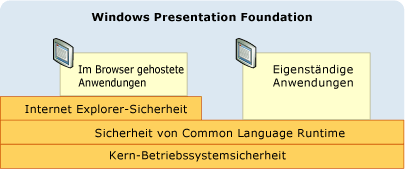
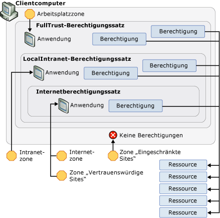

# WPF-Sicherheitsstrategie – Plattformsicherheit
Während Windows Presentation Foundation (WPF) eine Vielzahl von Sicherheitsdiensten bereitgestellt werden, sondern nutzt auch die Sicherheitsfeatures der zugrundeliegenden Plattform, die das Betriebssystem enthält, die [!INCLUDE[TLA2#tla_clr](../../../includes/tla2sharptla-clr-md.md)], und [!INCLUDE[TLA2#tla_ie](../../../includes/tla2sharptla-ie-md.md)]. Im Zusammenspiel stellen diese Ebenen für [!INCLUDE[TLA2#tla_wpf](../../../includes/tla2sharptla-wpf-md.md)] ein leistungsfähiges Modell für tiefgreifende, vorbeugende Sicherheitsmaßnahmen (Defense-in-Depth-Modell) bereit, das eine einzelne Fehlerquelle zu vermeiden sucht, wie aus der folgenden Abbildung hervorgeht:  
  
   
  
 Im weiteren Verlauf dieses Themas werden die Features auf den einzelnen Ebenen erläutert, die besonders [!INCLUDE[TLA2#tla_wpf](../../../includes/tla2sharptla-wpf-md.md)] betreffen.  

   
## Betriebssystemsicherheit  
 Für [!INCLUDE[TLA2#tla_wpf](../../../includes/tla2sharptla-wpf-md.md)] ist als Betriebssystem mindestens [!INCLUDE[TLA2#tla_winxpsp2](../../../includes/tla2sharptla-winxpsp2-md.md)] erforderlich. Den Kern der [!INCLUDE[TLA2#tla_winxpsp2](../../../includes/tla2sharptla-winxpsp2-md.md)] enthält verschiedene Sicherheitsfeatures, die die Sicherheitsgrundlage für alle Windows-Anwendungen, einschließlich solcher mit erstellten bilden [!INCLUDE[TLA2#tla_wpf](../../../includes/tla2sharptla-wpf-md.md)]. [!INCLUDE[TLA#tla_longhorn](../../../includes/tlasharptla-longhorn-md.md)] enthält die Sicherheitsfeatures von [!INCLUDE[TLA2#tla_wpf](../../../includes/tla2sharptla-wpf-md.md)] in erweiterter Form. In diesem Thema wird der Umfang dieser Sicherheitsfeatures behandelt, die für [!INCLUDE[TLA2#tla_wpf](../../../includes/tla2sharptla-wpf-md.md)] wichtig sind. Erläutert wird auch die Integration mit [!INCLUDE[TLA2#tla_wpf](../../../includes/tla2sharptla-wpf-md.md)], um weitere tiefgreifende Vorbeugungsmaßnahmen bereitzustellen.  
  
   
### Microsoft Windows XP Service Pack 2 (SP2)  
 Zusätzlich zu einer allgemeinen Beurteilung und Erhöhung der Sicherheit von Windows, es gibt drei wichtige Features [!INCLUDE[TLA2#tla_winxpsp2](../../../includes/tla2sharptla-winxpsp2-md.md)] , die in diesem Thema wird erläutert:  
  
-   /GS-Kompilierung  
  
-   [!INCLUDE[TLA#tla_win_update](../../../includes/tlasharptla-win-update-md.md)].  
  
#### /GS-Kompilierung  
 [!INCLUDE[TLA2#tla_winxpsp2](../../../includes/tla2sharptla-winxpsp2-md.md)] bietet Schutz durch das erneute Kompilieren vieler zentraler Systembibliotheken, einschließlich aller [!INCLUDE[TLA2#tla_wpf](../../../includes/tla2sharptla-wpf-md.md)]-Abhängigkeiten wie die [!INCLUDE[TLA2#tla_clr](../../../includes/tla2sharptla-clr-md.md)], um das Risiko von Pufferüberläufen zu verringern. Dies wird mit dem /GS-Parameter und dem C/C++-Befehlszeilencompiler erreicht. Obwohl Pufferüberläufe ausdrücklich vermieden werden sollten, ist die Kompilierung mit /GS ein Beispiel für eine tiefgreifende Verteidigungsmaßnahme gegen potenzielle Sicherheitslücken, die versehentlich oder böswillig durch Pufferüberläufe erzeugt werden.  
  
 In der Vergangenheit waren Pufferüberläufe die Ursache für viele Sicherheitslücken mit gravierenden Folgen. Ein Pufferüberlauf tritt auf, wenn ein Angreifer die Sicherheitsanfälligkeit eines Codes nutzt, die das Einfügen von schädlichem Code ermöglicht, der über die Begrenzungen eines Puffers schreibt. Ein Angreifer kann dann durch Überschreiben der Rückgabeadresse einer Funktion den Prozess, in dem der Code ausgeführt wird, hacken und die Ausführung des Angreifercodes auslösen. Daraus entsteht bösartiger Code, der beliebigen Code mit den gleichen Berechtigungen wie der gehackte Prozess ausführt.  
  
 Auf hoher Ebene schützt das /GS-Compilerflag vor einigen möglichen Pufferüberläufen, indem es zum Schutz der Rückgabeadresse einer Funktion, die über lokale Zeichenfolgepuffer verfügt, ein spezielles Sicherheitscookie einschleust. Nach der Rückgabe einer Funktion wird das Sicherheitscookie mit seinem vorherigen Wert verglichen. Hat sich der Wert geändert, ist möglicherweise ein Pufferüberlauf aufgetreten, und der Prozess wird mit einer Fehlerbedingung beendet. Das Beenden des Prozesses verhindert die Ausführung von potenziell bösartigem Code. Finden Sie unter [/GS (Puffer-Sicherheitsüberprüfung)](/cpp/build/reference/gs-buffer-security-check) Weitere Details.  
  
 [!INCLUDE[TLA2#tla_wpf](../../../includes/tla2sharptla-wpf-md.md)] wird mit dem /GS-Flag kompiliert, um eine weitere Schutzebene für [!INCLUDE[TLA2#tla_wpf](../../../includes/tla2sharptla-wpf-md.md)]-Anwendungen bereitzustellen.  
  
#### Verbesserungen von Microsoft Windows Update  
 Auch [!INCLUDE[TLA#tla_win_update](../../../includes/tlasharptla-win-update-md.md)] wurde in [!INCLUDE[TLA2#tla_winxpsp2](../../../includes/tla2sharptla-winxpsp2-md.md)] verbessert, um den Prozess des Herunterladens und Installierens von Updates zu vereinfachen. Durch diese Änderungen wird die Sicherheit für [!INCLUDE[TLA2#tla_wpf](../../../includes/tla2sharptla-wpf-md.md)]-Kunden erheblich erhöht, da sie dafür sorgen, dass die Systeme der Kunden (besonders in Hinblick auf die Sicherheitsupdates) auf dem neuesten Stand sind.  
  
   
### Windows Vista  
 [!INCLUDE[TLA2#tla_wpf](../../../includes/tla2sharptla-wpf-md.md)]-Benutzer mit [!INCLUDE[TLA#tla_longhorn](../../../includes/tlasharptla-longhorn-md.md)] profitieren von zusätzlichen Verbesserungen des Betriebssystems in puncto Sicherheit, z. B. Benutzerkontensteuerung, Integritätsprüfungen für Code und Rechteisolierung.  
  
#### Benutzerkontensteuerung (User Account Control, UAC)  
 Heute tendenziell eine Windows-Benutzer mit Administratorrechten ausgeführt werden, da viele Anwendungen für die Installation oder Ausführung oder beides erforderlich. Das Schreiben von Standardanwendungseinstellungen in die Registrierung ist nur ein Beispiel.  
  
 Das Arbeiten mit Administratorrechten bedeutet im Grunde, dass Anwendungen von Prozessen ausgeführt werden, denen Administratorrechte gewährt werden. Das hat Auswirkungen auf die Sicherheit, denn bösartiger Code, der zum Hacken eines mit Administratorrechten ausgeführten Prozesses verwendet wird, übernimmt automatisch dessen Berechtigungen, einschließlich des Zugriffs auf kritische Systemressourcen.  
  
 Anwendungen nur mit den unbedingt erforderlichen Berechtigungen auszuführen, ist eine Möglichkeit, sich vor dieser Sicherheitsbedrohung zu schützen. Dieses sogenannte "Prinzip der geringsten Rechte" ist ein zentrales Feature des Betriebssystems [!INCLUDE[TLA#tla_longhorn](../../../includes/tlasharptla-longhorn-md.md)]. Diese als Benutzerkontensteuerung bezeichnete Funktion wird von [!INCLUDE[TLA#tla_longhorn](../../../includes/tlasharptla-longhorn-md.md)] auf zweierlei Weise verwendet:  
  
-   Die meisten Anwendungen werden standardmäßig mit den Rechten der Benutzerkontensteuerung ausgeführt, selbst wenn der Benutzer ein Administrator ist; nur Anwendungen, die Administratorrechte benötigen, werden mit Administratorrechten ausgeführt. Um mit Administratorrechten ausgeführt zu werden, müssen Anwendungen entweder in ihrem Anwendungsmanifest oder als Eintrag in der Sicherheitsrichtlinie besonders gekennzeichnet werden.  
  
-   Bereitstellen von Kompatibilitätslösungen wie die Virtualisierung. Viele Anwendungen versuchen beipielsweise, in eingeschränkte Speicherorte wie "C:\Programme" zu schreiben. Für Anwendungen, die über die Benutzerkontensteuerung ausgeführt werden, steht ein alternativer benutzerbezogener Speicherort zur Verfügung, der für Schreibvorgänge keine Administratorrechte erfordert. Für Anwendungen, die über die Benutzerkontensteuerung ausgeführt werden, wird "C:\Programme" virtualisiert. Dadurch wird der Anschein erweckt, dass die Anwendungen in dieses Verzeichnis schreiben, obwohl sie stattdessen in den alternativen, benutzerbezogenen Speicherort schreiben. Dank dieser Art von Kompatibilität kann das Betriebssystem viele Anwendungen ausführen, die zuvor nicht mit der Benutzerkontensteuerung ausgeführt werden konnten.  
  
#### Integritätsprüfungen für Code  
 [!INCLUDE[TLA#tla_longhorn](../../../includes/tlasharptla-longhorn-md.md)] enthält strengere Integritätsprüfungen für Code, um zu verhindern, dass bösartiger Code zur Lade-/Laufzeit in Systemdateien oder den Kernel eingeschleust wird. Dies geht über den Schutz der Systemdateien hinaus.  
  
   
### Prozess mit eingeschränkten Rechten für im Browser gehostete Anwendungen  
 Im Browser gehostete [!INCLUDE[TLA2#tla_wpf](../../../includes/tla2sharptla-wpf-md.md)]-Anwendungen werden im Sicherheitssandkasten der Internetzone ausgeführt. Die Integration von [!INCLUDE[TLA2#tla_wpf](../../../includes/tla2sharptla-wpf-md.md)] mit [!INCLUDE[TLA#tla_ie](../../../includes/tlasharptla-ie-md.md)] erweitert diesen Schutz und stellt zusätzliche Unterstützung bereit.  
  
#### Internet Explorer 6 Service Pack 2 und Internet Explorer 7 für XP  
 [!INCLUDE[TLA2#tla_wpf](../../../includes/tla2sharptla-wpf-md.md)] nutzt die Sicherheit des Betriebssystems für weiteren Schutz, indem es die Prozessberechtigungen für [!INCLUDE[TLA#tla_winfxwebapp#plural](../../../includes/tlasharptla-winfxwebappsharpplural-md.md)] begrenzt. Bevor eine im Browser gehostete [!INCLUDE[TLA2#tla_wpf](../../../includes/tla2sharptla-wpf-md.md)]-Anwendung gestartet wird, erstellt das Betriebssystem einen Hostprozess, der unnötige Berechtigungen aus dem Prozesstoken entfernt. Zu den Berechtigungen, die entfernt werden, gehören beispielsweise das Herunterfahren des Computers des Benutzers, das Laden von Treibern und der Lesezugriff auf alle Dateien auf dem Computer.  
  
#### Internet Explorer 7 für Vista  
 In [!INCLUDE[TLA#tla_ie7](../../../includes/tlasharptla-ie7-md.md)] werden [!INCLUDE[TLA2#tla_wpf](../../../includes/tla2sharptla-wpf-md.md)]-Anwendungen im geschützten Modus ausgeführt. Besonders [!INCLUDE[TLA#tla_xbap#plural](../../../includes/tlasharptla-xbapsharpplural-md.md)] werden mit mittlerer Integrität ausgeführt.  
  
#### Defense-In-Depth-Ebene  
 Da [!INCLUDE[TLA#tla_winfxwebapp#plural](../../../includes/tlasharptla-winfxwebappsharpplural-md.md)] durch den Berechtigungssatz der Internetzone generell in einem Sicherheitssandkasten ausgeführt werden, wirkt sich das Entfernen dieser Berechtigungen unter Kompatibilitätsgesichtspunkten auf [!INCLUDE[TLA#tla_winfxwebapp#plural](../../../includes/tlasharptla-winfxwebappsharpplural-md.md)] nicht negativ aus. Stattdessen wird eine zusätzliche Defense-in-Depth-Ebene geschaffen. Wenn eine in einem Sicherheitssandkasten ausgeführte Anwendung in der Lage ist, andere Ebenen anzugreifen und den Prozess zu hacken, verfügt auch der Prozess nur über eingeschränkte Berechtigungen.  
  
 Finden Sie unter [mit einem Benutzerkonto mit geringsten rechten](https://docs.microsoft.com/previous-versions/tn-archive/cc700846%28v=technet.10%29).  
  
   
## Common Language Runtime-Sicherheit  
 Die [!INCLUDE[TLA#tla_clr](../../../includes/tlasharptla-clr-md.md)] bietet eine Reihe wichtiger Vorteile in puncto Sicherheit. Dazu zählen Validierung und Überprüfung, [!INCLUDE[TLA#tla_cas](../../../includes/tlasharptla-cas-md.md)] sowie die sicherheitsrelevante Methode.  
  
   
### Validierung und Prüfung  
 Assemblyisolation und Integrität wird von der [!INCLUDE[TLA2#tla_clr](../../../includes/tla2sharptla-clr-md.md)] über einen Validierungsprozess bereitgestellt. Mit der [!INCLUDE[TLA2#tla_clr](../../../includes/tla2sharptla-clr-md.md)]-Validierung wird sichergestellt, dass Assemblys isoliert werden. Dazu wird deren PE (Portable Executable)-Dateiformat für Adressen validiert, die auf eine Stelle außerhalb der Assembly verweisen. Anhand der [!INCLUDE[TLA2#tla_clr](../../../includes/tla2sharptla-clr-md.md)]-Validierung wird auch die Integrität der in einer Assembly eingebetteten Metadaten validiert.  
  
 Um die typsicherheit zu gewährleisten, verhindern Sie häufige Sicherheitsprobleme (z. B. Pufferüberläufe), und Aktivieren der Sandkasten, durch die Isolation, [!INCLUDE[TLA2#tla_clr](../../../includes/tla2sharptla-clr-md.md)] Sicherheit verwendet das Konzept der Überprüfung.  
  
 Verwaltete Anwendungen werden in Microsoft Intermediate Language (MSIL) kompiliert. Wenn Methoden in einer verwalteten Anwendung ausgeführt werden, wird die MSIL über Just-in-Time (JIT)-Kompilierung in systemeigenen Code kompiliert. Die JIT-Kompilierung enthält einen Prüfprozess mit vielen Sicherheits- und Stabilitätsregeln, die sicherstellen, dass der Code keine der folgenden Eigenschaften aufweist:  
  
-   Verletzen von Typverträgen  
  
-   Verursachen von Pufferüberläufen  
  
-   Unkontrollierter Zugriff auf den Arbeitsspeicher  
  
 Verwalteter Code, der den Prüfregeln nicht entspricht, darf nur dann ausgeführt werden, wenn er als vertrauenswürdiger Code gilt.  
  
 Der Vorteil des prüfbaren Codes ist einer der wichtigsten Gründe, warum [!INCLUDE[TLA2#tla_wpf](../../../includes/tla2sharptla-wpf-md.md)] baut auf .NET Framework. Mit zunehmender Verwendung prüfbaren Codes sinkt die Wahrscheinlichkeit, dass potenzielle Schwachstellen ausgenutzt werden, ganz erheblich.  
  
   
### Codezugriffssicherheit  
 Ein Clientcomputer stellt eine Vielzahl von Ressourcen bereit, auf die eine verwaltete Anwendung zugreifen kann. Dazu zählen u. a. Dateisystem, Registrierung, Druckdienste, Benutzeroberfläche, Reflektion und Umgebungsvariablen. Bevor eine verwaltete Anwendung die Ressourcen auf einem Clientcomputer zugreifen kann, müssen sie .NET Framework dazu Berechtigung. Eine Berechtigung in [!INCLUDE[TLA2#tla_cas](../../../includes/tla2sharptla-cas-md.md)] ist eine Unterklasse von <xref:System.Security.CodeAccessPermission>; [!INCLUDE[TLA2#tla_cas](../../../includes/tla2sharptla-cas-md.md)] implementiert eine Unterklasse für jede Ressource, auf die verwaltete Anwendungen zugreifen können.  
  
 Der Satz von Rechten, den [!INCLUDE[TLA2#tla_cas](../../../includes/tla2sharptla-cas-md.md)] einer verwalteten Anwendung beim Starten gewährt, wird als Berechtigungssatz bezeichnet. Er richtet sich nach den von der Anwendung bereitgestellten Nachweisen. Bei [!INCLUDE[TLA2#tla_wpf](../../../includes/tla2sharptla-wpf-md.md)]-Anwendungen wird als Nachweis der Speicherort oder die Zone bereitgestellt, von dem bzw. der die Anwendungen gestartet werden. [!INCLUDE[TLA2#tla_cas](../../../includes/tla2sharptla-cas-md.md)] identifiziert die folgenden Zonen:  
  
-   **Arbeitsplatz**. Anwendungen, die auf dem Clientcomputer gestartet werden (voll vertrauenswürdig).  
  
-   **Lokales Intranet**. Anwendungen, die aus dem Intranet gestartet werden (in gewisser Weise vertrauenswürdig).  
  
-   **Internet**. Anwendungen, die aus dem Internet gestartet werden (wenig vertrauenswürdig).  
  
-   **Vertrauenswürdige Sites**. Anwendungen, die von einem Benutzer als vertrauenswürdig identifiziert wurden (wenig vertrauenswürdig).  
  
-   **Nicht vertrauenswürdige Sites**. Anwendungen, die von einem Benutzer als nicht vertrauenswürdig identifiziert wurden (nicht vertrauenswürdig).  
  
 Für jede dieser Zonen stellt [!INCLUDE[TLA2#tla_cas](../../../includes/tla2sharptla-cas-md.md)] einen vordefinierten Berechtigungssatz bereit, der die Berechtigungen enthält, die der jeweils zugeordneten Vertrauensebene entsprechen. Dazu gehören:  
  
-   **FullTrust**. Für Anwendungen, die gestartet werden, aus der **Arbeitsplatz** Zone. Alle möglichen Berechtigungen werden gewährt.  
  
-   **LocalIntranet**. Für Anwendungen, die gestartet werden, aus der **Lokales Intranet** Zone. Für einen moderaten Zugriff auf die Ressourcen des Clientcomputers wird eine Teilmenge von Berechtigungen gewährt. Dazu zählen isolierter Speicher, uneingeschränkter Zugriff auf die Benutzeroberfläche und Dateidialogfelder, eingeschränkte Reflektion sowie eingeschränkter Zugriff auf Umgebungsvariablen. Berechtigungen für kritische Ressourcen wie die Registrierung werden nicht bereitgestellt.  
  
-   **Internet**. Für Anwendungen, die gestartet werden, aus der **Internet** oder **vertrauenswürdige Sites** Zone. Für einen eingeschränkten Zugriff auf die Ressourcen des Clientcomputers wird eine Teilmenge von Berechtigungen gewährt. Dazu zählen isolierter Speicher, Öffnen von Dateien sowie eingeschränkter Zugriff auf die Benutzeroberfläche. Im Grunde isolieren diese Berechtigungssätze die Anwendungen vom Clientcomputer.  
  
 Anwendungen, die aus der **nicht vertrauenswürdige Sites** Zone werden keine Berechtigungen erteilt [!INCLUDE[TLA2#tla_cas](../../../includes/tla2sharptla-cas-md.md)] überhaupt. Daher gibt es für diese Anwendungen keinen vordefinierten Berechtigungssatz.  
  
 Die folgende Abbildung veranschaulicht die Beziehung zwischen Zonen, Berechtigungssätzen, Berechtigungen und Ressourcen.  
  
   
  
 Die Einschränkungen des Sicherheitssandkastens der Internetzone gelten in gleicher Weise für jeden Code, den eine [!INCLUDE[TLA2#tla_winfxwebapp](../../../includes/tla2sharptla-winfxwebapp-md.md)] aus einer Systembibliothek importiert (einschließlich [!INCLUDE[TLA2#tla_wpf](../../../includes/tla2sharptla-wpf-md.md)]). Dadurch wird sichergestellt, dass jedes Bit des Codes (selbst [!INCLUDE[TLA2#tla_wpf](../../../includes/tla2sharptla-wpf-md.md)]) gesperrt wird. Unglücklicherweise muss eine [!INCLUDE[TLA2#tla_winfxwebapp](../../../includes/tla2sharptla-winfxwebapp-md.md)] jedoch, um ausgeführt zu werden, Funktionalität ausführen, die mehr Berechtigungen erfordert, als im Rahmen des Sicherheitssandkastens der Internetzone gewährt werden.  
  
 Nehmen Sie beispielsweise eine [!INCLUDE[TLA2#tla_winfxwebapp](../../../includes/tla2sharptla-winfxwebapp-md.md)]-Anwendung, die die folgende Seite enthält:  
  
 [!code-csharp[WPFPlatformSecuritySnippets#Permission](~/samples/snippets/csharp/VS_Snippets_Wpf/WPFPlatformSecuritySnippets/CSharp/Page1.xaml.cs#permission)]
 [!code-vb[WPFPlatformSecuritySnippets#Permission](~/samples/snippets/visualbasic/VS_Snippets_Wpf/WPFPlatformSecuritySnippets/VisualBasic/Page1.xaml.vb#permission)]  
  
 Zum Ausführen dieser [!INCLUDE[TLA2#tla_winfxwebapp](../../../includes/tla2sharptla-winfxwebapp-md.md)] muss der zugrunde liegende [!INCLUDE[TLA2#tla_wpf](../../../includes/tla2sharptla-wpf-md.md)]-Code mehr Funktionalität ausführen, als der aufrufenden [!INCLUDE[TLA2#tla_winfxwebapp](../../../includes/tla2sharptla-winfxwebapp-md.md)] zur Verfügung steht. Dazu zählen:  
  
-   Erstellen eines Fensterhandles (hWnd) für das Rendering  
  
-   Verteilen von Nachrichten  
  
-   Laden der Schriftart Tahoma  
  
 Unter dem Gesichtspunkt der Sicherheit wäre die Gewährung des direkten Zugriffs auf diese Vorgänge für die im Sicherheitssandkasten ausgeführte Anwendung eine Katastrophe.  
  
 Zum Glück bietet [!INCLUDE[TLA2#tla_wpf](../../../includes/tla2sharptla-wpf-md.md)] einen Ausweg aus dieser Lage, indem es diesen Vorgängen die Ausführung mit erhöhten Rechten im Namen der im Sicherheitssandkasten ausgeführten Anwendung erlaubt. Während alle [!INCLUDE[TLA2#tla_wpf](../../../includes/tla2sharptla-wpf-md.md)]-Vorgänge anhand der eingeschränkten Sicherheitsberechtigungen der Internetzone der [!INCLUDE[TLA2#tla_winfxwebapp](../../../includes/tla2sharptla-winfxwebapp-md.md)]-Anwendungsdomäne überprüft werden, wird [!INCLUDE[TLA2#tla_wpf](../../../includes/tla2sharptla-wpf-md.md)] (wie anderen Systembibliotheken) ein Berechtigungssatz gewährt, der alle möglichen Berechtigungen enthält.  
  
 Dies setzt voraus, dass [!INCLUDE[TLA2#tla_wpf](../../../includes/tla2sharptla-wpf-md.md)] erhöhte Rechte eingeräumt werden und gleichzeitig verhindert wird, dass diese Berechtigungen vom Berechtigungssatz der Internetzone der Hostanwendungsdomäne gesteuert werden.  
  
 [!INCLUDE[TLA2#tla_wpf](../../../includes/tla2sharptla-wpf-md.md)] erfolgt dies über die **Assert** -Methode einer Berechtigung. Der folgende Code beschreibt die Vorgehensweise.  
  
 [!code-csharp[WPFPlatformSecuritySnippets#Permission](~/samples/snippets/csharp/VS_Snippets_Wpf/WPFPlatformSecuritySnippets/CSharp/Page1.xaml.cs#permission)]
 [!code-vb[WPFPlatformSecuritySnippets#Permission](~/samples/snippets/visualbasic/VS_Snippets_Wpf/WPFPlatformSecuritySnippets/VisualBasic/Page1.xaml.vb#permission)]  
  
 Die **Assert** im Wesentlichen wird verhindert, dass die erforderlichen uneingeschränkten Berechtigungen [!INCLUDE[TLA2#tla_wpf](../../../includes/tla2sharptla-wpf-md.md)] durch das Internet beschränkt Berechtigungen der Internetzone der [!INCLUDE[TLA2#tla_winfxwebapp](../../../includes/tla2sharptla-winfxwebapp-md.md)].  
  
 Aus plattformsicht [!INCLUDE[TLA2#tla_wpf](../../../includes/tla2sharptla-wpf-md.md)] ist verantwortlich für die Verwendung von **Assert** ordnungsgemäß; eine falsche Verwendung von **Assert** könnte schädlichen Code die Möglichkeit für die rechteerweiterung aktivieren. Daher ist es wichtig, nur aufzurufen **Assert** bei Bedarf, und um sicherzustellen, dass diese Sandbox Einschränkungen bleiben. Beispielsweise darf im Sicherheitssandkasten ausgeführter Code zwar keine beliebigen Dateien öffnen, aber Schriftarten verwenden. [!INCLUDE[TLA2#tla_wpf](../../../includes/tla2sharptla-wpf-md.md)] ermöglicht Anwendungen die Sandbox schriftartfunktion zu verwenden, durch den Aufruf **Assert**, und für [!INCLUDE[TLA2#tla_wpf](../../../includes/tla2sharptla-wpf-md.md)] zum Lesen von Dateien, die bekanntermaßen diese Schriftarten für die Sandbox-Anwendung enthalten.  
  
   
### ClickOnce-Bereitstellung  
 [!INCLUDE[TLA#tla_clickonce](../../../includes/tlasharptla-clickonce-md.md)] ist eine umfangreiche bereitstellungstechnologie, die mit .NET Framework enthalten ist und die Integration mit [!INCLUDE[TLA#tla_visualstu](../../../includes/tlasharptla-visualstu-md.md)] (finden Sie unter [ClickOnce-Sicherheit und Bereitstellung](/visualstudio/deployment/clickonce-security-and-deployment) ausführliche Informationen). Eigenständige [!INCLUDE[TLA2#tla_wpf](../../../includes/tla2sharptla-wpf-md.md)]-Anwendungen können mit [!INCLUDE[TLA#tla_clickonce](../../../includes/tlasharptla-clickonce-md.md)] bereitgestellt werden, während im Browser gehostete Anwendungen mit [!INCLUDE[TLA2#tla_clickonce](../../../includes/tla2sharptla-clickonce-md.md)] bereitgestellt werden müssen.  
  
 Mit [!INCLUDE[TLA2#tla_clickonce](../../../includes/tla2sharptla-clickonce-md.md)] bereitgestellte Anwendungen werden durch die Codezugriffssicherheit ([!INCLUDE[TLA#tla_cas](../../../includes/tlasharptla-cas-md.md)]) mit einer weiteren Sicherheitsebene ausgestattet; im Grunde fordern mit [!INCLUDE[TLA#tla_clickonce](../../../includes/tlasharptla-clickonce-md.md)] bereitgestellte Anwendungen nur die von ihnen benötigten Berechtigungen an. Diese Berechtigungen werden nur gewährt, wenn sie nicht höher sind als die Berechtigungen im Berechtigungssatz für die Zone, von der die Anwendung bereitgestellt wird. Durch die Reduzierung des Berechtigungssatzes auf die benötigten Berechtigungen (selbst wenn diese niedriger sind als die Berechtigungen im Berechtigungssatz der Startzone) wird die Anzahl der Ressourcen, auf welche die Anwendung zugreifen kann, auf ein absolutes Minimum reduziert. Dadurch wird der mögliche Schaden für den Clientcomputer reduziert, falls die Anwendung gehackt wird.  
  
   
### Sicherheitsrelevante Methode  
 Für den [!INCLUDE[TLA2#tla_wpf](../../../includes/tla2sharptla-wpf-md.md)]-Code, der mithilfe von Berechtigungen den Sicherheitssandkasten der Internetzone für [!INCLUDE[TLA2#tla_winfxwebapp](../../../includes/tla2sharptla-winfxwebapp-md.md)]-Anwendungen aktiviert, muss stets das höchstmögliche Maß an Sicherheitsüberwachung und -kontrolle gelten. Um diese Anforderung zu erleichtern, bietet .NET Framework Unterstützung für die Verwaltung von Code, der Rechte erhöht. Insbesondere die [!INCLUDE[TLA2#tla_clr](../../../includes/tla2sharptla-clr-md.md)] ermöglicht Ihnen das Identifizieren Code, der Rechte erhöht, und markieren Sie sie mit der <xref:System.Security.SecurityCriticalAttribute>; Code nicht mit markiert <xref:System.Security.SecurityCriticalAttribute> wird *transparent* mit dieser Methode. Umgekehrt wird verhindert, dass verwalteter Code, der nicht mit dem <xref:System.Security.SecurityCriticalAttribute> gekennzeichnet ist, die Rechte erhöht.  
  
 Die sicherheitsrelevante Methode ermöglicht die Organisation von [!INCLUDE[TLA2#tla_wpf](../../../includes/tla2sharptla-wpf-md.md)] Code, der Rechte erhöht *sicherheitskritischen Kernel*, mit der Rest transparent dargestellt wird. Durch das Isolieren von sicherheitskritischem Code kann die [!INCLUDE[TLA2#tla_wpf](../../../includes/tla2sharptla-wpf-md.md)] -Entwicklungsteam auf eine zusätzliche Sicherheitsanalyse und Quellcodekontrolle Sicherheitsmaßnahme auf dem sicherheitskritischen Kernel Standardsicherheitsmaßnahmen (finden Sie unter [WPF-Sicherheitsstrategie – Sicherheitsentwicklung](wpf-security-strategy-security-engineering.md)).  
  
 Beachten Sie, dass .NET Framework vertrauenswürdigen Code erweitern lässt die [!INCLUDE[TLA2#tla_winfxwebapp](../../../includes/tla2sharptla-winfxwebapp-md.md)] Sicherheitssandkasten der Internetzone, da Entwickler verwaltete Assemblys zu schreiben, die mit markiert sind <xref:System.Security.AllowPartiallyTrustedCallersAttribute> (APTCA) und auf der Benutzer den globalen Assemblycache (GAC) bereitgestellt. Das Kennzeichnen einer Assembly mit dem APTCA-Attribut ist ein extrem kritischer Sicherheitsvorgang, da jeder Code, auch bösartiger Code aus dem Internet, diese Assembly aufrufen kann. Bei diesem Vorgang sind äußerste Vorsicht und die Verwendung bewährter Methoden ein absolutes Muss. Die Benutzer müssen zuerst angeben, dass sie dieser Software vertrauen, bevor sie installiert werden kann.  
  
   
## Microsoft Internet Explorer-Sicherheit  
 Neben Funktionen zum Reduzieren von Sicherheitsproblemen und zum Vereinfachen der Sicherheitskonfiguration enthält [!INCLUDE[TLA#tla_ie6sp2](../../../includes/tlasharptla-ie6sp2-md.md)] verschiedene Features, die die Sicherheit für die Benutzer von [!INCLUDE[TLA#tla_winfxwebapp#plural](../../../includes/tlasharptla-winfxwebappsharpplural-md.md)] noch weiter erhöhen. Hauptziel dieser Features ist eine bessere Kontrolle des Benutzers über seine Arbeit im Brower.  
  
 Vor [!INCLUDE[TLA2#tla_ie6sp2](../../../includes/tla2sharptla-ie6sp2-md.md)] mussten Benutzer mit Folgendem rechnen:  
  
-   Zufällige Popupfenster  
  
-   Verwirrende Skriptumleitung  
  
-   Zahlreiche Sicherheitsdialogfelder auf manchen Websites  
  
 In einigen Fällen versuchten nicht vertrauenswürdige Websites, Benutzer durch Spoofing der Installationsbenutzeroberfläche [!INCLUDE[TLA#tla_ui](../../../includes/tlasharptla-ui-md.md)] oder wiederholtes Anzeigen eines [!INCLUDE[TLA#tla_actx](../../../includes/tlasharptla-actx-md.md)]-Installationsdialogfelds zu täuschen, obwohl der Benutzer den Vorgang bereits abgebrochen hatte. Mit diesen Techniken ist es möglich, eine große Anzahl von Benutzern zu schlechten Entscheidungen zu verleiten, die zur Installation von Spyware-Anwendungen führen.  
  
 [!INCLUDE[TLA2#tla_ie6sp2](../../../includes/tla2sharptla-ie6sp2-md.md)] enthält mehrere Features, um diese Art von Problemen rund um das Prinzip der Benutzerinitiierung zu minimieren. [!INCLUDE[TLA2#tla_ie6sp2](../../../includes/tla2sharptla-ie6sp2-md.md)] erkennt, wenn ein Benutzer vor einer Aktion auf einen Link oder, die geklickt hat so genannte *benutzerinitiierung*, und behandelt den Vorgang anders als eine ähnliche Aktion stattdessen durch das Skript auf einer Seite ausgeführt wird. Als Beispiel [!INCLUDE[TLA2#tla_ie6sp2](../../../includes/tla2sharptla-ie6sp2-md.md)] umfasst eine **Popup-Blocker** ermittelt, dass klickt ein Benutzer eine Schaltfläche aus, bevor auf der Seite ein Popup erstellt. Auf diese Weise kann [!INCLUDE[TLA2#tla_ie6sp2](../../../includes/tla2sharptla-ie6sp2-md.md)] die meisten unschädlichen Popups zulassen und gleichzeitig die Popups verhindern, die Benutzer weder anfordern noch wünschen. Blockierte Popups werden unter der neuen aufgefangen **Informationsleiste**, dadurch kann der Benutzer die Blockierung überschreiben und das Popup anzeigen.  
  
 Die gleiche benutzerinitiierung Logik gilt auch für **öffnen**/**speichern** Sicherheitshinweise. [!INCLUDE[TLA2#tla_actx](../../../includes/tla2sharptla-actx-md.md)]-Installationsdialogfelder werden immer unter der Informationsleiste erfasst, sofern es sich nicht um das Upgrade eines bereits installierten Steuerelements handelt. All diese Maßnahmen sorgen für eine Benutzererfahrung mit mehr Sicherheit und Kontrolle und bieten Schutz vor Websites, die den Benutzer belästigen und zur Installation von unerwünschter oder schädlicher Software verleiten wollen.  
  
 Diese Funktionen schützen auch die Kunden, die mit [!INCLUDE[TLA2#tla_ie6sp2](../../../includes/tla2sharptla-ie6sp2-md.md)] zu Websites wechseln, auf denen sie [!INCLUDE[TLA2#tla_wpf](../../../includes/tla2sharptla-wpf-md.md)]-Anwendungen herunterladen und installieren können. Hauptgrund dafür ist die bessere Benutzererfahrung, die [!INCLUDE[TLA2#tla_ie6sp2](../../../includes/tla2sharptla-ie6sp2-md.md)] ermöglicht und die weniger Gelegenheit zum Installieren schädlicher oder undurchsichtiger Anwendungen bietet, und zwar ungeachtet der zum Erstellen verwendeten Technologie (einschließlich [!INCLUDE[TLA2#tla_wpf](../../../includes/tla2sharptla-wpf-md.md)]). [!INCLUDE[TLA2#tla_wpf](../../../includes/tla2sharptla-wpf-md.md)] erweitert durch die Verwendung von [!INCLUDE[TLA#tla_clickonce](../../../includes/tlasharptla-clickonce-md.md)] diese Schutzmaßnahmen noch und vereinfacht damit das Herunterladen der zugehörigen Anwendungen über das Internet. Da [!INCLUDE[TLA#tla_winfxwebapp#plural](../../../includes/tlasharptla-winfxwebappsharpplural-md.md)] innerhalb eines Sicherheitssandkastens der Internetzone ausgeführt werden, können sie nahtlos gestartet werden. Andererseits setzen eigenständige [!INCLUDE[TLA2#tla_wpf](../../../includes/tla2sharptla-wpf-md.md)]-Anwendungen volle Vertrauenswürdigkeit voraus, um ausgeführt werden zu können. Für diese Anwendungen zeigt [!INCLUDE[TLA#tla_clickonce](../../../includes/tlasharptla-clickonce-md.md)] beim Startvorgang ein Sicherheitsdialogfeld an, um auf die Verwendung der zusätzlichen Sicherheitsanforderungen der Anwendung hinzuweisen. Da dies vom Benutzer initiiert werden muss, unterliegt der Vorgang außerdem der Benutzerinitiierungslogik und kann kann abgebrochen werden.  
  
 Im Rahmen unseres stetigen Engagements für die Sicherheit enthält [!INCLUDE[TLA2#tla_ie7](../../../includes/tla2sharptla-ie7-md.md)] die Sicherheitsfunktionen von [!INCLUDE[TLA2#tla_ie6sp2](../../../includes/tla2sharptla-ie6sp2-md.md)] und erweitert diese noch.  
  
## Siehe auch

- [Grundlegendes zur Sicherheit in Microsoft Internet Explorer 6 unter Windows XP SP2](https://www.microsoft.com/downloads/details.aspx?FamilyId=E550F940-37A0-4541-B5E2-704AB386C3ED&displaylang=en)
- [Codezugriffssicherheit](../misc/code-access-security.md)
- [Sicherheit](security-wpf.md)
- [WPF-Sicherheit mit teilweiser Vertrauenswürdigkeit](wpf-partial-trust-security.md)
- [WPF-Sicherheitsstrategie – Sicherheitsentwicklung](wpf-security-strategy-security-engineering.md)
