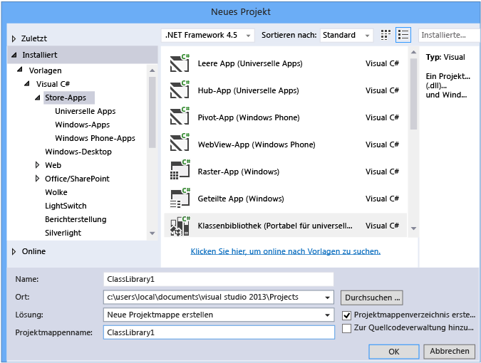
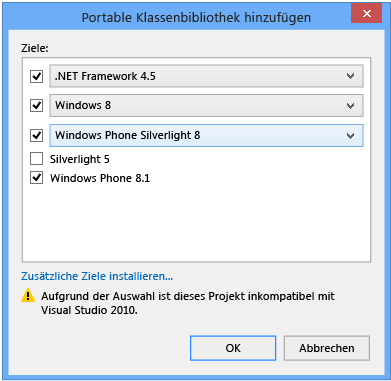
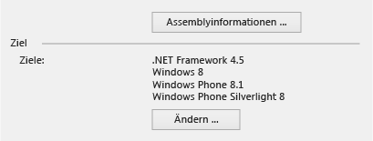
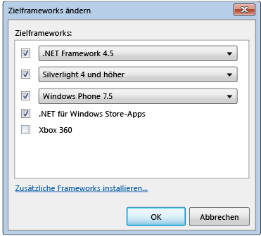
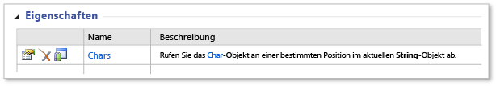
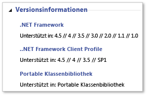

# <a name="cross-platform-development-with-the-portable-class-library"></a>Plattformübergreifende Entwicklung mit der portablen Klassenbibliothek
Der .NET Framework-Projekttyp "Portable Klassenbibliothek" in Visual Studio hilft Ihnen, plattformübergreifende Apps und Bibliotheken für Microsoft-Plattformen schnell und einfach zu erstellen.  

[!INCLUDE[standard](../../../includes/pcl-to-standard.md)]

 Portable Klassenbibliotheken können den Zeit- und Kostenaufwand für die Entwicklung und das Testen von Code verringern. Verwenden Sie diesen Projekttyp, um portable .NET Framework-Assemblys zu schreiben und zu erstellen und auf diese dann aus Apps für mehrere Plattformen wie Windows und Windows Phone zu verweisen.  
  
 Auch nachdem Sie ein Projekt für eine portable Klassenbibliothek in Visual Studio erstellt haben und mit dem Entwickeln beginnen, können Sie die Zielplattformen noch ändern. Visual Studio kompiliert Ihre Bibliothek mit den neuen Assemblys, sodass Sie die Änderungen, die Sie an am Code vornehmen müssen, leichter bestimmen können.  
  
 Dieser Artikel erläutert die Entwicklung von Apps in Visual Studio, aber Microsoft stellt auch Verweisassemblys für portable Klassenbibliotheken zur Verfügung, die Sie verwenden können, um Apps und Bibliotheken mit anderen Tools wie Xamarin zu entwickeln. Diese Apps und Bibliotheken können Sie auf jeder .NET Framework-basierten Laufzeit auf Nicht-Microsoft-Plattformen verwenden. Weitere Informationen über die Verweisassemblys finden Sie im Blogeintrag [Portable Klassenbibliothek (PCL) jetzt verfügbar auf allen Plattformen](https://blogs.msdn.com/b/dotnet/archive/2013/10/14/portable-class-library-pcl-now-available-on-all-platforms.aspx). Informationen zum Herunterladen von Assemblys finden Sie unter [Microsoft .NET Library Verweisassemblys für Portable](https://www.microsoft.com/download/details.aspx?id=40727) im Microsoft Download Center. Weitere Informationen dazu, wie Sie die Assemblys mit Xamarin verwenden, finden Sie im Blogeintrag [PCL und .NET NuGet-Bibliotheken jetzt für Xamarin aktiviert](https://blogs.msdn.com/b/dotnet/archive/2013/11/13/pcl-and-net-nuget-libraries-are-now-enabled-for-xamarin.aspx).  
  
 Visual Studio bietet Ihnen Vorlagen für das Entwickeln mit der portablen Klassenbibliothek. Je nachdem, welche Visual Studio-Version Sie verwenden, können die verfügbaren Vorlagen und Menüs von den in diesem Artikel beschriebenen abweichen.  
  
> [!WARNING]
>  Visual Studio 2013 Update 2 umfasst Updates für die Vorlagen der portablen Klassenbibliothek. Wenn Sie eine frühere Version von Visual Studio und Visual Studio 2013 auf demselben Computer installiert haben, und Sie dann die Änderungen in Update 2 installieren die **Zielframework** Optionen gelten für beide Versionen von Visual Studio.  
  
 In diesem Thema:  
  
 [Visual Studio-support](#vs_support)  
 [Erstellen eines Portable Class Library-Projekts](#create_pcl)  
 [Zieloptionen](#platforms)  
 [Ziele ändern](#change_targets)  
 [Unterstützte Funktionen](#features)  
 [Unterstützte Typen und members](#members)  
 [API-Unterschiede in der portablen Klassenbibliothek](#API_diff)  
 [Verwenden der portablen Klassenbibliothek](#using)  
  
<a name="vs_support"></a>   
## <a name="visual-studio-support"></a>Visual Studio-Unterstützung  
 Die Visual Studio-Unterstützung für die portable Klassenbibliothek richtet sich nach Ihrer Visual Studio-Version. In einigen Fällen ist alles vorhanden, was Sie benötigen, in anderen Fällen müssen Sie, entsprechend der folgenden Tabelle, zusätzliche Elemente installieren.  
  
|Visual Studio-SKU|Unterstützung bei der Erstellung einer portablen Klassenbibliothek|  
|-----------------------|---------------------------------------------------|  
|Visual Studio 2010 Professional, Premium oder Ultimate|Ja, bei der Installation der [Portable Library Tools](https://marketplace.visualstudio.com/items?itemName=BCLTeam.PortableLibraryTools2).|  
|Visual Studio Express 2010-Versionen|Nein.|  
|Visual Studio 2012 Professional, Premium oder Ultimate|Ja. Für Windows Phone 8.0-Unterstützung installieren die [Windows Phone SDK 8.0](https://www.microsoft.com/download/details.aspx?id=35471).|  
|Visual Studio Express 2012-Versionen|Nein.|  
|Visual Studio 2013 Professional, Premium oder Ultimate|Ja. Für Windows Phone 8.1-Unterstützung installieren die [neueste Version von Visual Studio 2013](https://visualstudio.microsoft.com/vs/older-downloads/).|  
|Visual Studio Community 2013 für Windows|Ja, bei der Installation der [neueste Version von Visual Studio Community 2013](https://visualstudio.microsoft.com/vs/older-downloads/), einschließlich Update 2.|  
  
<a name="create_pcl"></a>   
## <a name="creating-a-portable-class-library-project"></a>Erstellen eines Projekts mit portablen Klassenbibliotheken  
 Um eine portable Klassenbibliothek zu erstellen, sollten Sie eine der Vorlagen aus Visual Studio verwenden. Erstellen eines neuen Projekts, und klicken Sie in der **neues Projekt** Dialogfeld **Vorlagen**, wählen Sie die Zielsprache (C#- oder Visual Basic), und wählen Sie dann eine der Plattformen ausgerichtet werden sollen. Weitere Plattformen können Sie im nächsten Schritt auswählen.  
  
 In Visual Studio 2013 Update 2 können Sie wählen die **Klassenbibliothek (portabel)** Vorlage für die gewünschte Sprache und Plattform zum Erstellen einer portablen Klassenbibliothek. Sie sehen diese Vorlage für die folgenden Plattformen:  
  
-   Store-Apps  
  
-   Windows Desktop  
  
-   Silverlight  
  
 Wenn Sie eine Bibliothek aus, das Ziel Windows Phone 8.1 und Windows 8.1 in c# erstellen möchten, können Sie **Store apps**, und wählen Sie dann **-Klassenbibliothek (portabel für Universal Apps)**.  
  
   
  
 Diese Vorlage wählt automatisch Windows 8.1 und Windows Phone 8.1 als Ziele. Wenn Sie eine Bibliothek erstellen, die nur Windows Phone 8.1 oder Windows 8.1 als Ziel hat, können Sie die Zielplattformen später ändern und weitere Plattformen hinzufügen.  
  
 Wenn Sie Visual Studio 2012 oder Visual Studio 2013 ohne Update 2 verwenden, Sie erstellen ein neues Projekt und wählen Sie die **Portable Class Library** Vorlage unter Visual c# oder Visual Basic.  
  
   
  
 Die **Portable Klassenbibliothek hinzufügen** Dialogfeld wird angezeigt, und Sie können zusätzliche Plattformen auswählen. Das Dialogfeld zeigt abhängig von den gewählten Zielen Kompatibilitätswarnungen an.  
  
   
Dialogfeld "Portable Klassenbibliothek hinzufügen" für Visual Studio 2013 Update 2  
  
 Unabhängig davon, ob Sie Visual Studio 2012 oder Visual Studio 2013 verwenden, können Sie die Plattformen bereits auswählen, wenn Sie das Projekt für die portable Klassenbibliothek erstellen, oder nach dem Erstellen des Projekts die Projekteigenschaften verwenden, um die Zielplattformen zu ändern.  
  
<a name="platforms"></a>   
## <a name="target-options"></a>Zieloptionen  
 Wenn Sie ein Projekt für eine portable Klassenbibliothek erstellen, können Sie das Betriebssystem und die .NET Framework-Version auswählen, die Sie als Ziel wünschen. Wenn Sie Visual Studio 2013 verwenden und Update 2 installiert haben oder höher Sie können die **-Klassenbibliothek (portabel für Universal Apps)** Vorlage, um eine Portable Klassenbibliothek zu erstellen, die Windows 8.1 und Windows Phone 8.1 abzielt. Die folgende Tabelle zeigt die für Ihre jeweilige Visual Studio-Version verfügbaren Ziele.  
  
|Zieloption|Visual Studio 2012|Visual Studio 2013|Visual Studio 2013 Update 2 oder höher|  
|-|-|-|-|  
|.NET Framework|– .NET Framework 4 und höher<br /><br /> – .NET Framework 4.0.3 und höher<br /><br /> – .NET Framework 4.5|– .NET Framework 4 und höher<br /><br /> – .NET Framework 4.0.3 und höher<br /><br /> – .NET Framework 4.5 und höher<br /><br /> – .NET Framework 4.5.1|– .NET Framework 4<br /><br /> – .NET Framework 4.0.3<br /><br /> – .NET Framework 4.5<br /><br /> – .NET Framework 4.5.1|  
|Windows Phone|– Windows Phone 7 und höher<br /><br /> – Windows Phone 7.5 und höher<br /><br /> – Windows Phone 8|– Windows Phone 8|– Windows Phone Silverlight 8<br /><br /> – Windows Phone Silverlight 8.1<br /><br /> Für Windows Runtime- und XAML-Unterstützung, wählen Sie:<br /><br /> – Windows Phone 8.1|  
|Windows Store|– .NET für Windows Store-Apps|-Windows Store-Apps (Windows 8) und höher<br /><br /> -Windows Store-Apps (Windows 8.1)|-Windows 8<br /><br /> – Windows 8.1|  
|-Silverlight|-Silverlight 4 und höher<br /><br /> -Silverlight 5|-Silverlight 5|-Silverlight 5|  
|Xbox|-Xbox 360|Nicht zutreffend|Nicht zutreffend|  
  
<a name="change_targets"></a>   
## <a name="changing-targets"></a>Ziele ändern  
 Wenn Sie eine Vorlage für eine portable Klassenbibliothek wählen, werden Standardplattformen für Sie ausgewählt. Diese Plattformen richten sich nach der Visual Studio-Version, die Sie installiert haben, und nach den vorher ausgewählten Zielen. Sie können die Plattformen ändern, wenn Sie die portable Klassenbibliothek erstellen, oder nachdem Sie mit dem Entwickeln der portablen Klassenbibliothek begonnen haben.  
  
 Wenn Sie die Zielplattformen ändern, nachdem Sie Ihrem Projekt, im erstellt haben möchten **Projektmappen-Explorer**, öffnen Sie das Kontextmenü für das Portable Class Library-Projekt (nicht auf die Projektmappe), und wählen Sie dann **Eigenschaften** . Auf der Eigenschaftenseite des Projekts das **Bibliothek** Registerkarte derzeit festgelegten Zielplattformen angezeigt.  
  
   
Eigenschaftenseite portable Klassenbibliothek für Visual Studio 2013 Update 2  
  
 Wählen Sie zum Hinzufügen oder Entfernen von Zielen, die **Änderung** Schaltfläche und dann die entsprechenden Kontrollkästchen deaktivieren.  
  
 Wenn Sie die Zielplattformen ändern, passen sich auch die APIs, die Ihnen zum Entwickeln des Projekts zur Verfügung stehen, Ihrer Auswahl an. Visual Studio meldet die Fehler und Warnungen, die durch den Wechsel der Zielplattformen entstehen können.  
  
 Wenn Sie die Portabilität auswerten möchten Ihre Assemblys, bevor Sie Änderungen in Visual Studio vornehmen, können Sie verwenden die [.NET Portability Analyzer](https://visualstudiogallery.msdn.microsoft.com/1177943e-cfb7-4822-a8a6-e56c7905292b).  
  
 Die Menüoptionen variieren in Abhängigkeit von Ihrer Visual Studio-Version.  
  
   
Dialogfeld "Zielplattformen ändern" in Visual Studio 2012  
  
<a name="features"></a>   
## <a name="supported-features"></a>Unterstützte Funktionen  
 Die folgende Tabelle zeigt, welche Funktionen auf den verfügbaren Plattformen und in ihren Versionen unterstützt werden. In einigen Fällen hat Microsoft zum Release eines NuGet-Pakets Unterstützung hinzugefügt und dies vermerkt. Weitere Informationen über NuGet-Pakete für .NET Framework finden Sie unter [.NET Framework und Out-of-Band-Releases](../../../docs/framework/get-started/the-net-framework-and-out-of-band-releases.md).  
  
|Feature|.NET Framework|.NET Framework|.NET Framework|Windows Store|Windows Store|Windows Phone Store|Windows Phone Silverlight|Windows Phone Silverlight|Windows Phone Silverlight|Silverlight|Silverlight|Xbox 360|  
|-------------|--------------------|--------------------|--------------------|-------------------|-------------------|-------------------------|-------------------------------|-------------------------------|-------------------------------|-----------------|-----------------|--------------|  
||**4**|**4.0.3**|**4.5**|**8**|**8.1**|**8.1**|**7.5**|**8**|**8.1**|**4**|**5**||  
|Kernbibliotheken|✓|✓|✓|✓|✓|✓|✓|✓|✓|✓|✓|✓|  
|Asynchrone Unterstützung|➊|➊|✓|✓|✓|✓|➊|➊|✓|➊|➊||  
|Komprimierung|||✓|✓|✓|✓||➋|➋||||  
|Datenanmerkungen||✓|✓|✓|✓|||||✓|✓||  
|Dynamisches Schlüsselwort|✓|✓|✓|✓|✓|||||✓|✓||  
|HTTPClient|➌|➌|✓|✓|✓|✓|➌|➌|➌|➌|➌||  
|IQueryable|✓|✓|✓|✓|✓|✓|✓|✓|✓|✓|✓||  
|Language-Integrated Query (LINQ)|✓|✓|✓|✓|✓|✓|✓|✓|✓|✓|✓||  
|Managed Extensibility Network (MEF)|✓|✓|✓|✓|✓|||||✓|✓||  
|Netzwerkklassenbibliothek (NCL)|✓|✓|✓|✓|✓|✓|✓|✓|✓|✓|✓||  
|Serialisierung (Datenvertrag, XML und JSON)|✓|✓|✓|✓|✓|✓|✓|✓|✓|✓|✓||  
|System.Numerics|✓|✓|✓|✓|✓|||||✓|✓||  
|Ansichtsmodelle (MVVM)|||✓|✓|✓|✓|✓|✓|✓|✓|✓||  
|Windows Communication Foundation (WCF)|✓|✓|✓|✓|✓||✓|✓|✓|✓|✓||  
|Windows Runtime-APIs|||||✓|✓|||||||  
|Windows.UI.XAML|||||✓|✓|||||||  
|XLINQ||✓|✓|✓|✓|✓|✓|✓|✓|✓|✓|✓|  
  
 ➊ Erfordert [Microsoft Async](https://www.nuget.org/packages/Microsoft.Bcl.Async/) Paket  
 ➋ Erfordert [Microsoft Compression](https://www.nuget.org/packages/Microsoft.Bcl.Compression) Paket  
 ➌ Erfordert [Microsoft HTTP Client Libraries](https://www.nuget.org/packages/Microsoft.Net.Http) Paket  
  
> [!WARNING]
>  Sie können Fehler auftreten, wenn Sie verweisen die [Microsoft Compression](https://www.nuget.org/packages/Microsoft.Bcl.Compression) und [Microsoft HTTP Client Libraries](https://www.nuget.org/packages/Microsoft.Net.Http) Pakete aus einer portablen Bibliothek, die von einer Windows Phone Silverlight 8.1-app verwendet. Weitere Informationen finden Sie unter [Plattformkompatibilität und Änderungen für Windows Phone Silverlight 8.1-apps](https://docs.microsoft.com/previous-versions/windows/apps/dn642084(v=vs.105)).  
  
<a name="members"></a>   
## <a name="supported-types-and-members"></a>Unterstützte Typen und Members  
 Die Typen und Member, die in Projekten für portable Klassenbibliotheken verfügbar sind, werden von mehreren Kompatibilitätsfaktoren beschränkt:  
  
-   Sie müssen von allen Zielen, die Sie ausgewählt haben, gemeinsam nutzbar sein.  
  
-   Sie müssen sich auf diesen Zielen in ähnlicher Weise verhalten.  
  
-   Sie dürfen keine Kandidaten für Veraltung sein.  
  
-   Sie müssen jedoch in einer übertragbaren Umgebung einen Sinn ergeben, insbesondere wenn sie nicht übertragbare Member unterstützen.  
  
 Beispielsweise enthält die portable Klassenbibliothek nur dann UI-bezogene Typen, wenn Sie als Ziel Windows 8.1 und Windows Phone 8.1 wählen. Sie treffen möglicherweise auch Einschränkungen an, wenn Sie für Plattformen entwickeln, die vor der Einführung der portablen Klassenbibliothek veröffentlicht wurden (wie Xbox, .NET Framework 4 und Windows Phone 7). Das .NET Framework veröffentlicht Pakete über NuGet, wodurch die Unterstützung für portable Klassenbibliotheken für einige dieser älteren Plattformen verbessert wird. Weitere Informationen und eine Liste von NuGet-Paketen, finden Sie unter [.NET Framework und Out-of-Band-Releases](../../../docs/framework/get-started/the-net-framework-and-out-of-band-releases.md).  
  
 Wird ein Member in der portablen Klassenbibliothek und für Ihre Ziele unterstützt, erscheint es in Ihrem Projekt in IntelliSense. Außerdem wird das Symbol "Portable Klassenbibliothek"  wird in den Membertabellen der [.NET Framework-Klassenbibliothek](https://msdn.microsoft.com/library/mt472912.aspx) neben den unterstützten Membern. Beispielsweise zeigt die folgende Membertabelle, dass die <xref:System.String.Chars%2A>-Eigenschaft in der <xref:System.String>-Klasse in der portablen Klassenbibliothek unterstützt wird:  
  
   
Symbol für die portable Klassenbibliothek  
  
 Sie können auch suchen, der **Versionsinformationen** Abschnitt eines Referenzthemas nach einem Hinweis gibt an, dass ein Typ oder Member in das Projekt der portablen Klassenbibliothek unterstützt wird:  
  
   
Beispiel für Versionsinformationen  
  
 Beachten Sie aber, dass eine API zwar in der portablen Klassenbibliothek unterstützt werden kann, ob Sie die API jedoch verwenden können, hängt von den gewählten Zielen ab.  
  
<a name="API_diff"></a>   
## <a name="api-differences-in-the-portable-class-library"></a>API-Unterschiede in der portablen Klassenbibliothek  
 Um die Kompatibilität von Assemblys für portable Klassenbibliotheken mit allen unterstützten Plattformen sicherzustellen, wurden einige Member in der portablen Klassenbibliothek geringfügig geändert.  
  
<a name="using"></a>   
## <a name="using-the-portable-class-library"></a>Verwenden der portablen Klassenbibliothek  
 Nachdem Sie das Projekt für die portable Klassenbibliothek erstellt haben, verweisen Sie einfach aus anderen Projekten auf das neue Projekt. Sie können entweder auf das Projekt oder auf bestimmte Assemblys verweisen, die die Klassen enthalten, auf die Sie zugreifen möchten.  
  
 Um eine App auszuführen, die auf die Assembly einer portablen Klassenbibliothek verweist, müssen auf dem Computer die erforderlichen Versionen (oder höhere Versionen) der Zielplattformen installiert sein. Visual Studio enthält alle erforderlichen Frameworks, sodass Sie die App ohne weitere Änderung auf dem Computer ausführen können, auf dem Sie die Anwendung entwickelt haben.  
  
### <a name="deploying-a-windows-store-or-windows-phone-app"></a>Bereitstellen einer Windows Store- oder Windows Phone-App  
 Wenn Sie eine Windows Store- oder Windows Phone-App erstellen, die auf eine Assembly einer portablen Klassenbibliothek verweist, ist alles, was Sie zum Bereitstellen der App benötigen, im App-Paket enthalten und es sind keine weiteren Schritte erforderlich.  
  
### <a name="deploying-a-net-framework-app"></a>Bereitstellen einer .NET Framework-App  
 Wenn Sie eine .NET Framework-App bereitstellen, die auf eine Assembly einer portablen Klassenbibliothek verweist, müssen Sie eine Abhängigkeit von der richtigen Version von .NET Framework angeben. Durch die Angabe dieser Abhängigkeit stellen Sie sicher, dass die erforderliche Version mit der App installiert wird. Wenn die Zielplattform .NET Framework 4 oder höher ist, muss der Computer mit .NET Framework 4 auf einem [aktualisieren](https://www.microsoft.com/download/details.aspx?id=3556), Update 4.0.3 für .NET Framework 4 oder .NET Framework 4.5 installiert.  
  
-   Um eine Abhängigkeit mit ClickOnce-Bereitstellung zu erstellen: In **Projektmappen-Explorer**, wählen Sie den Projektknoten für das Projekt, das Sie veröffentlichen möchten. (Dies ist das Projekt, mit dem auf das Projekt der portablen Klassenbibliothek verwiesen wird.) Wählen Sie auf der Menüleiste **Projekt**, **Eigenschaften**, und wählen Sie dann die **veröffentlichen** Registerkarte. Auf der **veröffentlichen** Seite **Voraussetzungen**. Wählen Sie die erforderliche .NET Framework-Version (oder ein Update von .NET Framework 4) als erforderliche Komponente aus.  
  
-   Um eine Abhängigkeit mit einem Setup-Projekt zu erstellen: In **Projektmappen-Explorer**, wählen Sie das Setupprojekt. Wählen Sie auf der Menüleiste **Projekt**, **Eigenschaften**, **Voraussetzungen**. Wählen Sie die erforderliche .NET Framework-Version als erforderliche Komponente aus.  
  
 Weitere Informationen zum Bereitstellen von .NET Framework-apps finden Sie unter [Bereitstellungshandbuch für Entwickler](../../../docs/framework/deployment/deployment-guide-for-developers.md).  
  
### <a name="deploying-a-silverlight-based-app"></a>Bereitstellen einer Silverlight-App  
 Wenn Sie eine Silverlight-App bereitstellen, die auf eine Assembly einer portablen Klassenbibliothek verweist, müssen Sie sicherstellen, dass die minimale erforderliche Laufzeitversion für die App der Zielversion entspricht. Wenn Sie für Silverlight 4 entwickeln, muss die Version 4.0.60129.0 oder höher sein. Sie legen die Version fest, indem Sie `<param name="minRuntimeVersion" value="4.0.60129.0" />` wie folgt in die Webseite einschließen, die die Silverlight-App hostet:  
  
```xaml  
<div id="silverlightControlHost">  
    <object data="data:application/x-silverlight-2,"   
           type="application/x-silverlight-2" width="100%" height="100%">  
    <param name="source" value="ClientBin/SilverlightApplication.xap"/>  
    <param name="onError" value="onSilverlightError" />  
    <param name="background" value="white" />  
    <param name="minRuntimeVersion" value="4.0.60129.0" />  
    <param name="autoUpgrade" value="true" />  
    <a href="https://www.microsoft.com/getsilverlight/get-started/install/"   
             style="text-decoration:none">  
        
    </a>  
  </object>  
   <iframe id="_sl_historyFrame"   
              style="visibility:hidden;height:0px;width:0px;border:0px">  
   </iframe>  
</div>  
```  
  
## <a name="see-also"></a>Siehe auch

- [Verwenden der portablen Klassenbibliothek mit MVVM](../../../docs/standard/cross-platform/using-portable-class-library-with-model-view-view-model.md)  
- [App-Ressourcen für Bibliotheken, die für mehrere Zielplattformen konfiguriert sind](../../../docs/standard/cross-platform/app-resources-for-libraries-that-target-multiple-platforms.md)  
- [.NET Portability Analyzer](https://visualstudiogallery.msdn.microsoft.com/1177943e-cfb7-4822-a8a6-e56c7905292b)  
- [.NET Framework-Unterstützung für Windows Store-Apps und Windows-Runtime](../../../docs/standard/cross-platform/support-for-windows-store-apps-and-windows-runtime.md)  
- [Bereitstellung](../../../docs/framework/deployment/net-framework-applications.md)
