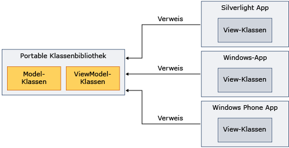

# Verwenden der portablen Klassenbibliothek mit Model-View-View ModelUsing Portable Class Library with Model-View-View Model
Sie können .NET Framework [Portable Class Library](../../../docs/standard/cross-platform/cross-platform-development-with-the-portable-class-library.md) das Model-View-View Model (MVVM)-Muster implementieren, und geben Sie die Assemblys auf mehreren Plattformen frei.You can use the .NET Framework [Portable Class Library](../../../docs/standard/cross-platform/cross-platform-development-with-the-portable-class-library.md) to implement the Model-View-View Model (MVVM) pattern and share assemblies across multiple platforms.

[!INCLUDE[standard](../../../includes/pcl-to-standard.md)]

 MVVM ist ein Anwendungsmuster, die die Benutzeroberfläche von der zugrunde liegende Geschäftslogik isoliert.MVVM is an application pattern that isolates the user interface from the underlying business logic. Sie können die Modell und Ansicht Modellklassen in implementieren eine [!INCLUDE[net_portable](../../../includes/net-portable-md.md)] -Projekt in Visual Studio 2012, und erstellen Sie Ansichten, die für verschiedene Plattformen angepasst werden.You can implement the model and view model classes in a [!INCLUDE[net_portable](../../../includes/net-portable-md.md)] project in Visual Studio 2012, and then create views that are customized for different platforms. Dieser Ansatz ermöglicht Ihnen das Schreiben von Daten von Modell und Geschäftslogik nur einmal und verwenden, die von .NET Framework, Silverlight, Windows Phone-code und [!INCLUDE[win8_appname_long](../../../includes/win8-appname-long-md.md)] -apps, wie in der folgenden Abbildung dargestellt.This approach enables you to write the data model and business logic only once, and use that code from .NET Framework, Silverlight, Windows Phone, and [!INCLUDE[win8_appname_long](../../../includes/win8-appname-long-md.md)] apps, as shown in the following illustration.

 

 Dieses Thema bietet allgemeine Informationen über das MVVM-Muster nicht.This topic does not provide general information about the MVVM pattern. Es enthält nur Informationen zur Verwendung von [!INCLUDE[net_portable](../../../includes/net-portable-md.md)] zum Implementieren von MVVM.It only provides information about how to use [!INCLUDE[net_portable](../../../includes/net-portable-md.md)] to implement MVVM. Weitere Informationen zu MVVM finden Sie unter den [MVVM Schnellstart verwenden die Prism Library 5.0 für WPF](https://docs.microsoft.com/previous-versions/msp-n-p/gg430857(v=pandp.40)).For more information about MVVM, see the [MVVM Quickstart Using the Prism Library 5.0 for WPF](https://docs.microsoft.com/previous-versions/msp-n-p/gg430857(v=pandp.40)).

## Klassen, die MVVM unterstützen.Classes That Support MVVM
 Wenn Sie das Ziel der [!INCLUDE[net_v45](../../../includes/net-v45-md.md)], [!INCLUDE[net_win8_profile](../../../includes/net-win8-profile-md.md)], Silverlight oder Windows Phone 7.5 für Ihre [!INCLUDE[net_portable](../../../includes/net-portable-md.md)] -Projekt die folgenden Klassen sind für die Implementierung des MVVM-Musters verfügbar:When you target the [!INCLUDE[net_v45](../../../includes/net-v45-md.md)], [!INCLUDE[net_win8_profile](../../../includes/net-win8-profile-md.md)], Silverlight, or Windows Phone 7.5 for your [!INCLUDE[net_portable](../../../includes/net-portable-md.md)] project, the following classes are available for implementing the MVVM pattern:

- <xref:System.Collections.ObjectModel.ObservableCollection%601?displayProperty=nameWithType>-Klasse<xref:System.Collections.ObjectModel.ObservableCollection%601?displayProperty=nameWithType> class

- <xref:System.Collections.ObjectModel.ReadOnlyObservableCollection%601?displayProperty=nameWithType>-Klasse<xref:System.Collections.ObjectModel.ReadOnlyObservableCollection%601?displayProperty=nameWithType> class

- <xref:System.Collections.Specialized.INotifyCollectionChanged?displayProperty=nameWithType>-Klasse<xref:System.Collections.Specialized.INotifyCollectionChanged?displayProperty=nameWithType> class

- <xref:System.Collections.Specialized.NotifyCollectionChangedAction?displayProperty=nameWithType>-Klasse<xref:System.Collections.Specialized.NotifyCollectionChangedAction?displayProperty=nameWithType> class

- <xref:System.Collections.Specialized.NotifyCollectionChangedEventArgs?displayProperty=nameWithType>-Klasse<xref:System.Collections.Specialized.NotifyCollectionChangedEventArgs?displayProperty=nameWithType> class

- <xref:System.Collections.Specialized.NotifyCollectionChangedEventHandler?displayProperty=nameWithType>-Klasse<xref:System.Collections.Specialized.NotifyCollectionChangedEventHandler?displayProperty=nameWithType> class

- <xref:System.ComponentModel.DataErrorsChangedEventArgs?displayProperty=nameWithType>-Klasse<xref:System.ComponentModel.DataErrorsChangedEventArgs?displayProperty=nameWithType> class

- <xref:System.ComponentModel.INotifyDataErrorInfo?displayProperty=nameWithType>-Klasse<xref:System.ComponentModel.INotifyDataErrorInfo?displayProperty=nameWithType> class

- <xref:System.ComponentModel.INotifyPropertyChanged?displayProperty=nameWithType>-Klasse<xref:System.ComponentModel.INotifyPropertyChanged?displayProperty=nameWithType> class

- <xref:System.Windows.Input.ICommand?displayProperty=nameWithType>-Klasse<xref:System.Windows.Input.ICommand?displayProperty=nameWithType> class

- Alle Klassen in der <xref:System.ComponentModel.DataAnnotations?displayProperty=nameWithType> NamespaceAll classes in the <xref:System.ComponentModel.DataAnnotations?displayProperty=nameWithType> namespace

## Implementierung von MVVMImplementing MVVM
 Zum Implementieren von MVVM normalerweise erstellen Sie sowohl das Modell und das Ansichtsmodell in einem [!INCLUDE[net_portable](../../../includes/net-portable-md.md)] Projekt, da eine [!INCLUDE[net_portable](../../../includes/net-portable-md.md)] Projekt kann nicht auf ein nicht portables Projekt verweisen.To implement MVVM, you typically create both the model and the view model in a [!INCLUDE[net_portable](../../../includes/net-portable-md.md)] project, because a [!INCLUDE[net_portable](../../../includes/net-portable-md.md)] project cannot reference a non-portable project. Das Modell und das Ansichtsmodell kann im selben Projekt oder in separaten Projekten.The model and view model can be in the same project or in separate projects. Wenn Sie separate Projekte verwenden, fügen Sie einen Verweis aus dem Projekt der Modelle anzeigen, auf das Modellprojekt.If you use separate projects, add a reference from the view model project to the model project.

 Nachdem Sie das Modell zu kompilieren und modellprojekte anzeigen, verweisen Sie auf diese Assemblys in der app, die die Sicht enthält.After you compile the model and view model projects, you reference those assemblies in the app that contains the view. Wenn die Ansicht nur mit dem Ansichtsmodell interagiert, müssen Sie sich nur auf die Assembly verweisen, die das Ansichtsmodell enthält.If the view interacts only with the view model, you only have to reference the assembly that contains the view model.

### ModellModel
 Das folgende Beispiel zeigt eine vereinfachte Model-Klasse, die im befinden könnte eine [!INCLUDE[net_portable](../../../includes/net-portable-md.md)] Projekt.The following example shows a simplified model class that could reside in a [!INCLUDE[net_portable](../../../includes/net-portable-md.md)] project.

 [!code-csharp[PortableClassLibraryMVVM#1](../../../samples/snippets/csharp/VS_Snippets_CLR/portableclasslibrarymvvm/cs/customer.cs#1)]
 [!code-vb[PortableClassLibraryMVVM#1](../../../samples/snippets/visualbasic/VS_Snippets_CLR/portableclasslibrarymvvm/vb/customer.vb#1)]

 Das folgende Beispiel zeigt eine einfache Möglichkeit zum Füllen, abrufen und aktualisieren Sie die Daten in einem [!INCLUDE[net_portable](../../../includes/net-portable-md.md)] Projekt.The following example shows a simple way to populate, retrieve, and update the data in a [!INCLUDE[net_portable](../../../includes/net-portable-md.md)] project. In einer echten app würden Sie die Daten aus einer Quelle, z. B. einen Windows Communication Foundation (WCF)-Dienst abrufen.In a real app, you would retrieve the data from a source such as a Windows Communication Foundation (WCF) service.

 [!code-csharp[PortableClassLibraryMVVM#2](../../../samples/snippets/csharp/VS_Snippets_CLR/portableclasslibrarymvvm/cs/customerrepository.cs#2)]
 [!code-vb[PortableClassLibraryMVVM#2](../../../samples/snippets/visualbasic/VS_Snippets_CLR/portableclasslibrarymvvm/vb/customerrepository.vb#2)]

### Anzeigen des ModellsView Model
 Eine Basisklasse für anzeigemodelle wird häufig hinzugefügt, bei der Implementierung des MVVM-Musters.A base class for view models is frequently added when implementing the MVVM pattern. Das folgende Beispiel zeigt eine Basisklasse.The following example shows a base class.

 [!code-csharp[PortableClassLibraryMVVM#3](../../../samples/snippets/csharp/VS_Snippets_CLR/portableclasslibrarymvvm/cs/viewmodelbase.cs#3)]
 [!code-vb[PortableClassLibraryMVVM#3](../../../samples/snippets/visualbasic/VS_Snippets_CLR/portableclasslibrarymvvm/vb/viewmodelbase.vb#3)]

 Eine Implementierung der <xref:System.Windows.Input.ICommand> Schnittstelle wird häufig verwendet, mit dem MVVM-Muster.An implementation of the <xref:System.Windows.Input.ICommand> interface is frequently used with the MVVM pattern. Im folgenden Beispiel wird eine Implementierung der <xref:System.Windows.Input.ICommand>-Schnittstelle veranschaulicht.The following example shows an implementation of the <xref:System.Windows.Input.ICommand> interface.

 [!code-csharp[PortableClassLibraryMVVM#4](../../../samples/snippets/csharp/VS_Snippets_CLR/portableclasslibrarymvvm/cs/relaycommand.cs#4)]
 [!code-vb[PortableClassLibraryMVVM#4](../../../samples/snippets/visualbasic/VS_Snippets_CLR/portableclasslibrarymvvm/vb/relaycommand.vb#4)]

 Das folgende Beispiel zeigt eine vereinfachte Ansicht-Modell.The following example shows a simplified view model.

 [!code-csharp[PortableClassLibraryMVVM#5](../../../samples/snippets/csharp/VS_Snippets_CLR/portableclasslibrarymvvm/cs/mainpageviewmodel.cs#5)]
 [!code-vb[PortableClassLibraryMVVM#5](../../../samples/snippets/visualbasic/VS_Snippets_CLR/portableclasslibrarymvvm/vb/customerviewmodel.vb#5)]  
  
### AnsichtView  
 Aus einem [!INCLUDE[net_v45](../../../includes/net-v45-md.md)] app [!INCLUDE[win8_appname_long](../../../includes/win8-appname-long-md.md)] -app, Silverlight-basierten Anwendung oder Windows Phone 7.5-app, können Sie die Assembly mit dem Modell und Ansicht-modellprojekte verweisen.From a [!INCLUDE[net_v45](../../../includes/net-v45-md.md)] app, [!INCLUDE[win8_appname_long](../../../includes/win8-appname-long-md.md)] app, Silverlight-based app, or Windows Phone 7.5 app, you can reference the assembly that contains the model and view model projects.  Anschließend erstellen Sie eine Ansicht, die Interaktion mit dem Ansichtsmodell.You then create a view that interacts with the view model. Das folgende Beispiel zeigt eine vereinfachte Windows Presentation Foundation (WPF)-app, die abgerufen und aktualisiert die Daten aus dem Anzeigemodell.The following example shows a simplified Windows Presentation Foundation (WPF) app that retrieves and updates data from the view model. Sie können ähnliche Ansichten erstellen, in Silverlight, Windows Phone, oder [!INCLUDE[win8_appname_long](../../../includes/win8-appname-long-md.md)] apps.You could create similar views in Silverlight, Windows Phone, or [!INCLUDE[win8_appname_long](../../../includes/win8-appname-long-md.md)] apps.  
  
 [!code-xaml[PortableClassLibraryMVVM#6](../../../samples/snippets/csharp/VS_Snippets_CLR/portableclasslibrarymvvm/cs/mainwindow.xaml#6)]  
  
## Siehe auchSee also

- [Portable KlassenbibliothekPortable Class Library](../../../docs/standard/cross-platform/cross-platform-development-with-the-portable-class-library.md)
