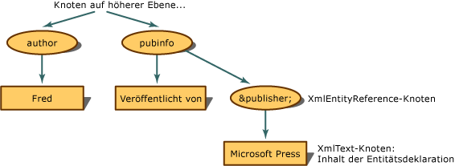

# <a name="entity-references-are-preserved"></a><span data-ttu-id="f5bfe-102">Entitätsverweise werden beibehalten</span><span class="sxs-lookup"><span data-stu-id="f5bfe-102">Entity References are Preserved</span></span>
<span data-ttu-id="f5bfe-103">Wenn der Entitätsverweis nicht erweitert, sondern beibehalten wird, erstellt das XML-Dokumentobjektmodell (DOM) beim Auffinden eines Entitätsverweises einen **XmlEntityReference**-Knoten.</span><span class="sxs-lookup"><span data-stu-id="f5bfe-103">When the entity reference is not expanded, but preserved, the XML Document Object Model (DOM) builds an **XmlEntityReference** node when it encounters an entity reference.</span></span>  
  
 <span data-ttu-id="f5bfe-104">Bei dem folgenden XML-Code</span><span class="sxs-lookup"><span data-stu-id="f5bfe-104">Using the following XML,</span></span>  
  
```xml  
<author>Fred</author>  
<pubinfo>Published by &publisher;</pubinfo>  
```  
  
 <span data-ttu-id="f5bfe-105">erstellt das DOM einen **XmlEntityReference**-Knoten, wenn der `&publisher;`-Verweis gefunden wird.</span><span class="sxs-lookup"><span data-stu-id="f5bfe-105">the DOM builds an **XmlEntityReference** node when it encounters the `&publisher;` reference.</span></span> <span data-ttu-id="f5bfe-106">Der **XmlEntityReference**-Knoten enthält untergeordnete Knoten, die aus dem Inhalt der Entitätsdeklaration kopiert werden.</span><span class="sxs-lookup"><span data-stu-id="f5bfe-106">The **XmlEntityReference** contains child nodes copied from the content in the entity declaration.</span></span> <span data-ttu-id="f5bfe-107">Im vorherigen Codebeispiel befindet sich Text in der Entitätsdeklaration. Daher wird ein **XmlText**-Knoten als untergeordneter Knoten des Entitätsverweisknotens erstellt.</span><span class="sxs-lookup"><span data-stu-id="f5bfe-107">The preceding code example contains text in the entity declaration, so an **XmlText** node is created as the child node of the entity reference node.</span></span>  
  
 <span data-ttu-id="f5bfe-108"></span><span class="sxs-lookup"><span data-stu-id="f5bfe-108"></span></span>  
<span data-ttu-id="f5bfe-109">Struktur für Entitätsverweise, die erhalten bleiben</span><span class="sxs-lookup"><span data-stu-id="f5bfe-109">Tree structure for entity references that are preserved</span></span>  
  
 <span data-ttu-id="f5bfe-110">Die untergeordneten Knoten von **XmlEntityReference** sind Kopien sämtlicher untergeordneter Knoten, die aus dem **XmlEntity**-Knoten erstellt wurden, als die Entitätsdeklaration gefunden wurde.</span><span class="sxs-lookup"><span data-stu-id="f5bfe-110">The child nodes of the **XmlEntityReference** are copies of all the child nodes created from the **XmlEntity** node when the entity declaration was encountered.</span></span>  
  
> [!NOTE]
> <span data-ttu-id="f5bfe-111">Die aus **XmlEntity** kopierten Knoten stellen nicht immer exakte Kopien dar, nachdem sie unter dem Entitätsverweisknoten angeordnet wurden.</span><span class="sxs-lookup"><span data-stu-id="f5bfe-111">The nodes copied from the **XmlEntity** are not always exact copies once placed under the entity reference node.</span></span> <span data-ttu-id="f5bfe-112">Es können sich Namespaces im Gültigkeitsbereich des Entitätsverweisknotens befinden, die die endgültige Konfiguration der untergeordneten Knoten beeinflussen.</span><span class="sxs-lookup"><span data-stu-id="f5bfe-112">There can be namespaces that are in scope at the entity reference node, and that affects the final configuration of the child nodes.</span></span>  
  
 <span data-ttu-id="f5bfe-113">Standardmäßig werden allgemeine Entitäten wie `&abc;` beibehalten, und es werden immer **XmlEntityReference**-Knoten erstellt.</span><span class="sxs-lookup"><span data-stu-id="f5bfe-113">By default, general entities like `&abc;` are preserved and **XmlEntityReference** nodes always created.</span></span>  
  
## <a name="see-also"></a><span data-ttu-id="f5bfe-114">Siehe auch</span><span class="sxs-lookup"><span data-stu-id="f5bfe-114">See also</span></span>

- [<span data-ttu-id="f5bfe-115">XML-Dokumentobjektmodell (DOM)</span><span class="sxs-lookup"><span data-stu-id="f5bfe-115">XML Document Object Model (DOM)</span></span>](xml-document-object-model-dom.md)
