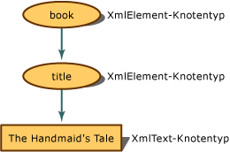

# <a name="mapping-the-object-hierarchy-to-xml-data"></a>Zuordnen der Objekthierarchie zu XML-Daten
Wenn sich ein XML-Dokument im Speicher befindet, ist seine konzeptionelle Darstellung eine Struktur. Für das Programmieren verwenden Sie eine Objekthierarchie, um auf die Knoten der Struktur zuzugreifen. Im folgenden Beispiel wird veranschaulicht, wie aus dem XML-Inhalt Knoten werden.  
  
 Wenn der XML-Code in das Dokumentobjektmodell (DOM) eingelesen wird, werden die einzelnen Teile in Knoten umgesetzt, und diese enthalten zusätzliche Metadaten über sich selbst, z. B. ihren Knotentyp und ihre Werte. Der Knotentyp besteht aus seinem Objekt und bestimmt, welche Aktionen ausgeführt und welche Eigenschaften festgelegt oder abgerufen werden.  
  
 Angenommen, Sie haben folgenden einfachen XML-Code:  
  
 **Eingabe**  
  
```xml  
<book>  
    <title>The Handmaid's Tale</title>  
</book>  
```  
  
 Diese Eingabe wird im Speicher als die folgende Knotenstruktur mit der zugewiesenen Knotentypeigenschaft dargestellt:  
  
   
Darstellung von "book" und "title" in der Knotenstruktur  
  
 Das `book`-Element wird zu einem **XmlElement**-Objekt, ebenso wie das nächste Element, `title`, zu einem **XmlElement**, während der Elementinhalt zu einem **XmlText**-Objekt wird. Die Methoden und Eigenschaften von **XmlElement** unterscheiden sich von denen, die für ein **XmlText**-Objekt verfügbar sind. Folglich ist es wichtig, zu wissen, in welchen Knotentyp das XML-Markup umgesetzt wird, da der Knotentyp bestimmt, welche Aktionen ausgeführt werden können.  
  
 Im folgenden Beispiel werden XML-Daten eingelesen, und je nach Knotentyp wird unterschiedlicher Text ausgegeben. Dabei wird die folgende XML-Datendatei, **items.xml**, als Eingabe verwendet:  
  
 **Eingabe**  
  
```xml  
<?xml version="1.0"?>  
<!-- This is a sample XML document -->  
<!DOCTYPE Items [<!ENTITY number "123">]>  
<Items>  
  <Item>Test with an entity: &number;</Item>  
  <Item>test with a child element <more/> stuff</Item>  
  <Item>test with a CDATA section <![CDATA[<456>]]> def</Item>  
  <Item>Test with a char entity: A</Item>  
  <!-- Fourteen chars in this element.-->  
  <Item>1234567890ABCD</Item>  
</Items>  
```  
  
 Im folgenden Codebeispiel wird die Datei **items.xml** gelesen, dann werden für jeden Knotentyp Informationen angezeigt.  
  
```vb  
Imports System  
Imports System.IO  
Imports System.Xml  
  
Public Class Sample  
    Private Const filename As String = "items.xml"  
  
    Public Shared Sub Main()  
  
        Dim reader As XmlTextReader = Nothing  
  
        Try  
            ' Load the reader with the data file and
            'ignore all white space nodes.
            reader = New XmlTextReader(filename)  
            reader.WhitespaceHandling = WhitespaceHandling.None  
  
            ' Parse the file and display each of the nodes.  
            While reader.Read()  
                Select Case reader.NodeType  
                    Case XmlNodeType.Element  
                        Console.Write("<{0}>", reader.Name)  
                    Case XmlNodeType.Text  
                        Console.Write(reader.Value)  
                    Case XmlNodeType.CDATA  
                        Console.Write("<![CDATA[{0}]]>", reader.Value)  
                    Case XmlNodeType.ProcessingInstruction  
                        Console.Write("<?{0} {1}?>", reader.Name, reader.Value)  
                    Case XmlNodeType.Comment  
                        Console.Write("<!--{0}-->", reader.Value)  
                    Case XmlNodeType.XmlDeclaration  
                        Console.Write("<?xml version='1.0'?>")  
                    Case XmlNodeType.Document  
                    Case XmlNodeType.DocumentType  
                        Console.Write("<!DOCTYPE {0} [{1}]", reader.Name, reader.Value)  
                    Case XmlNodeType.EntityReference  
                        Console.Write(reader.Name)  
                    Case XmlNodeType.EndElement  
                        Console.Write("</{0}>", reader.Name)  
                End Select  
            End While  
  
        Finally  
            If Not (reader Is Nothing) Then  
                reader.Close()  
            End If  
        End Try  
    End Sub 'Main ' End class  
End Class 'Sample  
```  
  
```csharp  
using System;  
using System.IO;  
using System.Xml;  
  
public class Sample  
{  
    private const String filename = "items.xml";  
  
    public static void Main()  
    {  
        XmlTextReader reader = null;  
  
        try  
        {  
            // Load the reader with the data file and ignore
            // all white space nodes.  
            reader = new XmlTextReader(filename);  
            reader.WhitespaceHandling = WhitespaceHandling.None;  
  
            // Parse the file and display each of the nodes.  
            while (reader.Read())  
            {  
                switch (reader.NodeType)  
                {  
                    case XmlNodeType.Element:  
                        Console.Write("<{0}>", reader.Name);  
                        break;  
                    case XmlNodeType.Text:  
                        Console.Write(reader.Value);  
                        break;  
                    case XmlNodeType.CDATA:  
                        Console.Write("<![CDATA[{0}]]>", reader.Value);  
                        break;  
                    case XmlNodeType.ProcessingInstruction:  
                        Console.Write("<?{0} {1}?>", reader.Name, reader.Value);  
                        break;  
                    case XmlNodeType.Comment:  
                        Console.Write("<!--{0}-->", reader.Value);  
                        break;  
                    case XmlNodeType.XmlDeclaration:  
                        Console.Write("<?xml version='1.0'?>");  
                        break;  
                    case XmlNodeType.Document:  
                        break;  
                    case XmlNodeType.DocumentType:  
                        Console.Write("<!DOCTYPE {0} [{1}]", reader.Name, reader.Value);  
                        break;  
                    case XmlNodeType.EntityReference:  
                        Console.Write(reader.Name);  
                        break;  
                    case XmlNodeType.EndElement:  
                        Console.Write("</{0}>", reader.Name);  
                        break;  
                }  
            }  
        }  
  
        finally  
        {  
            if (reader != null)  
                reader.Close();  
        }  
    }  
} // End class  
```  
  
 Die Ausgabe dieses Beispiels veranschaulicht die Zuordnung der Daten zu den Knotentypen.  
  
 **Ausgabe**  
  
```xml  
<?xml version='1.0'?><!--This is a sample XML document --><!DOCTYPE Items [<!ENTITY number "123">]<Items><Item>Test with an entity: 123</Item><Item>test with a child element <more> stuff</Item><Item>test with a CDATA section <![CDATA[<456>]]> def</Item><Item>Test with a char entity: A</Item><--Fourteen chars in this element.--><Item>1234567890ABCD</Item></Items>  
```  
  
 Wenn Sie die Eingabe und die daraus generierte Ausgabe Zeile für Zeile betrachten, können Sie anhand der folgenden Tabelle untersuchen, welcher Knotentest welche Ausgabezeilen generiert hat. Dadurch lässt sich feststellen, welche XML-Daten in welchen Knotentyp umgesetzt wurden.  
  
|Eingabe|Output|Knotentyptest|  
|-----------|------------|--------------------|  
|\<?xml version="1.0"?>|\<?xml version='1.0'?>|XmlNodeType.XmlDeclaration|  
|\<!-- Dies ist ein XML-Beispieldokument -->|\<!-- Dies ist ein XML-Beispieldokument -->|XmlNodeType.Comment|  
|\<!DOCTYPE Items [\<!ENTITY number "123">]>|\<!DOCTYPE Items [\<!ENTITY number "123">]|XmlNodeType.DocumentType|  
|\<Items>|\<Items>|XmlNodeType.Element|  
|\<Item>|\<Item>|XmlNodeType.Element|  
|Test mit einer Entität: &number;|Test mit einer Entität: 123|XmlNodeType.Text|  
|\</Item>|\</Item>|XmlNodeType.EndElement|  
|\<Item>|\<Item>|XmNodeType.Element|  
|Test mit einem untergeordneten Element|Test mit einem untergeordneten Element|XmlNodeType.Text|  
|\<more>|\<more>|XmlNodeType.Element|  
|stuff|stuff|XmlNodeType.Text|  
|\</Item>|\</Item>|XmlNodeType.EndElement|  
|\<Item>|\<Item>|XmlNodeType.Element|  
|test with a CDATA section|test with a CDATA section|XmlTest.Text|  
|<![CDATA[\<456>]]\>|<![CDATA[\<456>]]\>|XmlTest.CDATA|  
|def|def|XmlNodeType.Text|  
|\</Item>|\</Item>|XmlNodeType.EndElement|  
|\<Item>|\<Item>|XmlNodeType.Element|  
|Test mit einer char-Entität: &\#65;|Test mit einer char-Entität: A|XmlNodeType.Text|  
|\</Item>|\</Item>|XmlNodeType.EndElement|  
|\<!-- 14 Zeichen in diesem Element.-->|\<--14 Zeichen in diesem Element.-->|XmlNodeType.Comment|  
|\<Item>|\<Item>|XmlNodeType.Element|  
|1234567890ABCD|1234567890ABCD|XmlNodeType.Text|  
|\</Item>|\</Item>|XmlNodeType.EndElement|  
|\</Items>|\</Items>|XmlNodeType.EndElement|  
  
 Sie müssen wissen, welcher Knotentyp zugewiesen wird, da der Knotentyp steuert, welche Arten von Aktionen zulässig sind und welche Eigenschaften Sie festlegen und abrufen können.  
  
 Die Knotenerstellung für Leerraum wird gesteuert, wenn die Daten durch das **PreserveWhitespace**-Flag in das DOM geladen werden. Weitere Informationen finden Sie unter [Behandlung von Leerräumen und signifikanten Leerräumen beim Laden des DOM](../../../../docs/standard/data/xml/white-space-and-significant-white-space-handling-when-loading-the-dom.md).  
  
 Weitere Informationen zum Hinzufügen von neuen Knoten zum DOM finden Sie unter [Einfügen von Knoten in ein XML-Dokument](../../../../docs/standard/data/xml/inserting-nodes-into-an-xml-document.md). Weitere Informationen zum Entfernen von Knoten aus dem DOM finden Sie unter [Entfernen von Knoten, Inhalten und Werten aus einem XML-Dokument](../../../../docs/standard/data/xml/removing-nodes-content-and-values-from-an-xml-document.md). Weitere Informationen zum Ändern des Inhalts von Knoten im DOM finden Sie unter [Ändern von Knoten, Inhalten und Werten in einem XML-Dokument](../../../../docs/standard/data/xml/modifying-nodes-content-and-values-in-an-xml-document.md).  
  
## <a name="see-also"></a>Siehe auch

- [XML-Dokumentobjektmodell (DOM)](../../../../docs/standard/data/xml/xml-document-object-model-dom.md)
