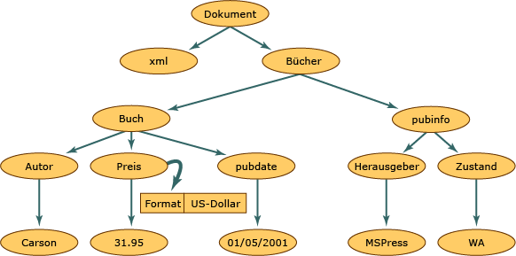

# <a name="xml-document-object-model-dom"></a>XML-Dokumentobjektmodell (DOM)

Die XML-DOM-Klasse ist eine Darstellung eines XML-Dokuments im Speicher. Mit dem DOM können Sie ein XML-Dokument programmgesteuert lesen und ändern. Die **XmlReader**-Klasse liest auch XML. Sie bietet jedoch nur nicht zwischengespeicherten, schreibgeschützten Forward-Only-Zugriff. Das bedeutet, dass keine Funktionen zum Bearbeiten der Werte eines Attributs oder des Inhalts eines Elements existieren, oder dass Knoten nicht mit der **XmlReader**-Klasse eingefügt oder entfernt werden können. Der DOM erfüllt in erster Linie Bearbeitungsfunktionen. Es ist die herkömmliche strukturierte Methode, XML-Daten im Speicher darzustellen, obwohl die tatsächlichen XML-Daten linear gespeichert werden, wenn sie sich in einer Datei befinden oder aus einem anderen Objekt in eine Datei eingefügt werden. Im Folgenden werden XML-Daten dargestellt.

## <a name="input"></a>Eingabe

```xml
<?xml version="1.0"?>
  <books>
    <book>
        <author>Carson</author>
        <price format="dollar">31.95</price>
        <pubdate>05/01/2001</pubdate>
    </book>
    <pubinfo>
        <publisher>MSPress</publisher>
        <state>WA</state>
    </pubinfo>
  </books>
```

In der folgenden Abbildung wird dargestellt, wie ein Speicher strukturiert ist, wenn diese XML-Daten in die DOM-Struktur eingelesen werden.

 Struktur von XML-Dokumenten

Innerhalb der Struktur eines XML-Dokuments stellt jeder Kreis in dieser Abbildung einen Knoten dar, der als **XmlNode**-Objekt bezeichnet wird. Das **XmlNode**-Objekt ist das Basisobjekt in der DOM-Struktur. Die **XmlDocument**-Klasse, die das **XmlNode**-Objekt erweitert, unterstützt Methoden zum Ausführen von Vorgängen für das gesamte Dokument (z.B. Laden des Dokuments in den Speicher oder Speichern von XML-Daten in eine Datei). Außerdem bietet die **XmlDocument**-Klasse eine Möglichkeit zum Anzeigen und Ändern der Knoten im gesamten XML-Dokument. Sowohl das **XmlNode**-Objekt als auch die **XmlDocument**-Klasse sind hinsichtlich der Leistung und Benutzerfreundlichkeit verbessert worden. Sie bieten zudem Methoden und Eigenschaften für folgende Zwecke:

- Zugreifen auf DOM-spezifische Knoten, z. B. Elementknoten, Entitätsverweisknoten usw.

- Abfragen ganzer Knoten zusätzlich zu den im Knoten enthaltenen Informationen, z. B. dem Text in einem Elementknoten.

  > [!NOTE]
  > Wenn eine Anwendung die vom DOM bereitgestellte Struktur oder die Bearbeitungsfunktionen nicht erfordert, bieten die **XmlReader**-Klasse und die **XmlWriter**-Klasse nicht zwischengespeicherten Forward-Only-Datenstromzugriff auf XML. Weitere Informationen finden Sie unter <xref:System.Xml.XmlReader> und <xref:System.Xml.XmlWriter>.

**Node**-Objekte verfügen über Methoden und Eigenschaften sowie grundlegende, genau definierte Merkmale. Einige dieser Merkmale sind z. B.:

- Knoten haben einen einzigen direkt übergeordneten Knoten, d. h., der direkt übergeordnete Knoten stellt einen Knoten dar, der sich genau eine Ebene höher befindet. Der einzige Knoten, der keinen direkt übergeordneten Knoten besitzt, ist der Dokumentstamm. Dieser Knoten befindet sich auf der obersten Ebene und enthält das Dokument selbst sowie die Fragmente des Dokuments.

- Viele Knoten verfügen über mehrere direkt untergeordnete Knoten. Dies sind Knoten, die sich genau eine Ebene darunter befinden. In der folgenden Liste sind Knotentypen aufgeführt, die über untergeordnete Knoten verfügen können.

  - **Document**

  - **DocumentFragment**

  - **EntityReference**

  - **Element**

  - **Attribut**

  Für die Knoten **XmlDeclaration**, **Notation**, **Entity**, **CDATASection**, **Text**, **Comment**, **ProcessingInstruction** und **DocumentType** existieren keine untergeordneten Knoten.

- Knoten, die sich auf derselben Ebene befinden und im Diagramm durch den **book**-Knoten und den **pubinfo**-Knoten dargestellt werden, sind gleichgeordnete Knoten.

Ein Merkmal des DOM besteht in der Art, wie es Attribute behandelt. Attribute sind keine Knoten, die übergeordneten, untergeordneten oder nebengeordneten Beziehungen angehören. Attribute werden als Eigenschaft des Elementknotens betrachtet. Sie werden aus einem Name-Wert-Paar gebildet. Wenn Sie beispielsweise über XML-Daten verfügen, die aus `format="dollar`" und dem Element `price` bestehen, stellt das Wort `format` den Namen dar und `format` ist der Wert des Attributs `dollar`. Um das Attribut `format="dollar"` des Knotens **price** abzufragen, müssen Sie die **GetAttribute**-Methode aufrufen, wenn sich der Cursor auf dem Elementknoten `price` befindet. Weitere Informationen hierzu erhalten Sie unter [Zugreifen auf Attribute im DOM](accessing-attributes-in-the-dom.md).

Wenn XML in den Speicher eingelesen wird, werden Knoten erstellt. Jedoch entsprechen nicht alle Knoten dem gleichen Typ. Ein Element in XML verfügt über andere Regeln und eine anderen Syntax als eine Anweisung zur Verarbeitung. Deshalb wird beim Lesen der verschiedenen Daten jedem Knoten ein Knotentyp zugewiesen. Dieser Knotentyp bestimmt die Merkmale und Funktionalitäten des Knotens.

Weitere Informationen zu den im Speicher generierten Knotentypen finden Sie unter [XML-Knotentypen](types-of-xml-nodes.md). Weitere Informationen zu den in der Knotenstruktur erstellten Objekten finden Sie unter [Zuordnen der Objekthierarchie zu XML-Daten](mapping-the-object-hierarchy-to-xml-data.md).

Microsoft hat die APIs erweitert, die in Level 1 und Level 2 des DOM des World Wide Web Consortium (W3C) verfügbar sind, um die Arbeit mit XML-Domkumenten zu vereinfachen. Die zusätzlichen Klassen, Methoden und Eigenschaften unterstützen nicht nur die W3C-Standards vollständig, sondern erweitern die Funktionen über die Möglichkeiten des XML-DOM des W3C hinaus. Mit neuen Klassen können Sie auf relationale Daten zugreifen und somit Methoden für die Synchronisierung mit ADO.NET-Daten nutzen, wobei Daten simultan als XML verfügbar gemacht werden. Weitere Informationen hierzu finden Sie unter [Synchronisieren eines „DataSet“ mit einem „XmlDataDocument“](../../../framework/data/adonet/dataset-datatable-dataview/dataset-and-xmldatadocument-synchronization.md).

Das DOM ist zum Einlesen von XML-Daten in den Speicher besonders nützlich, um deren Struktur zu ändern, Knoten hinzuzufügen oder zu entfernen oder die in einem Knoten gespeicherten Daten zu bearbeiten, z. B. den Text in einem Element. Allerdings stehen auch andere Klassen zur Verfügung, die in anderen Szenarios schneller als das DOM sind. Verwenden Sie für einen schnellen, nicht zwischengespeicherten Forward-Only-Datenstromzugriff auf XML die **XmlReader**-Klasse und die **XmlWriter**-Klasse. Verwenden Sie für einen wahlfreien Zugriff mit einem Cursormodell und **XPath** die **XPathNavigator**-Klasse.

## <a name="see-also"></a>Siehe auch

- [XML-Knotentypen](types-of-xml-nodes.md)
- [Zuordnen der Objekthierarchie zu XML-Daten](mapping-the-object-hierarchy-to-xml-data.md)
