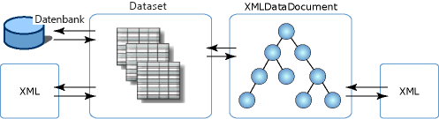

# XML-Integration mit relationalen Daten und ADO.NET
Die **XmlDataDocument** Klasse ist eine abgeleitete Klasse von der **XmlDocument**, und XML-Daten enthält. Der Vorteil der **XmlDataDocument** besteht darin, dass es eine Brücke zwischen relationalen und hierarchischen Daten. Es ist ein **XmlDocument** , die gebunden werden kann, um eine **DataSet** und beide Klassen können Änderungen an Daten in beiden Klassen synchronisiert. Ein **XmlDocument** , gebunden ist, um eine **DataSet** ermöglicht XML zur Integration mit relationalen Daten, und Sie müssen nicht über Ihre Daten als XML oder in einem relationalen Format dargestellt zu verfügen. Sie können beide Möglichkeiten nutzen und sind somit nicht auf eine einzige Darstellung der Daten festgelegt.  
  
 Wenn die Daten in zwei Ansichten zur Verfügung stehen, ergeben sich folgende Vorteile:  
  
-   Der strukturierte Teil eines XML-Dokuments kann einem Dataset zugeordnet und effizient gespeichert, indiziert und durchsucht werden.  
  
-   Transformationen, Validierungen und die Navigationen können mit einem Cursormodell in den relational gespeicherten XML-Daten effizient ausgeführt werden. In einigen Fällen kann ausgeführt werden effizienter mit relationalen Strukturen als wenn der XML-Code im gespeichert ein **XmlDocument** Modell.  
  
-   Die **DataSet** können einen Teil der XML-Code speichern. Das heißt, Sie verwenden können **XPath** oder **"XslTransform"** Speichern einer **DataSet** nur die Elemente und Attribute von Interesse sind. Von dort können werden Änderungen an der kleineren gefilterten Teilmenge der Daten, mit der Änderungen, die in den umfangreicheren Daten in der **XmlDataDocument**.  
  
 Sie können auch eine Transformation ausführen, über die Daten, die geladen wurde die **DataSet** von SQL Server. Eine weitere Möglichkeit besteht, zum Binden von .NET Framework-Klassen-Stil verwaltete WinForm- und WebForm-Steuerelementen an eine **DataSet** , die aus einem XML-Eingabestream aufgefüllt wurde.  
  
 Zusätzlich zur Unterstützung von **"XslTransform"**, wird ein **XmlDataDocument** macht relationale Daten für **XPath** -Abfragen und Validierungen.  Grundsätzlich sind alle XML-Dienste für relationale Daten verfügbar, und relationale Funktionen wie Steuerelementbindung, CODEGEN usw. sind für eine strukturierte Projektion von XML verfügbar, ohne die XML-Integrität zu beeinträchtigen.  
  
 Da **XmlDataDocument** geerbt wird, von einem **XmlDocument**, enthält es eine Implementierung des W3C-DOM Die Tatsache, die die **XmlDataDocument** zugeordnet ist, und speichert eine Teilmenge seiner Daten darin, eine **DataSet** nicht einschränken, oder ändern Sie die Verwendung als eine **XmlDocument** in keiner Weise. Nutzen geschriebenen Code eine **XmlDocument** funktioniert unverändert mit einer **XmlDataDocument**. Die **DataSet** bietet eine relationale Ansicht derselben Daten durch die Definition von Tabellen, Spalten, Beziehungen und Einschränkungen, und ist ein eigenständige Benutzer in-Memory-Datenspeicher.  
  
 Die folgende Abbildung zeigt den verschiedenen Zuordnungen, dass XML-Daten mit den **DataSet** und **XmlDataDocument**.  
  
   
  
 Die Abbildung zeigt, dass die XML-Daten direkt geladen werden können ein **DataSet**, ermöglicht die direkte Bearbeitung mit XML, in relationaler Weise bearbeitet. Der XML-Code kann in einer abgeleiteten Klasse des DOM, also geladen werden die **XmlDataDocument**, anschließend geladen und synchronisiert mit der **DataSet**. Da die **DataSet** und **XmlDataDocument** werden anhand einer einzigen synchronisiert Daten, Änderungen an den Daten eines Speichers im anderen Speicher widergespiegelt werden.  
  
 Die **XmlDataDocument** erbt alle bearbeiten und navigieren Funktionen aus der **XmlDocument**. Es gibt Situationen, bei Verwendung der **XmlDataDocument** und dessen geerbten Funktionen, die Synchronisierung mit einer **DataSet**, wird eine besser geeignete Option als das Laden von XML-Daten direkt in die **DataSet**. Die folgende Tabelle zeigt die Elemente, die berücksichtigt werden, wenn Sie die Methode zum Laden auswählen der **DataSet**.  
  
|Direktes Laden von XML in ein DataSet|Synchronisieren von „XmlDataDocument“ mit einem „DataSet“|  
|----------------------------------------------|-----------------------------------------------------------|  
|Abfragen von Daten in der **DataSet** können mit SQL einfacher als mit XPath.|XPath-Abfragen sind erforderlich, über die Daten in der **DataSet**.|  
|Das Beibehalten der Elementreihenfolge in der Quell-XML ist nicht funktionsentscheidend.|Das Beibehalten der Elementreihenfolge in der Quell-XML ist funktionsentscheidend.|  
|Leerraum zwischen Elementen und Formatierung muss in der Quell-XML nicht beibehalten werden.|Die Beibehaltung von Leerraum und Formatierung in der Quell-XML ist funktionsentscheidend.|  
  
 Wenn das Laden und Schreiben von XML direkt in und aus einem **DataSet** Ihren Anforderungen, finden Sie unter [beim Laden eines Datasets aus XML](../../../../docs/framework/data/adonet/dataset-datatable-dataview/loading-a-dataset-from-xml.md) und [Schreiben eines Datasets als XML-Daten](../../../../docs/framework/data/adonet/dataset-datatable-dataview/writing-dataset-contents-as-xml-data.md).  
  
 Wenn das Laden der **DataSet** aus einer **XmlDataDocument** Ihren Anforderungen, finden Sie unter [Synchronisieren einer Datasets ein XML-Dokument](../../../../docs/framework/data/adonet/dataset-datatable-dataview/dataset-and-xmldatadocument-synchronization.md).  
  
## Siehe auch  
 [Using XML in a DataSet (Verwenden von XML in einem DataSet)](../../../../docs/framework/data/adonet/dataset-datatable-dataview/using-xml-in-a-dataset.md)
