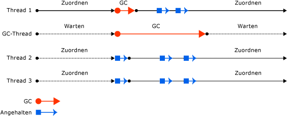

# Garbage Collection im Hintergrund

Bei der Garbage Collection (GC) im Hintergrund werden kurzlebige Generationen (0 und 1) bei Bedarf bereinigt, während die Garbage Collection von Generation 2 ausgeführt wird. Die Garbage Collection wird für einen oder mehrere dedizierte Threads ausgeführt – je nachdem ob sie im Hintergrund oder für Server ausgeführt wird – und gilt nur für Generation 2.

Die Garbage Collection im Hintergrund ist standardmäßig aktiviert. Sie kann mit der Konfigurationseinstellung [gcConcurrent](../../framework/configure-apps/file-schema/runtime/gcconcurrent-element.md) in .NET Framework-Apps oder der Einstellung [System.GC.Concurrent](../../core/run-time-config/garbage-collector.md#background-gc) in .NET Core- oder .NET 5-Apps (oder höher) aktiviert oder deaktiviert werden.

> [!NOTE]
> Ab .NET Framework 4 ersetzt die Garbage Collection im Hintergrund die [gleichzeitige Garbage Collection](#concurrent-garbage-collection). In .NET Framework 4 wird sie nur für die Garbage Collection für *Arbeitsstationen* unterstützt. Ab .NET Framework 4.5 ist die Garbage Collection im Hintergrund für *Arbeitsstationen* und *Server* verfügbar.

Eine Garbage Collection für kurzlebige Generationen, die während der Garbage Collection im Hintergrund stattfindet, wird als *Garbage Collection im Vordergrund* bezeichnet. Wenn Garbage Collections im Vordergrund stattfinden, werden alle verwalteten Threads angehalten.

Wenn eine Garbage Collection im Hintergrund ausgeführt wird und Sie genügend Objekte in Generation 0 zugeordnet haben, führt die CLR eine Garbage Collection der Generation 0 oder der Generation 1 im Vordergrund aus. Der dedizierte Thread der Garbage Collection im Hintergrund prüft häufig, ob eine Anforderung für die Garbage Collection im Vordergrund besteht. Trifft dies zu, wird die Garbage Collection im Hintergrund angehalten, damit die Garbage Collection im Vordergrund stattfinden kann. Nachdem die Garbage Collection im Vordergrund abgeschlossen wurde, werden dedizierte Threads der Garbage Collection im Hintergrund und die Benutzerthreads fortgesetzt.

Die Garbage Collection im Hintergrund beseitigt die von der gleichzeitigen Garbage Collection auferlegten Speicherbelegungseinschränkungen, da kurzlebige Garbage Collections während der Garbage Collection im Hintergrund stattfinden können. Mit der Garbage Collection im Hintergrund können inaktive Objekte in kurzlebigen Generationen entfernt werden. Ferner kann der Heap bei Bedarf während einer Garbage Collection der Generation 1 erweitert werden.

## Garbage Collection im Hintergrund für Arbeitsstationen und Server im Vergleich

Ab .NET Framework 4.5 ist die Garbage Collection im Hintergrund für Server verfügbar. Die Garbage Collection im Hintergrund ist der Standardmodus für die Garbage Collection auf Servern.

Die Garbage Collection im Hintergrund auf dem Server ähnelt der Garbage Collection im Hintergrund auf einer Arbeitsstation, es gibt jedoch einige Unterschiede:

- Die Garbage Collection im Hintergrund auf der Arbeitsstation verwendet einen dedizierten Thread für die Garbage Collection im Hintergrund, während die Garbage Collection im Hintergrund auf dem Server mehrere Threads verwendet. In der Regel wird ein dedizierter Thread für jeden logischen Prozessor verwendet.

- Anders als der Garbage-Collection-Thread im Hintergrund auf einer Arbeitsstation tritt bei diesen Threads auf Servern kein Timeout auf.

Die folgende Abbildung veranschaulicht eine Garbage Collection im Hintergrund für einen separaten dedizierten Thread auf einer *Arbeitsstation*:

Die folgende Abbildung veranschaulicht eine Garbage Collection im Hintergrund für einen separaten dedizierten Thread auf einem *Server*:

## Concurrent garbage collection

> [!TIP]
> Dieser Abschnitt gilt für:
>
> - .NET Framework 3.5 und früher für die Garbage Collection für Arbeitsstationen
> - .NET Framework 4 und früher für die Garbage Collection auf dem Server
>
> Die gleichzeitige Garbage Collection wird in späteren Versionen durch die Garbage Collection im Hintergrund ersetzt.

Bei der Garbage Collection für Arbeitsstationen oder Server können Sie die [gleichzeitige Garbage Collection aktivieren](../../framework/configure-apps/file-schema/runtime/gcconcurrent-element.md). Diese ermöglicht die gleichzeitige Ausführung von Threads mit einem dedizierten Thread, der die Garbage Collection nahezu die ganze Zeit ausführt. Diese Option wirkt sich nur auf die Garbage Collection in Generation 2 aus. In Generation 0 und 1 findet keine gleichzeitigen Garbage Collection statt, da diese schnell beendet wird.

Dank der gleichzeitigen Garbage Collection ist die Reaktionsfähigkeit interaktiver Anwendungen besser, da die für die Garbage Collection notwendigen Pausen minimiert werden. Verwaltete Threads können weiterhin die meiste Zeit ausgeführt werden, während der Thread der gleichzeitigen Garbage Collection ausgeführt wird. Dies verkürzt die Pausen während einer Garbage Collection.

Die gleichzeitige Garbage Collection wird auf einem dedizierten Thread ausgeführt. Standardmäßig führt die CLR die Garbage Collection für die Arbeitsstation mit aktivierter gleichzeitiger Garbage Collection auf Computern mit einem oder mehreren Prozessoren aus.

Die folgende Abbildung zeigt eine parallele Garbage Collection für einen separaten dedizierten Thread.

## Siehe auch

- [Garbage Collection für die Arbeitsstation und Garbage Collection auf dem Server](workstation-server-gc.md)
- [Runtimekonfigurationsoptionen für die Garbage Collection](../../core/run-time-config/garbage-collector.md)
