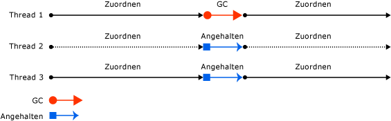

# Grundlagen der Garbage CollectionFundamentals of garbage collection

In der Common Language Runtime (CLR) dient der Garbage Collector (GC) als automatischer Speicher-Manager.In the common language runtime (CLR), the garbage collector (GC) serves as an automatic memory manager. Der Garbage Collector verwaltet die Belegung und Freigabe von Arbeitsspeicher für eine Anwendung.The garbage collector manages the allocation and release of memory for an application. Das bedeutet, dass beim Entwickeln mit verwaltetem Code kein Code für Aufgaben hinsichtlich der Speicherverwaltung geschrieben werden muss.For developers working with managed code, this means that you don't have to write code to perform memory management tasks. Mithilfe der automatischen Speicherverwaltung können häufig auftretende Probleme beseitigt werden, z. B. wenn ein Objekt versehentlich nicht freigegeben wurde und dadurch Arbeitsspeicherverluste entstehen oder wenn auf den Speicher für ein Objekt zugegriffen wird, das bereits freigegeben wurde.Automatic memory management can eliminate common problems, such as forgetting to free an object and causing a memory leak or attempting to access memory for an object that's already been freed.

In diesem Artikel werden die wichtigsten Konzepte der Garbage Collection beschrieben.This article describes the core concepts of garbage collection.

## VorteileBenefits

Der Garbage Collector bietet die folgenden Vorteile:The garbage collector provides the following benefits:

- Entwickler müssen nicht mehr manuell Arbeitsspeicher freigeben.Frees developers from having to manually release memory.

- Ordnet dem verwalteten Heap effizient Objekte zu.Allocates objects on the managed heap efficiently.

- Gibt Objekte frei, die nicht mehr verwendet werden, löscht den Speicher und hält Speicher für zukünftige Belegungen bereit.Reclaims objects that are no longer being used, clears their memory, and keeps the memory available for future allocations. Verwaltete Objekte beginnen automatisch mit einem bereinigten Inhalt, damit ihre Konstruktoren nicht jedes Datenfeld initialisieren müssen.Managed objects automatically get clean content to start with, so their constructors don't have to initialize every data field.

- Bietet Speichersicherheit, indem sichergestellt wird, dass ein Objekt den Inhalt eines anderen Objekts nicht verwenden kann.Provides memory safety by making sure that an object cannot use the content of another object.

## Grundlagen des ArbeitsspeichersFundamentals of memory

Die folgende Liste liefert eine Zusammenfassung wichtiger Arbeitsspeicherkonzepte der CLR.The following list summarizes important CLR memory concepts.

- Jeder Prozess verfügt über einen eigenen separaten virtuellen Adressraum.Each process has its own, separate virtual address space. Alle Prozesse auf demselben Computer verwenden den gleichen physischen Speicher und die gleiche Auslagerungsdatei, sofern vorhanden.All processes on the same computer share the same physical memory and the page file, if there is one.

- In der Standardeinstellung verfügt jeder Prozess auf 32-Bit-Computern über einen virtuellen Adressraum von 2 GB im Benutzermodus.By default, on 32-bit computers, each process has a 2-GB user-mode virtual address space.

- Als Anwendungsentwickler arbeiten Sie immer mit einem virtuellem Adressraum und manipulieren niemals direkt den physischen Speicher.As an application developer, you work only with virtual address space and never manipulate physical memory directly. Der Garbage Collector belegt und gibt virtuellen Arbeitsspeicher auf dem verwalteten Heap frei.The garbage collector allocates and frees virtual memory for you on the managed heap.

  Wenn Sie nativen Code schreiben, verwenden Sie die Windows-Funktionen für das Arbeiten mit dem virtuellen Adressraum.If you're writing native code, you use Windows functions to work with the virtual address space. Diese Funktionen belegen und geben für Sie virtuellen Arbeitsspeicher auf systemeigenen Heaps frei.These functions allocate and free virtual memory for you on native heaps.

- Virtueller Arbeitsspeicher kann sich in einem von drei Zuständen befinden:Virtual memory can be in three states:

  | ZustandState | BeschreibungDescription |
  |---------|---------|
  | KostenlosFree | Es sind keine Verweise auf den Speicherblock vorhanden, und der Speicherblock ist für eine Speicherbelegung verfügbar.The block of memory has no references to it and is available for allocation. |
  | ReserviertReserved | Der Speicherblock ist für die Verwendung verfügbar und kann nicht durch andere Anforderungen belegt werden.The block of memory is available for your use and cannot be used for any other allocation request. Sie können jedoch keine Daten in diesem Speicherblock speichern, bis eine Zusicherung erfolgt ist.However, you cannot store data to this memory block until it is committed. |
  | CommittetCommitted | Der Speicherblock ist einem physischen Speicher zugewiesen.The block of memory is assigned to physical storage. |

- Im virtuellen Adressraum können Fragmentierungen auftreten.Virtual address space can get fragmented. Das bedeutet, dass freie Blöcke (Lücken) im Adressraum vorhanden sind.This means that there are free blocks, also known as holes, in the address space. Wenn eine virtuelle Speicherbelegung angefordert wird, muss der Manager für virtuellen Arbeitsspeicher einen einzelnen freien Block finden, der groß genug ist, um die Belegungsanforderung zu erfüllen.When a virtual memory allocation is requested, the virtual memory manager has to find a single free block that is large enough to satisfy that allocation request. Selbst wenn 2 GB freier Speicherplatz verfügbar sind, schlägt eine Speicherbelegung, die 2 GB angefordert hat, fehl, wenn der freie Speicherplatz nicht in einem einzelnen Adressblock verfügbar ist.Even if you have 2 GB of free space, an allocation that requires 2 GB will be unsuccessful unless all of that free space is in a single address block.

- Es kann vorkommen, dass nicht mehr genügend Arbeitsspeicher zur Verfügung steht, weil der für Belegungen verfügbare virtuelle Adressraum oder der für Zusicherungen verfügbare physische Speicher nicht mehr ausreicht.You can run out of memory if there isn't enough virtual address space to reserve or physical space to commit.

  Die Auslagerungsdatei wird auch dann verwendet, wenn der tatsächliche physische Speicherbedarf insgesamt eher niedrig ist.The page file is used even if physical memory pressure (that is, demand for physical memory) is low. Wenn das erste Mal eine hohe physische Speicherauslastung auftritt, muss das Betriebssystem im physischen Speicher freien Platz für die Datenspeicherung schaffen. Zu diesem Zweck werden einige Daten aus dem physischen Speicher in die Auslagerungsdatei verschoben.The first time that physical memory pressure is high, the operating system must make room in physical memory to store data, and it backs up some of the data that is in physical memory to the page file. Für diese Daten erfolgt solange keine neue Speicherzuordnung, bis sie tatsächlich benötigt werden. Daher können Situationen entstehen, in denen auch bei einer geringen physischen Speicherauslastung Daten in der Auslagerungsdatei abgelegt sind.That data is not paged until it's needed, so it's possible to encounter paging in situations where the physical memory pressure is low.
  
### ArbeitsspeicherbelegungMemory allocation

Wenn Sie einen neuen Prozess initialisieren, wird diesem durch die Common Language Runtime ein zusammenhängender Adressraum reserviert.When you initialize a new process, the runtime reserves a contiguous region of address space for the process. Dieser reservierte Adressraum wird als verwalteter Heap bezeichnet.This reserved address space is called the managed heap. Im verwalteten Heap steht ein Zeiger zur Verfügung, der auf die Adresse des nächsten im Heap zu speichernden Objekts zeigt.The managed heap maintains a pointer to the address where the next object in the heap will be allocated. Anfangs ist dieser Zeiger auf die Basisadresse des verwalteten Heaps eingestellt.Initially, this pointer is set to the managed heap's base address. Alle Referenztypen werden im verwalteten Heap zugewiesen.All reference types are allocated on the managed heap. Wurde von einer Anwendung der erste Referenztyp erstellt, wird für diesen Typ an der Basisadresse des verwalteten Heaps Speicherplatz belegt.When an application creates the first reference type, memory is allocated for the type at the base address of the managed heap. Wenn das nächste Objekt von der Anwendung erstellt wird, belegt der Garbage Collector Speicherplatz im Adressraum direkt hinter dem ersten Objekt.When the application creates the next object, the garbage collector allocates memory for it in the address space immediately following the first object. Solange ein Adressbereich verfügbar ist, fährt der Garbage Collector auf diese Weise mit der Belegung von Arbeitsspeicher für neue Objekte fort.As long as address space is available, the garbage collector continues to allocate space for new objects in this manner.

Das Belegen von Speicher im verwalteten Heap beansprucht weniger Zeit als die nicht verwaltete Speicherbelegung.Allocating memory from the managed heap is faster than unmanaged memory allocation. Da durch die Common Language Runtime Speicher für ein Objekt durch Hinzufügen eines Werts zu einem Zeiger belegt wird, ist diese Methode fast so schnell wie das Reservieren von Speicher im Stapel.Because the runtime allocates memory for an object by adding a value to a pointer, it's almost as fast as allocating memory from the stack. Außerdem werden neue Objekte, für die Speicher reserviert wird, ständig nacheinander im verwalteten Heap gespeichert. Dadurch kann eine Anwendung schnell auf diese Objekte zugreifen.In addition, because new objects that are allocated consecutively are stored contiguously in the managed heap, an application can access the objects quickly.

### SpeicherfreigabeMemory release

Durch die Optimierungs-Engine des Garbage Collectors wird der beste Zeitpunkt für das Ausführen einer Garbage Collection bestimmt, die auf den erfolgten Speicherbelegungen basiert.The garbage collector's optimizing engine determines the best time to perform a collection based on the allocations being made. Beim Ausführen einer Garbage Collection wird Speicher freigegeben, den von der Anwendung nicht mehr benötigte Objekte beanspruchen.When the garbage collector performs a collection, it releases the memory for objects that are no longer being used by the application. Durch Überprüfen der *Stammelemente* der Anwendung wird ermittelt, welche Objekte nicht mehr verwendet werden.It determines which objects are no longer being used by examining the application's *roots*. Die Stammelemente einer Anwendung beinhalten statische Felder, lokale Variablen und Parameter im Stapel des Threads sowie CPU-Register.An application's roots include static fields, local variables and parameters on a thread's stack, and CPU registers. Jedes Stammelement bezieht sich entweder auf ein Objekt im verwalteten Heap oder ist auf NULL festgelegt.Each root either refers to an object on the managed heap or is set to null. Der Garbage Collector hat Zugriff auf eine Liste der aktiven Stammelemente, die vom JIT-Compiler (Just-In-Time) und der Common Language Runtime verwaltet wird.The garbage collector has access to the list of active roots that the just-in-time (JIT) compiler and the runtime maintain. Mithilfe dieser Liste erstellt der Garbage Collector ein Diagramm mit allen Objekten, die von den Stammelementen aus erreichbar sind.Using this list, the garbage collector creates a graph that contains all the objects that are reachable from the roots.

Objekte, die nicht in diesem Diagramm aufgeführt werden, können von den Stammelementen aus nicht erreicht werden.Objects that are not in the graph are unreachable from the application's roots. Diese nicht erreichbaren Objekte werden vom Garbage Collector als Abfall betrachtet, und der von diesen Objekten belegte Speicherplatz wird wieder freigegeben.The garbage collector considers unreachable objects garbage and releases the memory allocated for them. Während einer Garbage Collection wird der verwaltete Heap nach den Blöcken des Adressraums durchsucht, in denen sich nicht erreichbare Objekte befinden.During a collection, the garbage collector examines the managed heap, looking for the blocks of address space occupied by unreachable objects. Beim Auffinden dieser Objekte werden die erreichbaren Objekte mithilfe einer Speicherkopierfunktion im Speicher komprimiert, und die von den nicht erreichbaren Objekten belegten Blöcke des Adressraums werden freigegeben.As it discovers each unreachable object, it uses a memory-copying function to compact the reachable objects in memory, freeing up the blocks of address spaces allocated to unreachable objects. Nach dem Komprimieren des Speichers für die erreichbaren Objekte werden vom Garbage Collector die erforderlichen Korrekturen am Zeiger vorgenommen, sodass die Stammelemente der Anwendung auf die neuen Speicherorte der Objekte verweisen.Once the memory for the reachable objects has been compacted, the garbage collector makes the necessary pointer corrections so that the application's roots point to the objects in their new locations. Außerdem wird der Zeiger des verwalteten Heaps auf die Position hinter dem letzten erreichbaren Objekt gesetzt.It also positions the managed heap's pointer after the last reachable object.

Der Speicher wird nur dann komprimiert, wenn in der Garbage Collection eine signifikante Anzahl nicht erreichbarer Objekte gefunden wird.Memory is compacted only if a collection discovers a significant number of unreachable objects. Wenn nach einer Garbage Collection alle Objekte in einem verwalteten Heap verbleiben, bedarf es auch keiner Speicherkomprimierung.If all the objects in the managed heap survive a collection, then there is no need for memory compaction.

Um die Leistung zu verbessern, wird für große Objekte durch die Common Language Runtime Speicherplatz in einem separaten Heap belegt.To improve performance, the runtime allocates memory for large objects in a separate heap. Der Speicherplatz für große Objekte wird durch den Garbage Collector automatisch freigegeben.The garbage collector automatically releases the memory for large objects. Dieser Speicher wird jedoch nicht komprimiert, um das Verschieben großer Objekte im Speicher zu vermeiden.However, to avoid moving large objects in memory, this memory is usually not compacted.

## Bedingungen für eine Garbage CollectionConditions for a garbage collection

Eine Garbage Collection wird durchgeführt, wenn eine der folgenden Bedingungen zutrifft:Garbage collection occurs when one of the following conditions is true:

- Das System verfügt über einen kleinen physikalischen Speicher.The system has low physical memory. Dies wird entweder durch die Meldung des Betriebssystems über zu wenig Arbeitsspeicher oder durch die Meldung des Hosts über zu wenig Arbeitsspeicher erkannt.This is detected by either the low memory notification from the OS or low memory as indicated by the host.

- Der Speicher, der von den zugeordneten Objekten auf dem verwalteten Heap belegt ist, übersteigt einen akzeptablen Schwellenwert.The memory that's used by allocated objects on the managed heap surpasses an acceptable threshold. Dieser Schwellenwert wird während der Prozessausführung kontinuierlich angepasst.This threshold is continuously adjusted as the process runs.

- Die <xref:System.GC.Collect%2A?displayProperty=nameWithType> -Methode wird aufgerufen.The <xref:System.GC.Collect%2A?displayProperty=nameWithType> method is called. In fast allen Fällen müssen Sie diese Methode nicht aufrufen, da der Garbage Collector kontinuierlich ausgeführt wird.In almost all cases, you don't have to call this method, because the garbage collector runs continuously. Diese Methode wird hauptsächlich für eindeutige Situationen und für Tests verwendet.This method is primarily used for unique situations and testing.

## Der verwaltete HeapThe managed heap

Nachdem der Garbage Collector von der CLR initialisiert wurde, belegt er ein Arbeitsspeichersegment für die Speicherung und Verwaltung von Objekten.After the garbage collector is initialized by the CLR, it allocates a segment of memory to store and manage objects. Dieser Speicher wird als verwalteter Heap bezeichnet, im Gegensatz zu einem systemeigenen Heap im Betriebssystem.This memory is called the managed heap, as opposed to a native heap in the operating system.

Es gibt einen verwalteten Heap für jeden verwalteten Prozess.There is a managed heap for each managed process. Alle Threads im Prozess ordnen Speicher zu, für Objekte auf dem gleichen Heap.All threads in the process allocate memory for objects on the same heap.

Zum Reservieren von Speicher ruft der Garbage Collector die [VirtualAlloc](/windows/desktop/api/memoryapi/nf-memoryapi-virtualalloc)-Windows-Funktion auf und reserviert jeweils ein Segment des Speichers für verwaltete Anwendungen.To reserve memory, the garbage collector calls the Windows [VirtualAlloc](/windows/desktop/api/memoryapi/nf-memoryapi-virtualalloc) function and reserves one segment of memory at a time for managed applications. Zudem reserviert der Garbage Collector nach Bedarf weitere Segmente und gibt Segmente wieder für das Betriebssystem frei (nachdem alle Objekte aus diesen entfernt wurden), indem er die [VirtualFree](/windows/desktop/api/memoryapi/nf-memoryapi-virtualfree)-Windows-Funktion aufruft.The garbage collector also reserves segments, as needed, and releases segments back to the operating system (after clearing them of any objects) by calling the Windows [VirtualFree](/windows/desktop/api/memoryapi/nf-memoryapi-virtualfree) function.

> [!IMPORTANT]
> Die Größe der Segmente, die vom Garbage Collector zugeordnet werden, ist implementierungsspezifisch und kann jederzeit, auch in regelmäßigen Updates, geändert werden.The size of segments allocated by the garbage collector is implementation-specific and is subject to change at any time, including in periodic updates. Für eine Anwendung darf weder eine bestimmte Segmentgröße vorausgesetzt werden, noch darf sie von einer bestimmten Segmentgröße abhängen noch darf in ihr versucht werden, die Menge des für Segmentbelegungen verfügbaren Speichers zu konfigurieren.Your app should never make assumptions about or depend on a particular segment size, nor should it attempt to configure the amount of memory available for segment allocations.

Je weniger Objekte dem Heap zugeordnet sind, desto geringer ist der Arbeitsaufwand für den Garbage Collector.The fewer objects allocated on the heap, the less work the garbage collector has to do. Verwenden Sie beim Zuordnen von Objekten keine aufgerundeten Werte, die größer sind als die tatsächlichen Anforderungen. Belegen Sie z. B. kein Array von 32 Byte, wenn Sie nur 15 Byte benötigen.When you allocate objects, don't use rounded-up values that exceed your needs, such as allocating an array of 32 bytes when you need only 15 bytes.

Wenn eine Garbage Collection ausgelöst wird, gibt der Garbage Collector den Speicher frei, der von inaktiven Objekten belegt wird.When a garbage collection is triggered, the garbage collector reclaims the memory that's occupied by dead objects. Bei der Freigabe von Speicher werden aktive Objekte komprimiert, damit sie zusammen verschoben werden, und der inaktive Speicherplatz wird entfernt, sodass der Heap kleiner wird.The reclaiming process compacts live objects so that they are moved together, and the dead space is removed, thereby making the heap smaller. Dadurch wird sichergestellt, dass gemeinsam zugeordnete Objekte auf dem verwalteten Heap zusammenbleiben, um ihren Speicherort beizubehalten.This ensures that objects that are allocated together stay together on the managed heap to preserve their locality.

Die Intrusivität (Häufigkeit und Dauer) von Garbage Collections wird bestimmt durch den Umfang der Speicherbelegungen und der Größe des beibehaltenen Speichers auf dem verwalteten Heap.The intrusiveness (frequency and duration) of garbage collections is the result of the volume of allocations and the amount of survived memory on the managed heap.

Der Heap kann als Ansammlung von zwei Heaps betrachtet werden: der [große Objektheap](large-object-heap.md) und der kleine Objektheap.The heap can be considered as the accumulation of two heaps: the [large object heap](large-object-heap.md) and the small object heap. Der große Objektheap enthält Objekte, die mindestens 85.000 Bytes oder mehr umfassen und bei denen es sich in der Regel um Arrays handelt.The large object heap contains objects that are 85,000 bytes and larger, which are usually arrays. Ein Instanzobjekt ist meistens nicht sehr groß.It's rare for an instance object to be extremely large.

> [!TIP]
> Sie können [den Schwellenwert](../../core/run-time-config/garbage-collector.md#large-object-heap-threshold) für die Objekte im großen Objektheap festlegen.You can [configure the threshold size](../../core/run-time-config/garbage-collector.md#large-object-heap-threshold) for objects to go on the large object heap.

## GenerationenGenerations

Der GC-Algorithmus basiert auf mehreren Überlegungen:The GC algorithm is based on several considerations:

- Die Garbage Collection kann schneller ausgeführt werden, wenn der Speicher nur in einem Teil des verwalteten Heaps und nicht im gesamten Heap komprimiert wird.It's faster to compact the memory for a portion of the managed heap than for the entire managed heap.
- Neuere Objekte haben eine kürzere, ältere Objekte hingegen eine längere Lebensdauer.Newer objects have shorter lifetimes and older objects have longer lifetimes.
- Neuere Objekte tendieren dazu, miteinander in Beziehung zu stehen, und die Anwendung greift etwa zur gleichen Zeit auf sie zu.Newer objects tend to be related to each other and accessed by the application around the same time.

Die Garbage Collection wird hauptsächlich in Verbindung mit der Freigabe kurzlebiger Objekte ausgeführt.Garbage collection primarily occurs with the reclamation of short-lived objects. Der verwaltete Heap wird zur Leistungsoptimierung des Garbage Collectors in die drei Generationen 0, 1 und 2 unterteilt, sodass er langlebige und kurzlebige Objekte separat verarbeiten kann.To optimize the performance of the garbage collector, the managed heap is divided into three generations, 0, 1, and 2, so it can handle long-lived and short-lived objects separately. Der Garbage Collector speichert neue Objekte in Generation 0.The garbage collector stores new objects in generation 0. Objekte, die früh in der Lebensdauer der Anwendung erstellt wurden und nach den Garbage Collections noch vorhanden sind, werden höher gestuft und werden in Generationen 1 und 2 gespeichert.Objects created early in the application's lifetime that survive collections are promoted and stored in generations 1 and 2. Da es weniger Zeit beansprucht, statt des gesamten verwalteten Heaps nur einen Teil davon zu komprimieren, ist es bei diesem Konzept auch möglich, bei einer Garbage Collection lediglich Speicher einer bestimmten Generationsstufe und nicht den des gesamten verwalteten Heaps freizugeben.Because it's faster to compact a portion of the managed heap than the entire heap, this scheme allows the garbage collector to release the memory in a specific generation rather than release the memory for the entire managed heap each time it performs a collection.

- **Generation 0**.**Generation 0**. Dies ist die jüngste Generation, die kurzlebige Objekte enthält.This is the youngest generation and contains short-lived objects. Ein Beispiel für ein kurzlebiges Objekt ist eine temporäre Variable.An example of a short-lived object is a temporary variable. Die Garbage Collection tritt am häufigsten in dieser Generation auf.Garbage collection occurs most frequently in this generation.

  Neu zugeordnete Objekte bilden eine neue Generation von Objekten und sind implizit Sammlungen der Generation 0.Newly allocated objects form a new generation of objects and are implicitly generation 0 collections. Wenn es sich jedoch um große Objekte handelt, werden sie im großen Objektheap verwaltet, der manchmal auch als *Generation 3* bezeichnet wird.However, if they are large objects, they go on the large object heap (LOH), which is sometimes referred to as *generation 3*. Generation 3 ist eine physische Generation, die logisch als Teil der Generation 2 erfasst wird.Generation 3 is a physical generation that's logically collected as part of generation 2.

  Die meisten Objekte werden bei einer Garbage Collection für Generation 0 freigegeben und bleiben nicht bis zur nächsten Generation aktiv.Most objects are reclaimed for garbage collection in generation 0 and don't survive to the next generation.
  
  Wenn Generation 0 voll ist und eine Anwendung versucht, ein neues Objekt zu erstellen, führt der Garbage Collector eine Collection durch, um Adressraum für das neue Objekt freizugeben.If an application attempts to create a new object when generation 0 is full, the garbage collector performs a collection in an attempt to free address space for the object. Dabei werden nur die Objekte im Bereich der Generation 0 untersucht und nicht alle Objekte im verwalteten Heap.The garbage collector starts by examining the objects in generation 0 rather than all objects in the managed heap. Eine Garbage Collection für Generation 0 liefert oftmals ausreichend Speicherplatz, sodass von der Anwendung weitere neue Objekte erzeugt werden können.A collection of generation 0 alone often reclaims enough memory to enable the application to continue creating new objects.

- **Generation 1**.**Generation 1**. Diese Generation enthält kurzlebige Objekte und dient als Puffer zwischen kurzlebigen Objekten und langlebigen Objekten.This generation contains short-lived objects and serves as a buffer between short-lived objects and long-lived objects.

  Nach Durchführung einer Garbage Collection für Generation 0 wird der Speicher für die erreichbaren Objekte komprimiert, die dann auf Generation 1 hochgestuft werden.After the garbage collector performs a collection of generation 0, it compacts the memory for the reachable objects and promotes them to generation 1. Da Objekte, die nach Garbage Collections noch vorhanden sind, normalerweise längere Lebensdauern haben, ist es sinnvoll, sie auf eine höhere Generation heraufzustufen.Because objects that survive collections tend to have longer lifetimes, it makes sense to promote them to a higher generation. Der Garbage Collector muss die Objekte in Generation 1 und 2 nicht jedes Mal aufs Neue untersuchen, wenn eine Collection für Generation 0 durchgeführt wird.The garbage collector doesn't have to reexamine the objects in generations 1 and 2 each time it performs a collection of generation 0.
  
  Wenn eine Garbage Collection für Generation 0 nicht genug Speicher für die Anwendung zum Erstellen eines neuen Objekts freigibt, kann der Garbage Collector zunächst eine Collection für Generation 1 und anschließend für Generation 2 durchführen.If a collection of generation 0 does not reclaim enough memory for the application to create a new object, the garbage collector can perform a collection of generation 1, then generation 2. Objekte in Generation 1, die nach den Garbage Collections noch vorhanden sind, werden auf Generation 2 hochgestuft.Objects in generation 1 that survive collections are promoted to generation 2.

- **Generation 2**.**Generation 2**. Diese Generation enthält langlebige Objekte.This generation contains long-lived objects. Ein Beispiel für ein langlebiges Objekt ist ein Objekt in einer Serveranwendung, das statische Daten enthält, die für die Dauer des Prozesses aktiv sind.An example of a long-lived object is an object in a server application that contains static data that's live for the duration of the process.

  Objekte in Generation 2, die nach einer Collection noch vorhanden sind, bleiben in Generation 2, bis sie in einer künftigen Collection als nicht erreichbar erkannt werden.Objects in generation 2 that survive a collection remain in generation 2 until they are determined to be unreachable in a future collection.
  
  Objekte im großen Objektheap (manchmal auch als *Generation 3* bezeichnet) werden auch in Generation 2 gesammelt.Objects on the large object heap (which is sometimes referred to as *generation 3* ) are also collected in generation 2.

Garbage Collections finden für bestimmte Generationen statt, wenn die Bedingungen dies erfordern.Garbage collections occur on specific generations as conditions warrant. Das Durchführen einer Sammlung für eine Generation bedeutet, dass Objekte in dieser Generation und in allen jüngeren Generationen gesammelt werden.Collecting a generation means collecting objects in that generation and all its younger generations. Eine Garbage Collection für Generation 2 wird auch als vollständige Garbage Collection bezeichnet, da hierbei alle Objekte in allen Generationen (d. h. alle Objekte im verwalteten Heap) freigegeben werden.A generation 2 garbage collection is also known as a full garbage collection, because it reclaims objects in all generations (that is, all objects in the managed heap).

### Beibehaltene Objekte und HöherstufungenSurvival and promotions

Objekte, die bei einer Garbage Collection nicht freigegeben werden, werden als beibehaltene Objekte bezeichnet und auf die nächste Generation hochgestuft.Objects that are not reclaimed in a garbage collection are known as survivors and are promoted to the next generation:

- Objekte, die nach einer Garbage Collection für Generation 0 noch vorhanden sind, werden auf Generation 1 hochgestuft.Objects that survive a generation 0 garbage collection are promoted to generation 1.
- Objekte, die nach einer Garbage Collection für Generation 1 noch vorhanden sind, werden auf Generation 2 hochgestuft.Objects that survive a generation 1 garbage collection are promoted to generation 2.
- Objekte, die nach einer Garbage Collection für Generation 2 noch vorhanden sind, bleiben in Generation 2.Objects that survive a generation 2 garbage collection remain in generation 2.

Wenn der Garbage Collector erkennt, dass die Rate der beibehaltenen Objekte in einer Generation hoch ist, erhöht er den Schwellenwert der Zuteilungen für diese Generation.When the garbage collector detects that the survival rate is high in a generation, it increases the threshold of allocations for that generation. Somit wird bei der nächsten Garbage Collection eine beträchtliche Menge an Speicherplatz freigegeben.The next collection gets a substantial size of reclaimed memory. Die CLR wägt ständig zwei Prioritäten gegeneinander ab: Zum einen soll das Workingset einer Anwendung durch die Verzögerung der Garbage Collection nicht zu groß werden, und zum anderen soll die Garbage Collection nicht zu häufig ausgeführt werden.The CLR continually balances two priorities: not letting an application's working set get too large by delaying garbage collection and not letting the garbage collection run too frequently.

### Kurzlebige Generationen und SegmenteEphemeral generations and segments

Da Objekte in Generation 0 und 1 kurzlebig sind, werden diese Generationen als *kurzlebige Generationen* bezeichnet.Because objects in generations 0 and 1 are short-lived, these generations are known as the *ephemeral generations*.

Kurzlebige Generationen belegen das Speichersegment, das als kurzlebiges Segment bezeichnet wird.Ephemeral generations are allocated in the memory segment that's known as the ephemeral segment. Jedes neue vom Garbage Collector abgerufene Segment wird das neue kurzlebige Segment und enthält die Objekte, die nach einer Garbage Collection in Generation 0 noch bestehen.Each new segment acquired by the garbage collector becomes the new ephemeral segment and contains the objects that survived a generation 0 garbage collection. Das alte kurzlebige Segment wird das neue Segment der Generation 2.The old ephemeral segment becomes the new generation 2 segment.

Die Größe des kurzlebigen Segments variiert abhängig davon, ob es sich um ein 32-Bit- oder ein 64-Bit-System handelt und welchen Typ der Garbage Collector aufweist, der ausgeführt wird ([Garbage Collection für Arbeitsstation oder Server](workstation-server-gc.md)).The size of the ephemeral segment varies depending on whether a system is 32-bit or 64-bit and on the type of garbage collector it is running ([workstation or server GC](workstation-server-gc.md)). Die folgende Tabelle zeigt die Standardgrößen des kurzlebigen Segments.The following table shows the default sizes of the ephemeral segment.

|Garbage Collection für Arbeitsstationen oder ServerWorkstation/server GC|32-Bit32-bit|64-Bit64-bit|
|-|-------------|-------------|
|Arbeitsstation-GCWorkstation GC|16 MB16 MB|256 MB256 MB|
|Server-GCServer GC|64 MB64 MB|4 GB4 GB|
|Server-GC mit > 4 logischen CPUsServer GC with > 4 logical CPUs|32 MB32 MB|2 GB2 GB|
|Server-GC mit > 8 logischen CPUsServer GC with > 8 logical CPUs|16 MB16 MB|1 GB1 GB|

Das kurzlebige Segment kann Objekte der Generation 2 einschließen.The ephemeral segment can include generation 2 objects. Objekte der Generation 2 können mehrere Segmente verwenden (so viele, wie der Prozess erfordert und für den Speicher vorgesehen sind).Generation 2 objects can use multiple segments (as many as your process requires and memory allows for).

Die Menge an Speicher, der bei einer kurzlebigen Garbage Collection freigegeben wird, ist auf die Größe des kurzlebigen Segments beschränkt.The amount of freed memory from an ephemeral garbage collection is limited to the size of the ephemeral segment. Der Umfang des freigegebenen Speichers ist proportional zum Speicherplatz, der von den inaktiven Objekten belegt wurde.The amount of memory that is freed is proportional to the space that was occupied by the dead objects.

## Was geschieht während einer Garbage CollectionWhat happens during a garbage collection

Eine Garbage Collection umfasst die folgenden Phasen:A garbage collection has the following phases:

- Eine Markierungsphase, die eine Liste aller aktiven Objekte ermittelt und erstellt.A marking phase that finds and creates a list of all live objects.

- Eine Neuzuordnungsphase, in der die Verweise auf die zu komprimierenden Objekte aktualisiert werden.A relocating phase that updates the references to the objects that will be compacted.

- Eine Komprimierungsphase, in der der von den inaktiven Objekten belegte Speicherplatz freigegeben und die noch bestehenden Objekte komprimiert werden.A compacting phase that reclaims the space occupied by the dead objects and compacts the surviving objects. In der Komprimierungsphase werden die Objekte, die nach einer Garbage Collection noch vorhanden sind, zum älteren Ende des Segments verschoben.The compacting phase moves objects that have survived a garbage collection toward the older end of the segment.

  Da Auflistungen der Generation 2 mehrere Segmente belegen können, können Objekte, die auf Generation 2 höher gestuft werden, in ein älteres Segment verschoben werden.Because generation 2 collections can occupy multiple segments, objects that are promoted into generation 2 can be moved into an older segment. Objekte, die sowohl Generation 1 als auch Generation 2 überlebt haben, können in ein anderes Segment verschoben werden, da sie auf Generation 2 höher gestuft werden.Both generation 1 and generation 2 survivors can be moved to a different segment, because they are promoted to generation 2.

  Normalerweise wird der große Objektheap (LOH) nicht komprimiert, da das Kopieren großer Objekte Leistungseinbußen zur Folge hat.Ordinarily, the large object heap (LOH) is not compacted, because copying large objects imposes a performance penalty. In .NET Core und ab .NET Framework 4.5.1 können Sie jedoch die Eigenschaft <xref:System.Runtime.GCSettings.LargeObjectHeapCompactionMode%2A?displayProperty=nameWithType> verwenden, um bei Bedarf den großen Objektheap zu komprimieren.However, in .NET Core and in .NET Framework 4.5.1 and later, you can use the <xref:System.Runtime.GCSettings.LargeObjectHeapCompactionMode%2A?displayProperty=nameWithType> property to compact the large object heap on demand. Außerdem wird der LOH automatisch komprimiert, wenn eine feste Grenze festgelegt wird, indem Folgendes angegeben wird:In addition, the LOH is automatically compacted when a hard limit is set by specifying either:

  - Arbeitsspeicherlimit für einen ContainerA memory limit on a container.
  - Runtimekonfigurationsoptionen [GCHeapHardLimit](../../core/run-time-config/garbage-collector.md#heap-limit) oder [GCHeapHardLimitPercent](../../core/run-time-config/garbage-collector.md#heap-limit-percent)The [GCHeapHardLimit](../../core/run-time-config/garbage-collector.md#heap-limit) or [GCHeapHardLimitPercent](../../core/run-time-config/garbage-collector.md#heap-limit-percent) run-time configuration options.

Der Garbage Collector bestimmt anhand folgender Informationen, ob Objekte aktiv sind:The garbage collector uses the following information to determine whether objects are live:

- **Stapelstämme**.**Stack roots**. Vom Just-In-Time (JIT)-Compiler bereitgestellte Stapelvariablen und Stackwalker.Stack variables provided by the just-in-time (JIT) compiler and stack walker. Durch JIT-Optimierungen können Bereiche des Codes, in denen Stapelvariablen dem Garbage Collector gemeldet werden, verlängert oder verkürzt werden.JIT optimizations can lengthen or shorten regions of code within which stack variables are reported to the garbage collector.

- **Garbage Collection-Handles**.**Garbage collection handles**. Diese Handles zeigen auf verwaltete Objekte und können vom Benutzercode oder der Common Language Runtime zugeordnet werden.Handles that point to managed objects and that can be allocated by user code or by the common language runtime.

- **Statische Daten**.**Static data**. Statische Objekte in Anwendungsdomänen, die auf andere Objekte verweisen können.Static objects in application domains that could be referencing other objects. Jede Anwendungsdomäne verfolgt die eigenen statischen Objekte.Each application domain keeps track of its static objects.

Vor dem Start einer Garbage Collection werden alle verwalteten Threads bis auf den Thread, der die Garbage Collection ausgelöst hat, angehalten.Before a garbage collection starts, all managed threads are suspended except for the thread that triggered the garbage collection.

Die folgende Abbildung zeigt einen Thread, der eine Garbage Collection auslöst und eine Unterbrechung der Ausführung anderer Threads verursacht.The following illustration shows a thread that triggers a garbage collection and causes the other threads to be suspended.

## Nicht verwaltete RessourcenUnmanaged resources

Mit einer Garbage Collection werden alle Aufgaben in Bezug auf die Speicherverwaltung für die meisten von einer Anwendung erstellten Objekte automatisch ausgeführt.For most of the objects that your application creates, you can rely on garbage collection to automatically perform the necessary memory management tasks. Allerdings ist bei nicht verwalteten Ressourcen explizites Bereinigen erforderlich.However, unmanaged resources require explicit cleanup. Die häufigsten nicht verwalteten Ressourcen sind Objekte, die eine Betriebssystemressource umschließen, z. B. ein Dateihandle, ein Fensterhandle oder eine Netzwerkverbindung.The most common type of unmanaged resource is an object that wraps an operating system resource, such as a file handle, window handle, or network connection. Obwohl der Garbage Collector die Lebensdauer eines verwalteten Objekts, das eine nicht verwaltete Ressource kapselt, verfolgen kann, stehen ihm keine genauen Informationen zum Bereinigen dieser Ressource zur Verfügung.Although the garbage collector is able to track the lifetime of a managed object that encapsulates an unmanaged resource, it doesn't have specific knowledge about how to clean up the resource.

Wenn Sie ein Objekt erstellen möchten, das eine nicht verwaltete Ressource kapselt, ist es ratsam, Code zum Bereinigen der nicht verwalteten Ressource in einer öffentlichen `Dispose`-Methode bereitzustellen.When you create an object that encapsulates an unmanaged resource, it's recommended that you provide the necessary code to clean up the unmanaged resource in a public `Dispose` method. Durch Bereitstellen der `Dispose`-Methode wird Benutzern des Objekts die Möglichkeit gegeben, nicht mehr benötigten Speicherplatz explizit freizugeben, sobald das Objekt nicht mehr verwendet wird.By providing a `Dispose` method, you enable users of your object to explicitly free its memory when they are finished with the object. Wenn Sie ein Objekt verwenden, das eine nicht verwaltete Ressource kapselt, sollten Sie bei Bedarf `Dispose` aufrufen.When you use an object that encapsulates an unmanaged resource, make sure to call `Dispose` as necessary.

Sorgen Sie außerdem dafür, dass die nicht verwalteten Ressourcen freigegeben werden können, falls ein Consumer Ihres Typs vergisst, `Dispose` aufzurufen.You must also provide a way for your unmanaged resources to be released in case a consumer of your type forgets to call `Dispose`. Sie können entweder ein SafeHandle zum Wrappen der nicht verwalteten Ressource verwenden oder die <xref:System.Object.Finalize?displayProperty=nameWithType>-Methode überschreiben.You can either use a safe handle to wrap the unmanaged resource, or override the <xref:System.Object.Finalize?displayProperty=nameWithType> method.

Weitere Informationen zum Bereinigen nicht verwalteter Ressourcen finden Sie unter [Bereinigen von nicht verwalteten Ressourcen](unmanaged.md).For more information about cleaning up unmanaged resources, see [Clean up unmanaged resources](unmanaged.md).

## Siehe auchSee also

- [Garbage Collection für die Arbeitsstation und Garbage Collection auf dem ServerWorkstation and server garbage collection](workstation-server-gc.md)
- [Garbage Collection im HintergrundBackground garbage collection](background-gc.md)
- [Konfigurationsoptionen für die Garbage CollectionConfiguration options for GC](../../core/run-time-config/garbage-collector.md)
- [Garbage CollectionGarbage collection](index.md)
