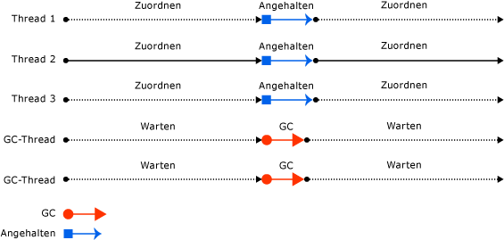

# Garbage Collection für die Arbeitsstation und Garbage Collection auf dem ServerWorkstation and server garbage collection

Der Garbage Collector optimiert sich selbst und kann in einer Vielzahl von Szenarien funktionieren.The garbage collector is self-tuning and can work in a wide variety of scenarios. Sie können jedoch [die Art der Garbage Collection](../../core/run-time-config/garbage-collector.md#flavors-of-garbage-collection) anhand der Merkmale der Workload festlegen.However, you can [set the type of garbage collection](../../core/run-time-config/garbage-collector.md#flavors-of-garbage-collection) based on the characteristics of the workload. Die CLR stellt mehrere Arten der Garbage Collection bereit:The CLR provides the following types of garbage collection:

- Die Garbage Collection (GC) für Arbeitsstationen, die für Client-Apps konzipiert ist.Workstation garbage collection (GC), which is designed for client apps. Dabei handelt es sich um die GC-Standardmethode für eigenständige Apps.It's the default GC flavor for standalone apps. Für gehostete Apps, z. B. die von ASP.NET gehosteten Apps, bestimmt der Host die GC-Standardkonfiguration.For hosted apps, for example, those hosted by ASP.NET, the host determines the default GC flavor.

  Die Garbage Collection für die Arbeitsstation kann gleichzeitig oder nicht gleichzeitig erfolgen.Workstation garbage collection can be concurrent or non-concurrent. Die gleichzeitige (oder *im Hintergrund* stattfindende) Garbage Collection ermöglicht, dass verwaltete Threads während einer Garbage Collection Vorgänge fortsetzen können.Concurrent (or *background*) garbage collection enables managed threads to continue operations during a garbage collection. Ab .NET Framework 4 wird die [gleichzeitige Garbage Collection](background-gc.md#concurrent-garbage-collection) durch die [Garbage Collection im Hintergrund](background-gc.md) ersetzt.[Background garbage collection](background-gc.md) replaces [concurrent garbage collection](background-gc.md#concurrent-garbage-collection) in .NET Framework 4 and later versions.

- Garbage Collection für Server, die für Serveranwendungen vorgesehen ist, die einen hohen Durchsatz und eine hohe Skalierbarkeit erfordern.Server garbage collection, which is intended for server applications that need high throughput and scalability.

  - In .NET Core kann die Garbage Collection auf dem Server nicht-gleichzeitig oder im Hintergrund ausgeführt werden.In .NET Core, server garbage collection can be non-concurrent or background.

  - In .NET Framework 4.5 und höher kann die Garbage Collection auf dem Server nicht-gleichzeitig oder im Hintergrund ausgeführt werden.In .NET Framework 4.5 and later versions, server garbage collection can be non-concurrent or background. In .NET Framework 4 und früheren Versionen erfolgt die Garbage Collection auf dem Server gleichzeitig.In .NET Framework 4 and previous versions, server garbage collection is non-concurrent.

Die folgende Abbildung zeigt die dedizierten Threads, die die Garbage Collection auf einem Server ausführen:The following illustration shows the dedicated threads that perform the garbage collection on a server:

## Überlegungen zur LeistungPerformance considerations

### Arbeitsstation-GCWorkstation GC

Im Folgenden finden Sie Überlegungen zu Threading und Leistung der Garbage Collection auf Arbeitsstationen:The following are threading and performance considerations for workstation garbage collection:

- Die Garbage Collection erfolgt auf dem Benutzerthread, der die Garbage Collection ausgelöst hat, und die Priorität bleibt unverändert.The collection occurs on the user thread that triggered the garbage collection and remains at the same priority. Da Benutzerthreads in der Regel mit normaler Priorität ausgeführt werden, muss der Garbage Collector (der auf einem Thread mit normaler Priorität ausgeführt wird) mit anderen Threads um CPU-Zeit konkurrieren.Because user threads typically run at normal priority, the garbage collector (which runs on a normal priority thread) must compete with other threads for CPU time. (Threads, die nativen Code ausführen, werden bei der Garbage Collection für die Arbeitsstation bzw. auf dem Server nicht angehalten.)(Threads that run native code are not suspended on either server or workstation garbage collection.)

- Die Garbage Collection für die Arbeitsstation wird immer auf einem Computer verwendet, der nur einen Prozessor besitzt, unabhängig von der [Konfigurationseinstellung](../../core/run-time-config/garbage-collector.md#systemgcservercomplus_gcserver).Workstation garbage collection is always used on a computer that has only one processor, regardless of the [configuration setting](../../core/run-time-config/garbage-collector.md#systemgcservercomplus_gcserver).

### Server-GCServer GC

Im Folgenden finden Sie Überlegungen zu Threading und Leistung der Garbage Collection auf Servern:The following are threading and performance considerations for server garbage collection:

- Die Garbage Collection erfolgt auf mehreren dedizierten Threads, die mit der Prioritätsebene `THREAD_PRIORITY_HIGHEST` ausgeführt werden.The collection occurs on multiple dedicated threads that are running at `THREAD_PRIORITY_HIGHEST` priority level.

- Für jede CPU werden ein Heap und ein dedizierter Thread zum Ausführen der Garbage Collection bereitgestellt, und die Auflistung für die Heaps findet zur gleichen Zeit statt.A heap and a dedicated thread to perform garbage collection are provided for each CPU, and the heaps are collected at the same time. Jeder Heap enthält einen kleinen Objektheap und einen großen Objektheap, und auf alle Heaps kann über den Benutzercode zugegriffen werden.Each heap contains a small object heap and a large object heap, and all heaps can be accessed by user code. Objekte auf verschiedenen Heaps können aufeinander verweisen.Objects on different heaps can refer to each other.

- Da mehrere Garbage Collection-Threads zusammenarbeiten, ist die Garbage Collection auf dem Server bei gleicher Heapgröße schneller als die Garbage Collection für die Arbeitsstation.Because multiple garbage collection threads work together, server garbage collection is faster than workstation garbage collection on the same size heap.

- Bei der Garbage Collection auf dem Server sind die Segmente häufig größer.Server garbage collection often has larger size segments. Dies ist jedoch nur eine allgemeine Angabe: Die Segmentgröße ist implementierungsspezifisch und unterliegt möglicherweise Änderungen.However, this is only a generalization: segment size is implementation-specific and is subject to change. Wenn Sie eine Anwendung optimieren, sollten Sie keine Annahmen über die Größe der Segmente machen, die vom Garbage Collector zugeordnet werden.Don't make assumptions about the size of segments allocated by the garbage collector when tuning your app.

- Die Garbage Collection auf dem Server kann ressourcenintensiv sein.Server garbage collection can be resource-intensive. Nehmen Sie beispielsweise an, dass auf einem Computer mit vier Prozessoren zwölf Prozesse vorhanden sind, in denen die Garbage Collection auf dem Server ausgeführt wird.For example, imagine that there are 12 processes that use server GC running on a computer that has four processors. Wenn alle Prozesse die Garbage Collection gleichzeitig durchführen, würden sie sich gegenseitig behindern, da auf demselben Prozessor zwölf Threads geplant würden.If all the processes happen to collect garbage at the same time, they would interfere with each other, as there would be 12 threads scheduled on the same processor. Wenn die Prozesse aktiv sind, ist es nicht empfehlenswert, dass sie alle die Garbage Collection auf dem Server verwenden.If the processes are active, it's not a good idea to have them all use server GC.

Wenn Sie Hunderte von Instanzen einer Anwendung ausführen, sollten Sie erwägen, eine Garbage Collection für die Arbeitsstation mit deaktivierter gleichzeitiger Garbage Collection zu verwenden.If you're running hundreds of instances of an application, consider using workstation garbage collection with concurrent garbage collection disabled. Dies führt zu weniger Kontextwechseln, wodurch die Leistung verbessert werden kann.This will result in less context switching, which can improve performance.

## Siehe auchSee also

- [Garbage Collection im HintergrundBackground garbage collection](background-gc.md)
- [Runtimekonfigurationsoptionen für die Garbage CollectionRun-time configuration options for garbage collection](../../core/run-time-config/garbage-collector.md)
