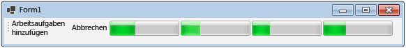

# Gewusst wie: Abbrechen eines Datenflussblocks
Dieses Dokument veranschaulicht, wie Sie das Abbrüche in der Anwendung aktivieren. In diesem Beispiel wird Windows Forms verwendet, um anzuzeigen, wo in einer Datenflusspipeline Arbeitselemente aktiv sind, und um die Auswirkungen eines Abbruchs zu verdeutlichen.  

[!INCLUDE [tpl-install-instructions](../../../includes/tpl-install-instructions.md)]
  
## Erstellen der Windows Forms-Anwendung  
  
1. Erstellen Sie ein C#- oder Visual Basic-**Windows Forms**-Anwendungsprojekt. In den folgenden Schritten wird das Projekt `CancellationWinForms` benannt.  
  
2. Fügen Sie im Formulardesigner für das Hauptformular „Form1.cs“ („Form1.vb“ in Visual Basic) ein <xref:System.Windows.Forms.ToolStrip>-Steuerelement hinzu.  
  
3. Fügen Sie dem <xref:System.Windows.Forms.ToolStrip>-Steuerelement ein <xref:System.Windows.Forms.ToolStripButton>-Steuerelement hinzu. Legen Sie die <xref:System.Windows.Forms.ToolStripItem.DisplayStyle%2A>-Eigenschaft auf <xref:System.Windows.Forms.ToolStripItemDisplayStyle.Text> und die <xref:System.Windows.Forms.ToolStripItem.Text%2A>-Eigenschaft auf **Arbeitselemente hinzufügen** fest.  
  
4. Fügen Sie dem <xref:System.Windows.Forms.ToolStrip>-Steuerelement ein zweites <xref:System.Windows.Forms.ToolStripButton>-Steuerelement hinzu. Legen Sie die <xref:System.Windows.Forms.ToolStripItem.DisplayStyle%2A>-Eigenschaft auf <xref:System.Windows.Forms.ToolStripItemDisplayStyle.Text>, die <xref:System.Windows.Forms.ToolStripItem.Text%2A>-Eigenschaft auf **Abbrechen** und die <xref:System.Windows.Forms.ToolStripItem.Enabled%2A>-Eigenschaft auf `False` fest.  
  
5. Fügen Sie vier <xref:System.Windows.Forms.ToolStripProgressBar> -Objekte zum <xref:System.Windows.Forms.ToolStrip>-Steuerelement hinzu.  
  
## Erstellen der Datenflusspipeline  
 In diesem Abschnitt wird beschrieben, wie Sie die Datenflusspipeline erstellen, die Arbeitselemente verarbeitet und Statusanzeigen aktualisiert.  
  
### So erstellen Sie die Datenflusspipeline  
  
1. Fügen Sie dem Projekt einen Verweis auf „System.Threading.Tasks.Dataflow.dll“ hinzu.  
  
2. Stellen Sie sicher, dass „Form1.cs“ („Form1.vb“ für Visual Basic) die folgenden `using`-Anweisungen (`Imports` in Visual Basic) enthält.  
  
     [!code-csharp[TPLDataflow_CancellationWinForms#1](../../../samples/snippets/csharp/VS_Snippets_Misc/tpldataflow_cancellationwinforms/cs/cancellationwinforms/form1.cs#1)]
     [!code-vb[TPLDataflow_CancellationWinForms#1](../../../samples/snippets/visualbasic/VS_Snippets_Misc/tpldataflow_cancellationwinforms/vb/cancellationwinforms/form1.vb#1)]  
  
3. Fügen Sie die `WorkItem`-Klasse als einen inneren Typ der `Form1`-Klasse hinzu.  
  
     [!code-csharp[TPLDataflow_CancellationWinForms#2](../../../samples/snippets/csharp/VS_Snippets_Misc/tpldataflow_cancellationwinforms/cs/cancellationwinforms/form1.cs#2)]
     [!code-vb[TPLDataflow_CancellationWinForms#2](../../../samples/snippets/visualbasic/VS_Snippets_Misc/tpldataflow_cancellationwinforms/vb/cancellationwinforms/form1.vb#2)]  
  
4. Fügen Sie der `Form1`-Klasse die folgenden Datenmember hinzu.  
  
     [!code-csharp[TPLDataflow_CancellationWinForms#3](../../../samples/snippets/csharp/VS_Snippets_Misc/tpldataflow_cancellationwinforms/cs/cancellationwinforms/form1.cs#3)]
     [!code-vb[TPLDataflow_CancellationWinForms#3](../../../samples/snippets/visualbasic/VS_Snippets_Misc/tpldataflow_cancellationwinforms/vb/cancellationwinforms/form1.vb#3)]  
  
5. Fügen Sie der `Form1`-Klasse die folgende `CreatePipeline`-Methode hinzu:  
  
     [!code-csharp[TPLDataflow_CancellationWinForms#4](../../../samples/snippets/csharp/VS_Snippets_Misc/tpldataflow_cancellationwinforms/cs/cancellationwinforms/form1.cs#4)]
     [!code-vb[TPLDataflow_CancellationWinForms#4](../../../samples/snippets/visualbasic/VS_Snippets_Misc/tpldataflow_cancellationwinforms/vb/cancellationwinforms/form1.vb#4)]  
  
 Da die `incrementProgress`- und `decrementProgress`-Datenflussblöcke als Benutzeroberfläche agiert, ist es wichtig, dass diese Aktionen im Benutzeroberflächenthread erfolgen. Um dies zu erreichen, stellen diese Objekte während der Erstellung ein <xref:System.Threading.Tasks.Dataflow.ExecutionDataflowBlockOptions>-Objekt bereit, für das die <xref:System.Threading.Tasks.Dataflow.DataflowBlockOptions.TaskScheduler%2A>-Eigenschaft auf <xref:System.Threading.Tasks.TaskScheduler.FromCurrentSynchronizationContext%2A?displayProperty=nameWithType> festgelegt ist. Die <xref:System.Threading.Tasks.TaskScheduler.FromCurrentSynchronizationContext%2A?displayProperty=nameWithType>-Methode erstellt ein <xref:System.Threading.Tasks.TaskScheduler>-Objekt, das Arbeiten im aktuellen Synchronisierungskontext durchführt. Da der `Form1`-Konstruktor über den Benutzeroberflächenthread aufgerufen wird, werden die Aktionen für den `incrementProgress`- und den `decrementProgress`-Datenflussblock ebenfalls im Benutzeroberflächenthread ausgeführt.  
  
 In diesem Beispiel wird die <xref:System.Threading.Tasks.Dataflow.DataflowBlockOptions.CancellationToken%2A>-Eigenschaft festgelegt, wenn sie die Elemente der Pipeline erstellt. Da die <xref:System.Threading.Tasks.Dataflow.DataflowBlockOptions.CancellationToken%2A>-Eigenschaft die Ausführung des Datenflussblocks dauerhaft abbricht, muss die gesamte Pipeline neu erstellt werden, wenn der Benutzer den Vorgang abbricht und anschließend weitere Arbeitselemente zur Pipeline hinzufügen möchte. Ein Beispiel für eine alternative Möglichkeit zum Abbrechen eines Datenflussblocks, die erlaubt, dass nach dem Abbrechen eines Vorgangs andere Arbeit ausgeführt wird, finden Sie unter [Exemplarische Vorgehensweise: Verwenden eines Datenflusses in einer Windows Forms-Anwendung](../../../docs/standard/parallel-programming/walkthrough-using-dataflow-in-a-windows-forms-application.md).  
  
## Verbinden der Datenflusspipeline mit der Benutzeroberfläche  
 In diesem Abschnitt wird beschrieben, wie Sie die Datenflusspipeline mit der Benutzeroberfläche verbinden. Sowohl das Erstellen der Pipeline als auch das Hinzufügen von Arbeitselementen zur Pipeline werden vom Ereignishandler für die Schaltfläche **Arbeitselemente hinzufügen** gesteuert. Der Abbruch wird durch die Schaltfläche **Abbrechen** initiiert. Wenn der Benutzer auf eine dieser Schaltflächen klickt, wird die entsprechende Aktion auf asynchrone Weise initiiert.  
  
### So verbinden Sie die Datenflusspipeline mit der Benutzeroberfläche  
  
1. Erstellen Sie im Formulardesigner für das Hauptformular einen Ereignishandler für das <xref:System.Windows.Forms.ToolStripItem.Click>-Ereignis der Schaltfläche **Arbeitselemente hinzufügen**.  
  
2. Implementieren Sie das <xref:System.Windows.Forms.ToolStripItem.Click>-Ereignis für die Schaltfläche **Arbeitselemente hinzufügen**.  
  
     [!code-csharp[TPLDataflow_CancellationWinForms#5](../../../samples/snippets/csharp/VS_Snippets_Misc/tpldataflow_cancellationwinforms/cs/cancellationwinforms/form1.cs#5)]
     [!code-vb[TPLDataflow_CancellationWinForms#5](../../../samples/snippets/visualbasic/VS_Snippets_Misc/tpldataflow_cancellationwinforms/vb/cancellationwinforms/form1.vb#5)]  
  
3. Erstellen Sie im Formulardesigner für das Hauptformular einen Ereignishandler für den <xref:System.Windows.Forms.ToolStripItem.Click>-Ereignishandler der Schaltfläche **Abbrechen**.  
  
4. Implementieren Sie den <xref:System.Windows.Forms.ToolStripItem.Click>-Ereignishandler für die Schaltfläche **Abbrechen**.  
  
     [!code-csharp[TPLDataflow_CancellationWinForms#6](../../../samples/snippets/csharp/VS_Snippets_Misc/tpldataflow_cancellationwinforms/cs/cancellationwinforms/form1.cs#6)]
     [!code-vb[TPLDataflow_CancellationWinForms#6](../../../samples/snippets/visualbasic/VS_Snippets_Misc/tpldataflow_cancellationwinforms/vb/cancellationwinforms/form1.vb#6)]  
  
## Beispiel  
 Im folgenden Beispiel wird der vollständige Code für „Form1.cs“ („Form1.vb“ in Visual Basic) gezeigt.  
  
 [!code-csharp[TPLDataflow_CancellationWinForms#100](../../../samples/snippets/csharp/VS_Snippets_Misc/tpldataflow_cancellationwinforms/cs/cancellationwinforms/form1.cs#100)]
 [!code-vb[TPLDataflow_CancellationWinForms#100](../../../samples/snippets/visualbasic/VS_Snippets_Misc/tpldataflow_cancellationwinforms/vb/cancellationwinforms/form1.vb#100)]  
  
 Die folgende Abbildung zeigt die ausgeführte Anwendung.  
  
   

## Weitere Informationen

- [Dataflow (Datenfluss)](../../../docs/standard/parallel-programming/dataflow-task-parallel-library.md)
