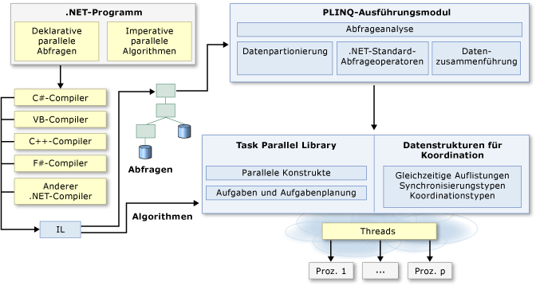

# Parallele Programmierung in .NET

Viele Personalcomputer und Arbeitsstationen verfügen über mehrere CPU-Kerne, die die gleichzeitige Ausführung mehrerer Threads ermöglichen. Um die Hardware nutzen zu können, kann der Code parallelisiert werden, um die Arbeit über mehrere Prozessoren zu verteilen.

Früher erforderte die Parallelisierung Änderungen von Threads und Sperren auf niedriger Ebene. Visual Studio und .NET Framework verbessern die Unterstützung für die parallele Programmierung, indem sie eine Laufzeit, Klassenbibliothekstypen und Diagnosetools bereitstellen. Diese Features, die in .NET Framework 4 eingeführt wurden, vereinfachen die parallele Entwicklung. Sie können effizienten, differenzierten und skalierbaren parallelen Code in einer natürlichen Sprache schreiben, ohne direkt mit Threads oder dem Threadpool arbeiten zu müssen.

Die folgende Abbildung zeigt eine allgemeine Übersicht der parallelen Programmierarchitektur in .NET Framework:

## Verwandte Themen

|Technologie|Beschreibung|
|----------------|-----------------|
|[Task Parallel Library (TPL)](../../../docs/standard/parallel-programming/task-parallel-library-tpl.md)|Stellt eine Dokumentation für die <xref:System.Threading.Tasks.Parallel?displayProperty=nameWithType>-Klasse, die parallele Versionen einer `For`-Schleife und einer `ForEach`-Schleife einschließt, sowie für die <xref:System.Threading.Tasks.Task?displayProperty=nameWithType>-Klasse bereit. Dies ist die bevorzugte Methode, um asynchrone Vorgänge auszudrücken.|
|[Parallel LINQ (PLINQ) (Paralleles LINQ (PLINQ))](../../../docs/standard/parallel-programming/introduction-to-plinq.md)|Eine parallele Implementierung von LINQ to Objects, die die Leistung in vielen Szenarien deutlich verbessert.|
|[Datenstrukturen für die parallele Programmierung](../../../docs/standard/parallel-programming/data-structures-for-parallel-programming.md)|Stellt Links zu Dokumentationen über threadsichere Auflistungsklassen, einfache Synchronisierungstypen und Typen für verzögerte Initialisierung bereit.|
|[Diagnosetools für die parallele Ausführung](../../../docs/standard/parallel-programming/parallel-diagnostic-tools.md)|Stellt Links zu Dokumentation für Visual Studio-Debuggerfenster für Aufgaben und parallele Stapel sowie für [Concurrency Visualizer](/visualstudio/profiling/concurrency-visualizer) bereit.|
|[Benutzerdefinierte Partitionierer für PLINQ und TPL](../../../docs/standard/parallel-programming/custom-partitioners-for-plinq-and-tpl.md)|Beschreibt, wie Partitionierer funktionieren und wie die Standardpartitionierer konfiguriert bzw. wie ein neuer Partitionierer erstellt wird.|
|[Taskplaner](xref:System.Threading.Tasks.TaskScheduler)|Beschreibt, wie Planer funktionieren und wie die Standardplaner konfiguriert werden.|
|[Lambdaausdrücke in PLINQ und TPL](../../../docs/standard/parallel-programming/lambda-expressions-in-plinq-and-tpl.md)|Bietet einen kurzen Überblick über Lambaausdrücke in C# und Visual Basic und zeigt, wie sie in PLINQ und der Task Parallel Library verwendet werden.|
|[Weitere Informationen](../../../docs/standard/parallel-programming/for-further-reading-parallel-programming.md)|Stellt Links zu zusätzlichen Informationen und Beispielressourcen für die parallele Programmierung in .NET Framework bereit.|

## Siehe auch

- [Async (Übersicht)](../async.md)
- [Verwaltetes Threading](../threading/index.md)
