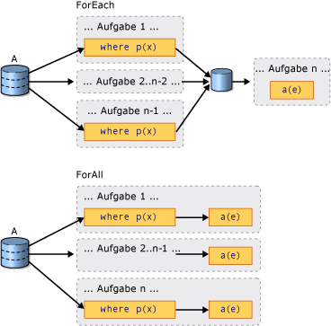

# Einführung in PLINQIntroduction to PLINQ

Parallel LINQ (PLINQ) ist eine parallele Implementierung des [LINQ-Musters (Language-Integrated Query)](../../csharp/programming-guide/concepts/linq/index.md).Parallel LINQ (PLINQ) is a parallel implementation of the [Language-Integrated Query (LINQ)](../../csharp/programming-guide/concepts/linq/index.md) pattern. PLINQ implementiert den kompletten Satz von LINQ-Standardabfrageoperatoren als Erweiterungsmethoden für den <xref:System.Linq>-Namespace und verfügt über zusätzliche Operatoren für parallele Vorgänge.PLINQ implements the full set of LINQ standard query operators as extension methods for the <xref:System.Linq> namespace and has additional operators for parallel operations. PLINQ kombiniert die Einfachheit und Lesbarkeit der LINQ-Syntax mit der Leistungsfähigkeit der parallelen Programmierung.PLINQ combines the simplicity and readability of LINQ syntax with the power of parallel programming.

> [!TIP]
> LINQ bietet ein einheitliches Modell für die typsichere Abfrage beliebiger aufzählbarer Datenquellen.If you're not familiar with LINQ, it features a unified model for querying any enumerable data source in a type-safe manner. LINQ to Objects ist der Name für LINQ-Abfragen von Auflistungen im Arbeitsspeicher, z. B. <xref:System.Collections.Generic.List%601>, und Arrays.LINQ to Objects is the name for LINQ queries that are run against in-memory collections such as <xref:System.Collections.Generic.List%601> and arrays. Dieser Artikel setzt Grundkenntnisse in LINQ voraus.This article assumes that you have a basic understanding of LINQ. Weitere Informationen finden Sie unter [Language-Integrated Query (LINQ)](../../csharp/programming-guide/concepts/linq/index.md).For more information, see [Language-Integrated Query (LINQ)](../../csharp/programming-guide/concepts/linq/index.md).

## Was ist eine parallele Abfrage?What is a Parallel query?

Eine PLINQ-Abfrage entspricht weitgehend einer nicht parallelen LINQ to Objects-Abfrage.A PLINQ query in many ways resembles a non-parallel LINQ to Objects query. PLINQ-Abfragen werden, ebenso wie sequenzielle LINQ-Abfragen, auf alle <xref:System.Collections.IEnumerable>- oder <xref:System.Collections.Generic.IEnumerable%601>-Datenquellen im Arbeitsspeicher angewendet und weisen eine verzögerte Ausführung auf, d. h. sie werden erst ausgeführt, wenn die Abfrage aufgelistet wird.PLINQ queries, just like sequential LINQ queries, operate on any in-memory <xref:System.Collections.IEnumerable> or <xref:System.Collections.Generic.IEnumerable%601> data source, and have deferred execution, which means they do not begin executing until the query is enumerated. Der Hauptunterschied besteht darin, dass PLINQ versucht, alle Prozessoren im System vollständig auszuschöpfen.The primary difference is that PLINQ attempts to make full use of all the processors on the system. PLINQ partitioniert hierzu die Datenquelle in Segmente und führt dann die Abfrage für jedes Segment parallel in separaten Arbeitsthreads und auf mehreren Prozessoren aus.It does this by partitioning the data source into segments, and then executing the query on each segment on separate worker threads in parallel on multiple processors. In vielen Fällen bedeutet eine parallele Ausführung, dass die Abfrage deutlich schneller ausgeführt wird.In many cases, parallel execution means that the query runs significantly faster.

Durch die parallele Ausführung kann PLINQ für bestimmte Abfragen eine erheblich höhere Leistung als Legacycode erzielen. Häufig muss hierzu lediglich der <xref:System.Linq.ParallelEnumerable.AsParallel%2A>-Abfragevorgang zur Datenquelle hinzugefügt werden.Through parallel execution, PLINQ can achieve significant performance improvements over legacy code for certain kinds of queries, often just by adding the <xref:System.Linq.ParallelEnumerable.AsParallel%2A> query operation to the data source. Die Parallelität kann jedoch eigene Komplexitäten mit sich bringen, und nicht alle Abfragevorgänge werden in PLINQ schneller ausgeführt.However, parallelism can introduce its own complexities, and not all query operations run faster in PLINQ. Im Gegenteil, manche Abfragen werden durch die Parallelisierung sogar verlangsamt.In fact, parallelization actually slows down certain queries. Sie sollten daher wissen, wie sich bestimmte Aspekte, z. B. Sortierung, auf parallele Abfragen auswirken.Therefore, you should understand how issues such as ordering affect parallel queries. Weitere Informationen finden Sie unter [Understanding Speedup in PLINQ (Grundlagen zur Beschleunigung in PLINQ)](understanding-speedup-in-plinq.md).For more information, see [Understanding Speedup in PLINQ](understanding-speedup-in-plinq.md).

> [!NOTE]
> In dieser Dokumentation werden Delegaten in PLINQ mithilfe von Lambdaausdrücken definiert.This documentation uses lambda expressions to define delegates in PLINQ. Falls Sie mit der Verwendung von Lambda-Ausdrücken in C# oder Visual Basic nicht vertraut sind, finden Sie entsprechende Informationen unter [Lambda Expressions in PLINQ and TPL (Lambda-Ausdrücke in PLINQ und TPL)](lambda-expressions-in-plinq-and-tpl.md).If you are not familiar with lambda expressions in C# or Visual Basic, see [Lambda Expressions in PLINQ and TPL](lambda-expressions-in-plinq-and-tpl.md).

Der Rest dieses Artikels bietet eine Übersicht über die wichtigsten PLINQ-Klassen und erläutert, wie PLINQ-Abfragen erstellt werden.The remainder of this article gives an overview of the main PLINQ classes and discusses how to create PLINQ queries. Jeder Abschnitt enthält Links zu ausführlicheren Informationen und Codebeispielen.Each section contains links to more detailed information and code examples.

## Die ParallelEnumerable-KlasseThe ParallelEnumerable Class

Die <xref:System.Linq.ParallelEnumerable?displayProperty=nameWithType>-Klasse stellt nahezu die gesamte Funktionalität von PLINQ zur Verfügung.The <xref:System.Linq.ParallelEnumerable?displayProperty=nameWithType> class exposes almost all of PLINQ's functionality. Diese Klasse sowie die restlichen Typen des <xref:System.Linq?displayProperty=nameWithType>-Namespace werden in der Assembly "System.Core.dll" kompiliert.It and the rest of the <xref:System.Linq?displayProperty=nameWithType> namespace types are compiled into the System.Core.dll assembly. Die standardmäßigen C#- und Visual Basic-Projekte in Visual Studio verweisen auf die Assembly und importiert den Namespace.The default C# and Visual Basic projects in Visual Studio both reference the assembly and import the namespace.

<xref:System.Linq.ParallelEnumerable> enthält Implementierungen aller Standardabfrageoperatoren, die von LINQ to Objects unterstützt werden, auch wenn nicht für jeden eine Parallelisierung angestrebt wird.<xref:System.Linq.ParallelEnumerable> includes implementations of all the standard query operators that LINQ to Objects supports, although it does not attempt to parallelize each one. Wenn Sie nicht mit LINQ vertraut sind, lesen Sie [Einführung in LINQ (C#)](../../csharp/programming-guide/concepts/linq/index.md) und [Einführung in LINQ (Visual Basic)](../../visual-basic/programming-guide/concepts/linq/introduction-to-linq.md).If you are not familiar with LINQ, see [Introduction to LINQ (C#)](../../csharp/programming-guide/concepts/linq/index.md) and [Introduction to LINQ (Visual Basic)](../../visual-basic/programming-guide/concepts/linq/introduction-to-linq.md).

Zusätzlich zu den Standardabfrageoperatoren enthält die <xref:System.Linq.ParallelEnumerable>-Klasse einen Satz von Methoden, die spezielle Verhaltensweisen für die parallele Ausführung unterstützen.In addition to the standard query operators, the <xref:System.Linq.ParallelEnumerable> class contains a set of methods that enable behaviors specific to parallel execution. Diese PLINQ-spezifischen Methoden sind in der folgenden Tabelle aufgeführt.These PLINQ-specific methods are listed in the following table.

|ParallelEnumerable-OperatorParallelEnumerable Operator|BeschreibungDescription|
|---------------------------------|-----------------|
|<xref:System.Linq.ParallelEnumerable.AsParallel%2A>|Der Einstiegspunkt für PLINQ.The entry point for PLINQ. Gibt an, dass der Rest der Abfrage nach Möglichkeit parallelisiert werden soll.Specifies that the rest of the query should be parallelized, if it is possible.|
|<xref:System.Linq.ParallelEnumerable.AsSequential%2A>|Gibt an, dass der Rest der Abfrage sequenziell, als nicht parallele LINQ-Abfrage ausgeführt werden soll.Specifies that the rest of the query should be run sequentially, as a non-parallel LINQ query.|
|<xref:System.Linq.ParallelEnumerable.AsOrdered%2A>|Gibt an, diese PLINQ die Reihenfolge der Quellsequenz im Rest der Abfrage oder bis zu einer Änderung der Reihenfolge, z. B. durch eine orderby-Klausel (Ordner By in Vlsual Basic), beibehalten soll.Specifies that PLINQ should preserve the ordering of the source sequence for the rest of the query, or until the ordering is changed, for example by the use of an orderby (Order By in Visual Basic) clause.|
|<xref:System.Linq.ParallelEnumerable.AsUnordered%2A>|Gibt an, dass PLINQ die Reihenfolge der Quellsequenz im Rest der Abfrage nicht beibehalten muss.Specifies that PLINQ for the rest of the query is not required to preserve the ordering of the source sequence.|
|<xref:System.Linq.ParallelEnumerable.WithCancellation%2A>|Gibt an, diese PLINQ den Zustand des bereitgestellten Abbruchtokens in regelmäßigen Abständen überwachen und die Ausführung auf Anforderung abbrechen soll.Specifies that PLINQ should periodically monitor the state of the provided cancellation token and cancel execution if it is requested.|
|<xref:System.Linq.ParallelEnumerable.WithDegreeOfParallelism%2A>|Gibt die maximale Anzahl von Prozessoren an, die PLINQ zum Parallelisieren der Abfrage verwenden soll.Specifies the maximum number of processors that PLINQ should use to parallelize the query.|
|<xref:System.Linq.ParallelEnumerable.WithMergeOptions%2A>|Gibt an, wie PLINQ parallele Ergebnisse im Consumerthread wieder in einer Sequenz zusammenführen soll, sofern dies möglich ist.Provides a hint about how PLINQ should, if it is possible, merge parallel results back into just one sequence on the consuming thread.|
|<xref:System.Linq.ParallelEnumerable.WithExecutionMode%2A>|Gibt an, ob PLINQ die Abfrage parallelisieren soll, selbst wenn diese standardmäßig sequenziell ausgeführt würde.Specifies whether PLINQ should parallelize the query even when the default behavior would be to run it sequentially.|
|<xref:System.Linq.ParallelEnumerable.ForAll%2A>|Eine Multithreadenumerationsmethode, die, im Gegensatz zum Durchlaufen der Ergebnisse der Abfrage, eine parallele Verarbeitung der Ergebnisse ermöglicht, ohne dass diese zuvor im Consumerthread zusammengeführt werden.A multithreaded enumeration method that, unlike iterating over the results of the query, enables results to be processed in parallel without first merging back to the consumer thread.|
|<xref:System.Linq.ParallelEnumerable.Aggregate%2A>-Überladung<xref:System.Linq.ParallelEnumerable.Aggregate%2A> overload|Eine spezielle Überladung für PLINQ, die eine Zwischenaggregation über lokale Threadpartitionen sowie eine abschließende Aggregationsfunktion zum Kombinieren der Ergebnisse aller Partitionen ermöglicht.An overload that is unique to PLINQ and enables intermediate aggregation over thread-local partitions, plus a final aggregation function to combine the results of all partitions.|

## Das Opt-in-ModellThe Opt-in Model

Beim Schreiben einer Abfrage entscheiden Sie sich für PLINQ, indem Sie in der Datenquelle die <xref:System.Linq.ParallelEnumerable.AsParallel%2A?displayProperty=nameWithType>-Erweiterungsmethode aufrufen, wie im folgenden Beispiel gezeigt.When you write a query, opt in to PLINQ by invoking the <xref:System.Linq.ParallelEnumerable.AsParallel%2A?displayProperty=nameWithType> extension method on the data source, as shown in the following example.

[!code-csharp[PLINQ#1](../../../samples/snippets/csharp/VS_Snippets_Misc/plinq/cs/plinq2_cs.cs#1)]
[!code-vb[PLINQ#1](../../../samples/snippets/visualbasic/VS_Snippets_Misc/plinq/vb/plinq2_vb.vb#1)]

Die <xref:System.Linq.ParallelEnumerable.AsParallel%2A>-Erweiterungsmethode bindet die nachfolgenden Abfrageoperatoren, in diesem Fall, `where` und `select`, an die <xref:System.Linq.ParallelEnumerable?displayProperty=nameWithType>-Implementierungen.The <xref:System.Linq.ParallelEnumerable.AsParallel%2A> extension method binds the subsequent query operators, in this case, `where` and `select`, to the <xref:System.Linq.ParallelEnumerable?displayProperty=nameWithType> implementations.

## AusführungsmodiExecution Modes

Standardmäßig wird PLINQ konservativ ausgeführt.By default, PLINQ is conservative. Die PLINQ-Infrastruktur analysiert zur Laufzeit die Gesamtstruktur der Abfrage.At run time, the PLINQ infrastructure analyzes the overall structure of the query. Wenn die Abfrage voraussichtlich durch eine Parallelisierung beschleunigt werden kann, partitioniert PLINQ die Quellsequenz in Aufgaben, die gleichzeitig ausgeführt werden können.If the query is likely to yield speedups by parallelization, PLINQ partitions the source sequence into tasks that can be run concurrently. Kann eine Abfrage nicht sicher parallelisiert werden, führt PLINQ die Abfrage sequenziell aus.If it is not safe to parallelize a query, PLINQ just runs the query sequentially. Wenn PLINQ die Wahl zwischen einem potenziell rechenintensiven parallelen Algorithmus und einem einfachen sequenziellen Algorithmus hat, entscheidet es sich standardmäßig für den sequenziellen Algorithmus.If PLINQ has a choice between a potentially expensive parallel algorithm or an inexpensive sequential algorithm, it chooses the sequential algorithm by default. Mit der <xref:System.Linq.ParallelEnumerable.WithExecutionMode%2A>-Methode und der <xref:System.Linq.ParallelExecutionMode?displayProperty=nameWithType>-Enumeration können Sie PLINQ anweisen, den parallelen Algorithmus auszuwählen.You can use the <xref:System.Linq.ParallelEnumerable.WithExecutionMode%2A> method and the <xref:System.Linq.ParallelExecutionMode?displayProperty=nameWithType> enumeration to instruct PLINQ to select the parallel algorithm. Dies ist sinnvoll, wenn Sie aufgrund von Tests und Messungen wissen, dass eine bestimmte Abfrage im parallelen Modus schneller ausgeführt wird.This is useful when you know by testing and measurement that a particular query executes faster in parallel. Weitere Informationen finden Sie unter [Vorgehensweise: Angeben des Ausführungsmodus in PLINQ](how-to-specify-the-execution-mode-in-plinq.md).For more information, see [How to: Specify the Execution Mode in PLINQ](how-to-specify-the-execution-mode-in-plinq.md).

## Grad der ParallelitätDegree of Parallelism

Standardmäßig verwendet PLINQ alle Prozessoren des Hostcomputers.By default, PLINQ uses all of the processors on the host computer. Mit der <xref:System.Linq.ParallelEnumerable.WithDegreeOfParallelism%2A>-Methode können Sie PLINQ anweisen, nicht mehr als eine angegebene Anzahl von Prozessoren zu verwenden.You can instruct PLINQ to use no more than a specified number of processors by using the <xref:System.Linq.ParallelEnumerable.WithDegreeOfParallelism%2A> method. Sie können so sicherstellen, dass andere auf dem Computer ausgeführt Prozesse eine bestimmte Menge an CPU-Zeit erhalten.This is useful when you want to make sure that other processes running on the computer receive a certain amount of CPU time. Der folgende Codeausschnitt beschränkt die Abfrage auf maximal zwei Prozessoren.The following snippet limits the query to utilizing a maximum of two processors.

[!code-csharp[PLINQ#5](../../../samples/snippets/csharp/VS_Snippets_Misc/plinq/cs/plinqsamples.cs#5)]
[!code-vb[PLINQ#5](../../../samples/snippets/visualbasic/VS_Snippets_Misc/plinq/vb/plinq2_vb.vb#5)]

Wenn eine Abfrage eine große Mengen an nicht rechnergebundenen Aufgaben ausführt, z. B. Datei-E/A, kann es von Vorteil sein, einen höheren Grad an Parallelität als die auf dem Rechner verfügbare Anzahl von Kernen anzugeben.In cases where a query is performing a significant amount of non-compute-bound work such as File I/O, it might be beneficial to specify a degree of parallelism greater than the number of cores on the machine.

## Geordnete und ungeordnete parallele AbfragenOrdered Versus Unordered Parallel Queries

Bei einigen Abfragen muss ein Abfrageoperator Ergebnisse erzeugen, die die Reihenfolge der Quellsequenz beibehalten.In some queries, a query operator must produce results that preserve the ordering of the source sequence. PLINQ stellt für diesen Zweck den <xref:System.Linq.ParallelEnumerable.AsOrdered%2A>-Operator bereit.PLINQ provides the <xref:System.Linq.ParallelEnumerable.AsOrdered%2A> operator for this purpose. <xref:System.Linq.ParallelEnumerable.AsOrdered%2A> unterscheidet sich von <xref:System.Linq.ParallelEnumerable.AsSequential%2A>.<xref:System.Linq.ParallelEnumerable.AsOrdered%2A> is distinct from <xref:System.Linq.ParallelEnumerable.AsSequential%2A>. Eine <xref:System.Linq.ParallelEnumerable.AsOrdered%2A>-Sequenz wird weiterhin parallel ausgeführt, die Ergebnisse werden jedoch gepuffert und sortiert.An <xref:System.Linq.ParallelEnumerable.AsOrdered%2A> sequence is still processed in parallel, but its results are buffered and sorted. Da die Beibehaltung der Reihenfolge in der Regel einen gewissen Mehraufwand bedeutet, wird eine <xref:System.Linq.ParallelEnumerable.AsOrdered%2A>-Sequenz ggf. langsamer verarbeitet als die standardmäßige <xref:System.Linq.ParallelEnumerable.AsUnordered%2A>-Sequenz.Because order preservation typically involves extra work, an <xref:System.Linq.ParallelEnumerable.AsOrdered%2A> sequence might be processed more slowly than the default <xref:System.Linq.ParallelEnumerable.AsUnordered%2A> sequence. Ob ein bestimmter geordneter paralleler Vorgang schneller ist als eine sequenzielle Version des Vorgangs, hängt von vielen Faktoren ab.Whether a particular ordered parallel operation is faster than a sequential version of the operation depends on many factors.

Im folgenden Codebeispiel wird gezeigt, wie Sie die Beibehaltung der Reihenfolge aktivieren.The following code example shows how to opt in to order preservation.

[!code-csharp[PLINQ#3](../../../samples/snippets/csharp/VS_Snippets_Misc/plinq/cs/plinq2_cs.cs#3)]
[!code-vb[PLINQ#3](../../../samples/snippets/visualbasic/VS_Snippets_Misc/plinq/vb/plinq2_vb.vb#3)]

Weitere Informationen finden Sie unter [Order Preservation in PLINQ (Beibehaltung der Reihenfolge in PLINQ)](order-preservation-in-plinq.md).For more information, see [Order Preservation in PLINQ](order-preservation-in-plinq.md).

## Parallele und sequenzielle AbfragenParallel vs. Sequential Queries

Einige Vorgänge erfordern, dass die Quelldaten sequenziell übergeben werden.Some operations require that the source data be delivered in a sequential manner. Die <xref:System.Linq.ParallelEnumerable>-Abfrageoperatoren stellen automatisch den sequenziellen Modus wieder her, wenn dies erforderlich ist.The <xref:System.Linq.ParallelEnumerable> query operators revert to sequential mode automatically when it is required. Für benutzerdefinierte Abfrageoperatoren und Benutzerdelegaten, die eine sequenzielle Ausführung erfordern, stellt PLINQ die <xref:System.Linq.ParallelEnumerable.AsSequential%2A>-Methode bereit.For user-defined query operators and user delegates that require sequential execution, PLINQ provides the <xref:System.Linq.ParallelEnumerable.AsSequential%2A> method. Bei Verwendung von <xref:System.Linq.ParallelEnumerable.AsSequential%2A> werden alle nachfolgenden Operatoren in der Abfrage sequenziell ausgeführt, bis <xref:System.Linq.ParallelEnumerable.AsParallel%2A> erneut aufgerufen wird.When you use <xref:System.Linq.ParallelEnumerable.AsSequential%2A>, all subsequent operators in the query are executed sequentially until <xref:System.Linq.ParallelEnumerable.AsParallel%2A> is called again. Weitere Informationen finden Sie unter [Vorgehensweise: Kombinieren von parallelen und sequenziellen LINQ-Abfragen](how-to-combine-parallel-and-sequential-linq-queries.md).For more information, see [How to: Combine Parallel and Sequential LINQ Queries](how-to-combine-parallel-and-sequential-linq-queries.md).

## Optionen für das Zusammenführen von AbfrageergebnissenOptions for Merging Query Results

Wenn eine PLINQ-Abfrage parallel ausgeführt wird, müssen die Ergebnisse aller Arbeitsthreads wieder im Hauptthread zusammengeführt werden, damit sie in einer `foreach`-Schleife (`For Each` in Visual Basics) verwendet oder in eine Liste bzw. ein Array eingefügt werden können.When a PLINQ query executes in parallel, its results from each worker thread must be merged back onto the main thread for consumption by a `foreach` loop (`For Each` in Visual Basic), or insertion into a list or array. In einigen Fällen ist es hilfreich, eine bestimmte Art von Merge anzugeben, z. B. um Ergebnisse schneller zu erzeugen.In some cases, it might be beneficial to specify a particular kind of merge operation, for example, to begin producing results more quickly. Zu diesem Zweck unterstützt PLINQ die <xref:System.Linq.ParallelEnumerable.WithMergeOptions%2A>-Methode und die <xref:System.Linq.ParallelMergeOptions>-Enumeration.For this purpose, PLINQ supports the <xref:System.Linq.ParallelEnumerable.WithMergeOptions%2A> method, and the <xref:System.Linq.ParallelMergeOptions> enumeration. Weitere Informationen finden Sie unter [Merge Options in PLINQ (Zusammenführungsoptionen in PLINQ)](merge-options-in-plinq.md).For more information, see [Merge Options in PLINQ](merge-options-in-plinq.md).

## Der ForAll-OperatorThe ForAll Operator

In sequenziellen LINQ-Abfragen wird die Ausführung verzögert, bis die Abfrage entweder in einer `foreach`-Schleife (`For Each` in Visual Basic) oder durch das Aufrufen einer Methode, z. B. <xref:System.Linq.ParallelEnumerable.ToList%2A>, <xref:System.Linq.ParallelEnumerable.ToArray%2A> oder <xref:System.Linq.ParallelEnumerable.ToDictionary%2A>, aufgezählt wird.In sequential LINQ queries, execution is deferred until the query is enumerated either in a `foreach` (`For Each` in Visual Basic) loop or by invoking a method such as <xref:System.Linq.ParallelEnumerable.ToList%2A> , <xref:System.Linq.ParallelEnumerable.ToArray%2A> , or <xref:System.Linq.ParallelEnumerable.ToDictionary%2A>. In PLINQ können Sie zudem `foreach` verwenden, um die Abfrage auszuführen und die Ergebnisse zu durchlaufen.In PLINQ, you can also use `foreach` to execute the query and iterate through the results. `foreach` selbst wird jedoch nicht parallel ausgeführt, sodass die Ausgabe aller parallelen Aufgaben wieder in dem Thread, in dem die Schleife ausgeführt wird, zusammengeführt werden muss.However, `foreach` itself does not run in parallel, and therefore, it requires that the output from all parallel tasks be merged back into the thread on which the loop is running. In PLINQ können Sie `foreach` verwenden, wenn Sie die abschließende Reihenfolge der Abfrageergebnisse beibehalten möchten oder wenn Sie die Ergebnisse seriell verarbeiten, z. B. wenn Sie für jedes Element `Console.WriteLine` aufrufen.In PLINQ, you can use `foreach` when you must preserve the final ordering of the query results, and also whenever you are processing the results in a serial manner, for example when you are calling `Console.WriteLine` for each element. Wenn die Beibehaltung der Reihenfolge nicht erforderlich ist und die Verarbeitung der Ergebnisse selbst parallelisiert werden kann, verwenden Sie die <xref:System.Linq.ParallelEnumerable.ForAll%2A>-Methode, um die Ausführung der PLINQ-Abfrage zu beschleunigen.For faster query execution when order preservation is not required and when the processing of the results can itself be parallelized, use the <xref:System.Linq.ParallelEnumerable.ForAll%2A> method to execute a PLINQ query. <xref:System.Linq.ParallelEnumerable.ForAll%2A> führt die abschließende Zusammenführung nicht aus.<xref:System.Linq.ParallelEnumerable.ForAll%2A> does not perform this final merge step. Im folgenden Codebeispiel wird die Verwendung der <xref:System.Linq.ParallelEnumerable.ForAll%2A>-Methode veranschaulicht.The following code example shows how to use the <xref:System.Linq.ParallelEnumerable.ForAll%2A> method. <xref:System.Collections.Concurrent.ConcurrentBag%601?displayProperty=nameWithType> wird hier verwendet, da sie für mehrere Threads optimiert ist, die gleichzeitig Elemente hinzufügen, ohne dass versucht wird, Elemente zu entfernen.<xref:System.Collections.Concurrent.ConcurrentBag%601?displayProperty=nameWithType> is used here because it is optimized for multiple threads adding concurrently without attempting to remove any items.

[!code-csharp[PLINQ#4](../../../samples/snippets/csharp/VS_Snippets_Misc/plinq/cs/plinq2_cs.cs#4)]
[!code-vb[PLINQ#4](../../../samples/snippets/visualbasic/VS_Snippets_Misc/plinq/vb/plinq2_vb.vb#4)]

Die folgende Abbildung zeigt den Unterschied zwischen `foreach` und <xref:System.Linq.ParallelEnumerable.ForAll%2A> hinsichtlich der Abfrageausführung.The following illustration shows the difference between `foreach` and <xref:System.Linq.ParallelEnumerable.ForAll%2A> with regard to query execution.

## AbbruchCancellation

PLINQ ist in die Abbruchtypen in .NET Framework 4 integriert.PLINQ is integrated with the cancellation types in .NET Framework 4. (Weitere Informationen finden Sie unter [Cancellation in Managed Threads (Abbruch in verwalteten Threads)](../threading/cancellation-in-managed-threads.md).) Daher können PLINQ-Abfragen im Gegensatz zu sequenziellen LINQ to Objects-Abfragen abgebrochen werden.(For more information, see [Cancellation in Managed Threads](../threading/cancellation-in-managed-threads.md).) Therefore, unlike sequential LINQ to Objects queries, PLINQ queries can be canceled. Um eine abbrechbare PLINQ-Abfrage zu erstellen, verwenden Sie den <xref:System.Linq.ParallelEnumerable.WithCancellation%2A>-Operator in der Abfrage, und stellen Sie eine <xref:System.Threading.CancellationToken>-Instanz als Argument bereit.To create a cancelable PLINQ query, use the <xref:System.Linq.ParallelEnumerable.WithCancellation%2A> operator on the query and provide a <xref:System.Threading.CancellationToken> instance as the argument. Wenn die <xref:System.Threading.CancellationToken.IsCancellationRequested%2A>-Eigenschaft im Token auf „true“ festgelegt ist, erkennt PLINQ dies. Die Verarbeitung wird in diesem Fall in allen Threads abgebrochen, und eine <xref:System.OperationCanceledException> wird ausgelöst.When the <xref:System.Threading.CancellationToken.IsCancellationRequested%2A> property on the token is set to true, PLINQ will notice it, stop processing on all threads, and throw an <xref:System.OperationCanceledException>.

Es ist möglich, dass eine PLINQ-Abfrage nach dem Festlegen des Abbruchtokens weiterhin einige Elemente verarbeitet.It is possible that a PLINQ query might continue to process some elements after the cancellation token is set.

Um kürzere Reaktionszeiten zu erzielen, können Sie auch auf Abbruchanforderungen in Benutzerdelegaten mit langer Laufzeit reagieren.For greater responsiveness, you can also respond to cancellation requests in long-running user delegates. Weitere Informationen finden Sie unter [Vorgehensweise: Abbrechen einer PLINQ-Abfrage](how-to-cancel-a-plinq-query.md).For more information, see [How to: Cancel a PLINQ Query](how-to-cancel-a-plinq-query.md).

## AusnahmenExceptions

Bei der Ausführung einer PLINQ-Abfrage können mehrere Ausnahmen von verschiedenen Threads gleichzeitig ausgelöst werden.When a PLINQ query executes, multiple exceptions might be thrown from different threads simultaneously. Zudem kann sich der Code für die Behandlung einer Ausnahme in einem anderen Thread befinden als der Code, der die Ausnahme ausgelöst hat.Also, the code to handle the exception might be on a different thread than the code that threw the exception. PLINQ kapselt alle Ausnahmen, die von einer Abfrage ausgelöst wurden, mithilfe des <xref:System.AggregateException>-Typs und marshallt diese Ausnahmen zurück an den aufrufenden Thread.PLINQ uses the <xref:System.AggregateException> type to encapsulate all the exceptions that were thrown by a query, and marshal those exceptions back to the calling thread. Im aufrufenden Thread ist nur ein try/catch-Block erforderlich.On the calling thread, only one try-catch block is required. Sie können jedoch alle Ausnahmen durchlaufen, die in <xref:System.AggregateException> gekapselt sind, und die Ausnahmen erfassen, die Sie sicher beheben können.However, you can iterate through all of the exceptions that are encapsulated in the <xref:System.AggregateException> and catch any that you can safely recover from. In seltenen Fällen können Ausnahmen ausgelöst werden, die nicht in einer <xref:System.AggregateException> eingeschlossen sind. <xref:System.Threading.ThreadAbortException>s sind ebenfalls nicht eingeschlossen.In rare cases, some exceptions may be thrown that are not wrapped in an <xref:System.AggregateException>, and <xref:System.Threading.ThreadAbortException>s  are also not wrapped.

Wenn Ausnahmen mittels Bubbling wieder an den Verbindungsthread übergeben werden können, ist es möglich, dass eine Abfrage nach dem Auslösen der Ausnahme weiterhin einige Elemente verarbeitet.When exceptions are allowed to bubble up back to the joining thread, then it is possible that a query may continue to process some items after the exception is raised.

Weitere Informationen finden Sie unter [Vorgehensweise: Behandeln von Ausnahmen in einer PLINQ-Abfrage](how-to-handle-exceptions-in-a-plinq-query.md).For more information, see [How to: Handle Exceptions in a PLINQ Query](how-to-handle-exceptions-in-a-plinq-query.md).

## Benutzerdefinierte PartitioniererCustom Partitioners

Sie können die Abfrageleistung teilweise erhöhen, indem Sie einen benutzerdefinierten Partitionierer schreiben, der bestimmte Merkmale der Quelldaten nutzt.In some cases, you can improve query performance by writing a custom partitioner that takes advantage of some characteristic of the source data. In der Abfrage ist der benutzerdefinierte Partitionierer das auflistbare Objekt, das abgefragt wird.In the query, the custom partitioner itself is the enumerable object that is queried.

[!code-csharp[PLINQ#2](../../../samples/snippets/csharp/VS_Snippets_Misc/plinq/cs/plinq2_cs.cs#2)]
[!code-vb[PLINQ#2](../../../samples/snippets/visualbasic/VS_Snippets_Misc/plinq/vb/plinq3.vb#2)]

PLINQ unterstützt eine feste Anzahl von Partitionen (auch wenn die Daten während der Laufzeit diesen Partitionen dynamisch neu zugeordnet werden können, um einen Lastenausgleich zu gewährleisten).PLINQ supports a fixed number of partitions (although data may be dynamically reassigned to those partitions during run time for load balancing.). <xref:System.Threading.Tasks.Parallel.For%2A> und <xref:System.Threading.Tasks.Parallel.ForEach%2A> unterstützen nur die dynamische Partitionierung, d. h. die Anzahl der Partitionen ändert sich zur Laufzeit.<xref:System.Threading.Tasks.Parallel.For%2A> and <xref:System.Threading.Tasks.Parallel.ForEach%2A> support only dynamic partitioning, which means that the number of partitions changes at run time. Weitere Informationen finden Sie unter [Custom Partitioners for PLINQ and TPL (Benutzerdefinierte Partitionierer für PLINQ und TPL)](custom-partitioners-for-plinq-and-tpl.md).For more information, see [Custom Partitioners for PLINQ and TPL](custom-partitioners-for-plinq-and-tpl.md).

## Messen der PLINQ-LeistungMeasuring PLINQ Performance

In vielen Fällen kann eine Abfrage parallelisiert werden, der mit dem Einrichten der parallelen Abfrage verbundene Mehraufwand überwiegt jedoch die erzielte Leistungssteigerung.In many cases, a query can be parallelized, but the overhead of setting up the parallel query outweighs the performance benefit gained. Wenn eine Abfrage nur wenige Berechnung ausführt oder wenn die Datenquelle klein ist, ist eine PLINQ-Abfrage möglicherweise langsamer als ein sequenzielle LINQ to Objects-Abfrage.If a query does not perform much computation or if the data source is small, a PLINQ query may be slower than a sequential LINQ to Objects query. Mithilfe des Parallel Performance Analyzer in Visual Studio Team Server können Sie die Leistung verschiedener Abfragen vergleichen, Verarbeitungsengpässe suchen und bestimmen, ob die Abfrage parallel oder sequenziell ausgeführt wird.You can use the Parallel Performance Analyzer in Visual Studio Team Server to compare the performance of various queries, to locate processing bottlenecks, and to determine whether your query is running in parallel or sequentially. Weitere Informationen finden Sie unter [Parallelitätsschnellansicht](/visualstudio/profiling/concurrency-visualizer) und [Vorgehensweise: Messen der Leistung von PLINQ-Abfragen](how-to-measure-plinq-query-performance.md).For more information, see [Concurrency Visualizer](/visualstudio/profiling/concurrency-visualizer) and [How to: Measure PLINQ Query Performance](how-to-measure-plinq-query-performance.md).

## Siehe auchSee also

- [Parallel LINQ (PLINQ) (Paralleles LINQ (PLINQ))Parallel LINQ (PLINQ)](introduction-to-plinq.md)
- [Grundlagen zur Beschleunigung in PLINQUnderstanding Speedup in PLINQ](understanding-speedup-in-plinq.md)
