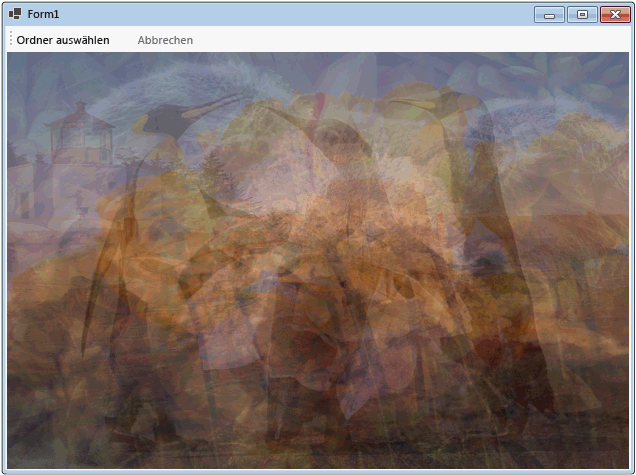

# Exemplarische Vorgehensweise: Datenfluss in einer Windows Forms-Anwendung verwendenWalkthrough: Using Dataflow in a Windows Forms Application
Dieses Dokument veranschaulicht, wie ein Netzwerk von Datenflussblöcken erstellt wird, die eine Bildverarbeitung in einer Windows Forms-Anwendung durchführen.This document demonstrates how to create a network of dataflow blocks that perform image processing in a Windows Forms application.  
  
 In diesem Beispiel werden Bilddateien aus dem angegebenen Ordner geladen, es wird ein zusammengesetztes Bild erstellt und das Ergebnis wird angezeigt.This example loads image files from the specified folder, creates a composite image, and displays the result. Im Beispiel wird das Datenflussmodell verwendet, um Bilder durch das Netzwerk zu leiten.The example uses the dataflow model to route images through the network. Im Datenflussmodell kommunizieren unabhängige Komponenten eines Programms durch Senden von Nachrichten miteinander.In the dataflow model, independent components of a program communicate with one another by sending messages. Wenn eine Komponente eine Nachricht empfängt, führt sie eine Aktion aus und übergibt dann das Ergebnis an eine andere Komponente.When a component receives a message, it performs some action and then passes the result to another component. Dies ist vergleichbar mit dem Ablaufsteuerungsmodell, in dem eine Anwendung Steuerungsstrukturen wie bedingte Anweisungen, Schleifen usw.verwendet, um die Reihenfolge der Vorgänge in einem Programm zu steuern.Compare this with the control flow model, in which an application uses control structures, for example, conditional statements, loops, and so on, to control the order of operations in a program.  
  
## VoraussetzungenPrerequisites  
 Lesen Sie das Thema [Datenfluss](dataflow-task-parallel-library.md), bevor Sie mit dieser exemplarischen Vorgehensweise beginnen.Read [Dataflow](dataflow-task-parallel-library.md) before you start this walkthrough.  

[!INCLUDE [tpl-install-instructions](../../../includes/tpl-install-instructions.md)]

## AbschnitteSections  
 Diese exemplarische Vorgehensweise enthält folgende Abschnitte:This walkthrough contains the following sections:  
  
- [Erstellen der Windows Forms-AnwendungCreating the Windows Forms Application](#winforms)  
  
- [Erstellen des DatenflussnetzwerksCreating the Dataflow Network](#network)  
  
- [Verbinden des Datenflussnetzwerks mit der BenutzeroberflächeConnecting the Dataflow Network to the User Interface](#ui)  
  
- [Vollständiges BeispielThe Complete Example](#complete)  
  

## Erstellen der Windows Forms-AnwendungCreating the Windows Forms Application  
 In diesem Abschnitt wird beschrieben, wie Sie die grundlegende Windows Forms-Anwendung erstellen und Steuerelemente zum Hauptformular hinzufügen.This section describes how to create the basic Windows Forms application and add controls to the main form.  
  
### Erstellen der Windows Forms-AnwendungTo Create the Windows Forms Application  
  
1. Erstellen Sie in Visual Studio ein Visual C#- oder Visual Basic-Projekt des Typs **Windows Forms-Anwendung**.In Visual Studio, create a Visual C# or Visual Basic **Windows Forms Application** project. In diesem Dokument hat das Projekt den Namen `CompositeImages`.In this document, the project is named `CompositeImages`.  
  
2. Fügen Sie im Formulardesigner für das Hauptformular „Form1.cs“ („Form1.vb“ in Visual Basic) ein <xref:System.Windows.Forms.ToolStrip>-Steuerelement hinzu.On the form designer for the main form, Form1.cs (Form1.vb for Visual Basic), add a <xref:System.Windows.Forms.ToolStrip> control.  
  
3. Fügen Sie dem <xref:System.Windows.Forms.ToolStrip>-Steuerelement ein <xref:System.Windows.Forms.ToolStripButton>-Steuerelement hinzu.Add a <xref:System.Windows.Forms.ToolStripButton> control to the <xref:System.Windows.Forms.ToolStrip> control. Legen Sie die <xref:System.Windows.Forms.ToolStripItem.DisplayStyle%2A>-Eigenschaft auf <xref:System.Windows.Forms.ToolStripItemDisplayStyle.Text> und die <xref:System.Windows.Forms.ToolStripItem.Text%2A>-Eigenschaft auf **Ordner auswählen** fest.Set the <xref:System.Windows.Forms.ToolStripItem.DisplayStyle%2A> property to <xref:System.Windows.Forms.ToolStripItemDisplayStyle.Text> and the <xref:System.Windows.Forms.ToolStripItem.Text%2A> property to **Choose Folder**.  
  
4. Fügen Sie dem <xref:System.Windows.Forms.ToolStrip>-Steuerelement ein zweites <xref:System.Windows.Forms.ToolStripButton>-Steuerelement hinzu.Add a second <xref:System.Windows.Forms.ToolStripButton> control to the <xref:System.Windows.Forms.ToolStrip> control. Legen Sie die <xref:System.Windows.Forms.ToolStripItem.DisplayStyle%2A>-Eigenschaft auf <xref:System.Windows.Forms.ToolStripItemDisplayStyle.Text>, die <xref:System.Windows.Forms.ToolStripItem.Text%2A>-Eigenschaft auf **Abbrechen** und die <xref:System.Windows.Forms.ToolStripItem.Enabled%2A>-Eigenschaft auf `False` fest.Set the <xref:System.Windows.Forms.ToolStripItem.DisplayStyle%2A> property to <xref:System.Windows.Forms.ToolStripItemDisplayStyle.Text>, the <xref:System.Windows.Forms.ToolStripItem.Text%2A> property to **Cancel**, and the <xref:System.Windows.Forms.ToolStripItem.Enabled%2A> property to `False`.  
  
5. Fügen Sie dem Hauptformular ein <xref:System.Windows.Forms.PictureBox>-Objekt hinzu.Add a <xref:System.Windows.Forms.PictureBox> object to the main form. Legen Sie die <xref:System.Windows.Forms.Control.Dock%2A>-Eigenschaft auf <xref:System.Windows.Forms.DockStyle.Fill> fest.Set the <xref:System.Windows.Forms.Control.Dock%2A> property to <xref:System.Windows.Forms.DockStyle.Fill>.  
  

## Erstellen des DatenflussnetzwerksCreating the Dataflow Network  
 Dieser Abschnitt beschreibt das Erstellen eines Datenflussnetzwerks, das Bildverarbeitung durchführt.This section describes how to create the dataflow network that performs image processing.  
  
### Erstellen des DatenflussnetzwerksTo Create the Dataflow Network  
  
1. Fügen Sie Ihrem Projekt einen Verweis auf „System.Threading.Tasks.Dataflow.dll“ hinzu.Add a reference to System.Threading.Tasks.Dataflow.dll to your project.  
  
2. Stellen Sie sicher, dass „Form1.cs“ („Form1.vb“ für Visual Basic) die folgenden `using`-Anweisungen (`Using` in Visual Basic) enthält:Ensure that Form1.cs (Form1.vb for Visual Basic) contains the following `using` (`Using` in Visual Basic) statements:  
  
     [!code-csharp[TPLDataflow_CompositeImages#1](../../../samples/snippets/csharp/VS_Snippets_Misc/tpldataflow_compositeimages/cs/compositeimages/form1.cs#1)]  
  
3. Fügen Sie der `Form1`-Klasse die folgenden Datenmember hinzu:Add the following data members to the `Form1` class:  
  
     [!code-csharp[TPLDataflow_CompositeImages#2](../../../samples/snippets/csharp/VS_Snippets_Misc/tpldataflow_compositeimages/cs/compositeimages/form1.cs#2)]  
  
4. Fügen Sie der `Form1`-Klasse die folgende `CreateImageProcessingNetwork`-Methode hinzu:Add the following method, `CreateImageProcessingNetwork`, to the `Form1` class. Diese Methode erstellt das Bildverarbeitungsnetzwerk.This method creates the image processing network.  
  
     [!code-csharp[TPLDataflow_CompositeImages#3](../../../samples/snippets/csharp/VS_Snippets_Misc/tpldataflow_compositeimages/cs/compositeimages/form1.cs#3)]  
  
5. Implementieren Sie die `LoadBitmaps`-Methode.Implement the `LoadBitmaps` method.  
  
     [!code-csharp[TPLDataflow_CompositeImages#4](../../../samples/snippets/csharp/VS_Snippets_Misc/tpldataflow_compositeimages/cs/compositeimages/form1.cs#4)]  
  
6. Implementieren Sie die `CreateCompositeBitmap`-Methode.Implement the `CreateCompositeBitmap` method.  
  
     [!code-csharp[TPLDataflow_CompositeImages#5](../../../samples/snippets/csharp/VS_Snippets_Misc/tpldataflow_compositeimages/cs/compositeimages/form1.cs#5)]  
  
    > [!NOTE]
    > Die C#-Version der `CreateCompositeBitmap`-Methode verwendet Zeiger, um eine effiziente Verarbeitung der <xref:System.Drawing.Bitmap?displayProperty=nameWithType>-Objekte zu ermöglichen.The C# version of the `CreateCompositeBitmap` method uses pointers to enable efficient processing of the <xref:System.Drawing.Bitmap?displayProperty=nameWithType> objects. Aus diesem Grund müssen Sie die Option **Unsicheren Code zulassen** in Ihrem Projekt aktivieren, um das [unsafe](../../csharp/language-reference/keywords/unsafe.md)-Schlüsselwort zu verwenden.Therefore, you must enable the **Allow unsafe code** option in your project in order to use the [unsafe](../../csharp/language-reference/keywords/unsafe.md) keyword. Weitere Informationen zum Aktivieren von unsicheren Codes in einem Visual C#-Projekt finden Sie unter [Seite „Erstellen“, Projekt-Designer (C#)](/visualstudio/ide/reference/build-page-project-designer-csharp).For more information about how to enable unsafe code in a Visual C# project, see [Build Page, Project Designer (C#)](/visualstudio/ide/reference/build-page-project-designer-csharp).  
  
 In der folgenden Tabelle werden die Member des Netzwerks beschrieben.The following table describes the members of the network.  
  
|MemberMember|Geben Sie Folgendes ein:Type|BeschreibungDescription|  
|------------|----------|-----------------|  
|`loadBitmaps`|<xref:System.Threading.Tasks.Dataflow.TransformBlock%602>|Akzeptiert einen Ordnerpfad als Eingabe und erzeugt eine Auflistung von <xref:System.Drawing.Bitmap>-Objekten als Ausgabe.Takes a folder path as input and produces a collection of <xref:System.Drawing.Bitmap> objects as output.|  
|`createCompositeBitmap`|<xref:System.Threading.Tasks.Dataflow.TransformBlock%602>|Akzeptiert eine Auflistung von <xref:System.Drawing.Bitmap>-Objekten als Eingabe und erzeugt eine zusammengesetzte Bitmap als Ausgabe.Takes a collection of <xref:System.Drawing.Bitmap> objects as input and produces a composite bitmap as output.|  
|`displayCompositeBitmap`|<xref:System.Threading.Tasks.Dataflow.ActionBlock%601>|Zeigt die zusammengesetzte Bitmap im Formular an.Displays the composite bitmap on the form.|  
|`operationCancelled`|<xref:System.Threading.Tasks.Dataflow.ActionBlock%601>|Zeigt ein Bild an, um anzugeben, dass der Vorgang abgebrochen wird, und ermöglicht es dem Benutzer, einen anderen Ordner auszuwählen.Displays an image to indicate that the operation is canceled and enables the user to select another folder.|  
  
 Um die Datenflussblöcke zu einem Netzwerk zu verbinden, wird in diesem Beispiel die <xref:System.Threading.Tasks.Dataflow.ISourceBlock%601.LinkTo%2A>-Methode verwendet.To connect the dataflow blocks to form a network, this example uses the <xref:System.Threading.Tasks.Dataflow.ISourceBlock%601.LinkTo%2A> method. Die <xref:System.Threading.Tasks.Dataflow.ISourceBlock%601.LinkTo%2A>-Methode enthält eine überladene Version, die ein <xref:System.Predicate%601>-Objekt akzeptiert, das definiert, ob der Zielblock eine Nachricht akzeptiert oder ablehnt.The <xref:System.Threading.Tasks.Dataflow.ISourceBlock%601.LinkTo%2A> method contains an overloaded version that takes a <xref:System.Predicate%601> object that determines whether the target block accepts or rejects a message. Dieser Filtermechanismus aktiviert Nachrichtenblöcke so, dass sie nur bestimmte Werte empfangen.This filtering mechanism enables message blocks to receive only certain values. In diesem Beispiel kann das Netzwerk auf zwei Arten verzweigen.In this example, the network can branch in one of two ways. Die Hauptverzweigung lädt die Bilder vom Datenträger, erstellt das zusammengesetzte Bild und zeigt das Bild auf dem Formular an.The main branch loads the images from disk, creates the composite image, and displays that image on the form. Die alternative Verzweigung bricht den aktuellen Vorgang ab.The alternate branch cancels the current operation. Die <xref:System.Predicate%601>-Objekte aktivieren die Datenflussblöcke entlang der Hauptverzweigung, um zur alternativen Verzweigung zu wechseln, indem bestimmte Nachrichten zurückgewiesen werden.The <xref:System.Predicate%601> objects enable the dataflow blocks along the main branch to switch to the alternative branch by rejecting certain messages. Wenn der Benutzer beispielsweise den Vorgang abbricht, erzeugt der Datenflussblock `createCompositeBitmap``null` (`Nothing` in Visual Basic) als Ausgabe.For example, if the user cancels the operation, the dataflow block `createCompositeBitmap` produces `null` (`Nothing` in Visual Basic) as its output. Der Datenflussblock `displayCompositeBitmap` lehnt `null`-Eingabewerte ab, und daher wird die Nachricht `operationCancelled` bereitgestellt.The dataflow block `displayCompositeBitmap` rejects `null` input values, and therefore, the message is offered to `operationCancelled`. Der Datenflussblock `operationCancelled` akzeptiert alle Nachrichten und zeigt daher ein Bild an, um anzugeben, dass der Vorgang abgebrochen wird.The dataflow block `operationCancelled` accepts all messages and therefore, displays an image to indicate that the operation is canceled.  
  
 Die folgende Abbildung zeigt das Bildverarbeitungsnetzwerk:The following illustration shows the image processing network:  
  
   
  
 Da die `displayCompositeBitmap`- und `operationCancelled`-Datenflussblöcke als Benutzeroberfläche agiert, ist es wichtig, dass diese Aktionen im Benutzeroberflächenthread erfolgen.Because the `displayCompositeBitmap` and `operationCancelled` dataflow blocks act on the user interface, it is important that these actions occur on the user-interface thread. Um dies zu erreichen, stellen diese Objekte während der Erstellung ein <xref:System.Threading.Tasks.Dataflow.ExecutionDataflowBlockOptions>-Objekt bereit, für das die <xref:System.Threading.Tasks.Dataflow.DataflowBlockOptions.TaskScheduler%2A>-Eigenschaft auf <xref:System.Threading.Tasks.TaskScheduler.FromCurrentSynchronizationContext%2A?displayProperty=nameWithType> festgelegt ist.To accomplish this, during construction, these objects each provide a <xref:System.Threading.Tasks.Dataflow.ExecutionDataflowBlockOptions> object that has the <xref:System.Threading.Tasks.Dataflow.DataflowBlockOptions.TaskScheduler%2A> property set to <xref:System.Threading.Tasks.TaskScheduler.FromCurrentSynchronizationContext%2A?displayProperty=nameWithType>. Die <xref:System.Threading.Tasks.TaskScheduler.FromCurrentSynchronizationContext%2A?displayProperty=nameWithType>-Methode erstellt ein <xref:System.Threading.Tasks.TaskScheduler>-Objekt, das Arbeiten im aktuellen Synchronisierungskontext durchführt.The <xref:System.Threading.Tasks.TaskScheduler.FromCurrentSynchronizationContext%2A?displayProperty=nameWithType> method creates a <xref:System.Threading.Tasks.TaskScheduler> object that performs work on the current synchronization context. Da die `CreateImageProcessingNetwork`-Methode vom Handler der Schaltfläche **Ordner auswählen** aufgerufen wird, die im Benutzeroberflächenthread ausgeführt wird, werden die Aktionen für den `displayCompositeBitmap`- und den `operationCancelled`-Datenflussblock ebenfalls im Benutzeroberflächenthread ausgeführt.Because the `CreateImageProcessingNetwork` method is called from the handler of the **Choose Folder** button, which runs on the user-interface thread, the actions for the `displayCompositeBitmap` and `operationCancelled` dataflow blocks also run on the user-interface thread.  
  
 In diesem Beispiel wird ein gemeinsames Abbruchtoken verwendet, anstatt die <xref:System.Threading.Tasks.Dataflow.DataflowBlockOptions.CancellationToken%2A>-Eigenschaft festzulegen, da die <xref:System.Threading.Tasks.Dataflow.DataflowBlockOptions.CancellationToken%2A>-Eigenschaft die Ausführung des Datenflussblocks endgültig abbricht.This example uses a shared cancellation token instead of setting the <xref:System.Threading.Tasks.Dataflow.DataflowBlockOptions.CancellationToken%2A> property because the <xref:System.Threading.Tasks.Dataflow.DataflowBlockOptions.CancellationToken%2A> property permanently cancels dataflow block execution. Dank eines Abbruchtokens kann dieses Beispiel das gleiche Datenflussnetzwerk mehrmals wiederverwenden, und zwar selbst dann, wenn der Benutzer einen oder mehrere Vorgänge abbricht.A cancellation token enables this example to reuse the same dataflow network multiple times, even when the user cancels one or more operations. Ein Beispiel für die Verwendung von <xref:System.Threading.Tasks.Dataflow.DataflowBlockOptions.CancellationToken%2A> für den endgültigen Abbruch der Ausführung des Datenflussblocks finden Sie unter [Gewusst wie: Abbrechen eines Datenflussblocks](how-to-cancel-a-dataflow-block.md).For an example that uses <xref:System.Threading.Tasks.Dataflow.DataflowBlockOptions.CancellationToken%2A> to permanently cancel the execution of a dataflow block, see [How to: Cancel a Dataflow Block](how-to-cancel-a-dataflow-block.md).  
  

## Verbinden des Datenflussnetzwerks mit der BenutzeroberflächeConnecting the Dataflow Network to the User Interface  
 In diesem Abschnitt wird beschrieben, wie Sie das Datenflussnetzwerk mit der Benutzeroberfläche verbinden.This section describes how to connect the dataflow network to the user interface. Die Erstellung des zusammengesetzten Bildes und der Abbruch des Vorgangs werden über die Schaltflächen **Ordner auswählen** und **Abbrechen** initiiert.The creation of the composite image and cancellation of the operation are initiated from the **Choose Folder** and **Cancel** buttons. Wenn der Benutzer eine dieser Schaltflächen auswählt, wird die entsprechende Aktion auf asynchrone Weise initiiert.When the user chooses either of these buttons, the appropriate action is initiated in an asynchronous manner.  
  
### Verbinden des Datenflussnetzwerks mit der BenutzeroberflächeTo Connect the Dataflow Network to the User Interface  
  
1. Erstellen Sie im Formulardesigner für das Hauptformular einen Ereignishandler für das <xref:System.Windows.Forms.ToolStripItem.Click>-Ereignis der Schaltfläche **Ordner auswählen**.On the form designer for the main form, create an event handler for the <xref:System.Windows.Forms.ToolStripItem.Click> event for the **Choose Folder** button.  
  
2. Implementieren Sie das <xref:System.Windows.Forms.ToolStripItem.Click>-Ereignis für die Schaltfläche **Ordner auswählen**.Implement the <xref:System.Windows.Forms.ToolStripItem.Click> event for the **Choose Folder** button.  
  
     [!code-csharp[TPLDataflow_CompositeImages#6](../../../samples/snippets/csharp/VS_Snippets_Misc/tpldataflow_compositeimages/cs/compositeimages/form1.cs#6)]  
  
3. Erstellen Sie im Formulardesigner für das Hauptformular einen Ereignishandler für das <xref:System.Windows.Forms.ToolStripItem.Click>-Ereignis der Schaltfläche **Abbrechen**.On the form designer for the main form, create an event handler for the <xref:System.Windows.Forms.ToolStripItem.Click> event for the **Cancel** button.  
  
4. Implementieren Sie das <xref:System.Windows.Forms.ToolStripItem.Click>-Ereignis für die Schaltfläche **Abbrechen**.Implement the <xref:System.Windows.Forms.ToolStripItem.Click> event for the **Cancel** button.  
  
     [!code-csharp[TPLDataflow_CompositeImages#7](../../../samples/snippets/csharp/VS_Snippets_Misc/tpldataflow_compositeimages/cs/compositeimages/form1.cs#7)]  
  

## Vollständiges BeispielThe Complete Example  
 Das folgende Beispiel enthält den vollständigen Code für diese exemplarische Vorgehensweise.The following example shows the complete code for this walkthrough.  
  
 [!code-csharp[TPLDataflow_CompositeImages#100](../../../samples/snippets/csharp/VS_Snippets_Misc/tpldataflow_compositeimages/cs/compositeimages/form1.cs#100)]  
  
 Die folgende Abbildung zeigt die normale Ausgabe für den gemeinsamen Ordner „\Sample Pictures\“.The following illustration shows typical output for the common \Sample Pictures\ folder.  
  
   

## Weitere InformationenSee also

- [Dataflow (Datenfluss)Dataflow](dataflow-task-parallel-library.md)
