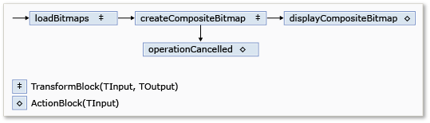

# Walkthrough: Using Dataflow in a Windows Forms Application
Dieses Dokument veranschaulicht, wie ein Netzwerk von Datenflussblöcken erstellt, die Bildverarbeitung in einer Windows Forms\-Anwendung ausführen.  
  
 Dieses Beispiel lädt Bilddateien im angegebenen Ordner, erstellt ein zusammengesetztes Bild und das Ergebnis angezeigt.  Im Beispiel wird das Datenflussmodell verwendet, um Bilder durch das Netzwerk zu leiten.  Im Datenflussmodell kommunizieren unabhängige Komponenten eines Programms durch den Austausch von Nachrichten.  Wenn eine Komponente eine Nachricht empfängt, führt sie eine Aktion aus und führt dann das Ergebnis an eine andere Komponente.  Vergleichen Sie dies mit dem Ablaufsteuerungsmodell, in dem die Reihenfolge der Vorgänge in einem Programm von der Anwendung mithilfe von Steuerungsstrukturen wie Bedingungsanweisungen oder Schleifen kontrolliert wird.  
  
## Vorbereitungsmaßnahmen  
 Lesen Sie unter [Datenfluss](../../../docs/standard/parallel-programming/dataflow-task-parallel-library.md), bevor Sie mit dieser exemplarischen Vorgehensweise beginnen.  
  
> [!TIP]
>  Die TPL\-Datenflussbibliothek \(<xref:System.Threading.Tasks.Dataflow?displayProperty=fullName>\-Namespace\) ist nicht in [!INCLUDE[net_v45](../../../includes/net-v45-md.md)] enthalten.  Öffnen Sie zum Installieren des <xref:System.Threading.Tasks.Dataflow>\-Namespace das Projekt in [!INCLUDE[vs_dev11_long](../../../includes/vs-dev11-long-md.md)], wählen Sie im Menü "Projekt" die Option **NuGet\-Pakete verwalten** aus, und suchen Sie online nach dem `Microsoft.Tpl.Dataflow`\-Paket.  
  
> [!TIP]
>  Die TPL\-Datenflussbibliothek \(<xref:System.Threading.Tasks.Dataflow?displayProperty=fullName>\-Namespace\) ist nicht in [!INCLUDE[net_v45](../../../includes/net-v45-md.md)] enthalten.  Öffnen Sie zum Installieren des <xref:System.Threading.Tasks.Dataflow>\-Namespace das Projekt in [!INCLUDE[vs_dev11_long](../../../includes/vs-dev11-long-md.md)], wählen Sie im Menü "Projekt" die Option **NuGet\-Pakete verwalten** aus, und suchen Sie online nach dem `Microsoft.Tpl.Dataflow`\-Paket.  
  
## Abschnitte  
 Diese exemplarische Vorgehensweise enthält folgende Abschnitte:  
  
-   [Erstellen der Windows Forms\-Anwendung](#winforms)  
  
-   [Erstellen des Datenfluss\-Netzwerks](#network)  
  
-   [Verbinden des Datenfluss\-Netzwerks an die Benutzeroberfläche](#ui)  
  
-   [Vollständiges Beispiel](#complete)  
  
   
## Erstellen der Windows Forms\-Anwendung  
 Dieser Abschnitt beschreibt, wie die grundlegende Windows Forms\-Anwendung erstellt und Steuerelemente dem Hauptformular hinzufügt.  
  
#### So fügen Sie die Windows Forms\-Anwendung erstellen  
  
1.  In [!INCLUDE[vsprvs](../../../includes/vsprvs-md.md)] erstellen Sie ein [!INCLUDE[csprcs](../../../includes/csprcs-md.md)] \- oder Visual Basic\-Code Projekt **Windows Forms\-Anwendung**.  In diesem Dokument wird das Projekt `CompositeImages`.  
  
2.  Klicken Sie im Formular\-Designer zum Hauptformular fügen Form1.vb, Form1.cs \(für [!INCLUDE[vbprvb](../../../includes/vbprvb-md.md)]\), ein <xref:System.Windows.Forms.ToolStrip>\-Steuerelement hinzu.  
  
3.  Fügen Sie ein <xref:System.Windows.Forms.ToolStripButton>\-Steuerelement dem <xref:System.Windows.Forms.ToolStrip>\-Steuerelement hinzu.  Legen Sie die Eigenschaft <xref:System.Windows.Forms.ToolStripItem.DisplayStyle%2A> auf <xref:System.Windows.Forms.ToolStripItemDisplayStyle> und die Eigenschaft <xref:System.Windows.Forms.ToolStripItem.Text%2A> fest, um die Ordner auszuwählen.  
  
4.  Fügen Sie ein <xref:System.Windows.Forms.ToolStripButton>\-Steuerelement Sekunden das <xref:System.Windows.Forms.ToolStrip>\-Steuerelement hinzu.  Legen Sie die Eigenschaft <xref:System.Windows.Forms.ToolStripItem.DisplayStyle%2A> auf <xref:System.Windows.Forms.ToolStripItemDisplayStyle>, die <xref:System.Windows.Forms.ToolStripItem.Text%2A>\-Eigenschaft auf Abbrechen und die Eigenschaft <xref:System.Windows.Forms.ToolStripItem.Enabled%2A> auf `False` fest.  
  
5.  Fügen Sie ein <xref:System.Windows.Forms.PictureBox>\-Objekt auf das Hauptformular hinzu.  Legen Sie die <xref:System.Windows.Forms.Control.Dock%2A>\-Eigenschaft auf <xref:System.Windows.Forms.DockStyle> fest.  
  
   
## Erstellen des Datenfluss\-Netzwerks  
 Dieser Abschnitt beschreibt, wie das Datenflussnetzwerk erstellt, das Bildverarbeitung ausführt.  
  
#### Um das Datenfluss\-Netzwerk erstellen  
  
1.  Fügen Sie einen Verweis auf System.Threading.Tasks.Dataflow.dll dem Projekt hinzu.  
  
2.  Stellen Sie sicher, dass Form1.cs Form1.vb \(für [!INCLUDE[vbprvb](../../../includes/vbprvb-md.md)]\) die folgenden `using`\-Anweisungen \(`Using` in [!INCLUDE[vbprvb](../../../includes/vbprvb-md.md)]\) enthält:  
  
     [!code-csharp[TPLDataflow_CompositeImages#1](../../../samples/snippets/csharp/VS_Snippets_Misc/tpldataflow_compositeimages/cs/compositeimages/form1.cs#1)]  
  
3.  Fügen Sie folgenden Datenmember der Klasse `Form1` hinzu:  
  
     [!code-csharp[TPLDataflow_CompositeImages#2](../../../samples/snippets/csharp/VS_Snippets_Misc/tpldataflow_compositeimages/cs/compositeimages/form1.cs#2)]  
  
4.  Fügen Sie die folgende Methode, `CreateImageProcessingNetwork`, der `Form1`\-Klasse hinzu.  Diese Methode erstellt das Bildverarbeitungsnetzwerk.  
  
     [!code-csharp[TPLDataflow_CompositeImages#3](../../../samples/snippets/csharp/VS_Snippets_Misc/tpldataflow_compositeimages/cs/compositeimages/form1.cs#3)]  
  
5.  Implementieren Sie die `LoadBitmaps`\-Methode.  
  
     [!code-csharp[TPLDataflow_CompositeImages#4](../../../samples/snippets/csharp/VS_Snippets_Misc/tpldataflow_compositeimages/cs/compositeimages/form1.cs#4)]  
  
6.  Implementieren Sie die `CreateCompositeBitmap`\-Methode.  
  
     [!code-csharp[TPLDataflow_CompositeImages#5](../../../samples/snippets/csharp/VS_Snippets_Misc/tpldataflow_compositeimages/cs/compositeimages/form1.cs#5)]  
  
    > [!NOTE]
    >  Die C\#\-Version der `CreateCompositeBitmap`\-Methode Zeiger verwendet, um ein effizientes Verarbeitung der <xref:System.Drawing.Bitmap?displayProperty=fullName>\-Objekte zu aktivieren.  Daher müssen Sie die Option **Unsicheren Code zulassen** im Projekt ermöglichen, das Schlüsselwort [unsicher](../Topic/unsafe%20\(C%23%20Reference\).md) zu verwenden.  Weitere Informationen dazu, wie unsicheren Code in einem Projekt [!INCLUDE[csprcs](../../../includes/csprcs-md.md)], finden Sie unter [Seite "Erstellen", Projekt\-Designer \(C\#\)](../Topic/Build%20Page,%20Project%20Designer%20\(C%23\).md).  
  
 In der folgenden Tabelle werden die Member des Netzwerks beschrieben.  
  
|Member|Typ|**Beschreibung**|  
|------------|---------|----------------------|  
|`loadBitmaps`|<xref:System.Threading.Tasks.Dataflow.TransformBlock%602>|Nimmt einen angezeigten Ordnerpfad, als Eingabe und erzeugt eine Auflistung <xref:System.Drawing.Bitmap>\-Objekte, z ausgegeben.|  
|`createCompositeBitmap`|<xref:System.Threading.Tasks.Dataflow.TransformBlock%602>|Entlädt eine Auflistung Objekte, <xref:System.Drawing.Bitmap> als Eingabe und erzeugt eine Zusammensetzungsbitmap, als Ausgabe.|  
|`displayCompositeBitmap`|<xref:System.Threading.Tasks.Dataflow.ActionBlock%601>|Zeigt die zusammengesetzte Bitmap auf dem Formular an.|  
|`operationCancelled`|<xref:System.Threading.Tasks.Dataflow.ActionBlock%601>|Zeigt ein Bild an, um anzugeben, dass der Vorgang abgebrochen wird und ermöglicht dem Benutzer, um einen anderen Ordner auszuwählen.|  
  
 Um die Datenflussblöcke herzustellen um ein Netzwerk zu bilden, werden in diesem Beispiel die <xref:System.Threading.Tasks.Dataflow.ISourceBlock%601.LinkTo%2A> methode.  Die <xref:System.Threading.Tasks.Dataflow.ISourceBlock%601.LinkTo%2A> methode enthält eine überladene Version, die ein <xref:System.Predicate%601>\-Objekt akzeptiert, die bestimmt, ob der Zielblock eine Meldung akzeptiert oder zurückweist.  Dieser Filtermechanismus ermöglicht Nachrichtenblöcken zu bestimmten EmpfangsWerten.  In diesem Beispiel kann das Netzwerk in zwei Arten verzweigen.  Die Main\-Verzweigung werden die Bilder vom Datenträger erstellt, das zusammengesetzte Bild und zeigt dieses Bild im Formular.  Die alternative Verzweigung bricht den aktuellen Vorgang ab.  Die Objekte <xref:System.Predicate%601> aktivieren die Datenflussblöcke entlang der Main\-Verzweigung, um zur Verzweigung alternativen wechseln, indem bestimmte Nachrichten ablehnen.  Wenn der Benutzer den Vorgang abbricht, erzeugt der Datenflussblock `createCompositeBitmap``null` \(`Nothing` in [!INCLUDE[vbprvb](../../../includes/vbprvb-md.md)]\) als Ausgabe.  Der Datenflussblock `displayCompositeBitmap` weist `null` Eingabewerte zurück, und daher, wird die Meldung `operationCancelled` bereitgestellt.  Der Datenflussblock `operationCancelled` akzeptiert alle Meldungen, und deshalb zeigt ein Bild an, um anzugeben, dass die Operation abgebrochen wird.  
  
 In der folgenden Abbildung wird das Bildverarbeitungsnetzwerk veranschaulicht.  
  
   
  
 Da die `displayCompositeBitmap` und `operationCancelled` Datenflussblöcke nach der Benutzeroberfläche handeln, ist es wichtig, dass diese Aktionen auf dem Benutzeroberflächenthread auftreten.  Um dieses, während der Erstellung zu erreichen, enthalten diese Objekte jedes ein <xref:System.Threading.Tasks.Dataflow.ExecutionDataflowBlockOptions>\-Objekt das den <xref:System.Threading.Tasks.Dataflow.DataflowBlockOptions.TaskScheduler%2A>\-Eigenschaft auf <xref:System.Threading.Tasks.TaskScheduler.FromCurrentSynchronizationContext%2A?displayProperty=fullName> festgelegt ist.  Die <xref:System.Threading.Tasks.TaskScheduler.FromCurrentSynchronizationContext%2A?displayProperty=fullName>\-Methode erstellt ein <xref:System.Threading.Tasks.TaskScheduler>\-Objekt, das Aufgaben im aktuellen Synchronisierungskontext ausführt.  Da die `CreateImageProcessingNetwork`\-Methode aus dem Handler der Auswählens\-Ordnerschaltfläche aufgerufen wird, die für den Benutzeroberflächenthread ausgeführt wird, werden die Aktionen für die `displayCompositeBitmap` und `operationCancelled` Datenflussblöcke auch für den Benutzeroberflächenthread ausgeführt.  
  
 In diesem Beispiel wird ein freigegebenes Abbruchtoken, anstatt, die <xref:System.Threading.Tasks.Dataflow.DataflowBlockOptions.CancellationToken%2A>\-Eigenschaft festzulegen, da die <xref:System.Threading.Tasks.Dataflow.DataflowBlockOptions.CancellationToken%2A>\-Eigenschaft Datenflussblocksausführung dauerhaft abbricht.  Ein Abbruchtoken aktiviert dieses Beispiel, um dasselbe Datenflussnetzwerk mehrmals zu verwenden, auch wenn der Benutzer mindestens Vorgänge abbrechen.  Ein Beispiel dieses wird mit <xref:System.Threading.Tasks.Dataflow.DataflowBlockOptions.CancellationToken%2A>, die Ausführung eines Datenflussblocks dauerhaft abzubrechen, [How to: Cancel a Dataflow Block](../../../docs/standard/parallel-programming/how-to-cancel-a-dataflow-block.md).  
  
   
## Verbinden des Datenfluss\-Netzwerks an die Benutzeroberfläche  
 Dieser Abschnitt beschreibt, wie das Datenflussnetzwerk an die Benutzeroberfläche herstellt.  Die Erstellung des zusammengesetzten Bilds und der Abbruch des Vorgangs sind vom Auswählens\-Ordner initiiert und Schaltflächen abbrechen.  Wenn der Benutzer eine dieser Schaltflächen auswählt, werden die entsprechenden Schritte in einer asynchronen Art initiiert.  
  
#### Um das Datenfluss\-Netzwerk an die Benutzeroberfläche herstellen  
  
1.  Klicken Sie im Formular\-Designer zum Hauptformular, erstellen Sie einen Ereignishandler für das <xref:System.Windows.Forms.ToolStripItem.Click>\-Ereignis für die Auswählens\-Ordnerschaltfläche erstellt.  
  
2.  Implementieren Sie das <xref:System.Windows.Forms.ToolStripItem.Click>\-Ereignis für die Auswählens\-Ordnerschaltfläche.  
  
     [!code-csharp[TPLDataflow_CompositeImages#6](../../../samples/snippets/csharp/VS_Snippets_Misc/tpldataflow_compositeimages/cs/compositeimages/form1.cs#6)]  
  
3.  Klicken Sie im Formular\-Designer zum Hauptformular, erstellen Sie einen Ereignishandler für das <xref:System.Windows.Forms.ToolStripItem.Click>\-Ereignis für die Abbruchschaltfläche erstellt.  
  
4.  Implementieren Sie das <xref:System.Windows.Forms.ToolStripItem.Click>\-Ereignis für die Schaltfläche Abbrechen.  
  
     [!code-csharp[TPLDataflow_CompositeImages#7](../../../samples/snippets/csharp/VS_Snippets_Misc/tpldataflow_compositeimages/cs/compositeimages/form1.cs#7)]  
  
   
## Vollständiges Beispiel  
 Im folgenden Beispiel wird der vollständige Code für diese exemplarische Vorgehensweise angezeigt.  
  
 [!code-csharp[TPLDataflow_CompositeImages#100](../../../samples/snippets/csharp/VS_Snippets_Misc/tpldataflow_compositeimages/cs/compositeimages/form1.cs#100)]  
  
 Die folgende Abbildung zeigt die typische Ausgabe für die Common\-Ordner \\Beispielbilder\\ an.  
  
   
  
## Nächste Schritte  
  
## Siehe auch  
 [Datenfluss](../../../docs/standard/parallel-programming/dataflow-task-parallel-library.md)