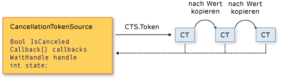

# Abbruch in verwalteten Threads

Ab .NET Framework 4 verwendet .NET ein einheitliches Modell für den kooperativen Abbruch von asynchronen oder lang andauernden synchronen Vorgängen. Dieses Modell basiert auf einem einfachen Objekt, dem sogenannten "Abbruchtoken". Das Objekt, das einen oder mehrere abbrechbare Vorgänge aufruft, z. B. durch Erstellen neuer Threads oder Aufgaben, übergibt das Token an jeden Vorgang. Einzelne Vorgänge können wiederum Kopien des Tokens an andere Vorgänge übergeben. Zu einem späteren Zeitpunkt kann das Objekt, das das Token erstellt hat, damit anfordern, dass die Vorgänge ihre aktuelle Aktivität einstellen. Nur das anfordernde Objekt kann die Abbruchanforderung ausgeben, und jeder Listener ist dafür verantwortlich, die Anforderung zu bemerken und angemessen und rechtzeitig darauf zu reagieren.  
  
Das allgemeine Muster für die Implementierung des kooperativen Abbruchmodells lautet:  
  
- Instanziieren Sie ein <xref:System.Threading.CancellationTokenSource>-Objekt, das die Abbruchbenachrichtigung verwaltet und an die einzelnen Abbruchtoken sendet.  
  
- Übergeben Sie das zurückgegebene Token über die <xref:System.Threading.CancellationTokenSource.Token%2A?displayProperty=nameWithType>-Eigenschaft an jede Aufgabe oder Thread, der zum Lauschen verwendet wird, um den Abbruch zu bemerken.  
  
- Stellen Sie einen Mechanismus für jede Aufgabe oder Thread bereit, um auf den Abbruch zu reagieren.  
  
- Rufen Sie die <xref:System.Threading.CancellationTokenSource.Cancel%2A?displayProperty=nameWithType>-Methode auf, um eine Benachrichtigung über den Abbruch bereitzustellen.  
  
> [!IMPORTANT]
> Die <xref:System.Threading.CancellationTokenSource>-Klasse implementiert die <xref:System.IDisposable>-Schnittstelle. Sie sollten darauf achten, die <xref:System.Threading.CancellationTokenSource.Dispose%2A?displayProperty=nameWithType>-Methode aufzurufen, wenn Sie die Verwendung der Abbruchtokenquelle abgeschlossen haben, um alle darin enthaltenen, nicht verwalteten Ressourcen freizugeben.  
  
 Die folgende Abbildung zeigt die Beziehung zwischen einer Tokenquelle und allen Kopien des Tokens.  
  
   
  
 Das kooperative Abbruchmodell vereinfacht die Erstellung von abbruchfähigen Anwendungen sowie Bibliotheken und unterstützt die folgenden Features:  
  
- Der Abbruch ist kooperativ und wird für den Listener nicht erzwungen. Der Listener bestimmt, wie die ordnungsgemäße Beendigung als Reaktion auf eine Abbruchanforderung durchgeführt wird.  
  
- Die Anforderung unterscheidet sich vom Lauschvorgang. Ein Objekt, das einen abbrechbaren Vorgang aufruft, kann steuern, wann (falls überhaupt) der Abbruch angefordert wird.  
  
- Das anfordernde Objekt sendet die Abbruchanforderung mithilfe eines einzigen Methodenaufrufs an alle Kopien des Tokens.  
  
- Ein Listener kann mehrere Token gleichzeitig belauschen, indem diese zu einem *verknüpften Token* verbunden werden.  
  
- Benutzercode kann Abbruchanforderungen aus Bibliothekscode erkennen und auf diese reagieren, während Bibliothekscode Abbruchanforderungen aus Benutzercode erkennen und auf diese reagieren kann.  
  
- Listener können durch Abruf, Rückrufregistrierung oder Warten auf Wait-Handles über Abbruchanforderungen benachrichtigt werden.  
  
## Abbruchtypen  
 Das Abbruchframework ist als Gruppe von verwandten Typen implementiert, die in der folgenden Tabelle aufgeführt sind.  
  
|Typname|Beschreibung|  
|---------------|-----------------|  
|<xref:System.Threading.CancellationTokenSource>|Ein Objekt, das ein Abbruchtoken erstellt und auch die Abbruchanforderung für alle Kopien dieses Token ausgibt.|  
|<xref:System.Threading.CancellationToken>|Ein einfacher Werttyp, der in der Regel als Methodenparameter an mindestens einen Listener übergeben wird. Listener überwachen den Wert der `IsCancellationRequested`-Eigenschaft des Token durch Abruf, Rückruf oder Wait-Handle.|  
|<xref:System.OperationCanceledException>|Überladungen des Konstruktors dieser Ausnahme akzeptieren ein <xref:System.Threading.CancellationToken> als Parameter. Listener können diese Ausnahme optional auslösen, um die Quelle des Abbruchs zu überprüfen und andere darüber zu benachrichtigen, dass auf eine Abbruchanforderung reagiert wurde.|  
  
 Das Abbruchmodell ist in .NET in mehreren Typen integriert. Die wichtigsten sind <xref:System.Threading.Tasks.Parallel?displayProperty=nameWithType>, <xref:System.Threading.Tasks.Task?displayProperty=nameWithType>, <xref:System.Threading.Tasks.Task%601?displayProperty=nameWithType> und <xref:System.Linq.ParallelEnumerable?displayProperty=nameWithType>. Es wird empfohlen, dieses kooperative Abbruchmodell für sämtlichen neuen Bibliotheks- und Anwendungscode zu verwenden.  
  
## Codebeispiel  
 Im folgenden Beispiel erstellt das anfordernde Objekt ein <xref:System.Threading.CancellationTokenSource>-Objekt und übergibt dann seine <xref:System.Threading.CancellationTokenSource.Token%2A>-Eigenschaft an den abbrechbaren Vorgang. Der Vorgang, der die Anforderung empfängt, überwacht den Wert von der <xref:System.Threading.CancellationToken.IsCancellationRequested%2A>-Eigenschaft des Token durch Abruf. Wenn der Wert zu `true` wechselt, kann der Listener auf geeignete Weise beendet werden. In diesem Beispiel wird die Methode einfach beendet und das ist auch häufig alles, was erforderlich ist.  
  
> [!NOTE]
> Im Beispiel wird die <xref:System.Threading.ThreadPool.QueueUserWorkItem%2A>-Methode verwendet, um zu veranschaulichen, dass das kooperative Abbruchframework mit Legacy-APIs kompatibel ist. Ein Beispiel, das den neuen bevorzugten <xref:System.Threading.Tasks.Task?displayProperty=nameWithType>-Typ verwendet, finden Sie unter [Vorgehensweise: Abbrechen einer Aufgabe und ihrer untergeordneten Elemente](../parallel-programming/how-to-cancel-a-task-and-its-children.md).  
  
 [!code-csharp[Cancellation#1](../../../samples/snippets/csharp/VS_Snippets_Misc/cancellation/cs/cancellationex1.cs#1)]
 [!code-vb[Cancellation#1](../../../samples/snippets/visualbasic/VS_Snippets_Misc/cancellation/vb/cancellationex1.vb#1)]  
  
## Vorgangsabbruch im Vergleich zum Objektabbruch  
 Im kooperativen Abbruchframework bezieht sich der Abbruch auf Vorgänge und nicht auf Objekte. Die Abbruchanforderung bedeutet, dass der Vorgang so schnell wie möglich beendet werden soll, nachdem alle erforderlichen Bereinigungen ausgeführt wurden. Ein Abbruchtoken sollte auf einen "abbrechbaren Vorgang" verweisen, aber dieser Vorgang kann in Ihrem Programm implementiert werden. Nachdem die <xref:System.Threading.CancellationToken.IsCancellationRequested%2A>-Eigenschaft des Tokens auf `true` festgelegt wurde, kann sie nicht wieder auf `false` zurückgesetzt werden. Daher können Abbruchtoken nicht wiederverwendet werden, nachdem sie abgebrochen wurden.  
  
 Wenn Sie einen Objektabbruchmechanismus benötigen, können Sie ihn durch Aufrufen der <xref:System.Threading.CancellationToken.Register%2A?displayProperty=nameWithType>-Methode auf dem Vorgangsabbruchmechanismus basieren lassen, wie im folgenden Beispiel gezeigt.  
  
 [!code-csharp[Cancellation#2](../../../samples/snippets/csharp/VS_Snippets_Misc/cancellation/cs/objectcancellation1.cs#2)]
 [!code-vb[Cancellation#2](../../../samples/snippets/visualbasic/VS_Snippets_Misc/cancellation/vb/objectcancellation1.vb#2)]  
  
 Wenn ein Objekt mehrere gleichzeitig abbrechbare Vorgänge unterstützt, übergeben Sie ein separates Token als Eingabe für die einzelnen abbrechbaren Vorgänge. Auf diese Weise kann ein Vorgang ohne Auswirkung auf die anderen abgebrochen werden.  
  
## Lauschen und Reagieren auf Abbruchanforderungen  
 Im Benutzerdelegaten bestimmt der Implementierer eines abbrechbaren Vorgangs, wie der Vorgang als Reaktion auf eine Abbruchanforderung beendet wird. In vielen Fällen kann der Benutzerdelegat einfach die erforderliche Bereinigung ausführen und dann sofort zurückkehren.  
  
 In komplexeren Fällen ist es für den Benutzerdelegaten möglicherweise erforderlich, den Bibliothekscode darüber zu benachrichtigen, dass der Abbruch aufgetreten ist. In solchen Fällen besteht für den Delegaten die richtige Methode zum Beenden des Vorgangs darin, die <xref:System.Threading.CancellationToken.ThrowIfCancellationRequested%2A>-Methode aufzurufen, die zum Auslösen einer <xref:System.OperationCanceledException> führt. Bibliothekscode kann diese Ausnahme im Benutzerdelegatthread abfangen und das Token der Ausnahme untersuchen, um zu ermitteln, ob die Ausnahme auf einen kooperativen Abbruch oder eine andere Ausnahmesituation hinweist.  
  
 Die <xref:System.Threading.Tasks.Task>-Klasse behandelt <xref:System.OperationCanceledException> auf diese Weise. Weitere Informationen finden Sie unter [Aufgabenabbruch](../parallel-programming/task-cancellation.md).  
  
### Lauschen durch Abruf  
 Bei langandauernden Berechnungen mit Schleifen oder Rekursionen können Sie auf eine Abbruchanforderung lauschen, indem Sie den Wert der <xref:System.Threading.CancellationToken.IsCancellationRequested%2A?displayProperty=nameWithType>-Eigenschaft in regelmäßigen Abständen abfragen. Wenn der Wert `true` lautet, sollte die Methode die Bereinigung vornehmen und so schnell wie möglich beendet werden. Die optimale Häufigkeit für das Abrufen hängt vom Typ der Anwendung ab. Es ist Aufgabe des Entwicklers, die beste Abrufhäufigkeit für ein Programm zu ermitteln. Der Abruf selbst hat keinen signifikanten Einfluss auf die Leistung. Im folgenden Beispiel wird eine Möglichkeit für den Abruf veranschaulicht.  
  
 [!code-csharp[Cancellation#3](../../../samples/snippets/csharp/VS_Snippets_Misc/cancellation/cs/cancellationex11.cs#3)]
 [!code-vb[Cancellation#3](../../../samples/snippets/visualbasic/VS_Snippets_Misc/cancellation/vb/cancellationex11.vb#3)]  
  
 Ein ausführlicheres Beispiel finden Sie unter [Vorgehensweise: Lauschen auf Abbruchanforderungen durch Abruf](how-to-listen-for-cancellation-requests-by-polling.md).  
  
### Lauschen durch Registrieren eines Rückrufs  
 Einige Vorgänge können so blockiert werden, dass sie den Wert des Abbruchtokens nicht rechtzeitig überprüfen können. In diesen Fällen können Sie eine Rückrufmethode registrieren, die die Blockierung der Methode aufhebt, wenn eine Abbruchanforderung empfangen wird.  
  
 Die <xref:System.Threading.CancellationToken.Register%2A>-Methode gibt ein <xref:System.Threading.CancellationTokenRegistration>-Objekt zurück, das speziell für diesen Zweck verwendet wird. Das folgende Beispiel zeigt, wie Sie die <xref:System.Threading.CancellationToken.Register%2A>-Methode zum Abbrechen einer asynchronen Webanforderung verwenden.  
  
 [!code-csharp[Cancellation#4](../../../samples/snippets/csharp/VS_Snippets_Misc/cancellation/cs/cancellationex4.cs#4)]
 [!code-vb[Cancellation#4](../../../samples/snippets/visualbasic/VS_Snippets_Misc/cancellation/vb/cancellationex4.vb#4)]  
  
 Das <xref:System.Threading.CancellationTokenRegistration>-Objekt verwaltet die Threadsynchronisierung und stellt sicher, dass die Ausführung des Rückrufs zu einem bestimmten Zeitpunkt beendet wird.  
  
 Um die Reaktionsfähigkeit des Systems sicherzustellen und Deadlocks zu vermeiden, müssen die folgenden Richtlinien beim Registrieren von Rückrufen beachtet werden:  
  
- Die Rückrufmethode muss schnell sein, da sie synchron aufgerufen wird und der Aufruf von <xref:System.Threading.CancellationTokenSource.Cancel%2A> daher nicht zurückgegeben wird, bevor der Rückruf zurückgegeben wurde.  
  
- Wenn Sie <xref:System.Threading.CancellationTokenRegistration.Dispose%2A> aufrufen, während der Rückruf ausgeführt wird, und Sie eine Sperre aufrechterhalten, auf die der Rückruf wartet, kann für das Programm ein Deadlock auftreten. Nachdem `Dispose` zurückgegeben wurde, können Sie alle für den Rückruf erforderlichen Ressourcen freigeben.  
  
- Rückrufe sollten keine manuellen Threads durchführen oder <xref:System.Threading.SynchronizationContext> in einem Rückruf verwenden. Wenn ein Rückruf für einen bestimmten Thread ausgeführt werden muss, verwenden Sie den <xref:System.Threading.CancellationTokenRegistration?displayProperty=nameWithType>-Konstruktor, mit dem Sie angeben können, dass der Zielsynchronisierungskontext das aktive <xref:System.Threading.SynchronizationContext.Current%2A?displayProperty=nameWithType> ist. Manuelles Threading in einem Rückruf kann zu einem Deadlock führen.  
  
 Ein ausführlicheres Beispiel finden Sie unter [Vorgehensweise: Registrieren von Rückrufen für Abbruchanforderungen](how-to-register-callbacks-for-cancellation-requests.md).  
  
### Lauschen mithilfe eines Wait-Handles  
 Wenn ein abbrechbarer Vorgang blockiert werden kann, während er auf einen primitiven Synchronisierungstyp wie <xref:System.Threading.ManualResetEvent?displayProperty=nameWithType> oder <xref:System.Threading.Semaphore?displayProperty=nameWithType> wartet, können Sie die <xref:System.Threading.CancellationToken.WaitHandle%2A?displayProperty=nameWithType>-Eigenschaft verwenden, um es dem Vorgang zu ermöglichen, auf das Ereignis und die Abbruchanforderung zu warten. Das Wait-Handle des Abbruchtokens wird als Reaktion auf eine Abbruchanforderung signalisiert, und die Methode kann anhand des Rückgabewerts der <xref:System.Threading.WaitHandle.WaitAny%2A>-Methode bestimmen, ob das Abbruchtoken signalisiert hat. Der Vorgang kann dann einfach beenden oder ggf. eine <xref:System.OperationCanceledException> auslösen.  
  
 [!code-csharp[Cancellation#5](../../../samples/snippets/csharp/VS_Snippets_Misc/cancellation/cs/cancellationex9.cs#5)]
 [!code-vb[Cancellation#5](../../../samples/snippets/visualbasic/VS_Snippets_Misc/cancellation/vb/cancellationex9.vb#5)]  
  
Sowohl <xref:System.Threading.ManualResetEventSlim?displayProperty=nameWithType> als auch <xref:System.Threading.SemaphoreSlim?displayProperty=nameWithType> unterstützen das Abbruchframework in ihren `Wait`-Methoden. Sie können das <xref:System.Threading.CancellationToken> an die Methode übergeben und bei der Abbruchanforderung wird das Ereignis reaktiviert, das ein <xref:System.OperationCanceledException> auslöst.  
  
 [!code-csharp[Cancellation#6](../../../samples/snippets/csharp/VS_Snippets_Misc/cancellation/cs/cancellationex10.cs#6)]
 [!code-vb[Cancellation#6](../../../samples/snippets/visualbasic/VS_Snippets_Misc/cancellation/vb/cancellationex10.vb#6)]  
  
 Ein ausführlicheres Beispiel finden Sie unter [Vorgehensweise: Lauschen auf Abbruchanforderungen mit Wait-Handles](how-to-listen-for-cancellation-requests-that-have-wait-handles.md).  
  
### Gleichzeitiges Lauschen auf mehrere Token  
 In einigen Fällen muss ein Listener möglicherweise auf mehrere Abbruchtoken gleichzeitig lauschen. Ein abbrechbarer Vorgang muss z. B. möglicherweise zusätzlich zu einem extern als Argument an einen Methodenparameter übergebenen Token ein internes Abbruchtoken überwachen. Zu diesem Zweck erstellen Sie eine verknüpfte Tokenquelle, die zwei oder mehr Token zu einem Token verbinden kann, wie im folgenden Beispiel gezeigt.  
  
 [!code-csharp[Cancellation#7](../../../samples/snippets/csharp/VS_Snippets_Misc/cancellation/cs/cancellationex13.cs#7)]
 [!code-vb[Cancellation#7](../../../samples/snippets/visualbasic/VS_Snippets_Misc/cancellation/vb/cancellationex13.vb#7)]  
  
 Beachten Sie, dass Sie `Dispose` für die verknüpfte Tokenquelle aufrufen müssen, wenn Sie damit fertig sind. Ein ausführlicheres Beispiel finden Sie unter [Vorgehensweise: Lauschen auf mehrere Abbruchanforderungen](how-to-listen-for-multiple-cancellation-requests.md).  
  
## Kooperation zwischen Bibliothekscode und Benutzercode  
 Das einheitliche Abbruchframework ermöglicht es dem Bibliothekscode, den Benutzercode abzubrechen. Ebenso ermöglicht es dem Benutzercode, den Bibliothekscode auf kooperative Weise abzubrechen. Die problemlose Zusammenarbeit hängt davon ab, ob die beiden Seiten die folgenden Richtlinien beachten:  
  
- Wenn der Bibliothekscode abbrechbare Vorgänge bereitstellt, sollten auch öffentliche Methoden bereitgestellt werden, die ein externes Abbruchtoken akzeptieren, damit der Benutzercode den Abbruch anfordern kann.  
  
- Wenn der Bibliothekscode einen Aufruf innerhalb des Benutzercodes ausführt, sollte der Bibliothekscode ein OperationCanceledException(externalToken) als *kooperativen Abbruch* und nicht notwendigerweise als Fehlerausnahme interpretieren.  
  
- Benutzerdelegaten sollten versuchen, zeitnah auf Abbruchanforderungen aus Bibliothekscode zu reagieren.  
  
 <xref:System.Threading.Tasks.Task?displayProperty=nameWithType> und <xref:System.Linq.ParallelEnumerable?displayProperty=nameWithType> sind Beispiele für Klassen, die diese Richtlinien einhalten. Weitere Informationen finden Sie unter [Aufgabenabbruch](../parallel-programming/task-cancellation.md) und [Vorgehensweise: Abbrechen einer PLINQ-Abfrage](../parallel-programming/how-to-cancel-a-plinq-query.md).  
  
## Siehe auch

- [Grundlagen des verwalteten Threadings](managed-threading-basics.md)
