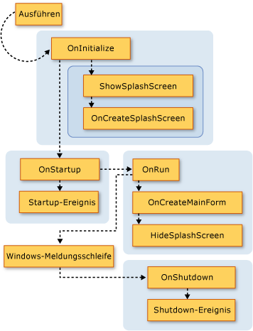
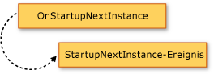
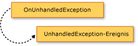

# Extending the Visual Basic Application Model
[!INCLUDE[vs2017banner](../../../visual-basic/includes/vs2017banner.md)]

Sie können durch Überschreiben der `Overridable`\-Member der <xref:Microsoft.VisualBasic.ApplicationServices.WindowsFormsApplicationBase>\-Klasse dem Anwendungsmodell Funktionen hinzufügen.  Mit dieser Technik können Sie das Verhalten des Anwendungsmodells anpassen und Aufrufe eigener Methoden beim Starten und Herunterfahren der Anwendung hinzufügen.  
  
## Visuelle Übersicht über das Anwendungsmodell  
 In diesem Abschnitt wird die Sequenz der Funktionsaufrufe im Visual Basic\-Anwendungsmodell visuell veranschaulicht.  Im nächsten Abschnitt wird ausführlich der Zweck der einzelnen Funktionen beschrieben.  
  
 In der folgenden Grafik wird die Aufrufsequenz des Anwendungsmodells in einer normalen Visual Basic\-Windows Forms\-Anwendung gezeigt.  Die Sequenz beginnt, wenn die `Sub Main`\-Prozedur die <xref:Microsoft.VisualBasic.ApplicationServices.WindowsFormsApplicationBase.Run%2A>\-Methode aufruft.  
  
   
  
 Das Visual Basic\-Anwendungsmodell enthält außerdem das <xref:Microsoft.VisualBasic.ApplicationServices.WindowsFormsApplicationBase.StartupNextInstance>\-Ereignis und das <xref:Microsoft.VisualBasic.ApplicationServices.WindowsFormsApplicationBase.UnhandledException>\-Ereignis.  In der folgenden Grafik wird der Mechanismus zum Auslösen dieser Ereignisse gezeigt.  
  
   
  
   
  
## Überschreiben der Basismethoden  
 Die <xref:Microsoft.VisualBasic.ApplicationServices.WindowsFormsApplicationBase.Run%2A>\-Methode definiert die Reihenfolge, in der die `Application`\-Methoden ausgeführt werden.  Standardmäßig ruft die `Sub Main`\-Prozedur für eine Windows Forms\-Anwendung die <xref:Microsoft.VisualBasic.ApplicationServices.WindowsFormsApplicationBase.Run%2A>\-Methode auf.  
  
 Wenn es sich bei der Anwendung um eine normale Anwendung \(Mehrfachinstanzanwendung\) oder die erste Instanz einer Einzelinstanzanwendung handelt, führt die <xref:Microsoft.VisualBasic.ApplicationServices.WindowsFormsApplicationBase.Run%2A>\-Methode die `Overridable`\-Methoden in der folgenden Reihenfolge aus:  
  
1.  <xref:Microsoft.VisualBasic.ApplicationServices.WindowsFormsApplicationBase.OnInitialize%2A>.  Standardmäßig legt diese Methode die visuellen Stile, die Textanzeigestile und den aktuellen Prinzipal für den Hauptthread der Anwendung fest \(falls die Anwendung Windows\-Authentifizierung verwendet\) und ruft `ShowSplashScreen` auf, wenn weder `/nosplash` noch `-nosplash` als Befehlszeilenargument verwendet wurde.  
  
     Wenn diese Funktion `False` zurückgibt, wird das Starten der Anwendung abgebrochen.  Dies kann in Situationen nützlich sein, in denen die Anwendung nicht ausgeführt werden soll.  
  
     Die <xref:Microsoft.VisualBasic.ApplicationServices.WindowsFormsApplicationBase.OnInitialize%2A>\-Methode ruft die folgenden Methoden auf:  
  
    1.  <xref:Microsoft.VisualBasic.ApplicationServices.WindowsFormsApplicationBase.ShowSplashScreen%2A>.  Ermittelt, ob ein Begrüßungsbildschirm für die Anwendung definiert ist, und zeigt diesen ggf. mit einem getrennten Thread an.  
  
         Die <xref:Microsoft.VisualBasic.ApplicationServices.WindowsFormsApplicationBase.ShowSplashScreen%2A>\-Methode enthält den Code, mit dem der Begrüßungsbildschirm für mindestens die Anzahl von Millisekunden angezeigt wird, die von der <xref:Microsoft.VisualBasic.ApplicationServices.WindowsFormsApplicationBase.MinimumSplashScreenDisplayTime%2A>\-Eigenschaft angegeben werden.  Um diese Funktionalität zu nutzen, müssen Sie der Anwendung mit dem **Projekt\-Designer** \(der die `My.Application.MinimumSplashScreenDisplayTime` auf zwei Sekunden festlegt\) den Begrüßungsbildschirm hinzufügen. Sie können stattdessen auch die `My.Application.MinimumSplashScreenDisplayTime`\-Eigenschaft in einer Methode festlegen, die die <xref:Microsoft.VisualBasic.ApplicationServices.WindowsFormsApplicationBase.OnInitialize%2A>\-Methode oder die <xref:Microsoft.VisualBasic.ApplicationServices.WindowsFormsApplicationBase.OnCreateSplashScreen%2A>\-Methode überschreibt.  Weitere Informationen finden Sie unter <xref:Microsoft.VisualBasic.ApplicationServices.WindowsFormsApplicationBase.MinimumSplashScreenDisplayTime%2A>.  
  
    2.  <xref:Microsoft.VisualBasic.ApplicationServices.WindowsFormsApplicationBase.OnCreateSplashScreen%2A>.  Ermöglicht es einem Designer, Code auszugeben, mit dem der Begrüßungsbildschirm initialisiert wird.  
  
         Standardmäßig hat diese Methode keine Auswirkungen.  Wenn Sie im [!INCLUDE[vbprvb](../../../csharp/programming-guide/concepts/linq/includes/vbprvb-md.md)]\-**Projekt\-Designer** einen Begrüßungsbildschirm für die Anwendung auswählen, überschreibt der Designer die <xref:Microsoft.VisualBasic.ApplicationServices.WindowsFormsApplicationBase.OnCreateSplashScreen%2A>\-Methode mit einer Methode, die die <xref:Microsoft.VisualBasic.ApplicationServices.WindowsFormsApplicationBase.SplashScreen%2A>\-Eigenschaft auf eine neue Instanz des Formulars mit dem Begrüßungsbildschirm festlegt.  
  
2.  <xref:Microsoft.VisualBasic.ApplicationServices.WindowsFormsApplicationBase.OnStartup%2A>.  Stellt einen Erweiterungspunkt für das Auslösen des `Startup`\-Ereignisses bereit.  Wenn diese Funktion `False` zurückgibt, wird das Starten der Anwendung abgebrochen.  
  
     Standardmäßig löst diese Methode das <xref:Microsoft.VisualBasic.ApplicationServices.WindowsFormsApplicationBase.Startup>\-Ereignis aus.  Wenn der Ereignishandler die <xref:System.ComponentModel.CancelEventArgs.Cancel%2A>\-Eigenschaft des Ereignisarguments auf `True` festlegt, gibt die Methode `False` zurück, um den Anwendungsstart abzubrechen.  
  
3.  <xref:Microsoft.VisualBasic.ApplicationServices.WindowsFormsApplicationBase.OnRun%2A>.  Stellt einen Ausgangspunkt für den Zeitpunkt bereit, zu dem die Initialisierung abgeschlossen und die Hauptanwendung bereit für die Ausführung ist.  
  
     Standardmäßig ruft diese Methode die `OnCreateMainForm`\-Methode \(zum Erstellen des Hauptformulars für die Anwendung\) und die `HideSplashScreen`\-Methode \(zum Schließen des Begrüßungsbildschirms\) auf, bevor sie in die Windows Forms\-Meldungsschleife eintritt:  
  
    1.  <xref:Microsoft.VisualBasic.ApplicationServices.WindowsFormsApplicationBase.OnCreateMainForm%2A>.  Ermöglicht es einem Designer, Code auszugeben, mit dem das Hauptformular initialisiert wird.  
  
         Standardmäßig hat diese Methode keine Auswirkungen.  Wenn Sie jedoch im [!INCLUDE[vbprvb](../../../csharp/programming-guide/concepts/linq/includes/vbprvb-md.md)]\-**Projekt\-Designer** ein Hauptformular für die Anwendung auswählen, überschreibt der Designer die <xref:Microsoft.VisualBasic.ApplicationServices.WindowsFormsApplicationBase.OnCreateMainForm%2A>\-Methode mit einer Methode, die die <xref:Microsoft.VisualBasic.ApplicationServices.WindowsFormsApplicationBase.MainForm%2A>\-Eigenschaft auf eine neue Instanz des Hauptformulars festlegt.  
  
    2.  <xref:Microsoft.VisualBasic.ApplicationServices.WindowsFormsApplicationBase.HideSplashScreen%2A>.  Wenn für die Anwendung ein Begrüßungsbildschirm definiert und dieser geöffnet ist, schließt diese Methode den Begrüßungsbildschirm.  
  
         Standardmäßig schließt diese Methode den Begrüßungsbildschirm.  
  
4.  <xref:Microsoft.VisualBasic.ApplicationServices.WindowsFormsApplicationBase.OnStartupNextInstance%2A>.  Stellt eine Möglichkeit bereit, das Verhalten einer Einzelinstanzanwendung für den Fall anzupassen, dass eine weitere Instanz der Anwendung gestartet wird.  
  
     Standardmäßig löst diese Methode das <xref:Microsoft.VisualBasic.ApplicationServices.WindowsFormsApplicationBase.StartupNextInstance>\-Ereignis aus.  
  
5.  <xref:Microsoft.VisualBasic.ApplicationServices.WindowsFormsApplicationBase.OnShutdown%2A>.  Stellt einen Erweiterungspunkt für das Auslösen des `Shutdown`\-Ereignisses bereit.  Diese Methode wird nicht ausgeführt, wenn eine nicht behandelte Ausnahme in der Hauptanwendung auftritt.  
  
     Standardmäßig löst diese Methode das <xref:Microsoft.VisualBasic.ApplicationServices.WindowsFormsApplicationBase.Shutdown>\-Ereignis aus.  
  
6.  <xref:Microsoft.VisualBasic.ApplicationServices.WindowsFormsApplicationBase.OnUnhandledException%2A>.  Wird ausgeführt, wenn eine nicht behandelte Ausnahme in einer der oben aufgeführten Methoden auftritt.  
  
     Standardmäßig löst diese Methode das <xref:Microsoft.VisualBasic.ApplicationServices.WindowsFormsApplicationBase.UnhandledException>\-Ereignis aus, sofern kein Debugger angefügt ist und das `UnhandledException`\-Ereignis von der Anwendung behandelt wird.  
  
 Wenn es sich um eine bereits ausgeführte Einzelinstanzanwendung handelt, ruft die nachfolgende Instanz der Anwendung die <xref:Microsoft.VisualBasic.ApplicationServices.WindowsFormsApplicationBase.OnStartupNextInstance%2A>\-Methode für die ursprüngliche Anwendungsinstanz auf und wird anschließend beendet.  
  
 Der <xref:Microsoft.VisualBasic.ApplicationServices.WindowsFormsApplicationBase>\-Konstruktor ruft die <xref:Microsoft.VisualBasic.ApplicationServices.WindowsFormsApplicationBase.UseCompatibleTextRendering%2A>\-Eigenschaft auf, um zu bestimmen, welches Textdarstellungsmodul für die Formulare der Anwendung verwendet wird.  Die <xref:Microsoft.VisualBasic.ApplicationServices.WindowsFormsApplicationBase.UseCompatibleTextRendering%2A>\-Eigenschaft gibt standardmäßig `False` zurück, wodurch angezeigt wird, dass das Textdarstellungsmodul GDI verwendet wird, das Standardmodul in [!INCLUDE[vbprvblong](../../../visual-basic/developing-apps/customizing-extending-my/includes/vbprvblong-md.md)].  Sie können die <xref:Microsoft.VisualBasic.ApplicationServices.WindowsFormsApplicationBase.UseCompatibleTextRendering%2A>\-Eigenschaft überschreiben, um `True` zurückzugeben. Dadurch wird angegeben, dass das Textdarstellungsmodul GDI\+ verwendet wird, das Standardmodul in Visual Basic .NET 2002 und in Visual Basic .NET 2003.  
  
## Konfigurieren der Anwendung  
 Im Rahmen des [!INCLUDE[vbprvb](../../../csharp/programming-guide/concepts/linq/includes/vbprvb-md.md)]\-Anwendungsmodells bietet die <xref:Microsoft.VisualBasic.ApplicationServices.WindowsFormsApplicationBase>\-Klasse geschützte Eigenschaften für die Konfiguration der Anwendung.  Diese Eigenschaften sollten im Konstruktor der implementierenden Klasse festgelegt werden.  
  
 In einem Windows Forms\-Projekt erstellt der **Projekt\-Designer** standardmäßig Code, mit dem die Eigenschaften auf Grundlage der Einstellungen für den Designer festgelegt werden.  Die Eigenschaften werden nur beim Starten der Anwendung verwendet. Änderungen an den Eigenschaften zur Laufzeit haben keine Auswirkungen.  
  
||||  
|-|-|-|  
|Eigenschaft|Auswirkung|Einstellung im Gültigkeitsbereich des Projekt\-Designers|  
|<xref:Microsoft.VisualBasic.ApplicationServices.WindowsFormsApplicationBase.IsSingleInstance%2A>|Bestimmt, ob die Anwendung als Einzelinstanz\- oder Mehrfachinstanzanwendung ausgeführt wird.|**Einzelinstanzanwendung erstellen** Kontrollkästchen|  
|<xref:Microsoft.VisualBasic.ApplicationServices.WindowsFormsApplicationBase.EnableVisualStyles%2A>|Wenn die Anwendung visuelle Stile verwendet, die Windows XP übereinstimmen.|**Visuelle XP\-Stile aktivieren** Kontrollkästchen|  
|<xref:Microsoft.VisualBasic.ApplicationServices.WindowsFormsApplicationBase.SaveMySettingsOnExit%2A>|Bestimmt, ob Änderungen an den Benutzereinstellungen beim Beenden der Anwendung automatisch gespeichert werden.|**My.Settings beim Herunterfahren speichern** Kontrollkästchen|  
|<xref:Microsoft.VisualBasic.ApplicationServices.WindowsFormsApplicationBase.ShutdownStyle%2A>|Was die Anwendung führt zu beenden, wie, wenn das Startformular enthält, oder wenn das letzte Formular enthält.|**Modus für das Herunterfahren** Liste|  
  
## Siehe auch  
 <xref:Microsoft.VisualBasic.ApplicationServices.ApplicationBase>   
 <xref:Microsoft.VisualBasic.ApplicationServices.WindowsFormsApplicationBase.Startup>   
 <xref:Microsoft.VisualBasic.ApplicationServices.WindowsFormsApplicationBase.StartupNextInstance>   
 <xref:Microsoft.VisualBasic.ApplicationServices.WindowsFormsApplicationBase.UnhandledException>   
 <xref:Microsoft.VisualBasic.ApplicationServices.WindowsFormsApplicationBase.Shutdown>   
 <xref:Microsoft.VisualBasic.ApplicationServices.WindowsFormsApplicationBase.NetworkAvailabilityChanged>   
 <xref:Microsoft.VisualBasic.ApplicationServices.WindowsFormsApplicationBase>   
 [Overview of the Visual Basic Application Model](../../../visual-basic/developing-apps/development-with-my/overview-of-the-visual-basic-application-model.md)   
 [Seite "Anwendung", Projekt\-Designer \(Visual Basic\)](/visual-studio/ide/reference/application-page-project-designer-visual-basic)