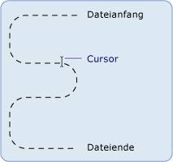

# Grundlagen zu Datei-E/A-Vorgängen und dem Dateisystem in .NET Framework (Visual Basic)
Klassen im <System.IO>-Namespace werden zum Arbeiten mit Laufwerken, Dateien und Verzeichnissen verwendet.  
  
 Der <System.IO>-Namespace enthält die Klassen <xref:System.IO.File> und <xref:System.IO.Directory>, die die Funktionalität von [!INCLUDE[dnprdnshort](../../../../csharp/getting-started/includes/dnprdnshort_md.md)] bereitstellen, die Dateien und Verzeichnisse ändert. Da die Methoden dieser Objekte statische oder freigegebene Member sind, können Sie diese direkt verwenden, ohne zuerst eine Instanz der Klasse erstellen zu müssen. Diesen Klassen sind die Klassen <xref:System.IO.FileInfo> und <xref:System.IO.DirectoryInfo> zugeordnet, die den Benutzern der `My`-Funktion bekannt sind. Zum Verwenden dieser Klassen müssen Sie die Namen vollständig qualifizieren oder die entsprechenden Namespaces durch Einschließen des `Imports` -Arguments (bzw. der Argumente) am Anfang des betreffenden Codes importieren. Weitere Informationen finden Sie unter [Imports-Anweisung (.NET-Namespace und -typ)](../../../../visual-basic/language-reference/statements/imports-statement-net-namespace-and-type.md).  
  
> [!NOTE]
>  Weitere Themen in diesem Abschnitt verwenden das Objekt `My.Computer.FileSystem` anstelle der `System.IO` -Klassen zum Arbeiten mit Laufwerken, Dateien und Verzeichnissen. Das Objekt `My.Computer.FileSystem` dient in erster Linie zur Verwendung in [!INCLUDE[vbprvb](../../../../csharp/programming-guide/concepts/linq/includes/vbprvb_md.md)]-Programmen. `System.IO`-Klassen sind für die Verwendung durch eine beliebige Sprache vorgesehen, die [!INCLUDE[dnprdnshort](../../../../csharp/getting-started/includes/dnprdnshort_md.md)], einschließlich [!INCLUDE[vbprvb](../../../../csharp/programming-guide/concepts/linq/includes/vbprvb_md.md)], unterstützen.  
  
## Definition eines Streams  
 [!INCLUDE[dnprdnshort](../../../../csharp/getting-started/includes/dnprdnshort_md.md)] verwendet Streams, um Lesen von und Schreiben in Dateien zu unterstützen. Sie können sich einen Stream als eindimensionalen Satz von zusammenhängenden Daten mit einem Anfang und einem Ende vorstellen, bei dem der Cursor die derzeitige Position im Stream anzeigt.  
  
   
  
## Streamoperationen  
 Die im Stream enthaltenen Daten stammen möglicherweise aus dem Arbeitsspeicher, einer Datei oder einem TCP/IP-Socket. Streams verfügen über grundlegende Operationen, die auf sie angewendet werden können.  
  
-   Lesen. Sie können aus einem Stream lesen und Daten vom Stream in eine Datenstruktur übertragen, z.B. eine Zeichenfolge oder ein Bytearray.  
  
-   **Schreiben**. Sie können in einen Stream schreiben und Daten aus einer Datenquelle in den Stream übertragen.  
  
-   **Suchen**. Sie können Ihre Position im Stream abfragen und ändern.  
  
 Weitere Informationen finden Sie unter [Composing Streams](https://msdn.microsoft.com/library/e4y2dch9).  
  
## Arten von Streams  
 In [!INCLUDE[dnprdnshort](../../../../csharp/getting-started/includes/dnprdnshort_md.md)] wird ein Datenstrom durch die Klasse <xref:System.IO.Stream> dargestellt, die die abstrakte Klasse für alle anderen Datenströme bildet. Sie können eine Instanz der Klasse <xref:System.IO.Stream> nicht direkt erstellen, sondern müssen eine der Klassen verwenden, die diese implementiert.  
  
 Es gibt viele Arten von Datenströmen, doch für die Arbeit mit Dateieingabe und -ausgabe (E/A) sind die wichtigsten Typen die <xref:System.IO.FileStream>-Klasse, die eine Möglichkeit bietet, aus Dateien zu lesen und in diese zu schreiben, sowie die <xref:System.IO.IsolatedStorage.IsolatedStorageFileStream>-Klasse, die die Möglichkeit bietet, Dateien und Verzeichnisse in einem isolierten Speicher zu erstellen. Andere Streams, die für die Arbeit mit Dateieingabe und -ausgabe verwendet werden können, sind:  
  
-   <xref:System.IO.BufferedStream>  
  
-   <xref:System.Security.Cryptography.CryptoStream>  
  
-   <xref:System.IO.MemoryStream>  
  
-   <xref:System.Net.Sockets.NetworkStream>.  
  
 In der nachstehenden Tabelle werden Aufgaben aufgeführt, die häufig mit einem Stream durchgeführt werden:  
  
|Aktion|Informationen|
|---|---|   
|Lesen und Schreiben in einer Datendatei|[Gewusst wie: Lesen und Schreiben einer neu erstellten Datendatei](https://msdn.microsoft.com/library/36b93480.aspx)|  
|Lesen von Text aus einer Datei|[Gewusst wie: Lesen von Text aus einer Datei](https://msdn.microsoft.com/library/db5x7c0d.aspx)|  
|Schreiben von Text in eine Datei|[Gewusst wie: Schreiben von Text in eine Datei](https://msdn.microsoft.com/library/6ka1wd3w.aspx)|  
|Lesen von Zeichen aus einer Zeichenfolge|[Gewusst wie: Lesen von Zeichen aus einer Zeichenfolge](https://msdn.microsoft.com/library/9yyz8a6c.aspx)|  
|Schreiben von Zeichen in eine Zeichenfolge|[Gewusst wie: Schreiben von Zeichen in eine Zeichenfolge](https://msdn.microsoft.com/library/z4kzt0dd.aspx)|  
|Verschlüsseln von Daten|[Verschlüsseln von Daten](https://msdn.microsoft.com/library/as0w18af.aspx)|  
|Entschlüsseln von Daten|[Entschlüsseln von Daten](https://msdn.microsoft.com/library/te15te69.aspx)|  
  
## Dateizugriff und Dateiattribute  
 Mit den Enumerationen <xref:System.IO.FileAccess>, <xref:System.IO.FileMode> und <xref:System.IO.FileShare> können Sie steuern, wie Dateien erstellt, geöffnet und freigegeben werden; diese Enumerationen enthalten die von den Konstruktoren der <xref:System.IO.FileStream>-Klasse verwendeten Flags. Wenn Sie z.B. einen neuen <xref:System.IO.FileStream> öffnen oder erstellen, können Sie über die <xref:System.IO.FileMode>-Enumeration angeben, ob die Datei zum Anfügen geöffnet ist, ob eine neue Datei erstellt wird, falls die angegebene Datei nicht vorhanden ist, ob die Datei überschrieben wird usw.  
  
 Die xref:System.IO.FileAttributes>-Enumeration ermöglicht das Sammeln dateispezifischer Informationen. Die <xref:System.IO.FileAttributes>-Enumeration gibt die gespeicherten Attribute der Datei zurück, die z.B. festlegen, ob sie komprimiert, verschlüsselt, ausgeblendet, schreibgeschützt, ein Archiv, ein Verzeichnis, eine Systemdatei oder eine temporäre Datei ist.  
  
 In der folgenden Tabelle sind die Tasks bezüglich Dateizugriff und Dateiattributen aufgelistet.  
  
|Beschreibung|Siehe|  
|---|---|
|Öffnen und Anfügen an eine Protokolldatei|[Gewusst wie: Öffnen und Anfügen an eine Protokolldatei](https://msdn.microsoft.com/library/3zc0w663.aspx)|  
|Festlegen der Attribute einer Datei|<xref:System.IO.FileAttributes>|  
  
## Dateiberechtigungen  
 Die Steuerung des Zugriffs auf Dateien und Verzeichnisse kann über die <xref:System.Security.Permissions.FileIOPermission>-Klasse erfolgen. Dies kann möglicherweise besonders wichtig für Entwickler sein, die mit Web Forms arbeiten, die standardmäßig im Kontext eines bestimmten lokalen Benutzerkontos namens ASPNET ausgeführt werden, das als Teil der Installationen [!INCLUDE[vstecasp](../../../../csharp/language-reference/preprocessor-directives/includes/vstecasp_md.md)] und [!INCLUDE[dnprdnshort](../../../../csharp/getting-started/includes/dnprdnshort_md.md)] erstellt wird. Wenn solch eine Anwendung den Zugriff auf eine Ressource anfordert, verfügt das ASPNET-Benutzerkonto über eingeschränkte Berechtigungen, was dazu führen kann, dass der Benutzer an der Ausführung von Aktionen, z.B. dem Schreiben in eine Datei über eine Webanwendung, gehindert wird. Weitere Informationen finden Sie unter [Sicherheitsberechtigungen](http://msdn.microsoft.com/en-us/b03757b4-e926-4196-b738-3733ced2bda0) und <xref:System.Security.Permissions.FileIOPermission>.  
  
## Isolierte Dateispeicherung  
 Die isolierte Speicherung versucht die Probleme zu lösen, die bei der Arbeit mit Dateien auftreten, wenn der Benutzer oder der Code nicht die notwendigen Berechtigungen aufweist. Die isolierte Speicherung weist jedem Benutzer ein Datendepot zu, das einen oder mehrere Speicher enthalten kann. Speicher können voneinander nach Benutzer und Assembly isoliert werden. Nur der Benutzer oder die Assembly, der bzw. die einen Speicher erstellt hat, verfügt über Zugriff auf ihn. Ein Speicher verhält sich wie ein vollständiges virtuelles Dateisystem. Sie können innerhalb eines Speichers Verzeichnisse und Dateien erstellen und bearbeiten.  
  
 In der nachstehenden Tabelle werden die Aufgaben aufgelistet, die häufig dem isolierten Datenspeicher zugeordnet sind.  
  
|Aktion|Informationen|
|---|---|  
|Erstellen eines isolierten Speichers|[Gewusst wie: Erhalten von Speichern für isolierten Speicher](https://msdn.microsoft.com/library/k48a6h13.aspx)|  
|Auflisten von isolierten Speichern|[Gewusst wie: Auflisten von Speichern für isolierten Speicher](https://msdn.microsoft.com/library/c3dy613a.aspx)|  
|Löschen eines isolierten Speichers|[Gewusst wie: Löschen von Speichern im isolierten Speicher](https://msdn.microsoft.com/library/5w71t104.aspx)|  
|Erstellen einer Datei oder eines Verzeichnisses im isolierten Speicher|[Gewusst wie: Erstellen von Dateien und Verzeichnissen in isoliertem Speicher](https://msdn.microsoft.com/library/6h2ws3ft.aspx)|  
|Suchen einer Datei im isolierten Speicher|[Gewusst wie: Suchen von vorhandenen Dateien und Verzeichnissen im isolierten Speicher](https://msdn.microsoft.com/library/zd5e2z84.aspx)|  
|Lesen aus oder Schreiben in einer Datei im isolierten Speicher|[Gewusst wie: Lesen bzw. Schreiben von Dateien im isolierten Speicher](https://msdn.microsoft.com/library/xf96a1wz.aspx)|  
|Löschen einer Datei oder eines Verzeichnisses im isolierten Speicher|[Gewusst wie: Löschen von Dateien und Verzeichnissen in isoliertem Speicher](https://msdn.microsoft.com/library/kx3852wf.aspx)|  
  
## Dateiereignisse  
 Mit der <xref:System.IO.FileSystemWatcher>-Komponente können Sie Änderungen in Dateien und Verzeichnissen in Ihrem System oder auf jedem beliebigen Computer überwachen, auf den Sie über das Netzwerk zugreifen können. Wenn z.B. eine Datei verändert wird, möchten Sie möglicherweise eine Warnung an einen Benutzer versenden, dass die Änderung durchgeführt wurde. Wenn Änderungen auftreten, wird mindestens ein Ereignis ausgelöst, in einem Puffer gespeichert und zur Verarbeitung an die <xref:System.IO.FileSystemWatcher>-Komponente übergeben.  
  
## Siehe auch  
 [Erstellen von Datenströmen](https://msdn.microsoft.com/library/e4y2dch9)   
 [Datei- und Stream-E/A](https://msdn.microsoft.com/library/k3352a4t)   
 [Asynchrone Datei-E/A](https://msdn.microsoft.com/library/kztecsys)   
 [Für Datei-E/A-Vorgänge und die Arbeit mit dem Dateisystem in .NET Framework verwendete Klassen (Visual Basic)](../../../../visual-basic/developing-apps/programming/drives-directories-files/classes-used-in-net-framework-file-io-and-the-file-system.md)
