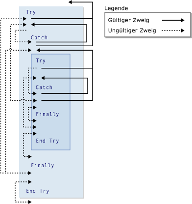

# GoTo Statement
[!INCLUDE[vs2017banner](../../../visual-basic/includes/vs2017banner.md)]

Verzweigt unabhängig von einer Bedingung auf eine angegebene Zeile innerhalb einer Prozedur.  
  
## Syntax  
  
```  
GoTo line  
```  
  
## Bestandteil  
 `line`  
 Erforderlich.  Eine beliebige Zeilenmarke.  
  
## Hinweise  
 Die `GoTo`\-Anweisung kann nur auf Zeilen der Prozedur verzweigen, in der sie verwendet wird.  Die Zeile muss über eine Zeilenmarke verfügen, auf die `GoTo` verweisen kann.  Weitere Informationen finden Sie unter [How to: Label Statements](../../../visual-basic/programming-guide/program-structure/how-to-label-statements.md).  
  
> [!NOTE]
>  Mit `GoTo`\-Anweisungen wird der Code schwer verständlich, und die Pflege des Codes wird ebenfalls erschwert.  Verwenden Sie stattdessen nach Möglichkeit eine Steuerungsstruktur.  Weitere Informationen finden Sie unter [Control Flow](../../../visual-basic/programming-guide/language-features/control-flow/index.md).  
  
 Es ist nicht möglich, mit einer `GoTo`\-Anweisung von außerhalb einer Konstruktion mit `For`...`Next`, `For Each`...`Next`, `SyncLock`...`End SyncLock`, `Try`...`Catch`...`Finally`, `With`...`End With` oder `Using`...`End Using` auf eine Bezeichnung in der Konstruktion zu verzweigen.  
  
## Verzweigung und Try\-Konstruktionen  
 Innerhalb einer `Try`...`Catch`...`Finally`\-Konstruktion gelten die folgenden Regeln für Verzweigungen mit der `GoTo`\-Anweisung.  
  
|Block oder Bereich|Verzweigung von außen nach innen|Verzweigung von innen nach außen|  
|------------------------|--------------------------------------|--------------------------------------|  
|`Try`\-Block|Nur aus einem `Catch`\-Block mit der gleichen Konstruktion <sup>1</sup>|Nur nach außerhalb der gesamten Konstruktion|  
|`Catch`\-Block|Niemals zulässig|Nur nach außerhalb der gesamten Konstruktion oder zum `Try`\-Block derselben Konstruktion <sup>1</sup>|  
|`Finally`\-Block|Niemals zulässig|Niemals zulässig|  
  
 <sup>1</sup> Wenn eine `Try`...`Catch`...`Finally`\-Konstruktion in einer anderen geschachtelt ist, kann ein `Catch`\-Block in den `Try`\-Block auf der eigenen Schachtelungsebene, jedoch nicht in einen anderen `Try`\-Block verzweigen.  Eine geschachtelte `Try`...`Catch`...`Finally`\-Konstruktion muss vollständig in einem `Try`\-Block oder einem `Catch`\-Block der Konstruktion enthalten sein, in der sie geschachtelt ist.  
  
 Im folgenden Beispiel wird eine `Try`\-Konstruktion veranschaulicht, die in einer anderen geschachtelt ist.  Verschiedene Verzweigungen zwischen den Blocks der beiden Konstruktionen werden als gültig oder ungültig angegeben.  
  
   
Gültige und ungültige Verzweigungen in Try\-Konstruktionen  
  
## Beispiel  
 In folgendem Beispiel wird die `GoTo`\-Anweisung verwendet, um auf Zeilensprungmarken innerhalb einer Prozedur zu verzweigen.  
  
 [!code-vb[VbVbalrStatements#31](../../../visual-basic/language-reference/error-messages/codesnippet/VisualBasic/goto-statement_1.vb)]  
  
## Siehe auch  
 [Do...Loop Statement](../../../visual-basic/language-reference/statements/do-loop-statement.md)   
 [For...Next\-Anweisung](../../../visual-basic/language-reference/statements/for-next-statement.md)   
 [For Each...Next\-Anweisung](../../../visual-basic/language-reference/statements/for-each-next-statement.md)   
 [If...Then...Else Statement](../../../visual-basic/language-reference/statements/if-then-else-statement.md)   
 [Select...Case Statement](../../../visual-basic/language-reference/statements/select-case-statement.md)   
 [Try...Catch...Finally Statement](../../../visual-basic/language-reference/statements/try-catch-finally-statement.md)   
 [While...End While Statement](../../../visual-basic/language-reference/statements/while-end-while-statement.md)   
 [With...End With Statement](../../../visual-basic/language-reference/statements/with-end-with-statement.md)