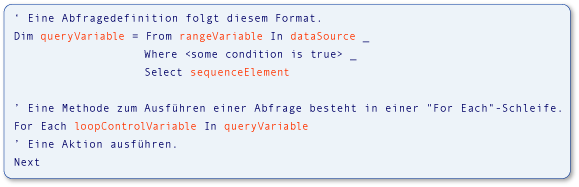

# Type Relationships in Query Operations (Visual Basic)
[!INCLUDE[vs2017banner](../../../../visual-basic/includes/vs2017banner.md)]

In [!INCLUDE[vbteclinqext](../../../../csharp/getting-started/includes/vbteclinqext-md.md)]\-Abfrageoperationen verwendete Variablen sind stark typisiert und müssen miteinander kompatibel sein.  Die starke Typisierung wird in der Datenquelle, in der Abfrage selbst und in der Abfrageausführung verwendet.  Die folgende Abbildung veranschaulicht Begriffe, die zum Beschreiben einer [!INCLUDE[vbteclinq](../../../../csharp/includes/vbteclinq-md.md)]\-Abfrage verwendet werden.  Weitere Informationen über die Teile einer Abfrage finden Sie unter [Grundlegende Abfrageoperationen \(Visual Basic\)](../../../../visual-basic/programming-guide/concepts/linq/basic-query-operations.md).  
  
   
Teile einer LINQ\-Abfrage  
  
 Der Typ der Bereichsvariablen in der Abfrage muss kompatibel mit dem Typ der Elemente in der Datenquelle sein.  Der Typ der Abfragevariablen muss kompatibel mit dem Sequenzelement sein, das in der `Select`\-Klausel definiert ist.  Schließlich muss der Typ der Sequenzelemente auch kompatibel mit dem Typ der Schleifensteuerungsvariablen sein, die in der `For Each`\-Anweisung zur Ausführung der Abfrage verwendet wird.  Diese starke Typisierung erleichtert zur Kompilierzeit die Identifikation von Typfehlern.  
  
 [!INCLUDE[vbprvb](../../../../csharp/programming-guide/concepts/linq/includes/vbprvb-md.md)] erleichtert eine starke Typisierung, indem lokale Typrückschlusse, auch bekannt als *implizite Typisierung*, implementiert werden.  Dieses Feature wird im vorigen Beispiel sowie in allen [!INCLUDE[vbteclinq](../../../../csharp/includes/vbteclinq-md.md)]\-Beispielen und \-Dokumentation verwendet.  In Visual Basic werden lokale Typrückschlüsse auf einfache Weise durch Verwendung einer `Dim`\-Anweisung ohne `As`\-Klausel erzielt.  Im folgenden Beispiel ist `city` als Zeichenfolge stark typisiert.  
  
 [!code-vb[VbLINQTypeRels#1](../../../../visual-basic/programming-guide/concepts/linq/codesnippet/visualbasic/type-relationships-in-qu_1.vb)]  
  
> [!NOTE]
>  Der lokale Typrückschluss funktioniert nur, wenn `Option Infer` auf `On` festgelegt ist.  Weitere Informationen finden Sie unter [Option Infer Statement](../../../../visual-basic/language-reference/statements/option-infer-statement.md).  
  
 Verwenden Sie jedoch einen lokalen Typrückschluss in einer Abfrage, sind die gleichen Typbeziehungen innerhalb der Variablen in der Datenquelle, der Abfragevariablen und der Abfrageausführungsschleife vorhanden.  Es ist hilfreich, über ein grundlegendes Verständnis dieser Typbeziehungen zu verfügen, wenn Sie [!INCLUDE[vbteclinq](../../../../csharp/includes/vbteclinq-md.md)]\-Abfragen erstellen oder mit den Beispielen und Codebeispielen in der Dokumentation arbeiten.  
  
 Sie müssen möglicherweise einen expliziten Typ für eine Bereichsvariable angeben, der nicht mit dem von der Datenquelle zurückgegeben Typ übereinstimmt.  Sie können den Typ der Bereichsvariablen mit einer `As`\-Klausel angeben.  Dies führt jedoch zu einem Fehler, wenn es sich um eine [eingrenzende Konvertierung](../../../../visual-basic/programming-guide/language-features/data-types/widening-and-narrowing-conversions.md) handelt und `Option Strict` auf `On` festgelegt ist.  Aus diesem Grund sollten Sie die von der Datenquelle empfangenen Werte konvertieren.  Sie können diese Werte mit der <xref:System.Linq.Enumerable.Cast%2A>\-Methode in den expliziten Bereichsvariablentyp konvertieren.  Sie können die in der `Select`\-Klausel ausgewählten Werte auch in einen expliziten Typ umwandeln, der nicht mit dem Typ der Bereichsvariablen übereinstimmt.  Diese Punkte werden im folgenden Code veranschaulicht.  
  
 [!code-vb[VbLINQTypeRels#4](../../../../visual-basic/programming-guide/concepts/linq/codesnippet/visualbasic/type-relationships-in-qu_2.vb)]  
  
## Abfragen, die ganze Elemente der Quelldaten zurückgeben  
 Im folgenden Beispiel wird eine [!INCLUDE[vbteclinq](../../../../csharp/includes/vbteclinq-md.md)]\-Abfrageoperation gezeigt, die eine Sequenz von Elementen zurückgibt, die aus den Quelldaten ausgewählt wurden.  Die Quelle `names` enthält ein Zeichenfolgenarray, und die Abfrageausgabe ist eine Sequenz mit Zeichenfolgen, die mit dem Buchstaben M beginnen.  
  
 [!code-vb[VbLINQTypeRels#2](../../../../visual-basic/programming-guide/concepts/linq/codesnippet/visualbasic/type-relationships-in-qu_3.vb)]  
  
 Dies ist zu folgendem Code äquivalent, aber viel kürzer und leichter zu schreiben.  In Visual Basic wird bevorzugt auf lokale Typrückschlüsse in Abfragen zurückgegriffen.  
  
 [!code-vb[VbLINQTypeRels#3](../../../../visual-basic/programming-guide/concepts/linq/codesnippet/visualbasic/type-relationships-in-qu_4.vb)]  
  
 Folgende Beziehungen sind in beiden der vorherigen Codebeispiele vorhanden, ganz gleich, ob die Typen implizit oder explizit ermittelt werden.  
  
1.  Der Typ der Elemente in der Datenquelle `names` ist der Typ der Bereichsvariablen `name` in der Abfrage.  
  
2.  Der Typ des Objekts, das ausgewählt ist \(`name`\), bestimmt den Typ der Abfragevariablen `mNames`.  Hier ist `name` eine Zeichenfolge, deshalb ist die Abfragevariable in Visual Basic IEnumerable\(Of String\).  
  
3.  Die in `mNames` definierte Abfrage wird in der `For Each`\-Schleife ausgeführt.  Die Schleife durchläuft das Ergebnis der Abfrage.  Da `mNames` beim Ausführen eine Zeichenfolgensequenz zurückgibt, ist die Schleifeniterationsvariable `nm` auch eine Zeichenfolge.  
  
## Abfragen, die ein Feld aus ausgewählten Elementen zurückgeben  
 Im folgenden Beispiel wird eine [!INCLUDE[vbtecdlinq](../../../../csharp/includes/vbtecdlinq-md.md)]\-Abfrageoperation gezeigt, die eine Sequenz zurückgibt, die nur ein Teil jedes in der Datenquelle ausgewählten Elements enthält.  Die Abfrage verwendet eine Auflistung von `Customer`\-Objekten als Datenquelle und projiziert nur die `Name`\-Eigenschaft im Ergebnis.  Da der Kundenname eine Zeichenfolge ist, erzeugt die Abfrage eine Zeichenfolgensequenz als Ausgabe.  
  
<CodeContentPlaceHolder>0</CodeContentPlaceHolder>  
 Die Beziehungen zwischen Variablen gleichen denen im einfacheren Beispiel.  
  
1.  Der Typ der Elemente in der Datenquelle, `customers`, ist der Typ der Bereichsvariablen, `cust`, in der Abfrage.  In diesem Beispiel ist dieser Typ `Customer`.  
  
2.  Die `Select`\-Anweisung gibt die `Name`\-Eigenschaft jedes `Customer`\-Objekts statt des vollständigen Objekts zurück.  Da `Name` eine Zeichenfolge ist, ist die Abfragevariable `custNames` erneut IEnumerable\(Of String\), und nicht `Customer`.  
  
3.  Da `custNames` eine Zeichenfolgensequenz darstellt, muss die Iterationsvariable der `For Each`\-Schleife `custName` eine Zeichenfolge sein.  
  
 Ohne lokale Typrückschlüsse wäre das vorige Beispiel schwieriger zu schreiben und zu verstehen, wie das folgende Beispiel zeigt.  
  
<CodeContentPlaceHolder>1</CodeContentPlaceHolder>  
## Abfragen, die anonyme Typen erfordern  
 Im folgenden Beispiel wird eine komplexere Situation veranschaulicht.  Im vorherigen Beispiel war es nicht günstig, Typen für alle Variablen explizit anzugeben.  In diesem Beispiel ist es unmöglich.  Anstatt ganze `Customer`\-Elemente aus der Datenquelle oder ein einzelnes Feld aus jedem Element auszuwählen, gibt die `Select`\-Klausel in dieser Abfrage zwei Eigenschaften des ursprünglichen `Customer`\-Objekts zurück: `Name` und `City`.  Als Reaktion auf die `Select`\-Klausel definiert der Compiler einen anonymen Typ, der diese beiden Eigenschaften enthält.  Das Ergebnis der Ausführung von `nameCityQuery` in der `For Each`\-Schleife ist eine Auflistung von Instanzen des neuen anonymen Typs.  Da der anonyme Typ keinen verwendbaren Namen hat, können Sie den Typ von `nameCityQuery` oder `custInfo` nicht explizit angeben.  Das heißt, dass Sie mit einem anonymen Typ keinen Typnamen haben, den Sie anstatt von `String` in `IEnumerable(Of String)` verwenden können.  Weitere Informationen finden Sie unter [Anonymous Types](../../../../visual-basic/programming-guide/language-features/objects-and-classes/anonymous-types.md).  
  
<CodeContentPlaceHolder>2</CodeContentPlaceHolder>  
 Obwohl es nicht möglich ist, Typen für alle Variablen im vorigen Beispiel anzugeben, bleiben die Beziehungen gleich.  
  
1.  Der Typ der Elemente in der Datenquelle entspricht auch hier dem Typ der Bereichsvariablen in der Abfrage.  In diesem Beispiel ist `cust` eine Instanz von `Customer`.  
  
2.  Da die `Select`\-Anweisung einen anonymen Typ erzeugt, muss die Abfragevariable `nameCityQuery` implizit als anonymer Typ typisiert werden.  Ein anonymer Typ hat keinen verwendbaren Namen und kann deshalb nicht explizit angegeben werden.  
  
3.  Der Typ der Iterationsvariablen in der `For Each`\-Schleife ist der in Schritt 2 erstellte anonyme Typ.  Da der Typ keinen verwendbaren Namen aufweist, muss der Typ der Schleifeniterationsvariable implizit bestimmt werden.  
  
## Siehe auch  
 [Getting Started with LINQ in Visual Basic](../../../../visual-basic/programming-guide/concepts/linq/getting-started-with-linq.md)   
 [Anonymous Types](../../../../visual-basic/programming-guide/language-features/objects-and-classes/anonymous-types.md)   
 [Local Type Inference](../../../../visual-basic/programming-guide/language-features/variables/local-type-inference.md)   
 [Introduction to LINQ in Visual Basic](../../../../visual-basic/programming-guide/language-features/linq/introduction-to-linq.md)   
 [LINQ](../../../../visual-basic/programming-guide/language-features/linq/index.md)   
 [Queries](../../../../visual-basic/language-reference/queries/queries.md)