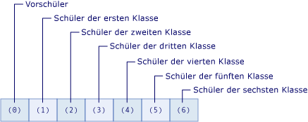

# Arrays in Visual Basic
[!INCLUDE[vs2017banner](../../../../visual-basic/includes/vs2017banner.md)]

Arrays sind Gruppen von Werten, die logisch miteinander verknüpft sind, z. B. die Anzahl der Schüler in jeder Jahrgangsstufe einer Grundschule.  Hilfe zu Arrays in Visual Basic for Applications \(VBA\) finden Sie in der [Sprachreferenz](https://msdn.microsoft.com/en-us/library/office/gg264383\(v=office.14\).aspx).  
  
 Mithilfe eines Arrays können Sie mit demselben Namen auf diese verknüpften Werte verweisen und eine Zahl verwenden, die als Index oder Feldindex bezeichnet wird, um die einzelnen Werte voneinander zu unterscheiden. Die einzelnen Werte werden als Elemente des Arrays bezeichnet. Sie sind fortlaufend von Index 0 \(null\) bis zum höchsten Indexwert.  
  
 Den Gegensatz zu einem Array wird eine Variable mit nur einem Wert *Skalar*\-Variable genannt.  
  
 Hier einige Beispiele, bevor wir mit den Erklärungen starten:  
  
```vb  
  
'Declare a single-dimension array of 5 values Dim numbers(4) As Integer ‘Declare a single-dimension array and set array element values Dim numbers = New Integer() {1, 2, 4, 8} ‘Redefine the size of an existing array retaining the current values ReDim Preserve numbers(15) ‘Redefine the size of an existing array, resetting the values ReDim numbers(15) ‘Declare a multi-dimensional array Dim matrix(5, 5) As Double ‘Declare a multi-dimensional array and set array element values Dim matrix = New Integer(4, 4) {{1, 2}, {3, 4}, {5, 6}, {7, 8}} ‘Declare a jagged array Dim sales()() As Double = New Double(11)() {}  
```  
  
 **In diesem Thema**  
  
-   [Arrayelemente in einem einfachen Array](#BKMK_ArrayElements)  
  
-   [Erstellen eines Arrays](#BKMK_CreatingAnArray)  
  
-   [Speichern von Werten in einem Array](#BKMK_StoringValues)  
  
-   [Auffüllen eines Arrays mit Anfangswerten](#BKMK_Populating)  
  
    -   [Geschachtelte Arrayliterale](#BKMK_NestedArrayLiterals)  
  
-   [Durchlaufen eines Arrays](#BKMK_Iterating)  
  
-   [Arrays als Parameter und Rückgabewerte](#BKMK_ReturnValues)  
  
-   [Verzweigte Arrays](#BKMK_JaggedArrays)  
  
-   [Arrays mit der Länge 0 (null)](#BKMK_ZeroLength)  
  
-   [Arraygröße](#BKMK_ArraySize)  
  
-   [Arraytypen und andere Typen](#BKMK_ArrayTypes)  
  
-   [Auflistungen als Alternative zu Arrays](#BKMK_Collections)  
  
##  <a name="BKMK_ArrayElements"></a> Arrayelemente in einem einfachen Array  
 Im folgenden Beispiel wird eine Arrayvariable deklariert, die die Schüler der einzelnen Jahrgangsstufe einer Grundschule enthalten soll.  
  
 [!code-vb[VbVbalrArrays#2](../../../../visual-basic/programming-guide/language-features/arrays/codesnippet/VisualBasic/index_1.vb)]  
  
 Das `students`\-Array im vorangehenden Beispiel enthält sieben Elemente. Die Indizes der Elemente reichen von 0 bis 6. Es ist einfacher, dieses Array zu verwenden, als sieben verschiedene Variablen zu deklarieren.  
  
 Die folgende Abbildung zeigt das `students`\-Array. Für jedes Element des Arrays gilt:  
  
-   Der Index des Elements steht für die Jahrgangsstufe \(Index 0 \(null\) steht für die erste Jahrgangsstufe\).  
  
-   Der im Element enthaltene Wert steht für die Anzahl der Schüler in dieser Jahrgangsstufe.  
  
   
Elemente des "students"\-Arrays  
  
 Das folgende Beispiel zeigt, wie auf das erste, zweite und letzte Element des `students`\-Arrays verwiesen wird.  
  
 [!code-vb[VbVbalrArrays#3](../../../../visual-basic/programming-guide/language-features/arrays/codesnippet/VisualBasic/index_2.vb)]  
  
 Sie können auf das Array als Ganzes verweisen, indem Sie nur den Arrayvariablennamen ohne Indizes verwenden.  
  
 Das `students`\-Array im vorhergehenden Beispiel verwendet nur einen Index, d. h. es ist eindimensional. Ein Array, das mehr als einen Index oder Feldindex verwendet, wird mehrdimensional genannt. Weitere Informationen finden Sie im weiteren Verlauf dieses Themas und unter [Array Dimensions in Visual Basic](../../../../visual-basic/programming-guide/language-features/arrays/array-dimensions.md).  
  
##  <a name="BKMK_CreatingAnArray"></a> Erstellen eines Arrays  
 Es gibt mehrere Möglichkeiten zum Definieren der Größe eines Arrays. Sie können die Größe beim Deklarieren des Arrays angeben, wie im folgenden Beispiel veranschaulicht.  
  
 [!code-vb[VbVbalrArrays#12](../../../../visual-basic/programming-guide/language-features/arrays/codesnippet/VisualBasic/index_3.vb)]  
  
 Sie können die Größe eines Arrays bei seiner Erstellung auch mit einer `New`\-Klausel angeben, wie im folgenden Beispiel veranschaulicht.  
  
 [!code-vb[VbVbalrArrays#11](../../../../visual-basic/programming-guide/language-features/arrays/codesnippet/VisualBasic/index_4.vb)]  
  
 Die Größe eines vorhandenen Arrays kann mit der `Redim`\-Anweisung neu definiert werden. Sie können angeben, dass von der `Redim`\-Anweisung die derzeit im Array gespeicherten Werte beibehalten werden sollen, oder Sie können angeben, dass ein leeres Array erstellt wird. Im folgenden Beispiel werden andere Möglichkeiten veranschaulicht, um mit der `Redim`\-Anweisung die Größe eines vorhandenen Arrays zu ändern.  
  
 [!code-vb[VbVbalrArrays#13](../../../../visual-basic/programming-guide/language-features/arrays/codesnippet/VisualBasic/index_5.vb)]  
  
 Weitere Informationen finden Sie unter [ReDim Statement](../../../../visual-basic/language-reference/statements/redim-statement.md).  
  
##  <a name="BKMK_StoringValues"></a> Speichern von Werten in einem Array  
 Sie können mit einem Index vom Typ `Integer` auf die einzelnen Positionen in einem Array zugreifen. Die Werte in einem Array können gespeichert und abgerufen werden, indem mit dem entsprechenden in Klammern eingeschlossenen Index auf die einzelnen Arraypositionen verwiesen wird. Indizes für mehrdimensionale Arrays sind durch Kommas \(,\) getrennt. Sie benötigen einen Index für jede Arraydimension. Im folgenden Beispiel werden einige Anweisungen gezeigt, die Werte in Arrays speichern.  
  
 [!code-vb[VbVbalrArrays#5](../../../../visual-basic/programming-guide/language-features/arrays/codesnippet/VisualBasic/index_6.vb)]  
  
 Das folgende Beispiel enthält einige Anweisungen, die Werte aus Arrays abrufen.  
  
 [!code-vb[VbVbalrArrays#6](../../../../visual-basic/programming-guide/language-features/arrays/codesnippet/VisualBasic/index_7.vb)]  
  
##  <a name="BKMK_Populating"></a> Auffüllen eines Arrays mit Anfangswerten  
 Mit einem Arrayliteral können Sie ein Array erstellen, das einen Anfangssatz von Werten enthält. Ein Arrayliteral besteht aus einer Liste von durch Trennzeichen getrennten Werten, die in geschweifte Klammern \(`{}`\) eingeschlossen sind.  
  
 Beim Erstellen eines Arrays mit einem Arrayliteral können Sie den Arraytyp entweder angeben oder mittels Typrückschluss bestimmen. Im folgenden Code werden beide Optionen veranschaulicht.  
  
 [!code-vb[VbVbalrCollectionInitializers#3](../../../../visual-basic/programming-guide/language-features/arrays/codesnippet/VisualBasic/index_8.vb)]  
  
 Beim Typrückschluss wird der Typ des Arrays anhand des bestimmenden Typs in der Liste der Werte bestimmt, die für das Arrayliteral angegeben wurden. Der bestimmende Typ ist ein eindeutiger Typ, auf den alle anderen Typen im Arrayliteral erweitert werden können. Wenn dieser eindeutige Typ nicht bestimmt werden kann, ist der bestimmende Typ der eindeutige Typ, auf den alle anderen Typen im Array eingegrenzt werden können. Wenn keiner dieser eindeutigen Typen bestimmt werden kann, ist der bestimmende Typ `Object`. Wenn die für das Arrayliteral angegebene Liste der Werte z. B. Werte vom Typ `Integer`, `Long` und `Double` enthält, weist das erhaltene Array den Typ `Double` auf. Sowohl `Integer` als auch `Long` können nur auf `Double` erweitert werden. Daher ist `Double` der bestimmende Typ. Weitere Informationen finden Sie unter [Widening and Narrowing Conversions](../../../../visual-basic/programming-guide/language-features/data-types/widening-and-narrowing-conversions.md). Diese Rückschlussregeln gelten für Typen, die für Arrays abgeleitet werden, die lokale, in einem Klassenmember definierte Variablen darstellen. Sie können zwar Arrayliterale beim Erstellen von Variablen auf Klassenebene verwenden, ein Typrückschluss auf Klassenebene ist jedoch nicht möglich. Daher leiten auf Klassenebene angegebene Arrayliterale die für das Arrayliteral bereitgestellten Werte als `Object`\-Typ ab.  
  
 In einem mit einem Arrayliteral erstellten Array kann der Typ der Elemente explizit angegeben werden. In diesem Fall müssen die Werte im Arrayliteral auf den Typ der Elemente des Arrays erweitert werden. Im folgenden Codebeispiel wird ein Array vom Typ `Double` aus einer Liste von ganzen Zahlen erstellt.  
  
 [!code-vb[VbVbalrCollectionInitializers#4](../../../../visual-basic/programming-guide/language-features/arrays/codesnippet/VisualBasic/index_9.vb)]  
  
###  <a name="BKMK_NestedArrayLiterals"></a> Geschachtelte Arrayliterale  
 Sie können ein mehrdimensionales Array mithilfe von geschachtelten Arrayliteralen erstellen. Geschachtelte Arrayliterale müssen über eine Dimension sowie eine Anzahl von Dimensionen \(bzw. einen Rang\) verfügen, der mit dem erhaltenen Array konsistent ist. Im folgenden Codebeispiel wird mit einem Arrayliteral ein zweidimensionales Array von ganzen Zahlen erstellt.  
  
 [!code-vb[VbVbalrCollectionInitializers#7](../../../../visual-basic/programming-guide/language-features/arrays/codesnippet/VisualBasic/index_10.vb)]  
  
 Im vorherigen Beispiel würde ein Fehler auftreten, wenn die Anzahl der Elemente in den geschachtelten Arrayliteralen nicht übereinstimmt. Ein Fehler würde auch auftreten, wenn die Arrayvariable explizit als nicht zweidimensional deklariert ist.  
  
> [!NOTE]
>  Sie können Fehler vermeiden, wenn Sie geschachtelte Arrayliterale anderer Dimensionen angeben, indem Sie die inneren Arrayliterale in Klammern einschließen. Die Klammern erzwingen die Auswertung des Literalausdrucks des Arrays, und die erhaltenen Werte werden mit dem äußeren Arrayliteral verwendet. Dies ist im folgenden Code veranschaulicht.  
  
 [!code-vb[VbVbalrCollectionInitializers#11](../../../../visual-basic/programming-guide/language-features/arrays/codesnippet/VisualBasic/index_11.vb)]  
  
 Mehrdimensionale Arrays können mit geschachtelten Arrayliteralen mithilfe des Typrückschlusses erstellt werden. Wenn Sie den Typrückschluss verwenden, ist der abgeleitete Typ der bestimmende Typ für sämtliche Werte in allen Arrayliteralen für eine Schachtelungsebene. Im folgenden Codebeispiel wird ein zweidimensionales Array vom Typ `Double` aus Werten erstellt, die vom Typ `Integer` und `Double` sind.  
  
 [!code-vb[VbVbalrCollectionInitializers#8](../../../../visual-basic/programming-guide/language-features/arrays/codesnippet/VisualBasic/index_12.vb)]  
  
 Weitere Beispiele finden Sie unter [How to: Initialize an Array Variable in Visual Basic](../../../../visual-basic/programming-guide/language-features/arrays/how-to-initialize-an-array-variable.md).  
  
##  <a name="BKMK_Iterating"></a> Durchlaufen eines Arrays  
 Wenn Sie ein Array durchlaufen, greifen Sie vom niedrigsten Index bis zum höchsten Index auf jedes Element im Array zu.  
  
 Im folgenden Beispiel wird ein eindimensionales Array mit dem [For...Next\-Anweisung](../../../../visual-basic/language-reference/statements/for-next-statement.md) durchlaufen. Die <xref:System.Array.GetUpperBound%2A>\-Methode gibt den höchsten Wert zurück, den der Index annehmen kann. Der niedrigste Indexwert ist immer 0.  
  
 [!code-vb[VbVbalrArrays#41](../../../../visual-basic/programming-guide/language-features/arrays/codesnippet/VisualBasic/index_13.vb)]  
  
 Im folgenden Beispiel wird ein mehrdimensionales Array mit einer `For...Next`\-Anweisung durchlaufen. Die <xref:System.Array.GetUpperBound%2A>\-Methode enthält einen Parameter, der die Dimension angibt.`GetUpperBound(0)` gibt den hohen Indexwert für die erste Dimension und `GetUpperBound(1)` gibt den hohen Indexwert für die zweite Dimension zurück.  
  
 [!code-vb[VbVbalrArrays#42](../../../../visual-basic/programming-guide/language-features/arrays/codesnippet/VisualBasic/index_14.vb)]  
  
 Im folgenden Beispiel wird ein eindimensionales Array mit einem [For Each...Next\-Anweisung](../../../../visual-basic/language-reference/statements/for-each-next-statement.md) durchlaufen.  
  
 [!code-vb[VbVbalrArrays#43](../../../../visual-basic/programming-guide/language-features/arrays/codesnippet/VisualBasic/index_15.vb)]  
  
 Im folgenden Beispiel wird ein mehrdimensionales Array mit einer `For Each...Next`\-Anweisung durchlaufen. Sie haben jedoch mehr Kontrolle über die Elemente eines mehrdimensionalen Arrays, wenn Sie, wie im vorherigen Beispiel, eine geschachtelte `For…Next`\-Anweisung anstelle einer `For Each…Next`\-Anweisung verwenden.  
  
 [!code-vb[VbVbalrArrays#44](../../../../visual-basic/programming-guide/language-features/arrays/codesnippet/VisualBasic/index_16.vb)]  
  
##  <a name="BKMK_ReturnValues"></a> Arrays als Parameter und Rückgabewerte  
 Damit eine `Function`\-Prozedur ein Array zurückgibt, geben Sie den Arraydatentyp und die Anzahl der Dimensionen als Rückgabetyp für die [Function Statement](../../../../visual-basic/language-reference/statements/function-statement.md) an. Deklarieren Sie in der Funktion eine lokale Arrayvariable mit dem gleichen Datentyp und der gleichen Anzahl an Dimensionen. Schließen Sie die lokale Arrayvariable ohne Klammern in die [Return Statement](../../../../visual-basic/language-reference/statements/return-statement.md) ein.  
  
 Um ein Array als Parameter für eine `Sub`\- oder `Function`\-Prozedur anzugeben, definieren Sie den Parameter als Array mit einem bestimmten Datentyp und einer bestimmten Anzahl von Dimensionen. Senden Sie im Aufruf zur Prozedur eine Arrayvariable mit dem gleichen Datentyp und der gleichen Anzahl von Dimensionen.  
  
 Im folgenden Beispiel gibt die Funktion `GetNumbers` einen `Integer()` zurück. Dieser Arraytyp ist ein eindimensionales Array vom Typ `Integer`. Die Prozedur `ShowNumbers` akzeptiert ein Argument `Integer()`.  
  
 [!code-vb[VbVbalrArrays#51](../../../../visual-basic/programming-guide/language-features/arrays/codesnippet/VisualBasic/index_17.vb)]  
  
 Im folgenden Beispiel gibt die Funktion `GetNumbersMultiDim` einen `Integer(,)` zurück. Dieser Arraytyp ist ein zweidimensionales Array vom Typ `Integer`.  Die Prozedur `ShowNumbersMultiDim` akzeptiert ein Argument `Integer(,)`.  
  
 [!code-vb[VbVbalrArrays#52](../../../../visual-basic/programming-guide/language-features/arrays/codesnippet/VisualBasic/index_18.vb)]  
  
##  <a name="BKMK_JaggedArrays"></a> Verzweigte Arrays  
 Ein Array, das andere Arrays als Elemente enthält, wird als Array von Arrays oder verzweigtes Array bezeichnet. Ein verzweigtes Array und jedes Element in einem verzweigten Array können über eine oder mehrere Dimensionen verfügen. In einigen Fällen ist die Datenstruktur in einer Anwendung zweidimensional, jedoch nicht rechteckig.  
  
 Im folgenden Beispiel wird ein Array von Monaten dargestellt, bei dem jedes Element ein Array von Tagen ist. Da die einzelnen Monate eine unterschiedliche Anzahl von Tagen haben, bilden die Elemente kein rechteckiges zweidimensionales Array. Deshalb wird ein verzweigtes Array anstelle eines mehrdimensionalen Arrays verwendet.  
  
 [!code-vb[VbVbalrArrays#21](../../../../visual-basic/programming-guide/language-features/arrays/codesnippet/VisualBasic/index_19.vb)]  
  
##  <a name="BKMK_ZeroLength"></a> Arrays mit der Länge 0 \(null\)  
 Ein Array ohne Elemente wird auch als Array der Länge Null bezeichnet. In einer Variablen mit einem Array der Länge Null kommt auch der Wert `Nothing` nicht vor. Wenn Sie ein Array ohne Elemente erstellen möchten, deklarieren Sie eine der Dimensionen des Arrays als \-1, wie im folgenden Beispiel veranschaulicht.  
  
 [!code-vb[VbVbalrArrays#14](../../../../visual-basic/programming-guide/language-features/arrays/codesnippet/VisualBasic/index_20.vb)]  
  
 Unter den folgenden Bedingungen müssen Sie eventuell ein Array der Länge 0 \(null\) erstellen:  
  
-   Der Code muss, ohne eine <xref:System.NullReferenceException>\-Ausnahme auszulösen, auf Member der <xref:System.Array>\-Klasse zugreifen, beispielsweise auf <xref:System.Array.Length%2A> oder <xref:System.Array.Rank%2A>, oder eine [!INCLUDE[vbprvb](../../../../csharp/programming-guide/concepts/linq/includes/vbprvb-md.md)]\-Funktion wie <xref:Microsoft.VisualBasic.Information.UBound%2A> aufrufen.  
  
-   Sie möchten den verwendeten Code dadurch vereinfachen, dass eine Überprüfung auf das Vorhandensein von `Nothing` als Sonderfall entfällt.  
  
-   Der Code interagiert mit einer API \(Application Programming Interface\), die entweder verlangt, dass mindestens einer Prozedur ein Array der Länge Null übergeben wird. Oder er interagiert mit einer API, die ein solches Array von mindestens einer Prozedur zurückgibt.  
  
##  <a name="BKMK_ArraySize"></a> Arraygröße  
 Die Größe eines Arrays ist das Produkt der Längen aller seiner Dimensionen. Sie stellt die Gesamtzahl der Elemente dar, die derzeit im Array enthalten sind.  
  
 Im folgenden Beispiel wird ein dreidimensionales Array deklariert.  
  
```  
Dim prices(3, 4, 5) As Long  
```  
  
 Die Gesamtgröße des Arrays in der `prices`\-Variable ist \(3 \+ 1\) x \(4 \+ 1\) x \(5 \+ 1\) \= 120.  
  
 Sie können die Größe eines Arrays mithilfe der <xref:System.Array.Length%2A>\-Eigenschaft bestimmen. Sie können die Länge der einzelnen Dimensionen eines mehrdimensionalen Arrays mithilfe der <xref:System.Array.GetLength%2A>\-Methode bestimmen.  
  
 Sie können die Größe einer Arrayvariablen ändern, indem Sie ihr ein neues Arrayobjekt zuweisen oder indem Sie die `ReDim`\-Anweisung verwenden.  
  
 Mehrere Faktoren wirken sich auf die Arraygröße aus.  
  
|||  
|-|-|  
|Dimensionslänge|Der Index jeder Dimension ist nullbasiert, d. h. er reicht von 0 bis zur Obergrenze. Die Länge einer bestimmten Dimension ist deshalb um 1 größer als die deklarierte Obergrenze dieser Dimension.|  
|Längenbeschränkungen|Die Länge jeder Dimension eines Arrays ist auf den maximalen Wert des `Integer`\-Datentyps \(\(2 ^ 31\) \- 1\) beschränkt. Die Gesamtgröße eines Arrays richtet sich nach dem verfügbaren Arbeitsspeicher des Systems und ist damit ebenfalls beschränkt. Wenn Sie versuchen, ein Array zu initialisieren, das die Kapazität des verfügbaren RAM\-Arbeitsspeichers übersteigt, löst die Common Language Runtime eine <xref:System.OutOfMemoryException>\-Ausnahme aus.|  
|Größe und Elementgröße|Die Größe eines Arrays ist vom Datentyp seiner Elemente unabhängig. Die Größe stellt immer die Gesamtzahl der Elemente dar, nicht die Anzahl an Bytes, die die Elemente im Speicher belegen.|  
|Speicherverbrauch|Es gibt keine verbindlichen Angaben darüber, wie ein Array gespeichert wird. Der Speicherverbrauch variiert auf Plattformen mit unterschiedlichen Datenbreiten, d. h. ein und dasselbe Array kann auf einem 64\-Bit\-System mehr Speicherplatz benötigen als auf einem 32\-Bit\-System. Abhängig von der Systemkonfiguration beim Initialisieren eines Arrays kann die Common Language Runtime \(CLR\) Speicher so zuweisen, dass die Elemente auf sehr engem Raum gespeichert werden oder nur die natürlichen Hardwarebeschränkungen gelten. Ein Array benötigt außerdem zusätzlichen Speicher für seine Steuerungsinformationen. Der Bedarf an zusätzlichem Speicher nimmt mit jeder hinzugefügten Dimension zu.|  
  
##  <a name="BKMK_ArrayTypes"></a> Arraytypen und andere Typen  
 Jedes Array besitzt einen Datentyp, der jedoch nicht mit dem Datentyp seiner Elemente identisch ist. Es gibt keinen universellen Datentyp, der sich für alle Arrays eignet. Stattdessen wird der Datentyp eines Arrays durch die Anzahl der Dimensionen \(den *Rang*\) des Arrays bestimmt, sowie durch den Datentyp der Elemente im Array. Die Datentypen zweier Arrayvariablen werden nur dann als gleich betrachtet, wenn die Arrayvariablen den gleichen Rang aufweisen und ihre Elemente den gleichen Datentyp aufweisen. Die Länge der Dimensionen in einem Array haben keinerlei Auswirkungen auf den Arraydatentyp.  
  
 Jedes Array erbt aus der <xref:System.Array?displayProperty=fullName>\-Klasse. Sie können eine Variable des Typs `Array` deklarieren, ein Array des Typs `Array` können Sie jedoch nicht erstellen. Die [ReDim Statement](../../../../visual-basic/language-reference/statements/redim-statement.md) kann nicht für eine Variable verwendet werden, die mit dem Typ `Array` deklariert ist. Aus diesen Gründen und zur Gewährleistung der Typsicherheit empfiehlt es sich, jedes Array als bestimmten Typ zu deklarieren \(`Integer` im vorhergehenden Beispiel\).  
  
 Sie können den Datentyp eines Arrays oder seiner Elemente auf verschiedene Arten ermitteln.  
  
-   Sie können die <xref:System.Object.GetType%2A?displayProperty=fullName>\-Methode für die Variable aufrufen, um ein <xref:System.Type>\-Objekt für den Laufzeittyp der Variable zu erhalten. Das <xref:System.Type>\-Objekt stellt in seinen Eigenschaften und Methoden umfassende Informationen bereit.  
  
-   Sie können die Variable an die <xref:Microsoft.VisualBasic.Information.TypeName%2A>\-Funktion übergeben, um den Namen des Laufzeittyps als `String` zu erhalten.  
  
-   Sie können die Variable an die <xref:Microsoft.VisualBasic.Information.VarType%2A>\-Funktion übergeben, um einen `VariantType`\-Wert zu erhalten, der die Typklassifikation der Variablen darstellt.  
  
 Im folgenden Beispiel wird die `TypeName`\-Funktion aufgerufen, um den Typ des Arrays und den Typ der Elemente im Array zu bestimmen. Der Arraytyp ist `Integer(,)`, und die Elemente im Array sind vom Typ `Integer`.  
  
 [!code-vb[VbVbalrArrays#15](../../../../visual-basic/programming-guide/language-features/arrays/codesnippet/VisualBasic/index_21.vb)]  
  
##  <a name="BKMK_Collections"></a> Auflistungen als Alternative zu Arrays  
 Arrays eignen sich bestens zum Erstellen und Arbeiten mit einer festen Anzahl von Objekten mit starkem Typ. Auflistungen ermöglichen ein flexibleres Arbeiten mit Objektgruppen. Im Gegensatz zu Arrays kann sich die Gruppe von Objekten, mit denen Sie arbeiten, in Abhängigkeit von den sich ändernden Anforderungen der Anwendung dynamisch vergrößern bzw. verkleinern.  
  
 Wenn Sie die Größe eines Arrays ändern müssen, müssen Sie die [ReDim Statement](../../../../visual-basic/language-reference/statements/redim-statement.md) verwenden. Dabei erstellt [!INCLUDE[vbprvb](../../../../csharp/programming-guide/concepts/linq/includes/vbprvb-md.md)] ein neues Array und gibt das vorherige Array zum Löschen frei. Dies nimmt Ausführungszeit in Anspruch. Wenn sich die Anzahl der verwendeten Elemente häufig ändert oder Sie die maximale Anzahl der benötigten Elemente nicht vorhersehen können, erzielen Sie mit einer Auflistung möglicherweise eine höhere Leistung.  
  
 Bei einigen Auflistungen können Sie jedem Objekt, das Sie in die Auflistung einfügen, einen Schlüssel zuweisen, sodass das Objekt anhand des Schlüssels schnell abgerufen werden kann.  
  
 Wenn die Auflistung Elemente eines Datentyps enthält, können Sie eine der Klassen im <xref:System.Collections.Generic?displayProperty=fullName>\-Namespace verwenden. Eine generische Auflistung erzwingt Typsicherheit, sodass der Auflistung kein anderer Datentyp hinzugefügt werden kann. Wenn Sie ein Element aus einer generischen Auflistung abrufen, brauchen Sie dessen Datentyp nicht zu bestimmen oder zu konvertieren.  
  
 Weitere Informationen über Auflistungen finden Sie unter [Auflistungen](../Topic/Collections%20\(C%23%20and%20Visual%20Basic\).md).  
  
### Beispiel  
 Im folgenden Beispiel wird mit der generischen [!INCLUDE[dnprdnshort](../../../../csharp/getting-started/includes/dnprdnshort-md.md)]\-Klasse <xref:System.Collections.Generic.List%601?displayProperty=fullName> eine Listenauflistung mit `Customer`\-Objekten erstellt.  
  
 [!code-vb[VbVbalrArrays#1](../../../../visual-basic/programming-guide/language-features/arrays/codesnippet/VisualBasic/index_22.vb)]  
  
 Die Deklaration der `CustomerFile`\-Auflistung gibt an, dass sie nur Elemente vom Typ `Customer` enthalten kann. Sie bietet außerdem eine Anfangskapazität von 200 Elementen. Die Prozedur `AddNewCustomer` überprüft das neue Element auf seine Gültigkeit und fügt es dann der Auflistung hinzu. Die Prozedur `PrintCustomers` verwendet zum Traversieren der Auflistung und zum Anzeigen ihrer Elemente eine `For Each`\-Schleife.  
  
## Verwandte Themen  
  
|Begriff|Definition|  
|-------------|----------------|  
|[Array Dimensions in Visual Basic](../../../../visual-basic/programming-guide/language-features/arrays/array-dimensions.md)|Erläutert Rang und Dimensionen in Arrays.|  
|[How to: Initialize an Array Variable in Visual Basic](../../../../visual-basic/programming-guide/language-features/arrays/how-to-initialize-an-array-variable.md)|Beschreibt das Auffüllen von Arrays mit Anfangswerten.|  
|[How to: Sort An Array in Visual Basic](../../../../visual-basic/programming-guide/language-features/arrays/how-to-sort-an-array.md)|Erläutert, wie die Elemente eines Arrays alphabetisch sortiert werden.|  
|[How to: Assign One Array to Another Array](../../../../visual-basic/programming-guide/language-features/arrays/how-to-assign-one-array-to-another-array.md)|Beschreibt die Regeln und Schritte zum Zuweisen eines Arrays an eine andere Arrayvariable.|  
|[Troubleshooting Arrays](../../../../visual-basic/programming-guide/language-features/arrays/troubleshooting-arrays.md)|Erörtert einige allgemeine Probleme, die beim Arbeiten mit Arrays auftreten.|  
  
## Siehe auch  
 <xref:System.Array>   
 [Dim Statement](../../../../visual-basic/language-reference/statements/dim-statement.md)   
 [ReDim Statement](../../../../visual-basic/language-reference/statements/redim-statement.md)