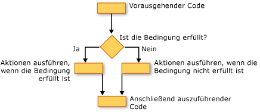

# Entscheidungsstrukturen (Visual Basic)
[!INCLUDE[vbprvb](../../../../csharp/programming-guide/concepts/linq/includes/vbprvb_md.md)]können Sie testbedingungen und andere Vorgänge abhängig von den Ergebnissen dieses Tests ausführen. Sie können testen, für eine Bedingung zu true oder false für verschiedene Werte für einen Ausdruck oder für verschiedene Ausnahmen generiert, wenn Sie eine Reihe von Anweisungen ausführen.  
  
 Die folgende Abbildung zeigt eine Entscheidungsstruktur, die testet eine Bedingung erfüllt sein und verschiedene Aktionen abhängig davon, ob er true oder false.  
  
   
Unterschiedliche Aktionen auszuführen, wenn eine Bedingung True ist, und wenn sie falsch ist.  
  
## If... Dann... Else-Konstruktion  
 `If...Then...Else`Konstruktionen können Sie für mindestens eine Bedingung zu testen, und führen Sie eine oder mehrere Anweisungen jede Bedingung. Sie können testbedingungen und Aktionen auf folgende Weise:  
  
-   Führen Sie eine oder mehrere Anweisungen, wenn eine Bedingung`True`  
  
-   Führen Sie eine oder mehrere Anweisungen, wenn eine Bedingung`False`  
  
-   Führen Sie einige Anweisungen, wenn eine Bedingung `True` und anderen ist dies`False`  
  
-   Testen einer zusätzlichen Bedingung, wenn eine zuvor angegebene Bedingung ist`False`  
  
 Die Kontrollstruktur, die all diese Maßnahmen ermöglicht, wird die [Wenn... Dann... Else-Anweisung](../../../../visual-basic/language-reference/statements/if-then-else-statement.md). Sie können eine einzeiligen Version verwenden, haben nur einen Test und eine Anweisung auszuführen. Wenn Sie einen komplexen Satz aus Bedingung und Aktion haben, können Sie die Version für mehrere Zeilen.  
  
## Wählen Sie... Case-Konstruktion  
 Die `Select...Case` Konstruktion können Sie Auswerten eines Ausdrucks einmal, und führen Sie verschiedene Gruppen von Anweisungen basierend auf verschiedenen möglichen Werte. Weitere Informationen finden Sie unter [wählen... Case-Anweisung](../../../../visual-basic/language-reference/statements/select-case-statement.md).  
  
## Versuchen Sie es... Catch... Finally-Konstruktion  
 `Try...Catch...Finally`Konstruktionen können Sie eine Gruppe von Anweisungen in einer Umgebung ausführen, die Kontrolle behält, wenn eine Anweisung eine Ausnahme auslöst. Sie können verschiedene Aktionen für verschiedene Ausnahmen. Optional können Sie angeben, einen Codeblock, der ausgeführt wird, bevor Sie verlassen, dass die gesamte `Try...Catch...Finally` Konstruktion, unabhängig davon, was auftritt. Weitere Informationen finden Sie unter [versuchen... Catch... Finally-Anweisung](../../../../visual-basic/language-reference/statements/try-catch-finally-statement.md).  
  
> [!NOTE]
>  Für viele Steuerungsstrukturen werden beim Klicken auf ein Schlüsselwort alle Schlüsselwörter in der Struktur hervorgehoben. Z. B. beim Klicken auf `If` in einer `If...Then...Else` Konstruktion, alle Instanzen von `If`, `Then`, `ElseIf`, `Else`, und `End If` bei der Erstellung werden hervorgehoben. Um zum nächsten oder vorherigen hervorgehobenen Schlüsselwort zu wechseln, drücken Sie STRG + UMSCHALT + nach-unten oder STRG + UMSCHALT + nach-oben-Taste.  
  
## Siehe auch  
 [Ablaufsteuerung](../../../../visual-basic/programming-guide/language-features/control-flow/index.md)   
 [Schleifenstruktur](../../../../visual-basic/programming-guide/language-features/control-flow/loop-structures.md)   
 [Weitere Steuerungsstrukturen](../../../../visual-basic/programming-guide/language-features/control-flow/other-control-structures.md)   
 [Geschachtelte Steuerungsstrukturen](../../../../visual-basic/programming-guide/language-features/control-flow/nested-control-structures.md)   
 [If-Operator](../../../../visual-basic/language-reference/operators/if-operator.md)
