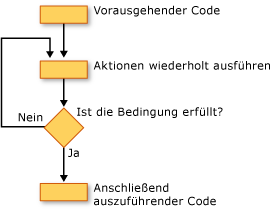

# Schleifenstruktur (Visual Basic)
[!INCLUDE[vbprvb](~/includes/vbprvb-md.md)]Schleifenstruktur ermöglichen Ihnen, eine oder mehrere Codezeilen wiederholt auszuführen. Sie können die Anweisungen in einer Schleifenstruktur wiederholen, bis eine Bedingung ist `True`, bis eine Bedingung ist `False`, eine angegebene Anzahl, wie oft oder einmal für jedes Element in einer Auflistung.  
  
 Die folgende Abbildung zeigt eine Schleifenstruktur, die eine Reihe von Anweisungen ausgeführt, bis eine Bedingung "true" ist.  
  
   
Eine Reihe von Anweisungen ausgeführt, bis eine Bedingung "true" ist.  
  
## While-Schleifen  
 Die `While`... `End While` Konstruktion führt eine Reihe von Anweisungen aus, solange die Bedingung angegeben werden, in der `While` -Anweisung ist `True`. Weitere Informationen finden Sie unter [während... While-Anweisung enden](../../../../visual-basic/language-reference/statements/while-end-while-statement.md).  
  
## Do-Schleifen  
 Die `Do`... `Loop` Konstruktion können Sie eine Bedingung am Anfang oder Ende einer Schleifenstruktur zu testen. Sie können auch angeben, ob die Schleife wiederholt wird, während die Bedingung bleibt `True` oder bis er wieder ist `True`. Weitere Informationen finden Sie unter [werden... Loop-Anweisung](../../../../visual-basic/language-reference/statements/do-loop-statement.md).  
  
## For-Schleifen  
 Die `For`... `Next` Konstruktion führt die Schleife eine festgelegte Anzahl von Zeiten. Er verwendet eine Loop-Steuerelementvariable, die so genannte eine *Leistungsindikator*, zum Nachverfolgen der Wiederholungen. Sie geben die Start- und Endwerten für diesen Leistungsindikator, und Sie können optional angeben, die Menge von der aus eine Wiederholung zur nächsten erhöht gleichzeitig die. Weitere Informationen finden Sie unter [für... Nächste Anweisung](../../../../visual-basic/language-reference/statements/for-next-statement.md).  
  
## For Each-Schleife  
 Die `For Each`... `Next` Konstruktion wird eine Reihe von Anweisungen, die einmal für jedes Element in einer Auflistung ausgeführt. Geben Sie die Loop-Steuerelementvariable, aber Sie müssen keine Anfangs- oder Endwert dafür bestimmen. Weitere Informationen finden Sie unter [für jede... Nächste Anweisung](../../../../visual-basic/language-reference/statements/for-each-next-statement.md).  
  
## Siehe auch  
 [Ablaufsteuerung](../../../../visual-basic/programming-guide/language-features/control-flow/index.md)  
 [Entscheidungsstrukturen](../../../../visual-basic/programming-guide/language-features/control-flow/decision-structures.md)  
 [Weitere Steuerungsstrukturen](../../../../visual-basic/programming-guide/language-features/control-flow/other-control-structures.md)  
 [Geschachtelte Steuerungsstrukturen](../../../../visual-basic/programming-guide/language-features/control-flow/nested-control-structures.md)
