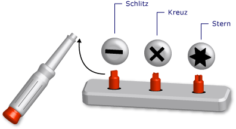

# Generische Typen in Visual Basic (Visual Basic)Generic Types in Visual Basic (Visual Basic)
Ein *generischer Typ* ist ein einzelnes Programmierelement, das sich so anpasst, dass es für verschiedene Datentypen dieselben Funktionalität ausführt.A *generic type* is a single programming element that adapts to perform the same functionality for a variety of data types. Wenn Sie eine generische Klasse oder Prozedur definieren, müssen Sie keine separate Version für jeden Datentyp definieren, für den Sie diese Funktionalität möglicherweise ausführen möchten.When you define a generic class or procedure, you do not have to define a separate version for each data type for which you might want to perform that functionality.  
  
 Eine Analogie hierzu ist ein Schraubendrehersatz mit auswechselbaren Spitzen.An analogy is a screwdriver set with removable heads. Sie sehen sich die Schraube an, die Sie drehen müssen, und wählen die geeignete Spitze für diese Schraube aus (geschlitzt, gekreuzt oder mit Stern).You inspect the screw you need to turn and select the correct head for that screw (slotted, crossed, starred). Sobald Sie die richtige Spitze in den Schraubendreher gesteckt haben, führen Sie mit dem Schraubendreher genau diese Funktion aus, d. h., Sie drehen die Schraube.Once you insert the correct head in the screwdriver handle, you perform the exact same function with the screwdriver, namely turning the screw.  
  
   
Schraubendrehersatz als generisches WerkzeugScrewdriver set as a generic tool  
  
 Wenn Sie einen generischen Typ definieren, parametrisieren Sie ihn mit mindestens einem Datentyp.When you define a generic type, you parameterize it with one or more data types. Dies ermöglicht es, die Datentypen mithilfe von Code an die Anforderungen anzupassen.This allows the using code to tailor the data types to its requirements. Im Code können Sie mehrere unterschiedliche Programmierelemente anhand des generischen Elements deklarieren, von denen jedes für eine andere Gruppe von Datentypen ausgeführt wird.Your code can declare several different programming elements from the generic element, each one acting on a different set of data types. Die deklarierten Elemente führen jedoch alle dieselbe Logik aus, unabhängig davon, welche Datentypen von ihnen verwendet werden.But the declared elements all perform the identical logic, no matter what data types they are using.  
  
 Nehmen Sie beispielsweise an, Sie möchten eine Warteschlangeklasse erstellen und verwenden, die für einen bestimmten Datentyp, z. B. `String`, ausgeführt wird.For example, you might want to create and use a queue class that operates on a specific data type such as `String`. Sie können eine solche Klasse aus deklarieren <xref:System.Collections.Generic.Queue%601?displayProperty=fullName>, wie im folgende Beispiel dargestellt.</xref:System.Collections.Generic.Queue%601?displayProperty=fullName>You can declare such a class from <xref:System.Collections.Generic.Queue%601?displayProperty=fullName>, as the following example shows.  
  
 [!code-vb[VbVbalrDataTypes&#1;](../../../../visual-basic/language-reference/data-types/codesnippet/VisualBasic/generic-types_1.vb)][!code-vb[VbVbalrDataTypes#1](../../../../visual-basic/language-reference/data-types/codesnippet/VisualBasic/generic-types_1.vb)]  
  
 Nun können Sie `stringQ` verwenden, um ausschließlich mit `String` -Werten zu arbeiten.You can now use `stringQ` to work exclusively with `String` values. Da `stringQ` speziell für `String` -Werte und nicht allgemein für `Object` -Werte verwendet wird, gibt es weder späte Bindung noch Typkonvertierung.Because `stringQ` is specific for `String` instead of being generalized for `Object` values, you do not have late binding or type conversion. Dies erspart Ausführungszeit und verringert Laufzeitfehler.This saves execution time and reduces run-time errors.  
  
 Weitere Informationen zur Verwendung eines generischen Typs finden Sie unter [Gewusst wie: Verwenden einer generischen Klasse](../../../../visual-basic/programming-guide/language-features/data-types/how-to-use-a-generic-class.md).For more information on using a generic type, see [How to: Use a Generic Class](../../../../visual-basic/programming-guide/language-features/data-types/how-to-use-a-generic-class.md).  
  
## Beispiel für eine generische KlasseExample of a Generic Class  
 Im folgenden Beispiel wird eine Rumpfdefinition einer generischen Klasse veranschaulicht.The following example shows a skeleton definition of a generic class.  
  
 [!code-vb[VbVbalrDataTypes&#2;](../../../../visual-basic/language-reference/data-types/codesnippet/VisualBasic/generic-types_2.vb)][!code-vb[VbVbalrDataTypes#2](../../../../visual-basic/language-reference/data-types/codesnippet/VisualBasic/generic-types_2.vb)]  
  
 Im dieser Rumpfdefinition ist `t` ein *Typparameter*, d. h. ein Platzhalter für einen Datentyp, den Sie beim Deklarieren der Klasse angeben.In the preceding skeleton, `t` is a *type parameter*, that is, a placeholder for a data type that you supply when you declare the class. An anderer Stelle im Code können Sie verschiedene Versionen von `classHolder` deklarieren, indem Sie für `t`verschiedene Datentypen angeben.Elsewhere in your code, you can declare various versions of `classHolder` by supplying various data types for `t`. Im folgenden Beispiel werden zwei solcher Deklarationen gezeigt.The following example shows two such declarations.  
  
 [!code-vb[VbVbalrDataTypes&3;](../../../../visual-basic/language-reference/data-types/codesnippet/VisualBasic/generic-types_3.vb)][!code-vb[VbVbalrDataTypes#3](../../../../visual-basic/language-reference/data-types/codesnippet/VisualBasic/generic-types_3.vb)]  
  
 Die vorangehenden Anweisungen deklarieren *konstruierte Klassen*, in denen ein bestimmter Typ den Typparameter ersetzt.The preceding statements declare *constructed classes*, in which a specific type replaces the type parameter. Diese Ersetzung wird im gesamten Code in der konstruierten Klasse weitergegeben.This replacement is propagated throughout the code within the constructed class. Im folgenden Beispiel wird gezeigt, wie die `processNewItem` -Prozedur in `integerClass`aussieht.The following example shows what the `processNewItem` procedure looks like in `integerClass`.  
  
 [!code-vb[VbVbalrDataTypes&4;](../../../../visual-basic/language-reference/data-types/codesnippet/VisualBasic/generic-types_4.vb)][!code-vb[VbVbalrDataTypes#4](../../../../visual-basic/language-reference/data-types/codesnippet/VisualBasic/generic-types_4.vb)]  
  
 Ein ausführlicheres Beispiel finden Sie unter [Gewusst wie: Definieren einer Klasse, dass können bieten identisch Funktionen auf unterschiedliche Datentypen](../../../../visual-basic/programming-guide/language-features/data-types/how-to-define-a-class-that-can-provide-identical-functionality.md).For a more complete example, see [How to: Define a Class That Can Provide Identical Functionality on Different Data Types](../../../../visual-basic/programming-guide/language-features/data-types/how-to-define-a-class-that-can-provide-identical-functionality.md).  
  
## Geeignete ProgrammierelementeEligible Programming Elements  
 Sie können generische Klassen, Strukturen, Schnittstellen, Prozeduren und Delegaten definieren und verwenden.You can define and use generic classes, structures, interfaces, procedures, and delegates. Beachten Sie, dass die [!INCLUDE[dnprdnshort](../../../../csharp/getting-started/includes/dnprdnshort_md.md)] definiert mehrere generische Klassen, Strukturen und Schnittstellen, die häufig verwendete generische Elemente darstellen.Note that the [!INCLUDE[dnprdnshort](../../../../csharp/getting-started/includes/dnprdnshort_md.md)] defines several generic classes, structures, and interfaces that represent commonly used generic elements. Der <xref:System.Collections.Generic?displayProperty=fullName>-Namespace stellt Wörterbücher, Listen, Warteschlangen und Stapel bereit.</xref:System.Collections.Generic?displayProperty=fullName>The <xref:System.Collections.Generic?displayProperty=fullName> namespace provides dictionaries, lists, queues, and stacks. Lesen Sie vor dem eigene generisches Element definieren, wenn es bereits in <xref:System.Collections.Generic?displayProperty=fullName>.</xref:System.Collections.Generic?displayProperty=fullName> verfügbar istBefore defining your own generic element, see if it is already available in <xref:System.Collections.Generic?displayProperty=fullName>.  
  
 Prozeduren sind keine Typen, Sie können aber generische Prozeduren definieren und verwenden.Procedures are not types, but you can define and use generic procedures. Finden Sie unter [generische Prozeduren in Visual Basic](../../../../visual-basic/programming-guide/language-features/data-types/generic-procedures.md).See [Generic Procedures in Visual Basic](../../../../visual-basic/programming-guide/language-features/data-types/generic-procedures.md).  
  
## Vorteile von generischen TypenAdvantages of Generic Types  
 Ein generischer Typ fungiert als Basis für das Deklarieren mehrerer unterschiedlicher Programmierelemente, von denen jedes für einen bestimmten Datentyp ausgeführt wird.A generic type serves as a basis for declaring several different programming elements, each of which operates on a specific data type. Die Alternativen zu einem generischen Typ sind:The alternatives to a generic type are:  
  
1.  Ein einzelner Typ, der auf den `Object` -Datentyp angewendet wird.A single type operating on the `Object` data type.  
  
2.  Ein Satz von *typspezifischen* Versionen des Typs, wobei jede Version individuell codiert ist und auf einen speziellen Datentyp, z. B. `String`oder `Integer`, oder auf einen benutzerdefinierten Typ, etwa `customer`, angewendet wird.A set of *type-specific* versions of the type, each version individually coded and operating on one specific data type such as `String`, `Integer`, or a user-defined type such as `customer`.  
  
 Ein generischer Typ bietet folgende Vorteile gegenüber diesen Alternativen:A generic type has the following advantages over these alternatives:  
  
-   **Typsicherheit.****Type Safety.** . Generische Typen erzwingen die Typüberprüfung zur Kompilierzeit.Generic types enforce compile-time type checking. Auf `Object` basierende Typen akzeptieren jeden Datentyp, und Sie müssen Code schreiben, der überprüft, ob ein Eingabedatentyp zulässig ist.Types based on `Object` accept any data type, and you must write code to check whether an input data type is acceptable. Mit generischen Typen kann der Compiler Typenkonflikte vor der Laufzeit abfangen.With generic types, the compiler can catch type mismatches before run time.  
  
-   **Die Leistung.****Performance.** Generische Typen müssen kein *Boxing* und *unBoxing* für Daten ausführen, da jeder Typ speziell für einen Datentyp verwendet wird.Generic types do not have to *box* and *unbox* data, because each one is specialized for one data type. Operationen, die auf `Object` basierend, müssen für Eingabedatentypen Boxing ausführen, um sie in `Object` zu konvertieren, und Unboxing für Daten ausführen, die für die Ausgabe vorgesehen sind.Operations based on `Object` must box input data types to convert them to `Object` and unbox data destined for output. Durch Boxing und Unboxing wird die Leistung verringert.Boxing and unboxing reduce performance.  
  
     Typen, die auf `Object` basieren, sind außerdem spät gebunden, d. h., dass der Zugriff auf ihre Member zusätzlichen Code zur Laufzeit erfordert.Types based on `Object` are also late-bound, which means that accessing their members requires extra code at run time. Hierdurch wird die Leistung ebenfalls verringert.This also reduces performance.  
  
-   **Konsolidierung von Code.****Code Consolidation.** Der Code in einem generischen Typ muss nur einmal definiert werden.The code in a generic type has to be defined only once. Ein Satz typspezifischer Versionen eines Typs muss in jeder Version denselben Code replizieren, wobei der einzige Unterschied im speziellen Datentyp für die jeweilige Version besteht.A set of type-specific versions of a type must replicate the same code in each version, with the only difference being the specific data type for that version. Bei generischen Typen werden alle typspezifischen Versionen aus dem ursprünglichen generischen Typ generiert.With generic types, the type-specific versions are all generated from the original generic type.  
  
-   **Wiederverwendung von Code.****Code Reuse.** . Code, der nicht von einem bestimmten Datentyp abhängt, kann für verschiedene Datentypen wiederverwendet werden, wenn er generisch ist.Code that does not depend on a particular data type can be reused with various data types if it is generic. Sie können ihn häufig sogar für einen Datentypen wiederverwenden, den Sie ursprünglich nicht vorausbestimmt haben.You can often reuse it even with a data type that you did not originally predict.  
  
-   **IDE-Unterstützung.****IDE Support.** Wenn Sie einen konstruierten Typ verwenden, der aus einem generischen Typ deklariert wurde, können Sie durch die IDE (Integrated Development Environment, integrierte Entwicklungsumgebung) weitere Unterstützung beim Verfassen des Codes erhalten.When you use a constructed type declared from a generic type, the integrated development environment (IDE) can give you more support while you are developing your code. Beispielsweise kann IntelliSense Ihnen die typspezifischen Optionen für ein Argument eines Konstruktors oder einer Methode anzeigen.For example, IntelliSense can show you the type-specific options for an argument to a constructor or method.  
  
-   **Generische Algorithmen.****Generic Algorithms.** Abstrakte Algorithmen, die typunabhängig sind, sind gute Kandidaten für generische Typen.Abstract algorithms that are type-independent are good candidates for generic types. Zum Beispiel eine generische Prozedur, die Elemente mithilfe der <xref:System.IComparable>Schnittstelle kann verwendet werden, für jeden Datentyp, der implementiert <xref:System.IComparable>.</xref:System.IComparable> </xref:System.IComparable> sortiertFor example, a generic procedure that sorts items using the <xref:System.IComparable> interface can be used with any data type that implements <xref:System.IComparable>.  
  
## EinschränkungenConstraints  
 Obwohl der Code in der Definition eines generischen Typs so typunabhängig wie möglich sein sollte, müssen Sie eventuell eine bestimmte Fähigkeit irgendeines Datentyps erfordern, der dem generischen Datentyp bereitgestellt wird.Although the code in a generic type definition should be as type-independent as possible, you might need to require a certain capability of any data type supplied to your generic type. Wenn Sie zwei Elemente zu sortieren vergleichen möchten, deren Datentyp muss implementieren beispielsweise die <xref:System.IComparable>Schnittstelle.</xref:System.IComparable>For example, if you want to compare two items for the purpose of sorting or collating, their data type must implement the <xref:System.IComparable> interface. Sie können diese Anforderung erzwingen, indem Sie dem Typparameter eine *Einschränkung* hinzufügen.You can enforce this requirement by adding a *constraint* to the type parameter.  
  
### Beispiel für eine EinschränkungExample of a Constraint  
 Das folgende Beispiel zeigt eine Skelette Definition einer Klasse mit einer Einschränkung, die das Typargument implementieren <xref:System.IComparable>.</xref:System.IComparable> erfordertThe following example shows a skeleton definition of a class with a constraint that requires the type argument to implement <xref:System.IComparable>.  
  
 [!code-vb[VbVbalrDataTypes&5;](../../../../visual-basic/language-reference/data-types/codesnippet/VisualBasic/generic-types_5.vb)][!code-vb[VbVbalrDataTypes#5](../../../../visual-basic/language-reference/data-types/codesnippet/VisualBasic/generic-types_5.vb)]  
  
 Wenn nachfolgende Code versucht, eine Klasse von `itemManager` angeben eines Typs, die nicht implementiert <xref:System.IComparable>, signalisiert der Compiler einen Fehler.</xref:System.IComparable>If subsequent code attempts to construct a class from `itemManager` supplying a type that does not implement <xref:System.IComparable>, the compiler signals an error.  
  
### Typen von EinschränkungenTypes of Constraints  
 In einer Einschränkung können die folgenden Anforderungen in beliebiger Kombination angegeben werden:Your constraint can specify the following requirements in any combination:  
  
-   Das Typargument muss mindestens eine Schnittstelle implementieren.The type argument must implement one or more interfaces  
  
-   Das Typargument darf nur den Typ einer einzigen Klasse haben oder von einer einzigen Klasse erben.The type argument must be of the type of, or inherit from, at most one class  
  
-   Das Typargument muss einen parameterlosen Konstruktor für den Code verfügbar machen, der Objekte aus dem Typargument erstellt.The type argument must expose a parameterless constructor accessible to the code that creates objects from it  
  
-   Das Typargument muss ein *Verweistyp*oder *Werttyp*sein.The type argument must be a *reference type*, or it must be a *value type*  
  
 Wenn Sie mehrere Einschränkungen erzwingen müssen, verwenden Sie eine durch Trennzeichen getrennte *Einschränkungsliste* in geschweiften Klammern (`{ }`).If you need to impose more than one requirement, you use a comma-separated *constraint list* inside braces (`{ }`). Um einen zugreifbaren Konstruktor erfordern, Sie enthalten die [Operator New](../../../../visual-basic/language-reference/operators/new-operator.md) Schlüsselwort in der Liste.To require an accessible constructor, you include the [New Operator](../../../../visual-basic/language-reference/operators/new-operator.md) keyword in the list. Um festzulegen, dass ein Verweistyp erforderlich ist, fügen Sie das `Class` -Schlüsselwort ein. Um festzulegen, dass ein Werttyp erforderlich ist, fügen Sie das `Structure` -Schlüsselwort ein.To require a reference type, you include the `Class` keyword; to require a value type, you include the `Structure` keyword.  
  
 Weitere Informationen zu Einschränkungen finden Sie unter [Liste](../../../../visual-basic/language-reference/statements/type-list.md).For more information on constraints, see [Type List](../../../../visual-basic/language-reference/statements/type-list.md).  
  
### Beispiel für mehrere EinschränkungenExample of Multiple Constraints  
 Im folgenden Beispiel wird die Rumpfdefinition einer generischen Klasse mit einer Einschränkungsliste für den Typparameter veranschaulicht.The following example shows a skeleton definition of a generic class with a constraint list on the type parameter. In Code, der eine Instanz dieser Klasse erstellt, muss das Typargument implementieren sowohl die <xref:System.IComparable>und <xref:System.IDisposable>-Schnittstellen, ein Verweistyp sein und einen zugreifbaren parameterlosen Konstruktor verfügbar machen.</xref:System.IDisposable> </xref:System.IComparable>In the code that creates an instance of this class, the type argument must implement both the <xref:System.IComparable> and <xref:System.IDisposable> interfaces, be a reference type, and expose an accessible parameterless constructor.  
  
 [!code-vb[VbVbalrDataTypes&6;](../../../../visual-basic/language-reference/data-types/codesnippet/VisualBasic/generic-types_6.vb)][!code-vb[VbVbalrDataTypes#6](../../../../visual-basic/language-reference/data-types/codesnippet/VisualBasic/generic-types_6.vb)]  
  
## Wichtige BegriffeImportant Terms  
 Für generische Typen werden die folgenden Begriffe verwendet:Generic types introduce and use the following terms:  
  
-   *Generischer Typ*.*Generic Type*. Eine Definition einer Klasse, einer Struktur, einer Schnittstelle, einer Prozedur oder eines Delegaten, für deren bzw. dessen Deklaration Sie mindestens einen Datentyp angeben.A definition of a class, structure, interface, procedure, or delegate for which you supply at least one data type when you declare it.  
  
-   *Typparameter*.*Type Parameter*. In der Definition eines generischen Typs ein Platzhalter für einen Datentyp, den Sie beim Deklarieren des Typs angeben.In a generic type definition, a placeholder for a data type you supply when you declare the type.  
  
-   *Typargument*.*Type Argument*. Ein spezieller Datentyp, der einen Typparameter ersetzt, wenn Sie einen konstruierten Typ aus einem generischen Typ deklarieren.A specific data type that replaces a type parameter when you declare a constructed type from a generic type.  
  
-   *Einschränkung*.*Constraint*. Eine Bedingung für einen Typparameter, die das Typargument einschränkt, das Sie für den Typparameter angeben können.A condition on a type parameter that restricts the type argument you can supply for it. Eine Einschränkung kann festlegen, dass das Typargument eine bestimmte Schnittstelle implementieren, eine bestimmte Klasse sein oder von einer bestimmten Klasse erben, einen zugänglichen parameterlosen Konstruktor haben oder ein Verweistyp oder ein Werttyp sein muss.A constraint can require that the type argument must implement a particular interface, be or inherit from a particular class, have an accessible parameterless constructor, or be a reference type or a value type. Sie können diese Einschränkungen kombinieren, Sie können aber maximal eine Klasse angeben.You can combine these constraints, but you can specify at most one class.  
  
-   *Konstruierter Typ.**Constructed Type*. Eine Klasse, eine Struktur, eine Schnittstelle, eine Prozedur oder ein Delegat, die bzw. der aus einem generischen Typ deklariert wird, indem Typargumente für dessen Typparameter angegeben werden.A class, structure, interface, procedure, or delegate declared from a generic type by supplying type arguments for its type parameters.  
  
## Siehe auchSee Also  
 [Datentypen](../../../../visual-basic/programming-guide/language-features/data-types/index.md) [Data Types](../../../../visual-basic/programming-guide/language-features/data-types/index.md)   
 [Typzeichen](../../../../visual-basic/programming-guide/language-features/data-types/type-characters.md)  [Type Characters](../../../../visual-basic/programming-guide/language-features/data-types/type-characters.md)   
 [Werttypen und Verweistypen](../../../../visual-basic/programming-guide/language-features/data-types/value-types-and-reference-types.md)  [Value Types and Reference Types](../../../../visual-basic/programming-guide/language-features/data-types/value-types-and-reference-types.md)   
 [Typumwandlungen in Visual Basic](../../../../visual-basic/programming-guide/language-features/data-types/type-conversions.md)  [Type Conversions in Visual Basic](../../../../visual-basic/programming-guide/language-features/data-types/type-conversions.md)   
 [Problembehandlung bei Datentypen](../../../../visual-basic/programming-guide/language-features/data-types/troubleshooting-data-types.md)  [Troubleshooting Data Types](../../../../visual-basic/programming-guide/language-features/data-types/troubleshooting-data-types.md)   
 [Datentypen](../../../../visual-basic/language-reference/data-types/data-type-summary.md)  [Data Types](../../../../visual-basic/language-reference/data-types/data-type-summary.md)   
 [Of](../../../../visual-basic/language-reference/statements/of-clause.md)  [Of](../../../../visual-basic/language-reference/statements/of-clause.md)   
 [Als](../../../../visual-basic/language-reference/statements/as-clause.md)  [As](../../../../visual-basic/language-reference/statements/as-clause.md)   
 [Object-Datentyp](../../../../visual-basic/language-reference/data-types/object-data-type.md)  [Object Data Type](../../../../visual-basic/language-reference/data-types/object-data-type.md)   
 [Kovarianz und Kontravarianz](http://msdn.microsoft.com/library/a58cc086-276f-4f91-a366-85b7f95f38b8)  [Covariance and Contravariance](http://msdn.microsoft.com/library/a58cc086-276f-4f91-a366-85b7f95f38b8)   
 [Iteratoren](http://msdn.microsoft.com/library/f45331db-d595-46ec-9142-551d3d1eb1a7) [Iterators](http://msdn.microsoft.com/library/f45331db-d595-46ec-9142-551d3d1eb1a7)
