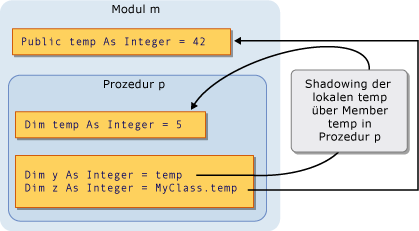
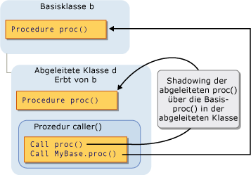

# <a name="shadowing-in-visual-basic"></a><span data-ttu-id="e24ef-102">Shadowing in Visual Basic</span><span class="sxs-lookup"><span data-stu-id="e24ef-102">Shadowing in Visual Basic</span></span>
<span data-ttu-id="e24ef-103">Wenn zwei Programmierelemente denselben Namen haben, eine davon kann auszublenden, oder *Schatten*, eine.</span><span class="sxs-lookup"><span data-stu-id="e24ef-103">When two programming elements share the same name, one of them can hide, or *shadow*, the other one.</span></span> <span data-ttu-id="e24ef-104">In diesem Fall ist das gespiegelte Element nicht zur Verfügung; Stattdessen, wenn der Code verwendet den Elementnamen und die [!INCLUDE[vbprvb](../../../../csharp/programming-guide/concepts/linq/includes/vbprvb_md.md)] Compiler löst den Verweis in das spiegelnde Element.</span><span class="sxs-lookup"><span data-stu-id="e24ef-104">In such a situation, the shadowed element is not available for reference; instead, when your code uses the element name, the [!INCLUDE[vbprvb](../../../../csharp/programming-guide/concepts/linq/includes/vbprvb_md.md)] compiler resolves it to the shadowing element.</span></span>  
  
## <a name="purpose"></a><span data-ttu-id="e24ef-105">Zweck</span><span class="sxs-lookup"><span data-stu-id="e24ef-105">Purpose</span></span>  
 <span data-ttu-id="e24ef-106">Der Hauptzweck des shadowing ist die Definition von Klassenmembern zu schützen.</span><span class="sxs-lookup"><span data-stu-id="e24ef-106">The main purpose of shadowing is to protect the definition of your class members.</span></span> <span data-ttu-id="e24ef-107">Die Basisklasse kann geändert werden, die ein Element mit dem gleichen Namen wie eine erstellt, die Sie bereits definiert haben.</span><span class="sxs-lookup"><span data-stu-id="e24ef-107">The base class might undergo a change that creates an element with the same name as one you have already defined.</span></span> <span data-ttu-id="e24ef-108">In diesem Fall die `Shadows` Modifizierer erzwingt, dass Verweise über die Klasse, um die Member aufgelöst werden Sie definiert, sondern an das neue Element der Basisklasse.</span><span class="sxs-lookup"><span data-stu-id="e24ef-108">If this happens, the `Shadows` modifier forces references through your class to be resolved to the member you defined, instead of to the new base class element.</span></span>  
  
## <a name="types-of-shadowing"></a><span data-ttu-id="e24ef-109">Typen von Shadowing</span><span class="sxs-lookup"><span data-stu-id="e24ef-109">Types of Shadowing</span></span>  
 <span data-ttu-id="e24ef-110">Ein Element kann auf zwei verschiedene Weisen ein anderes Element spiegeln.</span><span class="sxs-lookup"><span data-stu-id="e24ef-110">An element can shadow another element in two different ways.</span></span> <span data-ttu-id="e24ef-111">Das spiegelnde Element kann innerhalb eines Unterbereichs des Bereichs enthält, für die Shadowing durchgeführt wurde in dem Fall das shadowing erfolgt deklariert werden *über den Gültigkeitsbereich*.</span><span class="sxs-lookup"><span data-stu-id="e24ef-111">The shadowing element can be declared inside a subregion of the region containing the shadowed element, in which case the shadowing is accomplished *through scope*.</span></span> <span data-ttu-id="e24ef-112">Oder eine ableitende Klasse einen Member einer Basisklasse, die in dem Fall das shadowing erfolgt redefine kann *durch Vererbung*.</span><span class="sxs-lookup"><span data-stu-id="e24ef-112">Or a deriving class can redefine a member of a base class, in which case the shadowing is done *through inheritance*.</span></span>  
  
### <a name="shadowing-through-scope"></a><span data-ttu-id="e24ef-113">Shadowing über den Gültigkeitsbereich</span><span class="sxs-lookup"><span data-stu-id="e24ef-113">Shadowing Through Scope</span></span>  
 <span data-ttu-id="e24ef-114">Es ist möglich, dass Programmierelemente in demselben Modul, Klasse oder Struktur, die den gleichen Namen, aber unterschiedliche Gültigkeitsbereiche haben.</span><span class="sxs-lookup"><span data-stu-id="e24ef-114">It is possible for programming elements in the same module, class, or structure to have the same name but different scope.</span></span> <span data-ttu-id="e24ef-115">Wenn zwei Elemente auf diese Weise deklariert wurden und der Code auf den gemeinsamen Namen verweist, spiegelt das Element mit dem engeren Gültigkeitsbereich das andere Element (der Blockbereich ist der engste).</span><span class="sxs-lookup"><span data-stu-id="e24ef-115">When two elements are declared in this manner and the code refers to the name they share, the element with the narrower scope shadows the other element (block scope is the narrowest).</span></span>  
  
 <span data-ttu-id="e24ef-116">Ein Modul kann definieren, z. B. ein `Public` Variable mit dem Namen `temp`, und eine Prozedur innerhalb des Moduls eine lokale Variable namens auch deklarieren kann `temp`.</span><span class="sxs-lookup"><span data-stu-id="e24ef-116">For example, a module can define a `Public` variable named `temp`, and a procedure within the module can declare a local variable also named `temp`.</span></span> <span data-ttu-id="e24ef-117">Verweise auf `temp` innerhalb der Prozedur greifen auf die lokale Variable zu, während Verweise auf `temp` von außerhalb der Prozedur greifen auf die `Public` Variable.</span><span class="sxs-lookup"><span data-stu-id="e24ef-117">References to `temp` from within the procedure access the local variable, while references to `temp` from outside the procedure access the `Public` variable.</span></span> <span data-ttu-id="e24ef-118">In diesem Fall die Prozedurvariable `temp` Shadowing der Modulvariablen `temp`.</span><span class="sxs-lookup"><span data-stu-id="e24ef-118">In this case, the procedure variable `temp` shadows the module variable `temp`.</span></span>  
  
 <span data-ttu-id="e24ef-119">Die folgende Abbildung zeigt zwei Variablen, die mit dem Namen `temp`.</span><span class="sxs-lookup"><span data-stu-id="e24ef-119">The following illustration shows two variables, both named `temp`.</span></span> <span data-ttu-id="e24ef-120">Die lokale Variable `temp` die Membervariable shadows `temp` , wenn innerhalb ihrer eigenen Prozedur über `p`.</span><span class="sxs-lookup"><span data-stu-id="e24ef-120">The local variable `temp` shadows the member variable `temp` when accessed from within its own procedure `p`.</span></span> <span data-ttu-id="e24ef-121">Allerdings die `MyClass` Schlüsselwort umgeht das shadowing und greift auf die Membervariable.</span><span class="sxs-lookup"><span data-stu-id="e24ef-121">However, the `MyClass` keyword bypasses the shadowing and accesses the member variable.</span></span>  
  
 <span data-ttu-id="e24ef-122"></span><span class="sxs-lookup"><span data-stu-id="e24ef-122"></span></span>  
<span data-ttu-id="e24ef-123">Shadowing über den Gültigkeitsbereich</span><span class="sxs-lookup"><span data-stu-id="e24ef-123">Shadowing through scope</span></span>  
  
 <span data-ttu-id="e24ef-124">Ein Beispiel für das shadowing über den Gültigkeitsbereich, finden Sie unter [Gewusst wie: Ausblenden einer Variablen mit dem gleichen Namen wie der Variable](../../../../visual-basic/programming-guide/language-features/declared-elements/how-to-hide-a-variable-with-the-same-name-as-your-variable.md).</span><span class="sxs-lookup"><span data-stu-id="e24ef-124">For an example of shadowing through scope, see [How to: Hide a Variable with the Same Name as Your Variable](../../../../visual-basic/programming-guide/language-features/declared-elements/how-to-hide-a-variable-with-the-same-name-as-your-variable.md).</span></span>  
  
### <a name="shadowing-through-inheritance"></a><span data-ttu-id="e24ef-125">Shadowing durch Vererbung</span><span class="sxs-lookup"><span data-stu-id="e24ef-125">Shadowing Through Inheritance</span></span>  
 <span data-ttu-id="e24ef-126">Wenn eine abgeleitete Klasse ein von einer Basisklasse geerbtes Programmierelement neu definiert, spiegelt das neu definierte Element das ursprüngliche Element.</span><span class="sxs-lookup"><span data-stu-id="e24ef-126">If a derived class redefines a programming element inherited from a base class, the redefining element shadows the original element.</span></span> <span data-ttu-id="e24ef-127">Jede Art von deklarierten Element oder eine Gruppe überladener Elemente kann mit keinem anderen Typ Shadowing durchführen.</span><span class="sxs-lookup"><span data-stu-id="e24ef-127">You can shadow any type of declared element, or set of overloaded elements, with any other type.</span></span> <span data-ttu-id="e24ef-128">Z. B. ein `Integer` Variable Schatten kann ein `Function` Verfahren.</span><span class="sxs-lookup"><span data-stu-id="e24ef-128">For example, an `Integer` variable can shadow a `Function` procedure.</span></span> <span data-ttu-id="e24ef-129">Wenn Sie eine Prozedur mit einer anderen Prozedur spiegeln, können Sie eine andere Parameterliste und einen anderen Rückgabetyp verwenden.</span><span class="sxs-lookup"><span data-stu-id="e24ef-129">If you shadow a procedure with another procedure, you can use a different parameter list and a different return type.</span></span>  
  
 <span data-ttu-id="e24ef-130">Die folgende Abbildung zeigt eine Basisklasse `b` und eine abgeleitete Klasse `d` , die von erbt `b`.</span><span class="sxs-lookup"><span data-stu-id="e24ef-130">The following illustration shows a base class `b` and a derived class `d` that inherits from `b`.</span></span> <span data-ttu-id="e24ef-131">Die Basisklasse definiert eine Prozedur namens `proc`, und die abgeleitete Klasse mit einer anderen Prozedur mit demselben Namen Shadowing.</span><span class="sxs-lookup"><span data-stu-id="e24ef-131">The base class defines a procedure named `proc`, and the derived class shadows it with another procedure of the same name.</span></span> <span data-ttu-id="e24ef-132">Die erste `Call` Anweisung greift auf das shadowing `proc` in der abgeleiteten Klasse.</span><span class="sxs-lookup"><span data-stu-id="e24ef-132">The first `Call` statement accesses the shadowing `proc` in the derived class.</span></span> <span data-ttu-id="e24ef-133">Allerdings die `MyBase` Schlüsselwort umgeht das shadowing und greift auf die schattierte Prozedur in der Basisklasse.</span><span class="sxs-lookup"><span data-stu-id="e24ef-133">However, the `MyBase` keyword bypasses the shadowing and accesses the shadowed procedure in the base class.</span></span>  
  
 <span data-ttu-id="e24ef-134"></span><span class="sxs-lookup"><span data-stu-id="e24ef-134"></span></span>  
<span data-ttu-id="e24ef-135">Shadowing durch Vererbung</span><span class="sxs-lookup"><span data-stu-id="e24ef-135">Shadowing through inheritance</span></span>  
  
 <span data-ttu-id="e24ef-136">Ein Beispiel für das shadowing durch Vererbung, finden Sie unter [Gewusst wie: Ausblenden einer Variablen mit dem gleichen Namen wie Ihre Variablen](../../../../visual-basic/programming-guide/language-features/declared-elements/how-to-hide-a-variable-with-the-same-name-as-your-variable.md) und [Gewusst wie: Ausblenden einer geerbten Variablen](../../../../visual-basic/programming-guide/language-features/declared-elements/how-to-hide-an-inherited-variable.md).</span><span class="sxs-lookup"><span data-stu-id="e24ef-136">For an example of shadowing through inheritance, see [How to: Hide a Variable with the Same Name as Your Variable](../../../../visual-basic/programming-guide/language-features/declared-elements/how-to-hide-a-variable-with-the-same-name-as-your-variable.md) and [How to: Hide an Inherited Variable](../../../../visual-basic/programming-guide/language-features/declared-elements/how-to-hide-an-inherited-variable.md).</span></span>  
  
#### <a name="shadowing-and-access-level"></a><span data-ttu-id="e24ef-137">Shadowing und Zugriffsebene</span><span class="sxs-lookup"><span data-stu-id="e24ef-137">Shadowing and Access Level</span></span>  
 <span data-ttu-id="e24ef-138">Das spiegelnde Element ist nicht immer aus dem Code, der mit der abgeleiteten Klasse zugegriffen werden kann.</span><span class="sxs-lookup"><span data-stu-id="e24ef-138">The shadowing element is not always accessible from the code using the derived class.</span></span> <span data-ttu-id="e24ef-139">Beispielsweise können deklariert werden `Private`.</span><span class="sxs-lookup"><span data-stu-id="e24ef-139">For example, it might be declared `Private`.</span></span> <span data-ttu-id="e24ef-140">In diesem Fall erfolgt kein shadowing, und der Compiler löst alle Verweise auf dasselbe Element haben gab es kein shadowing.</span><span class="sxs-lookup"><span data-stu-id="e24ef-140">In such a case, shadowing is defeated and the compiler resolves any reference to the same element it would have if there had been no shadowing.</span></span> <span data-ttu-id="e24ef-141">Dieses Element ist die wenigsten Ableitungsschritte Schritte rückwärts von der Klasse shadowing barrierefreien Elements.</span><span class="sxs-lookup"><span data-stu-id="e24ef-141">This element is the accessible element the fewest derivational steps backward from the shadowing class.</span></span> <span data-ttu-id="e24ef-142">Ist das gespiegelte Element eine Prozedur, wird die Lösung ist die nächste Version auf mit dem gleichen Namen, die Liste der Parameter und Rückgabetyp.</span><span class="sxs-lookup"><span data-stu-id="e24ef-142">If the shadowed element is a procedure, the resolution is to the closest accessible version with the same name, parameter list, and return type.</span></span>  
  
 <span data-ttu-id="e24ef-143">Das folgende Beispiel zeigt eine Vererbungshierarchie mit drei Klassen.</span><span class="sxs-lookup"><span data-stu-id="e24ef-143">The following example shows an inheritance hierarchy of three classes.</span></span> <span data-ttu-id="e24ef-144">Jede Klasse definiert eine `Sub` Prozedur `display`, und jede abgeleitete Klasse Schatten der `display` Prozedur in der Basisklasse.</span><span class="sxs-lookup"><span data-stu-id="e24ef-144">Each class defines a `Sub` procedure `display`, and each derived class shadows the `display` procedure in its base class.</span></span>  
  
```  
Public Class firstClass  
    Public Sub display()  
        MsgBox("This is firstClass")  
    End Sub  
End Class  
Public Class secondClass  
    Inherits firstClass  
    Private Shadows Sub display()  
        MsgBox("This is secondClass")  
    End Sub  
End Class  
Public Class thirdClass  
    Inherits secondClass  
    Public Shadows Sub display()  
        MsgBox("This is thirdClass")  
    End Sub  
End Class  
Module callDisplay  
    Dim first As New firstClass  
    Dim second As New secondClass  
    Dim third As New thirdClass  
    Public Sub callDisplayProcedures()  
        ' The following statement displays "This is firstClass".  
        first.display()  
        ' The following statement displays "This is firstClass".  
        second.display()  
        ' The following statement displays "This is thirdClass".  
        third.display()  
    End Sub  
End Module  
```  
  
 <span data-ttu-id="e24ef-145">Im vorherigen Beispiel, die abgeleitete Klasse `secondClass` Schatten `display` mit einem `Private` Verfahren.</span><span class="sxs-lookup"><span data-stu-id="e24ef-145">In the preceding example, the derived class `secondClass` shadows `display` with a `Private` procedure.</span></span> <span data-ttu-id="e24ef-146">Beim Modul `callDisplay` Aufrufe `display` in `secondClass`, der aufrufende Code liegt außerhalb des `secondClass` und daher nicht den privaten verfügbar `display` Verfahren.</span><span class="sxs-lookup"><span data-stu-id="e24ef-146">When module `callDisplay` calls `display` in `secondClass`, the calling code is outside `secondClass` and therefore cannot access the private `display` procedure.</span></span> <span data-ttu-id="e24ef-147">Es erfolgt kein Shadowing, und der Compiler löst den Verweis auf die Basisklasse `display` Verfahren.</span><span class="sxs-lookup"><span data-stu-id="e24ef-147">Shadowing is defeated, and the compiler resolves the reference to the base class `display` procedure.</span></span>  
  
 <span data-ttu-id="e24ef-148">Jedoch stärker abgeleiteten Klasse `thirdClass` deklariert `display` als `Public`, sodass der Code in `callDisplay` darauf zugreifen können.</span><span class="sxs-lookup"><span data-stu-id="e24ef-148">However, the further derived class `thirdClass` declares `display` as `Public`, so the code in `callDisplay` can access it.</span></span>  
  
## <a name="shadowing-and-overriding"></a><span data-ttu-id="e24ef-149">Shadowing und überschreiben</span><span class="sxs-lookup"><span data-stu-id="e24ef-149">Shadowing and Overriding</span></span>  
 <span data-ttu-id="e24ef-150">Verwechseln Sie shadowing und Überschreiben nicht.</span><span class="sxs-lookup"><span data-stu-id="e24ef-150">Do not confuse shadowing with overriding.</span></span> <span data-ttu-id="e24ef-151">Beide werden verwendet, wenn eine abgeleitete Klasse von einer Basisklasse erbt und beide ein deklariertes Element mit einem anderen neu definieren.</span><span class="sxs-lookup"><span data-stu-id="e24ef-151">Both are used when a derived class inherits from a base class, and both redefine one declared element with another.</span></span> <span data-ttu-id="e24ef-152">Aber es bedeutende Unterschiede zwischen den beiden gibt.</span><span class="sxs-lookup"><span data-stu-id="e24ef-152">But there are significant differences between the two.</span></span> <span data-ttu-id="e24ef-153">Einen Vergleich finden Sie unter [Unterschiede zwischen Shadowing und überschreiben](../../../../visual-basic/programming-guide/language-features/declared-elements/differences-between-shadowing-and-overriding.md).</span><span class="sxs-lookup"><span data-stu-id="e24ef-153">For a comparison, see [Differences Between Shadowing and Overriding](../../../../visual-basic/programming-guide/language-features/declared-elements/differences-between-shadowing-and-overriding.md).</span></span>  
  
## <a name="shadowing-and-overloading"></a><span data-ttu-id="e24ef-154">Shadowing und überladen</span><span class="sxs-lookup"><span data-stu-id="e24ef-154">Shadowing and Overloading</span></span>  
 <span data-ttu-id="e24ef-155">Wenn Sie ein Element mit der gleichen Basisklasse mit mehr als ein Element in der abgeleiteten Klasse Shadowing, werden die shadowing Elemente überladene Versionen dieses Elements.</span><span class="sxs-lookup"><span data-stu-id="e24ef-155">If you shadow the same base class element with more than one element in your derived class, the shadowing elements become overloaded versions of that element.</span></span> <span data-ttu-id="e24ef-156">Weitere Informationen finden Sie unter [Prozedurüberladung](../../../../visual-basic/programming-guide/language-features/procedures/procedure-overloading.md).</span><span class="sxs-lookup"><span data-stu-id="e24ef-156">For more information, see [Procedure Overloading](../../../../visual-basic/programming-guide/language-features/procedures/procedure-overloading.md).</span></span>  
  
## <a name="accessing-a-shadowed-element"></a><span data-ttu-id="e24ef-157">Zugreifen auf ein gespiegeltes Element</span><span class="sxs-lookup"><span data-stu-id="e24ef-157">Accessing a Shadowed Element</span></span>  
 <span data-ttu-id="e24ef-158">Wenn Sie ein Element aus einer abgeleiteten Klasse zugreifen, erfolgt dies gewöhnlich über die aktuelle Instanz der abgeleiteten Klasse und durch die Qualifizierung des Elementnamens mit dem `Me` Schlüsselwort.</span><span class="sxs-lookup"><span data-stu-id="e24ef-158">When you access an element from a derived class, you normally do so through the current instance of that derived class, by qualifying the element name with the `Me` keyword.</span></span> <span data-ttu-id="e24ef-159">Wenn die abgeleitete Klasse, die das Element in der Basisklasse Shadowing durchführt, können Sie das Element der Basisklasse aufrufen, durch die Qualifizierung mit dem `MyBase` Schlüsselwort.</span><span class="sxs-lookup"><span data-stu-id="e24ef-159">If your derived class shadows the element in the base class, you can access the base class element by qualifying it with the `MyBase` keyword.</span></span>  
  
 <span data-ttu-id="e24ef-160">Ein Beispiel für den Zugriff auf ein Element Shadowing durchgeführt wurde, finden Sie unter [Gewusst wie: Zugriff auf eine Variable Hidden durch eine abgeleitete Klasse](../../../../visual-basic/programming-guide/language-features/declared-elements/how-to-access-a-variable-hidden-by-a-derived-class.md).</span><span class="sxs-lookup"><span data-stu-id="e24ef-160">For an example of accessing a shadowed element, see [How to: Access a Variable Hidden by a Derived Class](../../../../visual-basic/programming-guide/language-features/declared-elements/how-to-access-a-variable-hidden-by-a-derived-class.md).</span></span>  
  
### <a name="declaration-of-the-object-variable"></a><span data-ttu-id="e24ef-161">Deklaration von Objektvariablen</span><span class="sxs-lookup"><span data-stu-id="e24ef-161">Declaration of the Object Variable</span></span>  
 <span data-ttu-id="e24ef-162">Erstellen der Objektvariablen kann auch beeinflussen, ob die abgeleitete Klasse spiegelnde Element oder das gespiegelte Element zugreift.</span><span class="sxs-lookup"><span data-stu-id="e24ef-162">How you create the object variable can also affect whether the derived class accesses a shadowing element or the shadowed element.</span></span> <span data-ttu-id="e24ef-163">Das folgende Beispiel erstellt zwei Objekte aus einer abgeleiteten Klasse, aber ein Objekt ist als die Basisklasse und die andere als die abgeleitete Klasse deklariert.</span><span class="sxs-lookup"><span data-stu-id="e24ef-163">The following example creates two objects from a derived class, but one object is declared as the base class and the other as the derived class.</span></span>  
  
```  
Public Class baseCls  
    ' The following statement declares the element that is to be shadowed.  
    Public z As Integer = 100  
End Class  
Public Class dervCls  
    Inherits baseCls  
    ' The following statement declares the shadowing element.  
    Public Shadows z As String = "*"  
End Class  
Public Class useClasses  
    ' The following statement creates the object declared as the base class.  
    Dim basObj As baseCls = New dervCls()  
    ' Note that dervCls widens to its base class baseCls.  
    ' The following statement creates the object declared as the derived class.  
    Dim derObj As dervCls = New dervCls()  
    Public Sub showZ()   
    ' The following statement outputs 100 (the shadowed element).  
        MsgBox("Accessed through base class: " & basObj.z)  
    ' The following statement outputs "*" (the shadowing element).  
        MsgBox("Accessed through derived class: " & derObj.z)  
    End Sub  
End Class  
```  
  
 <span data-ttu-id="e24ef-164">Im vorhergehenden Beispiel die Variable `basObj` als Basisklasse deklariert ist.</span><span class="sxs-lookup"><span data-stu-id="e24ef-164">In the preceding example, the variable `basObj` is declared as the base class.</span></span> <span data-ttu-id="e24ef-165">Zuweisen einer `dervCls` -Objekt, eine erweiternde Konvertierung und ist daher gültig.</span><span class="sxs-lookup"><span data-stu-id="e24ef-165">Assigning a `dervCls` object to it constitutes a widening conversion and is therefore valid.</span></span> <span data-ttu-id="e24ef-166">Die Basisklasse kann jedoch nicht die shadowing-Version der Variablen zugreifen `z` in der abgeleiteten Klasse, sodass der Compiler löst `basObj.z` auf den ursprünglichen Wert der Basisklasse.</span><span class="sxs-lookup"><span data-stu-id="e24ef-166">However, the base class cannot access the shadowing version of the variable `z` in the derived class, so the compiler resolves `basObj.z` to the original base class value.</span></span>  
  
## <a name="see-also"></a><span data-ttu-id="e24ef-167">Siehe auch</span><span class="sxs-lookup"><span data-stu-id="e24ef-167">See Also</span></span>  
 <span data-ttu-id="e24ef-168">[Verweise auf deklarierte Elemente](../../../../visual-basic/programming-guide/language-features/declared-elements/references-to-declared-elements.md) </span><span class="sxs-lookup"><span data-stu-id="e24ef-168">[References to Declared Elements](../../../../visual-basic/programming-guide/language-features/declared-elements/references-to-declared-elements.md) </span></span>  
<span data-ttu-id="e24ef-169"> [Gültigkeitsbereich in Visual Basic](../../../../visual-basic/programming-guide/language-features/declared-elements/scope.md) </span><span class="sxs-lookup"><span data-stu-id="e24ef-169"> [Scope in Visual Basic](../../../../visual-basic/programming-guide/language-features/declared-elements/scope.md) </span></span>  
<span data-ttu-id="e24ef-170"> [Erweiternde und eingrenzende Konvertierungen](../../../../visual-basic/programming-guide/language-features/data-types/widening-and-narrowing-conversions.md) </span><span class="sxs-lookup"><span data-stu-id="e24ef-170"> [Widening and Narrowing Conversions](../../../../visual-basic/programming-guide/language-features/data-types/widening-and-narrowing-conversions.md) </span></span>  
<span data-ttu-id="e24ef-171"> [Schatten](../../../../visual-basic/language-reference/modifiers/shadows.md) </span><span class="sxs-lookup"><span data-stu-id="e24ef-171"> [Shadows](../../../../visual-basic/language-reference/modifiers/shadows.md) </span></span>  
<span data-ttu-id="e24ef-172"> [Außerkraftsetzungen](../../../../visual-basic/language-reference/modifiers/overrides.md) </span><span class="sxs-lookup"><span data-stu-id="e24ef-172"> [Overrides](../../../../visual-basic/language-reference/modifiers/overrides.md) </span></span>  
<span data-ttu-id="e24ef-173"> [Me, My, MyBase und MyClass](../../../../visual-basic/programming-guide/program-structure/me-my-mybase-and-myclass.md) </span><span class="sxs-lookup"><span data-stu-id="e24ef-173"> [Me, My, MyBase, and MyClass](../../../../visual-basic/programming-guide/program-structure/me-my-mybase-and-myclass.md) </span></span>  
<span data-ttu-id="e24ef-174"> [Grundlagen der Vererbung](../../../../visual-basic/programming-guide/language-features/objects-and-classes/inheritance-basics.md)</span><span class="sxs-lookup"><span data-stu-id="e24ef-174"> [Inheritance Basics](../../../../visual-basic/programming-guide/language-features/objects-and-classes/inheritance-basics.md)</span></span>
