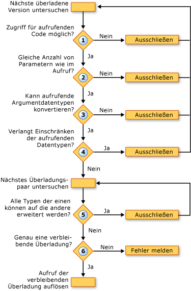

# Überladungsauflösung (Visual Basic)
Wenn die [!INCLUDE[vbprvb](../../../../csharp/programming-guide/concepts/linq/includes/vbprvb_md.md)] Compiler erkennt einen Aufruf an eine Prozedur, die in mehreren überladenen Versionen definiert ist, muss der Compiler entscheiden, welche Überladung aufrufen. Dazu werden die folgenden Schritte ausführen:  
  
1.  **Eingabehilfen.** Überladung mit der Zugriffsebene, die verhindert, dass den aufrufenden Code Aufrufen dieser beseitigt.  
  
2.  **Anzahl von Parametern.** Überladung, die eine andere Anzahl von Parametern definiert als geliefert werden im Aufruf beseitigt.  
  
3.  **Parameter-Datentypen.** Der Compiler zieht Instanzmethoden gegenüber Erweiterungsmethoden. Wenn eine beliebige Instanzmethode, erfordert nur erweiterungskonvertierungen entsprechend den Prozeduraufruf gefunden wird, alle Erweiterungsmethoden gelöscht, und der Compiler fährt mit der Instanzmethoden. Wenn keine solche Instanzmethode gefunden wird, weiterhin mit der Instanz und Erweiterungsmethoden.  
  
     In diesem Schritt schließt es eine Überladung für die die Datentypen der aufrufenden Argumente nicht in die Parametertypen, die in der Überladung definiert konvertiert werden können.  
  
4.  **Einschränkende Konvertierungen.** Überladung, die eine einschränkende Konvertierung aus der aufrufenden Argumenttypen mit den Parametertypen definierten erfordert beseitigt. Dies ist der Fall, ob die Überprüfung des Typs wechseln ([Option Strict-Anweisung](../../../../visual-basic/language-reference/statements/option-strict-statement.md)) ist `On` oder `Off`.  
  
5.  **Geringste Erweiterung.** Der Compiler betrachtet die verbleibenden Überladungen paarweise. Für jedes Paar werden die Datentypen der definierten Parameter verglichen. Wenn die entsprechenden Typen in den anderen Typen in einer Überladung alle erweitert werden, beseitigt der Compiler die letztere. Wird beibehalten, also die Überladung, die am wenigsten erweiternde erforderlich sind.  
  
6.  **Einzelne Betrachtung.** Angesichts Überladungen paarweise bis nur eine bleibt Überladung und der Aufruf in diese Überladung löst wird fortgesetzt. Wenn der Compiler die Überladungen, die einem einzelnen Kandidaten reduziert werden kann, wird einen Fehler generiert.  
  
 Die folgende Abbildung zeigt den Prozess, der bestimmt, welche eine Gruppe von überladenen Versionen aufgerufen.  
  
   
Auflösung bei überladenen Versionen  
  
 Das folgende Beispiel veranschaulicht diese überladungsauflösungsprozesses.  
  
 [!code-vb[VbVbcnProcedures&#62;](./codesnippet/VisualBasic/overload-resolution_1.vb)]  
  
 [!code-vb[VbVbcnProcedures&#63;](./codesnippet/VisualBasic/overload-resolution_2.vb)]  
  
 Im ersten Aufruf beseitigt der Compiler die erste Überladung, da der Typ des ersten Arguments (`Short`) wird in den Typ des entsprechenden Parameters (`Byte`). Klicken Sie dann die dritte Überladung beseitigt, da jeder Argumenttyp der zweiten Überladung (`Short` und `Single`) in den entsprechenden Typ der dritten Überladung erweitert (`Integer` und `Single`). Die zweite Überladung eine geringere Erweiterung erfordert, damit der Compiler für den Aufruf verwendet.  
  
 Im zweiten Aufruf kann nicht der Compiler keine Überladung durch Einschränken beseitigen. Die dritte Überladung beseitigt aus demselben Grund wie im ersten Aufruf, da die zweite Überladung mit geringerer Erweiterung der Argumenttypen aufgerufen werden kann. Jedoch kann der Compiler zwischen der ersten und zweiten Überladung nicht auflösen. Jede verfügt über einen definierten Parametertyp, der in den entsprechenden Typ in einer anderen erweitert wird (`Byte` auf `Short`, aber `Single` , `Double`). Aus diesem Grund generiert der Compiler einen Überladungsauflösungsfehler.  
  
## Überladene optionale und ParamArray-Argumente  
 Wenn zwei Überladungen einer Prozedur identische Signaturen verfügen, mit der Ausnahme, dass der letzte Parameter deklariert ist [Optional](../../../../visual-basic/language-reference/modifiers/optional.md) in einem und [ParamArray](../../../../visual-basic/language-reference/modifiers/paramarray.md) in einer anderen, löst der Compiler einen Aufruf an die Prozedur wie folgt:  
  
|Wenn der Aufruf wird des letzten Arguments als|Der Compiler löst den Aufruf an die Überladung, die das letzte Argument als deklarieren|  
|---|---|  
|Kein Wert (Argument ausgelassen)|`Optional`|  
|Ein einzelner Wert|`Optional`|  
|Zwei oder mehr Werte in einer durch Trennzeichen getrennte Liste|`ParamArray`|  
|Ein Array von beliebiger Länge (einschließlich eines leeren Arrays)|`ParamArray`|  
  
## Siehe auch  
 [Optionale Parameter](./optional-parameters.md)   
 [Parameterarrays](./parameter-arrays.md)   
 [Prozedurüberladung](./procedure-overloading.md)   
 [Problembehandlung bei Prozeduren](./troubleshooting-procedures.md)   
 [Gewusst wie: Definieren mehrerer Versionen einer Prozedur](./how-to-define-multiple-versions-of-a-procedure.md)   
 [Gewusst wie: Aufrufen einer überladenen Prozedur](./how-to-call-an-overloaded-procedure.md)   
 [Gewusst wie: überladen eine Prozedur mit optionalen Parametern](./how-to-overload-a-procedure-that-takes-optional-parameters.md)   
 [Gewusst wie: überladen eine Prozedur mit einer unbestimmten Anzahl von Parametern](./how-to-overload-a-procedure-that-takes-an-indefinite-number-of-parameters.md)   
 [Überlegungen zur prozedurüberladung](./considerations-in-overloading-procedures.md)   
 [Überladungen](../../../../visual-basic/language-reference/modifiers/overloads.md)   
 [Erweiterungsmethoden](./extension-methods.md)
